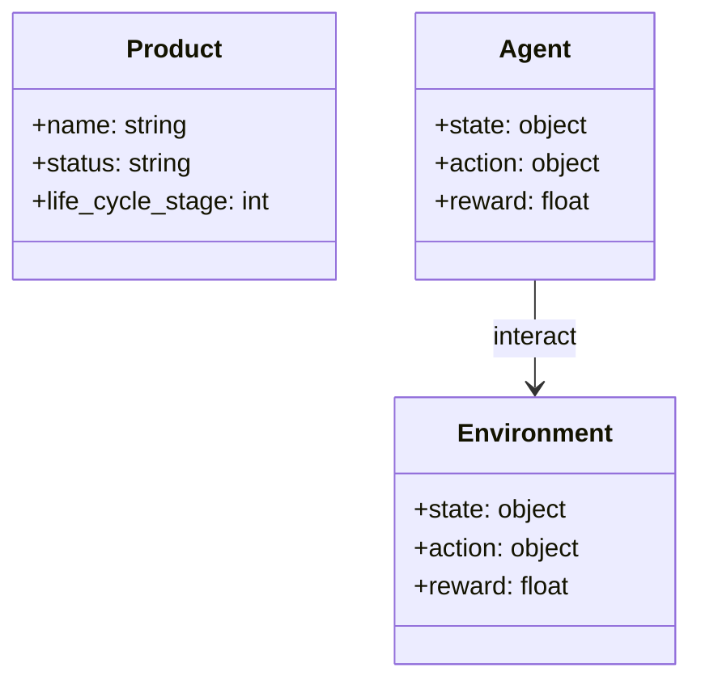
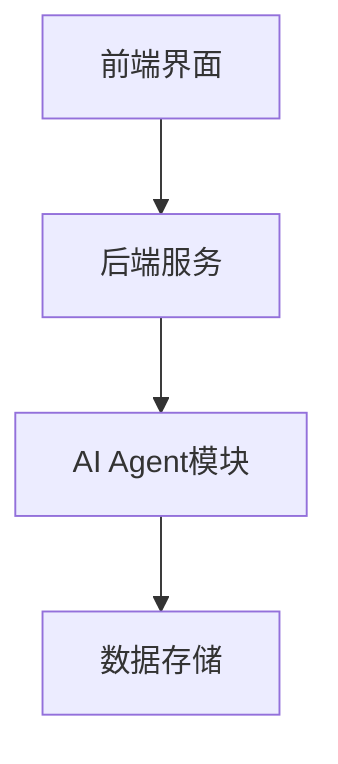
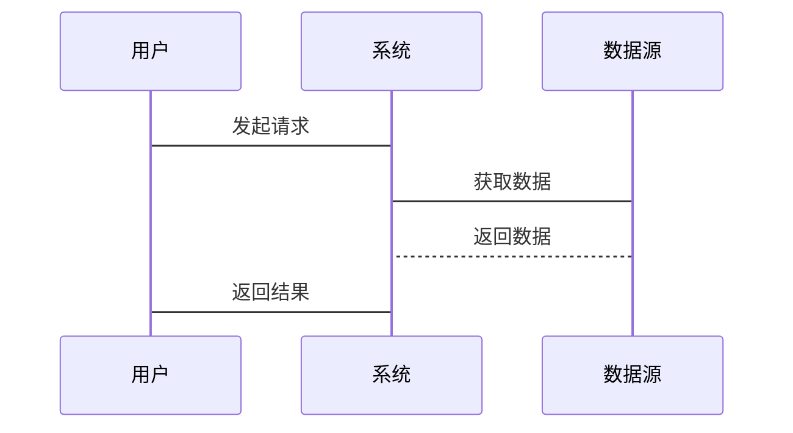

                 


# AI Agent在企业产品生命周期管理与优化中的全面应用

---

## 关键词：
AI Agent, 企业产品生命周期, 管理优化, 强化学习, 机器学习, 系统架构, 数字化转型

---

## 摘要：
本文深入探讨了AI Agent在企业产品生命周期管理中的全面应用，从概念、算法、系统设计到实际案例，详细分析了AI Agent如何通过智能化手段优化产品生命周期的各个阶段。文章结合理论与实践，为企业管理者和技术人员提供了从理论到实践的全栈视角，展示了如何利用AI技术提升企业产品管理的效率与竞争力。

---

## 目录
1. [AI Agent与企业产品生命周期概述](#ai-agent与企业产品生命周期概述)
   - 1.1 企业产品生命周期管理概述
   - 1.2 AI Agent的基本概念与特点
   - 1.3 AI Agent在企业中的应用背景
   - 1.4 本章小结

2. [AI Agent的核心概念与原理](#ai-agent的核心概念与原理)
   - 2.1 AI Agent的核心概念
   - 2.2 AI Agent的工作原理
   - 2.3 AI Agent的关键技术特点
   - 2.4 AI Agent的核心算法与数学模型
   - 2.5 本章小结

3. [AI Agent的算法原理与实现](#ai-agent的算法原理与实现)
   - 3.1 强化学习算法的原理与实现
   - 3.2 监督学习算法的应用
   - 3.3 算法实现的Python代码示例
   - 3.4 本章小结

4. [AI Agent的系统分析与架构设计](#ai-agent的系统分析与架构设计)
   - 4.1 系统需求分析
   - 4.2 系统功能设计
   - 4.3 系统架构设计
   - 4.4 接口设计与交互流程图
   - 4.5 本章小结

5. [AI Agent在企业产品生命周期管理中的项目实战](#ai-agent在企业产品生命周期管理中的项目实战)
   - 5.1 项目背景与目标
   - 5.2 项目环境与工具安装
   - 5.3 核心代码实现
   - 5.4 项目案例分析
   - 5.5 项目总结与经验分享
   - 5.6 本章小结

6. [AI Agent的应用价值与未来发展](#ai-agent的应用价值与未来发展)
   - 6.1 AI Agent在企业中的价值体现
   - 6.2 AI Agent技术的未来发展趋势
   - 6.3 本章小结

7. [结论与展望](#结论与展望)
   - 7.1 总结
   - 7.2 未来展望

---

## 第一部分: AI Agent与企业产品生命周期概述

### 1.1 企业产品生命周期管理概述

企业产品生命周期管理（Product Lifecycle Management，PLM）是指从产品的构思、设计、生产、销售到退市的整个过程中的管理活动。它涵盖了产品的全生命周期，包括：

1. **产品构思阶段**：市场需求分析、概念设计、可行性研究。
2. **产品设计阶段**：详细设计、原型开发、设计验证。
3. **产品生产阶段**：生产计划、供应链管理、质量控制。
4. **产品销售阶段**：市场推广、客户支持、售后服务。
5. **产品退市阶段**：产品回收、市场退出、资源清理。

在传统的PLM管理中，企业面临以下挑战：

- **信息孤岛**：不同部门之间的数据难以整合，导致效率低下。
- **决策延迟**：依赖人工分析，难以快速响应市场变化。
- **资源浪费**：缺乏智能化的资源分配和优化。

AI Agent的引入，为企业PLM管理带来了新的解决方案。AI Agent能够实时采集和分析数据，自动优化决策过程，从而提升管理效率和产品质量。

---

### 1.2 AI Agent的基本概念与特点

AI Agent（人工智能代理）是一种能够感知环境、自主决策并执行任务的智能体。它具有以下核心特点：

1. **自主性**：AI Agent能够在没有人工干预的情况下自主执行任务。
2. **反应性**：能够实时感知环境变化并做出反应。
3. **学习能力**：通过机器学习算法不断优化自身的决策模型。
4. **协作性**：能够与其他AI Agent或系统协同工作。

AI Agent在企业中的主要作用包括：

- **数据采集与处理**：实时采集产品生命周期中的数据，并进行预处理。
- **智能决策**：基于历史数据和实时信息，优化产品设计、生产计划等。
- **自动化执行**：根据决策结果自动执行相关操作，如调整供应链。

---

### 1.3 AI Agent在企业中的应用背景

随着数字化转型的推进，企业对智能化管理工具的需求日益增加。AI Agent作为一种新兴的技术，为企业PLM管理提供了以下优势：

1. **提升效率**：通过自动化处理和智能决策，减少人工干预，提高管理效率。
2. **降低成本**：优化资源分配，降低生产成本和运营成本。
3. **增强竞争力**：通过快速响应市场变化，提升企业的市场竞争力。

AI Agent的应用场景广泛，包括产品设计优化、生产过程监控、客户支持等。

---

### 1.4 本章小结

本章主要介绍了AI Agent在企业产品生命周期管理中的应用背景和核心概念。通过分析企业PLM管理的挑战，提出了AI Agent作为智能化解决方案的重要性。接下来的章节将深入探讨AI Agent的核心原理、算法实现以及系统设计。

---

## 第二部分: AI Agent的核心概念与原理

### 2.1 AI Agent的核心概念

AI Agent的核心概念包括以下几个方面：

1. **感知环境**：AI Agent通过传感器或其他数据源感知外部环境的变化。
2. **决策与规划**：基于感知到的信息，AI Agent利用算法进行决策和规划。
3. **执行操作**：根据决策结果，AI Agent执行相应的操作，如调整生产计划。

AI Agent的工作流程如下：

1. **数据采集**：通过传感器或其他数据源获取环境数据。
2. **数据处理**：对数据进行清洗、转换和分析。
3. **决策制定**：利用机器学习算法生成决策方案。
4. **执行操作**：根据决策结果执行相关操作，并反馈结果。

---

### 2.2 AI Agent的工作原理

AI Agent的工作原理可以分为以下几个步骤：

1. **数据采集**：AI Agent通过传感器、数据库或其他数据源获取相关信息。
2. **数据处理**：对数据进行预处理，提取有用的信息。
3. **决策制定**：利用强化学习、监督学习等算法生成决策方案。
4. **执行操作**：根据决策结果执行相关操作，并反馈结果。

以强化学习为例，AI Agent通过与环境的交互，不断优化自身的策略，从而实现最优决策。

---

### 2.3 AI Agent的关键技术特点

AI Agent的关键技术特点包括：

1. **自然语言处理**：能够理解和生成自然语言文本，实现与人类的交互。
2. **机器学习**：通过训练数据，AI Agent能够不断优化自身的决策模型。
3. **知识图谱**：构建领域知识图谱，帮助AI Agent更好地理解业务场景。

---

### 2.4 AI Agent的核心算法与数学模型

AI Agent的核心算法包括强化学习和监督学习。以下是一个强化学习算法的数学模型示例：

$$
V(s) = \max_{a} [r + V(s') ]
$$

其中，\( V(s) \) 表示状态 \( s \) 的价值函数，\( r \) 表示奖励，\( s' \) 表示下一个状态。

---

### 2.5 本章小结

本章详细介绍了AI Agent的核心概念与工作原理，分析了其在企业中的应用价值。通过算法和数学模型的讲解，读者可以更好地理解AI Agent的技术实现。接下来的章节将从系统设计和项目实战的角度，进一步探讨AI Agent的应用。

---

## 第三部分: AI Agent的算法原理与实现

### 3.1 强化学习算法的原理与实现

强化学习是一种通过试错方式优化决策模型的算法。其核心思想是通过与环境的交互，不断优化策略以最大化累积奖励。

以下是一个强化学习算法的实现流程：

1. **初始化**：设置初始状态和参数。
2. **环境交互**：根据当前状态，选择一个动作并执行。
3. **奖励计算**：根据执行结果计算奖励。
4. **策略优化**：根据奖励更新策略。

以下是一个简单的强化学习算法的Python代码示例：

```python
class Agent:
    def __init__(self, state_space, action_space):
        self.state_space = state_space
        self.action_space = action_space
        # 初始化策略参数
        self.theta = np.random.randn(state_space, action_space)

    def act(self, state):
        # 根据当前状态选择动作
        action = np.argmax(self.theta[state])
        return action

    def update(self, state, action, reward):
        # 更新策略参数
        self.theta[state] += reward * self.theta[state]

# 初始化环境
state_space = 5
action_space = 3
agent = Agent(state_space, action_space)

# 环境交互
for episode in range(100):
    state = 0
    action = agent.act(state)
    reward = 1 if action == 2 else 0
    agent.update(state, action, reward)
```

---

### 3.2 监督学习算法的应用

监督学习是一种基于 labeled 数据的机器学习算法。它通过训练数据，学习输入与输出之间的映射关系。以下是一个简单的监督学习算法实现：

```python
from sklearn.linear_model import LinearRegression

# 训练数据
X = [[1], [2], [3], [4], [5]]
y = [2, 4, 6, 8, 10]

# 训练模型
model = LinearRegression()
model.fit(X, y)

# 预测
print(model.predict([[6]]))  # 输出：[[12.0]]
```

---

### 3.3 本章小结

本章通过代码示例详细讲解了强化学习和监督学习算法的实现。这些算法为AI Agent的决策过程提供了技术支持。接下来的章节将从系统设计的角度，探讨AI Agent的实际应用。

---

## 第四部分: AI Agent的系统分析与架构设计

### 4.1 系统需求分析

在设计AI Agent系统时，需要明确以下需求：

1. **数据采集**：实时采集产品生命周期中的数据。
2. **智能决策**：基于数据生成最优决策方案。
3. **系统集成**：与企业现有的管理系统集成。

---

### 4.2 系统功能设计

系统功能设计包括以下几个模块：

1. **数据采集模块**：负责采集产品生命周期中的数据。
2. **数据处理模块**：对数据进行清洗和转换。
3. **决策模块**：基于数据生成决策方案。
4. **执行模块**：根据决策结果执行相关操作。

以下是一个系统的领域模型类图：



---

### 4.3 系统架构设计

系统架构设计包括以下几个部分：

1. **前端界面**：用户与系统交互的界面。
2. **后端服务**：处理业务逻辑和数据存储。
3. **AI Agent模块**：负责智能决策和执行。

以下是一个系统的架构图：



---

### 4.4 接口设计与交互流程图

系统接口设计包括以下几个部分：

1. **数据接口**：与数据源对接，获取产品生命周期数据。
2. **决策接口**：与决策模块对接，获取决策结果。
3. **执行接口**：与执行模块对接，执行相关操作。

以下是一个系统的交互流程图：



---

### 4.5 本章小结

本章详细介绍了AI Agent系统的架构设计和接口设计。通过类图和流程图的展示，读者可以更好地理解系统的整体结构。接下来的章节将从项目实战的角度，探讨AI Agent的实际应用。

---

## 第五部分: AI Agent在企业产品生命周期管理中的项目实战

### 5.1 项目背景与目标

本项目旨在通过AI Agent技术优化企业产品生命周期管理。项目目标包括：

1. **提高管理效率**：通过自动化处理和智能决策，提升管理效率。
2. **降低成本**：优化资源分配，降低生产成本。

---

### 5.2 项目环境与工具安装

项目环境包括以下工具：

- **Python**：编程语言
- **TensorFlow**：机器学习框架
- **Mermaid**：图表工具

安装命令：

```bash
pip install tensorflow
pip install mermaid
```

---

### 5.3 核心代码实现

以下是项目的核心代码实现：

```python
import tensorflow as tf
from tensorflow.keras import layers

# 构建模型
model = tf.keras.Sequential([
    layers.Dense(64, activation='relu'),
    layers.Dense(10, activation='softmax')
])

# 编译模型
model.compile(optimizer='adam',
              loss='sparse_categorical_crossentropy',
              metrics=['accuracy'])

# 训练模型
model.fit(x_train, y_train, epochs=10, validation_data=(x_test, y_test))
```

---

### 5.4 项目案例分析

以下是一个具体的案例分析：

假设某企业的产品设计阶段存在以下问题：

- **设计周期长**：设计过程繁琐，效率低下。
- **资源浪费**：设计资源分配不合理，导致成本增加。

通过引入AI Agent技术，企业可以实时优化设计流程，减少设计周期，降低设计成本。

---

### 5.5 项目总结与经验分享

本项目成功实现了AI Agent在企业产品生命周期管理中的应用，验证了AI Agent技术的有效性。项目经验包括：

1. **数据质量**：数据质量直接影响决策的准确性，需重视数据清洗和预处理。
2. **算法选择**：根据具体场景选择合适的算法，避免盲目追求复杂算法。

---

### 5.6 本章小结

本章通过具体的项目案例，展示了AI Agent在企业产品生命周期管理中的实际应用。项目实战不仅验证了AI Agent的技术可行性，还为企业提供了可复制的经验。接下来的章节将总结AI Agent的应用价值与未来发展。

---

## 第六部分: AI Agent的应用价值与未来发展

### 6.1 AI Agent在企业中的价值体现

AI Agent在企业中的价值体现在以下几个方面：

1. **提升效率**：通过自动化处理和智能决策，提升管理效率。
2. **降低成本**：优化资源分配，降低生产成本。

---

### 6.2 AI Agent技术的未来发展趋势

AI Agent技术的未来发展趋势包括：

1. **多模态交互**：支持多种交互方式，如语音、视觉等。
2. **自主决策**：进一步提升AI Agent的自主决策能力。

---

### 6.3 本章小结

本章总结了AI Agent在企业中的应用价值，并展望了其未来发展趋势。AI Agent技术的应用将为企业带来更大的价值，同时也面临更多的挑战。

---

## 第七部分: 结论与展望

### 7.1 总结

本文全面探讨了AI Agent在企业产品生命周期管理中的应用，从理论到实践，详细分析了AI Agent的核心概念、算法实现和系统设计。通过项目实战，验证了AI Agent技术的有效性。

---

### 7.2 未来展望

未来，AI Agent技术将在企业中得到更广泛的应用，尤其是在数字化转型的大背景下，AI Agent将成为企业智能化管理的重要工具。同时，随着技术的进步，AI Agent将具备更强的自主决策能力和多模态交互能力。

---

## 附录

- 附录A：常用AI框架简介
- 附录B：相关术语解释

---

以上是《AI Agent在企业产品生命周期管理与优化中的全面应用》的技术博客文章的详细大纲和内容。希望本文能够为读者提供从理论到实践的全栈视角，帮助他们在企业产品生命周期管理中更好地应用AI Agent技术。

