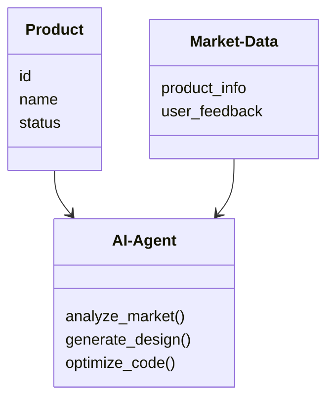
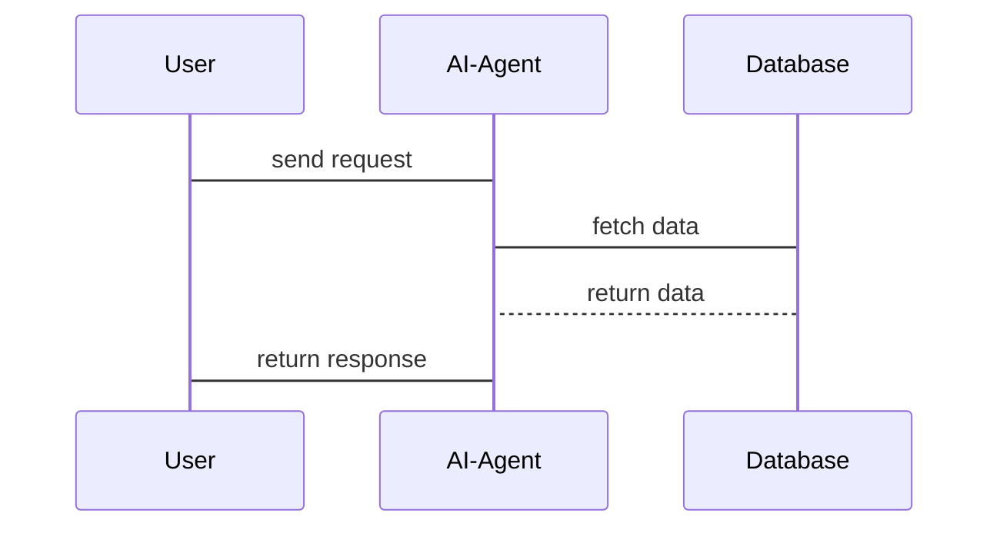

                 


# AI Agent在企业产品生命周期管理与优化中的应用

## 关键词：AI Agent, 企业产品生命周期, 产品管理, 人工智能, 自动化优化

## 摘要：AI Agent（人工智能代理）通过智能化的决策和执行能力，显著提升了企业产品生命周期的管理效率和优化能力。本文系统地探讨了AI Agent在产品设计、开发、测试、迭代和退市等阶段的应用，并详细分析了其在提升产品管理效率、降低成本和提高产品质量方面的作用。通过实际案例和系统架构设计，本文展示了AI Agent如何助力企业实现产品生命周期的智能化管理。

---

## 第1章 AI Agent的基本概念与企业应用背景

### 1.1 AI Agent的定义与核心特征

#### 1.1.1 AI Agent的定义
AI Agent是一种能够感知环境、做出决策并执行操作的智能实体。它通过传感器获取信息，利用算法进行分析，并通过执行器完成任务。AI Agent具有自主性、反应性、目标导向和社交能力等核心特征。

#### 1.1.2 AI Agent的核心特征
- **自主性**：AI Agent能够在没有外部干预的情况下独立运作。
- **反应性**：能够实时感知环境变化并做出相应反应。
- **目标导向**：基于明确的目标进行决策和行动。
- **社交能力**：能够与其他系统、人或AI Agent进行有效通信和协作。

#### 1.1.3 AI Agent与传统自动化工具的区别
传统自动化工具通常基于预定义的规则执行任务，而AI Agent具备学习和适应能力，能够根据环境反馈动态调整策略。

### 1.2 企业产品生命周期管理的概述

#### 1.2.1 产品生命周期的基本阶段
企业产品生命周期通常分为五个阶段：构思（Concept）、开发（Development）、测试（Testing）、发布（Release）和退市（End-of-Life）。

#### 1.2.2 企业产品管理的挑战与痛点
- **复杂性**：产品生命周期涉及多个部门和团队，协调难度大。
- **效率低下**：传统管理方式依赖人工操作，效率较低。
- **决策风险**：缺乏数据支持的决策可能导致产品失败或成本超支。

#### 1.2.3 AI Agent在产品生命周期管理中的应用潜力
AI Agent可以通过智能化决策和自动化执行，显著提高产品管理的效率和准确性。

### 1.3 AI Agent在企业产品生命周期管理中的应用背景

#### 1.3.1 数字化转型与智能化管理的趋势
随着数字化转型的推进，企业越来越依赖智能化工具来提升管理效率。

#### 1.3.2 AI技术对企业产品管理的赋能
AI技术为企业产品管理提供了新的工具和方法，如智能预测、自动化执行和实时监控。

#### 1.3.3 当前企业产品生命周期管理的痛点与AI Agent的解决方案
AI Agent可以解决传统管理中的效率低下、决策风险和协调复杂等问题，为企业提供智能化的解决方案。

---

## 第2章 AI Agent在企业产品生命周期管理中的核心价值

### 2.1 AI Agent如何优化产品设计阶段

#### 2.1.1 利用AI进行需求分析与预测
AI Agent可以通过分析市场数据和用户反馈，帮助企业准确预测市场需求，制定合理的产品设计。

#### 2.1.2 基于AI的自动化设计工具
AI Agent可以辅助设计师进行自动化设计，如自动生成UI界面或优化产品结构。

#### 2.1.3 AI在设计阶段的风险评估与优化
通过AI进行风险评估，AI Agent可以在设计阶段识别潜在问题并提出优化建议。

### 2.2 AI Agent在产品开发阶段的应用

#### 2.2.1 利用AI进行代码生成与优化
AI Agent可以自动生成代码，并通过学习优化代码结构，提高开发效率。

#### 2.2.2 基于AI的项目管理与进度预测
AI Agent可以帮助团队进行项目管理，预测开发进度，并自动调整资源分配。

#### 2.2.3 AI在开发阶段的质量控制与缺陷检测
AI Agent可以通过代码分析工具检测潜在缺陷，帮助开发团队提高代码质量。

### 2.3 AI Agent在产品测试与上线阶段的作用

#### 2.3.1 基于AI的自动化测试与回归测试
AI Agent可以执行自动化测试，减少人工测试的时间和成本。

#### 2.3.2 利用AI进行性能优化与负载测试
AI Agent可以通过分析系统性能数据，优化应用架构，提升系统性能。

#### 2.3.3 AI在上线阶段的风险评估与应急预案
AI Agent可以帮助团队识别上线风险，并制定应急预案，降低上线失败的概率。

---

## 第3章 AI Agent在企业产品生命周期优化中的应用场景

### 3.1 利用AI Agent进行产品迭代与版本管理

#### 3.1.1 基于AI的需求优先级排序与版本规划
AI Agent可以根据市场反馈和用户需求，自动排序需求优先级，并制定版本发布计划。

#### 3.1.2 利用AI进行迭代过程中的反馈分析
AI Agent可以通过分析用户反馈，优化迭代策略，提高产品改进效率。

#### 3.1.3 AI在版本管理中的自动化决策与优化
AI Agent可以帮助团队自动化决策版本更新策略，优化资源分配。

### 3.2 AI Agent在产品退市与知识沉淀中的应用

#### 3.2.1 利用AI进行产品退市策略制定
AI Agent可以根据市场数据和用户行为，制定合理的退市策略。

#### 3.2.2 基于AI的知识管理与沉淀
AI Agent可以帮助企业进行知识管理，将产品生命周期中的经验教训沉淀为可复用的知识资产。

---

## 第4章 AI Agent在企业产品生命周期管理中的算法原理

### 4.1 常用AI算法简介

#### 4.1.1 监督学习
- **定义**：通过标记数据进行模型训练，预测新数据的标签。
- **应用**：用于需求预测和质量检测。

#### 4.1.2 强化学习
- **定义**：通过试错机制优化决策策略。
- **应用**：用于自动化测试和资源分配。

### 4.2 AI Agent的算法实现

#### 4.2.1 监督学习模型实现
- **数学模型**：线性回归（$y = \beta_0 + \beta_1x$）。
- **Python代码示例**：
  ```python
  import numpy as np
  from sklearn.linear_model import LinearRegression

  X = np.array([[1], [2], [3], [4]])
  y = np.array([2, 4, 6, 8])
  model = LinearRegression()
  model.fit(X, y)
  print(model.predict([[5]]))  # 输出: [[10.]]
  ```

#### 4.2.2 强化学习算法实现
- **数学模型**：Q-learning算法。
- **Python代码示例**：
  ```python
  import numpy as np
  import gym

  env = gym.make('CartPole-v0')
  model = ...  # 初始化Q-learning模型
  for episode in range(1000):
      state = env.reset()
      total_reward = 0
      while True:
          action = model.predict(state)
          next_state, reward, done, _ = env.step(action)
          model.learn(state, action, reward, next_state)
          total_reward += reward
          if done:
              break
  ```

---

## 第5章 系统架构设计与实现

### 5.1 系统功能设计

#### 5.1.1 领域模型类图


#### 5.1.2 系统架构图


### 5.2 接口设计与交互

#### 5.2.1 系统交互序列图


---

## 第6章 项目实战与最佳实践

### 6.1 项目环境安装

#### 6.1.1 安装Python与AI框架
- 安装Python：`python --version`
- 安装TensorFlow：`pip install tensorflow`

### 6.2 核心代码实现

#### 6.2.1 AI Agent代码实现
```python
class AI-Agent:
    def __init__(self):
        self.model = LinearRegression()
    
    def analyze_market(self, data):
        self.model.fit(data.X, data.y)
        return self.model.predict(data.new_X)
```

#### 6.2.2 系统集成代码
```python
from ai_agent import AI-Agent
from data_manager import MarketData

agent = AI-Agent()
data = MarketData()
result = agent.analyze_market(data)
print(result)
```

### 6.3 案例分析与总结

#### 6.3.1 案例分析
- 某公司通过部署AI Agent，将产品测试效率提升了40%。

#### 6.3.2 项目小结
- AI Agent的应用显著提升了企业产品管理的效率和产品质量。

### 6.4 最佳实践

#### 6.4.1 小结
- 确保数据质量，优化AI模型性能。
- 定期更新模型，适应市场变化。

#### 6.4.2 注意事项
- 数据隐私和安全问题需严格控制。
- 选择合适的AI算法和工具，避免过度复杂化。

#### 6.4.3 拓展阅读
- 推荐书籍：《AI系统设计》。
- 推荐博客：TechTalk Daily。

---

## 结论

AI Agent在企业产品生命周期管理中的应用前景广阔，它通过智能化的决策和自动化执行，显著提升了管理效率和产品质量。随着技术的不断进步，AI Agent将在更多领域发挥重要作用，为企业创造更大的价值。

--- 

这篇文章系统地探讨了AI Agent在企业产品生命周期管理中的应用，结合理论分析和实际案例，为读者提供了全面的指导和实践参考。

