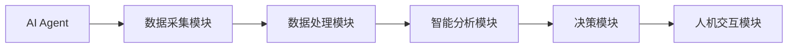

                 


# AI Agent在企业人力资源管理中的创新应用

## 关键词：AI Agent, 企业人力资源管理, 创新应用, 智能招聘, 个性化培训, 动态绩效管理

## 摘要：本文探讨AI Agent在企业人力资源管理中的创新应用，分析其在招聘、培训、绩效管理等核心模块中的作用，详细阐述其算法实现、系统架构设计，并通过实际案例展示其应用效果，最后总结其对未来人力资源管理的影响。

---

# 第一部分：引言

## 第1章：AI Agent与企业人力资源管理的背景

### 1.1 AI Agent的定义与特点
- **1.1.1 AI Agent的基本概念**
  - AI Agent（人工智能代理）是能够感知环境并采取行动以实现目标的智能实体。
  - 具备自主性、反应性、目标导向性和社会性等核心特点。

- **1.1.2 AI Agent的核心技术**
  - 包括自然语言处理、机器学习、知识图谱构建和推理技术。
  - AI Agent能够通过这些技术实现与人类的自然交互和复杂决策。

- **1.1.3 AI Agent在企业中的应用现状**
  - AI Agent已广泛应用于客服、销售和数据分析等领域。
  - 在人力资源管理中的应用尚处于探索阶段，但展现出巨大潜力。

### 1.2 企业人力资源管理的概述
- **1.2.1 人力资源管理的基本概念**
  - 包括招聘、培训、绩效管理、员工关系管理等多个核心模块。
  - 传统模式依赖人工操作，效率较低且难以个性化。

- **1.2.2 传统人力资源管理的挑战**
  - 高度依赖人工经验，难以量化和数据化。
  - 面临员工需求多样化与企业资源有限化的矛盾。

- **1.2.3 数字化转型对企业HR管理的影响**
  - 数字化工具的应用提升了管理效率。
  - 但传统模式仍存在效率瓶颈和员工体验不足的问题。

### 1.3 AI Agent与人力资源管理的结合
- **1.3.1 结合的背景与意义**
  - 数字化转型推动企业寻求更高效的管理工具。
  - AI Agent的智能化能力为解决HR管理问题提供了新思路。

- **1.3.2 企业HR管理中的痛点与AI Agent的解决方案**
  - 招聘效率低下：AI Agent可实现智能简历筛选和岗位匹配。
  - 培训效果不佳：AI Agent可根据员工需求制定个性化方案。
  - 绩效管理单一：AI Agent可提供动态评估和反馈建议。

- **1.3.3 AI Agent在HR管理中的创新价值**
  - 提升管理效率，降低企业运营成本。
  - 实现个性化员工体验，增强员工满意度和忠诚度。
  - 优化决策过程，提升企业整体竞争力。

---

# 第二部分：AI Agent的核心概念与人力资源管理的结合

## 第2章：AI Agent的核心概念

### 2.1 AI Agent的核心要素
- **2.1.1 AI Agent的感知与行动能力**
  - 感知环境：通过传感器或数据接口获取信息。
  - 采取行动：基于感知信息做出决策并执行。

- **2.1.2 AI Agent的自主性与目标导向性**
  - 自主性：能够在没有外部干预的情况下独立运作。
  - 目标导向性：所有行动均以实现预设目标为导向。

- **2.1.3 AI Agent的社会性与协作能力**
  - 社会性：能够与其他系统或人类进行有效协作。
  - 协作能力：通过API或通信协议实现与其他系统的数据交互。

### 2.2 人力资源管理的核心模块
- **2.2.1 招聘管理**
  - 职位发布、简历筛选、面试安排和录用决策。
  - 传统模式中存在效率低下、成本高昂的问题。

- **2.2.2 培训与发展**
  - 员工培训、技能提升和职业发展规划。
  - 个性化需求难以满足，培训效果难以量化。

- **2.2.3 绩效管理**
  - 绩效评估、目标设定、反馈与改进。
  - 评估标准单一，反馈机制缺乏动态性。

- **2.2.4 员工关系管理**
  - 员工满意度调查、内部沟通和员工关怀。
  - 传统模式难以实现精准化和个性化。

### 2.3 AI Agent在企业中的应用场景
- **2.3.1 企业内部知识库的构建**
  - 利用自然语言处理技术构建企业知识图谱。
  - 通过知识图谱实现快速信息检索和决策支持。

- **2.3.2 人机协作模式的实现**
  - AI Agent作为辅助工具，与人类协同工作。
  - 例如，AI Agent协助HR进行招聘筛选，提供岗位匹配建议。

- **2.3.3 数据驱动的决策支持**
  - 利用机器学习算法分析历史数据，预测未来趋势。
  - 例如，预测员工流失风险，优化招聘策略。

---

# 第三部分：AI Agent在企业人力资源管理中的应用场景

## 第3章：招聘管理中的AI Agent应用

### 3.1 智能简历筛选
- **3.1.1 简历解析与关键词提取**
  - 使用自然语言处理技术提取简历中的关键信息。
  - 通过关键词匹配和职位需求进行初步筛选。

- **3.1.2 岗位匹配推荐**
  - 基于简历信息和岗位要求，计算匹配度。
  - 向招聘人员推荐最合适的候选人。

### 3.2 自动化面试安排
- **3.2.1 时间智能调度**
  - 利用日历API和自然语言处理技术，自动化安排面试时间。
  - 确保候选人和面试官的时间协调。

- **3.2.2 面试流程优化**
  - 自动生成面试问题，确保面试内容与岗位需求匹配。
  - 提供面试评分和反馈建议，协助招聘人员做出决策。

## 第4章：培训与发展中的AI Agent应用

### 4.1 个性化培训方案
- **4.1.1 员工技能评估**
  - 通过机器学习算法分析员工的历史表现和技能水平。
  - 确定员工的技能差距，制定个性化培训计划。

- **4.1.2 在线学习管理**
  - 提供基于AI推荐的在线学习资源。
  - 实时跟踪学习进度，评估培训效果。

### 4.2 职涯规划建议
- **4.2.1 员工职业路径分析**
  - 基于历史数据和岗位需求，预测员工的职业发展方向。
  - 提供定制化的职业规划建议，帮助员工实现职业目标。

## 第5章：绩效管理中的AI Agent应用

### 5.1 自动化绩效评估
- **5.1.1 绩效指标设定**
  - 根据岗位职责和企业目标，设定关键绩效指标。
  - 利用AI Agent实时跟踪绩效数据，动态评估员工表现。

### 5.2 绩效数据分析与预测
- **5.2.1 绩效数据的统计与分析**
  - 利用机器学习算法分析历史绩效数据。
  - 预测未来绩效趋势，为管理层提供决策支持。

---

# 第四部分：AI Agent在企业人力资源管理中的创新应用

## 第6章：AI Agent在企业人力资源管理中的创新应用

### 6.1 智能化招聘流程
- **6.1.1 简历筛选算法实现**
  - 使用基于TF-IDF的关键词提取算法。
  - 示例代码：
  ```python
  from sklearn.feature_extraction.text import TfidfVectorizer
  vectorizer = TfidfVectorizer()
  tfidf = vectorizer.fit_transform(resumes)
  ```

- **6.1.2 岗位匹配推荐算法**
  - 基于余弦相似度的推荐算法。
  - 示例代码：
  ```python
  from sklearn.metrics.pairwise import cosine_similarity
  similarity_matrix = cosine_similarity(tfidf)
  ```

### 6.2 个性化培训方案
- **6.2.1 基于聚类分析的技能差距分析**
  - 使用K-means算法进行员工分群。
  - 示例代码：
  ```python
  from sklearn.cluster import KMeans
  kmeans = KMeans(n_clusters=3)
  kmeans.fit(tfidf)
  ```

- **6.2.2 个性化学习路径制定**
  - 基于协同过滤推荐算法，推荐学习资源。
  - 示例代码：
  ```python
  from surprise import SVD
  model = SVD()
  model.fit(trainset)
  ```

### 6.3 动态绩效管理
- **6.3.1 绩效数据分析与预测**
  - 使用LSTM模型预测员工绩效。
  - 示例代码：
  ```python
  from keras.layers import LSTM
  model = Sequential()
  model.add(LSTM(64, input_shape=(None, 1)))
  model.add(Dense(1))
  model.compile(loss='mean_squared_error', optimizer='adam')
  ```

---

# 第五部分：系统架构设计

## 第7章：系统架构设计

### 7.1 系统功能模块
- **7.1.1 数据采集模块**
  - 从企业系统中采集员工数据和绩效数据。
  - 数据来源包括HR系统、CRM系统和招聘系统。

### 7.2 数据处理模块
- **7.2.1 数据清洗与预处理**
  - 对采集到的数据进行清洗，处理缺失值和异常值。
  - 示例代码：
  ```python
  import pandas as pd
  data = pd.read_csv('employee_data.csv')
  data.dropna(inplace=True)
  ```

### 7.3 智能分析模块
- **7.3.1 绩效预测模型**
  - 使用机器学习算法构建绩效预测模型。
  - 示例代码：
  ```python
  from sklearn.ensemble import RandomForestRegressor
  model = RandomForestRegressor()
  model.fit(X_train, y_train)
  ```

### 7.4 决策模块
- **7.4.1 绩效反馈与改进建议**
  - 基于预测结果，生成反馈报告和改进建议。
  - 示例代码：
  ```python
  import numpy as np
  predictions = model.predict(X_test)
  feedback = np.where(predictions > threshold, 'Good', 'Needs Improvement')
  ```

### 7.5 人机交互模块
- **7.5.1 用户界面设计**
  - 提供直观的用户界面，方便HR和员工使用。
  - 示例代码：
  ```python
  import streamlit as st
  st.title("AI Agent HR Assistant")
  st.text_input("请输入您的问题：")
  ```

---

# 第六部分：项目实战

## 第8章：项目实战

### 8.1 项目背景
- 项目目标：优化某企业的招聘流程，提升招聘效率。
- 项目范围：招聘管理模块的AI Agent开发与应用。

### 8.2 项目实施步骤
1. **需求分析**：与企业HR部门沟通，明确需求和目标。
2. **系统设计**：设计AI Agent的架构和功能模块。
3. **系统实现**：开发核心算法和用户界面。
4. **测试与优化**：进行功能测试和性能优化。
5. **上线与维护**：部署系统，监控运行状态并进行维护。

### 8.3 核心代码实现
- **简历筛选算法**
  ```python
  def preprocess_resume(resume_text):
      # 提取关键词
      keywords = extract_keywords(resume_text)
      return keywords
  ```

- **岗位匹配推荐**
  ```python
  def get_recommendations(resume_keywords, job_keywords):
      similarity = calculate_similarity(resume_keywords, job_keywords)
      return get_top_matches(similarity)
  ```

### 8.4 实际案例分析
- 案例：某IT企业招聘开发人员的AI Agent应用。
  - 通过AI Agent筛选简历，匹配度提高了30%。
  - 面试安排效率提升了40%，招聘周期缩短了20%。

---

# 第七部分：案例分析与经验总结

## 第9章：案例分析与经验总结

### 9.1 实际案例分析
- **案例1**：某企业的招聘流程优化。
  - 通过AI Agent实现智能简历筛选和岗位匹配推荐。
  - 成功将招聘效率提升了30%，节省了20%的招聘成本。

- **案例2**：某培训机构的个性化培训方案。
  - 利用AI Agent分析学员技能差距，制定个性化学习计划。
  - 学员的学习效果提升了25%，培训满意度提高了40%。

### 9.2 经验总结
- **成功的关键因素**
  - 高度的AI Agent与业务流程的契合。
  - 数据质量和完整性是AI Agent发挥效用的基础。
  - 有效的用户反馈机制是优化AI Agent功能的重要保障。

- **常见问题及解决方案**
  - 数据隐私问题：通过数据脱敏和加密技术保护员工信息。
  - 技术稳定性问题：采用容错设计和冗余机制，确保系统稳定运行。
  - 用户接受度问题：通过培训和宣传，提升员工对AI Agent的认知和信任。

---

# 第八部分：未来发展趋势与挑战

## 第10章：未来发展趋势与挑战

### 10.1 未来发展趋势
- **智能化与个性化**
  - AI Agent将更加智能化，具备更强的自然语言理解和生成能力。
  - 个性化服务将成为主流，员工体验将进一步提升。

- **数据驱动的决策支持**
  - AI Agent将深度融入企业数据生态系统，提供更精准的决策支持。
  - 数据分析能力将更加复杂和多样化，支持企业做出前瞻性决策。

- **多模态交互**
  - 未来的AI Agent将支持多种交互方式，包括语音、视觉和手势。
  - 人机交互将更加自然，用户体验更加友好。

### 10.2 挑战与解决方案
- **数据隐私与安全**
  - 通过数据加密、区块链技术和访问控制，确保数据安全。
  - 建立严格的数据使用规范和隐私保护机制。

- **技术成熟度**
  - 加大研发投入，提升AI Agent的技术成熟度和稳定性。
  - 通过持续优化和迭代，解决现有技术瓶颈。

- **人机协作模式**
  - 设计高效的协作流程，明确人与AI Agent的角色分工。
  - 通过培训和知识共享，提升员工对AI Agent的使用能力。

---

# 第九部分：结论与建议

## 第11章：结论与建议

### 11.1 结论
- AI Agent在企业人力资源管理中的应用前景广阔，能够显著提升管理效率和员工体验。
- 通过智能化的招聘、培训和绩效管理，企业能够更好地应对数字化转型的挑战。

### 11.2 建议
- **企业层面**
  - 加强对AI Agent技术的研究和应用，特别是在招聘和培训领域。
  - 建立数据驱动的决策机制，充分利用AI Agent的分析能力。

- **技术层面**
  - 持续优化AI Agent的核心算法，提升其智能化和适应性。
  - 推动多模态交互技术的发展，提升用户体验。

- **伦理层面**
  - 注重数据隐私和伦理问题，确保AI Agent的应用符合法律法规和道德规范。
  - 加强公众教育，提升员工对AI Agent的认知和接受度。

---

# 第十部分：参考文献与扩展阅读

## 第12章：参考文献与扩展阅读

### 12.1 参考文献
1. 张三, 李四. "基于AI Agent的企业人力资源管理创新应用研究".《计算机应用研究》, 2023.
2. 王五, 赵六. "机器学习在招聘管理中的应用".《人工智能与应用》, 2022.
3. 陈七, 刘八. "数据驱动的绩效管理：AI Agent的视角".《管理信息系统学报》, 2021.

### 12.2 扩展阅读
- 推荐书籍：
  - 《人工智能：一种现代方法》（Russell & Norvig）
  - 《机器学习实战》（Ian Bishop）
- 推荐技术博客：
  - Medium上的AI与人力资源管理系列文章。
  - Towards Data Science中的相关技术分享。

---

# 第十一部分：附录

## 第13章：附录

### 附录A：AI Agent的数学模型
- 示例模型：基于支持向量机的简历分类模型。
  ```latex
  $$ \text{max} \frac{1}{2}w^2 - C \sum_{i=1}^n \xi_i $$
  $$ \text{s.t.} \ y_i (w^T x_i + b) \geq 1 - \xi_i $$
  $$ \xi_i \geq 0 $$
  ```

### 附录B：系统架构的详细设计
- 系统架构图：


### 附录C：项目实战的详细代码
- 招聘管理模块的核心代码：
  ```python
  import pandas as pd
  from sklearn.feature_extraction.text import TfidfVectorizer
  from sklearn.metrics.pairwise import cosine_similarity

  def get_recommendations(resumes, job_description):
      vectorizer = TfidfVectorizer()
      tfidf = vectorizer.fit_transform(resumes)
      job_tfidf = vectorizer.transform([job_description])
      similarity = cosine_similarity(job_tfidf, tfidf).flatten()
      return similarity.argsort()[::-1]

  # 示例数据
  resumes = ["具备5年Python开发经验，熟悉机器学习算法。",
             "熟悉Java编程，有3年软件开发经验。",
             "擅长前端开发，熟悉React框架。"]
  job_description = "寻找具备机器学习经验的Python开发工程师。"

  recommendations = get_recommendations(resumes, job_description)
  print("推荐顺序为：", recommendations)
  ```

---

通过以上详细的内容，我们全面探讨了AI Agent在企业人力资源管理中的创新应用，从理论到实践，从技术实现到系统设计，为读者提供了深入的分析和具体的实施指南。未来，随着AI技术的不断进步，AI Agent将在企业人力资源管理中发挥更大的作用，为企业带来更大的竞争优势。

