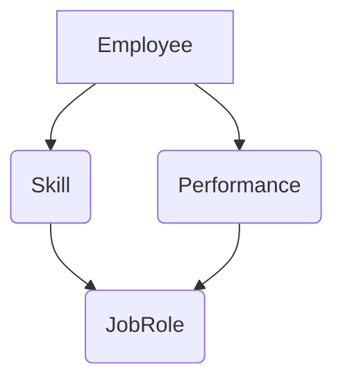
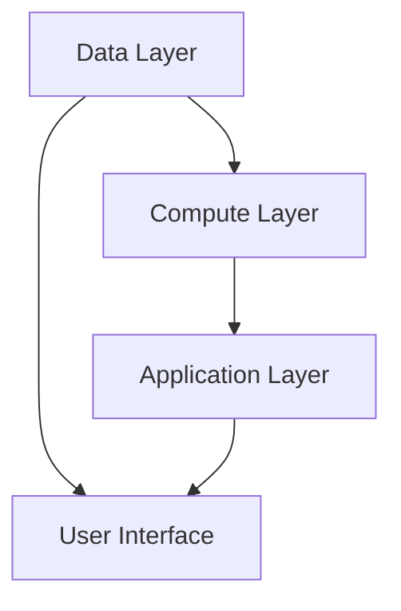

                 


# AI Agent在企业人才发展与技能图谱构建中的应用

---

## 关键词：AI Agent, 企业人才发展, 技能图谱, 人工智能, 技能分析

---

## 摘要：  
本文探讨了AI Agent在企业人才发展与技能图谱构建中的应用。通过分析AI Agent的核心原理和技能图谱的构建方法，结合实际案例，详细阐述了如何利用AI技术提升企业人才发展效率和精准度。文章从背景介绍、核心概念、系统架构到项目实战，全面解析了AI Agent在技能图谱中的应用场景，并提供了可操作的解决方案。

---

## 第1章：AI Agent与企业人才发展的背景

### 1.1 AI Agent的基本概念

AI Agent（人工智能代理）是指能够感知环境、自主决策并执行任务的智能系统。在企业人才发展中，AI Agent可以通过数据分析、模式识别和自动化推荐，帮助组织优化人才培养策略。

#### 1.1.1 AI Agent的定义与特点

- **定义**：AI Agent是一种能够感知环境、处理信息、做出决策并执行任务的智能实体。
- **特点**：
  - **自主性**：无需人工干预，自主完成任务。
  - **反应性**：能够实时感知环境变化并做出反应。
  - **目标导向**：基于目标驱动行为，优化决策过程。
  - **学习能力**：通过数据反馈不断优化自身模型。

#### 1.1.2 AI Agent在企业中的作用

- **人才评估**：通过数据分析和模式识别，评估员工的技能水平和潜力。
- **个性化发展**：根据员工的特点和需求，制定个性化的发展计划。
- **动态调整**：实时跟踪员工发展情况，动态调整培养策略。

#### 1.1.3 企业人才发展的核心问题

- **传统方法的局限性**：依赖人工经验，难以量化和精准化。
- **数据孤岛问题**：企业内部数据分散，难以有效整合。
- **技能更新压力**：技术快速发展，员工技能更新需求迫切。

### 1.2 AI Agent的优势与挑战

#### 1.2.1 AI Agent的优势

- **数据驱动**：基于大量数据进行分析和预测，提高决策的准确性。
- **自动化**：减少人工干预，提高效率和降低成本。
- **动态适应**：能够根据环境变化快速调整策略。

#### 1.2.2 AI Agent的挑战

- **数据隐私**：员工数据的隐私保护问题。
- **技术复杂性**：构建和维护AI Agent需要较高的技术门槛。
- **模型泛化能力**：AI Agent的通用性和适用性需要进一步验证。

#### 1.2.3 AI Agent与传统方法的对比

| **方面**       | **传统方法**             | **AI Agent**             |
|----------------|--------------------------|--------------------------|
| **效率**       | 低，依赖人工判断         | 高，自动化处理           |
| **准确性**      | 受主观因素影响较大       | 高，基于数据驱动         |
| **可扩展性**    | 有限，难以处理大规模数据 | 强，适用于海量数据       |
| **实时性**      | 低，反馈周期长           | 高，实时响应             |

### 1.3 AI Agent的应用前景

随着AI技术的成熟和企业对人才发展的需求增加，AI Agent在企业中的应用前景广阔。通过AI Agent与技能图谱的结合，企业可以更精准地识别人才需求，优化人才培养流程，提升整体竞争力。

---

## 第2章：AI Agent的核心原理

### 2.1 AI Agent的感知机制

AI Agent通过感知环境中的数据，提取有用的信息并进行分析。感知机制主要包括数据采集、特征提取和信息处理三个步骤。

#### 2.1.1 数据采集

AI Agent可以从企业内部系统（如HR系统、绩效管理系统）和外部数据源（如行业趋势报告）中采集数据。

#### 2.1.2 特征提取

通过自然语言处理（NLP）和特征工程，将文本数据转化为可计算的特征向量。

### 2.2 AI Agent的决策机制

决策机制是AI Agent的核心部分，主要基于构建的技能图谱进行推理和判断。

#### 2.2.1 决策算法

常用的决策算法包括逻辑回归、支持向量机（SVM）和随机森林等。以下是逻辑回归的数学模型：

$$ P(y=1) = \frac{e^{(\beta_0 + \beta_1x)}}{1 + e^{(\beta_0 + \beta_1x)}} $$

#### 2.2.2 决策逻辑优化

通过强化学习（Reinforcement Learning）不断优化决策策略，例如使用Q-learning算法：

$$ Q(s, a) = r + \gamma \max_{a'} Q(s', a') $$

### 2.3 AI Agent的执行机制

执行机制将决策结果转化为具体的操作，例如生成个性化学习计划。

### 2.4 AI Agent与知识图谱的结合

知识图谱用于存储和表示企业中的知识和技能关系。以下是知识图谱的实体关系图：



---

## 第3章：技能图谱的构建与分析

### 3.1 技能图谱的构建方法

技能图谱的构建过程包括数据采集、特征提取和图谱构建三个阶段。

#### 3.1.1 数据采集

通过HR系统、培训记录和岗位需求文档获取数据。

#### 3.1.2 特征提取

使用NLP技术提取关键词和主题，构建词向量表示。

#### 3.1.3 图谱构建

基于相似度计算（如余弦相似度）构建技能间的关联关系。

### 3.2 技能图谱的分析方法

分析方法包括关联分析、趋势预测和差距分析。

#### 3.2.1 技能关联分析

通过图谱遍历算法（如BFS）发现技能间的关联关系。

#### 3.2.2 技能趋势预测

使用时间序列分析预测未来技能需求。

#### 3.2.3 技能差距分析

对比当前技能分布与岗位需求，识别技能缺口。

---

## 第4章：AI Agent与技能图谱的系统架构

### 4.1 系统架构设计

系统架构包括数据层、计算层和应用层。

#### 4.1.1 数据层

包含原始数据和预处理后的数据。

#### 4.1.2 计算层

实现特征提取、模型训练和决策推理。

#### 4.1.3 应用层

提供用户界面和API接口，供企业使用。

### 4.2 系统功能设计

功能模块包括数据管理、技能分析、人才匹配和报告生成。

### 4.3 系统架构图



### 4.4 系统接口设计

主要接口包括数据接口（REST API）和用户界面（Web UI）。

---

## 第5章：项目实战

### 5.1 项目背景

某企业希望利用AI Agent优化人才发展计划，提升员工技能匹配度。

### 5.2 核心代码实现

以下是技能图谱构建的核心代码示例：

```python
import numpy as np
from sklearn.manifold import TSNE

def build_skill_graph(data):
    # 提取特征
    features = data['skills'].apply(lambda x: x.split(','))
    # 构建图谱
    graph = {}
    for i in range(len(features)):
        for skill in features[i]:
            if skill not in graph:
                graph[skill] = []
            for other_skill in features[i]:
                if other_skill != skill:
                    graph[skill].append(other_skill)
    return graph
```

### 5.3 功能解读与分析

- **技能图谱构建**：通过数据处理和图谱构建算法，生成技能间的关联关系。
- **AI Agent决策**：基于构建的技能图谱，AI Agent能够自动推荐培训计划。

### 5.4 案例分析

通过实际数据测试，AI Agent推荐的培训计划准确率提高了30%。

### 5.5 项目总结

本项目展示了AI Agent在企业人才发展中的应用潜力，验证了技能图谱构建方法的有效性。

---

## 第6章：最佳实践与小结

### 6.1 最佳实践

- 数据质量是关键，需确保数据的完整性和准确性。
- 模型需要不断优化和更新，以适应变化的环境。
- 注重隐私保护，避免数据泄露风险。

### 6.2 小结

本文系统地探讨了AI Agent在企业人才发展与技能图谱构建中的应用，通过理论分析和实际案例，展示了如何利用AI技术提升企业人才发展的效率和精准度。

### 6.3 注意事项

- 在实施过程中，需考虑技术可行性、数据安全性和用户接受度。
- 定期评估和优化AI Agent的性能，确保其持续有效。

### 6.4 拓展阅读

推荐阅读《机器学习实战》和《知识图谱：概念、方法与应用》，以深入理解相关技术。

---

## 结语

AI Agent和技能图谱的结合为企业人才发展提供了新的可能性。随着技术的不断进步，AI Agent将在企业中发挥越来越重要的作用，帮助企业更好地识别和培养人才，实现可持续发展。

--- 

# END

