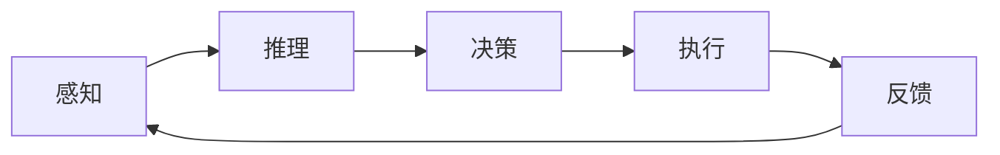
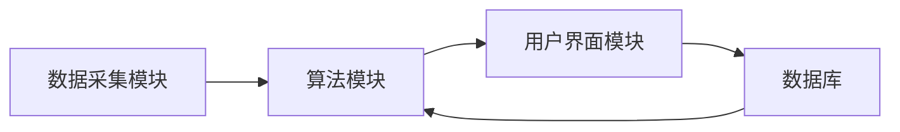
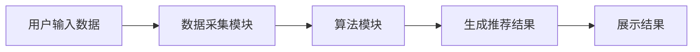

                 


# AI Agent在企业人才发展与继任计划中的应用

> 关键词：AI Agent, 企业人才发展, 继任计划, 推荐算法, NLP技术, 人才匹配

> 摘要：本文深入探讨了AI Agent在企业人才发展与继任计划中的应用，从基础概念到实际应用，结合推荐算法和NLP技术，分析了AI Agent在人才评估、培养、目标设定和文化管理中的作用，并通过系统设计和项目实战展示了如何将AI Agent应用于实际企业场景中。文章最后总结了最佳实践和未来发展方向。

---

## 第一部分: AI Agent 的基础与核心概念

### 第1章: AI Agent 的定义与特点

#### 1.1 AI Agent 的定义与分类

**1.1.1 什么是 AI Agent**

AI Agent（人工智能代理）是指能够感知环境、自主决策并执行任务的智能体。它通过传感器获取信息，利用算法处理数据，并通过执行器与环境交互。AI Agent 的核心目标是通过智能化手段提高效率、优化决策并解决问题。

**1.1.2 AI Agent 的主要特点**

| 特性 | 描述 |
|------|------|
| 智能性 | 能够理解、推理和学习，具备自主决策能力。 |
| 反应性 | 能够实时感知环境并做出快速响应。 |
| 适应性 | 能够根据环境变化调整自身行为和策略。 |
| 可扩展性 | 支持多种任务和应用场景的扩展。 |

**1.1.3 AI Agent 的分类与应用场景**

AI Agent 可以根据功能、智能水平和应用场景进行分类：

1. **功能分类**：
   - **信息收集型**：用于数据采集和分析（如传感器数据）。
   - **决策型**：用于复杂决策（如自动驾驶）。
   - **执行型**：用于任务执行（如机器人）。

2. **智能水平分类**：
   - **反应式 AI Agent**：基于当前感知做出反应，不依赖历史数据。
   - **认知式 AI Agent**：具备推理、规划和学习能力。

3. **应用场景分类**：
   - **企业应用**：如人才管理、供应链优化。
   - **个人应用**：如智能助手、健康监测。

---

#### 1.2 AI Agent 的核心原理

**1.2.1 AI Agent 的基本组成**

AI Agent 的核心组成包括感知模块、推理模块和执行模块：

- **感知模块**：通过传感器或数据接口获取环境信息。
- **推理模块**：利用算法对信息进行处理和推理。
- **执行模块**：根据推理结果执行任务。

**1.2.2 AI Agent 的工作流程**

以下是 AI Agent 的基本工作流程：



**1.2.3 AI Agent 的优势与局限性**

| 优势 | 局限性 |
|------|--------|
| 高效性 | 高昂的开发成本 |
| 智能性 | 数据依赖性 |
| 可扩展性 | 道德与隐私问题 |

---

#### 1.3 企业人才发展与继任计划的背景

**1.3.1 传统企业人才发展方法的不足**

传统人才发展方法依赖人工评估和经验判断，存在以下问题：

- **主观性**：人为判断容易受到主观因素影响。
- **低效性**：手动评估耗时且效率低下。
- **缺乏个性化**：难以满足每个人的个性化需求。

**1.3.2 企业人才发展的关键点**

企业人才发展需要关注以下几个关键点：

- **人才识别**：准确识别高潜力员工。
- **人才培养**：制定个性化培养计划。
- **目标管理**：确保目标与企业战略一致。

**1.3.3 继任计划的重要性与挑战**

继任计划是企业确保关键岗位人员顺利过渡的重要手段。然而，传统继任计划存在以下挑战：

- **时间滞后**：传统评估方法耗时较长，难以及时发现潜在问题。
- **缺乏动态性**：员工能力和市场环境不断变化，需要动态调整计划。

---

## 第二部分: AI Agent 在企业人才发展中的应用

### 第2章: AI Agent 在人才评估中的应用

#### 2.1 AI Agent 在人才评估中的应用

**2.1.1 人才评估的核心指标**

人才评估的核心指标包括：

- **能力评估**：专业技能、领导力、团队协作能力。
- **潜力评估**：学习能力、创新能力和适应能力。
- **文化匹配度**：价值观与企业文化的一致性。

**2.1.2 AI Agent 在评估中的优势**

AI Agent 在人才评估中的优势如下：

- **高效性**：快速处理大量数据，提高评估效率。
- **客观性**：减少人为偏见，提高评估准确性。
- **动态性**：实时更新评估结果，适应变化。

**2.1.3 典型案例分析**

某科技公司使用 AI Agent 对员工进行潜力评估。通过分析员工的历史表现、项目参与度和技能匹配度，AI Agent 准确识别出高潜力员工，并为其制定个性化培养计划。

---

#### 2.2 AI Agent 在人才培养中的应用

**2.2.1 个性化学习路径的设计**

AI Agent 可以根据员工的技能水平、职业目标和企业需求，制定个性化学习路径。例如，通过分析员工的学习历史和技能缺口，AI Agent 推荐适合的学习资源和培训计划。

**2.2.2 AI Agent 在培训中的角色**

AI Agent 可以作为智能培训助手，帮助员工完成在线课程、跟踪学习进度并提供个性化的学习建议。

**2.2.3 典型案例分析**

某软件公司使用 AI Agent 对开发人员进行技能培训。通过分析员工的技能水平和项目需求，AI Agent 推荐适合的在线课程，并通过实时反馈优化学习路径。

---

#### 2.3 AI Agent 在人才目标管理中的应用

**2.3.1 目标设定与分解**

AI Agent 可以协助企业制定和分解目标。例如，通过分析企业的战略目标和部门需求，AI Agent 帮助制定个性化的目标，并分解为可执行的任务。

**2.3.2 目标执行的监控**

AI Agent 可以实时监控目标执行情况，并根据数据反馈调整执行计划。例如，通过分析员工的工作进度和绩效数据，AI Agent 提供实时反馈和改进建议。

**2.3.3 目标达成的评估**

AI Agent 可以对目标达成情况进行评估，并生成评估报告。例如，通过分析员工的绩效数据和目标完成情况，AI Agent 生成详细的目标评估报告，并提出改进建议。

---

#### 2.4 AI Agent 在企业文化的管理中的应用

**2.4.1 企业文化的核心要素**

企业文化的核心要素包括：

- **企业价值观**：企业的核心信念和价值观。
- **企业目标**：企业的长期发展目标。
- **企业行为规范**：员工的行为准则和道德规范。

**2.4.2 AI Agent 在文化管理中的作用**

AI Agent 可以通过分析员工的行为数据和文化匹配度，帮助企业优化企业文化。例如，通过分析员工的反馈和行为数据，AI Agent 帮助识别文化冲突，并提出解决方案。

**2.4.3 典型案例分析**

某跨国公司使用 AI Agent 分析员工的文化匹配度。通过分析员工的背景、价值观和行为数据，AI Agent 帮助公司优化组织结构和文化氛围。

---

### 第3章: AI Agent 的推荐算法与人才匹配

#### 3.1 推荐算法的核心原理

**3.1.1 基于协同过滤的推荐算法**

基于协同过滤的推荐算法通过分析用户的行为数据，找到相似用户的偏好，并推荐相似内容。例如，Netflix 使用协同过滤算法推荐电影和电视剧。

**3.1.2 基于内容的推荐算法**

基于内容的推荐算法通过分析内容的特征，推荐与用户兴趣相似的内容。例如，Spotify 使用基于内容的推荐算法推荐音乐。

**3.1.3 混合推荐算法**

混合推荐算法结合协同过滤和基于内容的推荐算法，利用两者的优势，提高推荐的准确性和多样性。

---

#### 3.2 人才匹配的数学模型

**3.2.1 人才匹配的指标体系**

人才匹配的指标体系包括：

- **技能匹配度**：员工技能与岗位需求的匹配程度。
- **文化匹配度**：员工价值观与企业文化的匹配程度。
- **潜力匹配度**：员工未来发展潜力与企业需求的匹配程度。

**3.2.2 人才匹配的数学公式**

人才匹配的综合评分公式如下：

$$
\text{匹配度} = \alpha \cdot \text{技能匹配度} + \beta \cdot \text{文化匹配度} + \gamma \cdot \text{潜力匹配度}
$$

其中，$\alpha + \beta + \gamma = 1$，权重系数根据企业需求调整。

---

#### 3.3 AI Agent 在人才匹配中的应用流程

**3.3.1 数据采集与预处理**

- 数据来源：员工档案、绩效数据、项目经验。
- 数据清洗：去除重复数据、填充缺失值、处理异常值。

**3.3.2 模型训练与优化**

- 特征工程：提取关键特征，如技能、经验和绩效。
- 模型选择：选择合适的推荐算法，如协同过滤或混合推荐。
- 模型优化：通过交叉验证调整模型参数，提高推荐准确率。

**3.3.3 应用与反馈**

- 推荐结果：生成人才匹配报告，推荐适合的岗位和培养计划。
- 反馈优化：根据实际效果调整模型参数和推荐策略。

---

### 第4章: 系统设计与实现

#### 4.1 系统功能设计

**4.1.1 系统功能模块**

- **数据采集模块**：采集员工数据和岗位需求。
- **算法模块**：实现推荐算法和匹配模型。
- **用户界面模块**：展示推荐结果和匹配报告。

**4.1.2 系统架构设计**

以下是系统架构的 Mermaid 图：



---

#### 4.2 系统接口设计

**4.2.1 数据接口**

- 输入接口：员工数据和岗位需求。
- 输出接口：推荐结果和匹配报告。

**4.2.2 API 设计**

- API 接口：提供 RESTful API 供其他系统调用。
- 接口文档：详细描述接口参数和返回格式。

---

#### 4.3 系统交互设计

**4.3.1 交互流程**

以下是系统交互的 Mermaid 图：



---

## 第五部分: 项目实战与最佳实践

### 第5章: 项目实战

#### 5.1 环境安装

- **Python 环境**：安装 Python 3.8 或更高版本。
- **依赖库安装**：安装 Pandas、Scikit-learn、Numpy 等库。

#### 5.2 核心代码实现

```python
import pandas as pd
from sklearn.metrics.pairwise import cosine_similarity

# 数据预处理
df = pd.read_csv('employee_data.csv')
df.dropna(inplace=True)

# 特征提取
features = df[['技能', '经验', '绩效']]
feature_matrix = features.values

# 计算相似度
similarity_matrix = cosine_similarity(feature_matrix)

# 推荐算法
def get_recommendations(similarity_matrix, index, top_n=5):
    idx = index
    similarity_scores = list(enumerate(similarity_matrix[idx]))
    similarity_scores = sorted(similarity_scores, key=lambda x: x[1], reverse=True)
    similarity_scores = similarity_scores[1:top_n+1]
    indices = [i[0] for i in similarity_scores]
    return indices

# 示例
index = 0
recommendations = get_recommendations(similarity_matrix, index)
print(recommendations)
```

#### 5.3 案例分析与结果解读

通过上述代码，我们可以对员工进行技能匹配度的推荐。例如，对于索引为0的员工，系统会推荐5个匹配度最高的员工。

---

### 第6章: 最佳实践与总结

#### 6.1 最佳实践 tips

- 数据质量：确保数据的完整性和准确性。
- 模型优化：根据实际效果调整模型参数。
- 用户反馈：及时收集用户反馈，优化推荐算法。

#### 6.2 总结

本文详细探讨了 AI Agent 在企业人才发展与继任计划中的应用，从理论到实践，展示了如何利用 AI 技术优化企业人才管理。通过推荐算法和 NLP 技术，AI Agent 可以帮助企业更高效地识别和培养高潜力员工，制定科学的继任计划。

#### 6.3 注意事项

- 数据隐私：确保员工数据的隐私和安全。
- 技术可行性：根据企业需求选择合适的技术方案。
- 伦理道德：确保 AI Agent 的应用符合伦理规范。

#### 6.4 拓展阅读

- 《机器学习实战》
- 《深度学习入门》
- 《人工智能与企业应用》

---

通过本文的分析，我们可以看到 AI Agent 在企业人才管理中的巨大潜力。未来，随着技术的进步和算法的优化，AI Agent 将在更多领域发挥重要作用，帮助企业实现更高效、更精准的人才发展与继任计划。

