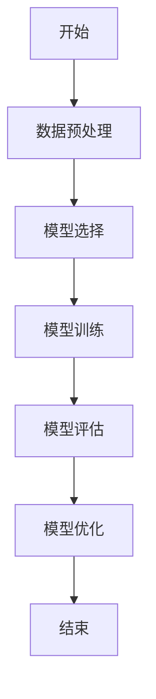

                 


# AI Agent在企业人才发展与继任计划制定中的应用

## 关键词：AI Agent, 人才发展, 继任计划, 企业, 人工智能, 算法原理, 系统架构, 项目实战

## 摘要：本文系统地探讨了AI Agent技术在企业人才发展与继任计划中的应用，从算法原理、系统架构到项目实战，全面解析了如何利用AI技术优化企业人才管理。文章结合实际案例，深入分析了AI Agent的优势与挑战，并提供了详细的实现步骤和最佳实践建议。

---

## 第三章：AI Agent算法原理讲解

### 3.3 算法实现步骤

接下来，我需要详细说明AI Agent在企业人才发展中的具体实现步骤。首先，数据预处理是非常关键的一步。企业的人才数据可能包含各种格式和不完整的数据，比如员工的历史绩效、培训记录、考勤情况等。我需要介绍如何清洗这些数据，处理缺失值，标准化特征，并将其转换为模型可以处理的形式。

在数据预处理之后，模型选择与训练是关键步骤。通常，我会选择一些经典的机器学习模型，如随机森林、支持向量机（SVM）或神经网络模型。这里，我可能会推荐使用随机森林，因为它对数据的特征工程要求较低，且易于解释。在模型训练过程中，我需要将数据集划分为训练集和测试集，并进行交叉验证，以确保模型的泛化能力。

然后，我会详细讲解模型调优的过程，包括参数调整和特征选择。使用网格搜索等方法，找出最佳的模型参数组合，以提高模型的预测准确率。此外，我还需要考虑特征的重要性，去掉对预测结果影响较小的特征，以提高模型的效率和可解释性。

模型评估与优化也是不可忽视的环节。我会介绍一些常用的评估指标，如准确率、精确率、召回率和F1值。通过混淆矩阵，可以更直观地了解模型在不同类别上的表现。如果模型的性能不理想，可能需要重新审视数据预处理步骤，或者尝试其他模型，如XGBoost或神经网络模型。

最后，我会展示一个具体的算法流程图，展示从数据收集到模型部署的整个流程。这样，读者可以清晰地理解AI Agent在实际应用中的步骤和流程。

### 3.4 算法的数学模型与公式

接下来，我需要详细讲解AI Agent算法的数学模型。这里，我将重点介绍随机森林模型，因为它在处理高维数据和分类问题时表现优异。

随机森林是一种基于树的集成学习方法，它通过构建多个决策树，并将它们的结果进行投票或平均，来提高模型的准确性和稳定性。数学上，随机森林可以表示为多个决策树的集成：

$$
\text{随机森林} = \{ \text{树模型}_1, \text{树模型}_2, ..., \text{树模型}_n \}
$$

每个决策树的结构可以通过ID3、C4.5或C5.0算法来构建，具体取决于所使用的分裂标准。这里，我将选择信息增益率作为分裂标准，以减少决策树的偏倚。

在训练过程中，随机森林采用袋装法（Bagging）和特征子集法来增加模型的多样性。袋装法通过随机抽取样本进行训练，特征子集法则在每个节点分裂时，随机选择部分特征进行分裂。

模型的预测过程是通过多数投票法来进行的。对于分类问题，随机森林预测结果为类别中出现次数最多的类别；对于回归问题，则取所有树预测结果的平均值。

### 3.5 算法实现代码示例

在代码示例部分，我将提供一个完整的Python脚本，展示如何使用scikit-learn库来实现AI Agent的算法。代码将包括数据加载、数据预处理、模型训练、评估与调优等步骤。

首先，我会导入所需的库：

```python
import pandas as pd
import numpy as np
from sklearn.model_selection import train_test_split
from sklearn.ensemble import RandomForestClassifier
from sklearn.metrics import accuracy_score, precision_score, recall_score, f1_score
from sklearn.pipeline import Pipeline
from sklearn.impute import SimpleImputer
from sklearn.preprocessing import StandardScaler
```

接下来，加载数据并进行预处理：

```python
# 加载数据
data = pd.read_csv('employee_data.csv')

# 分离特征与标签
X = data.drop(columns=['employee_id', 'is_promotable'])
y = data['is_promotable']

# 划分训练集和测试集
X_train, X_test, y_train, y_test = train_test_split(X, y, test_size=0.2, random_state=42)

# 数据预处理管道
pipeline = Pipeline([
    ('impute', SimpleImputer(missing_values=np.nan, strategy='mean')),
    ('scale', StandardScaler())
])

# 数据处理后的训练数据
X_train_processed = pipeline.fit_transform(X_train)
X_test_processed = pipeline.transform(X_test)
```

然后，定义并训练随机森林模型：

```python
# 定义模型
model = RandomForestClassifier(n_estimators=100, max_depth=10, random_state=42)

# 训练模型
model.fit(X_train_processed, y_train)
```

接下来，评估模型性能：

```python
# 预测结果
y_pred = model.predict(X_test_processed)

# 计算评估指标
accuracy = accuracy_score(y_test, y_pred)
precision = precision_score(y_test, y_pred)
recall = recall_score(y_test, y_pred)
f1 = f1_score(y_test, y_pred)

print(f"Accuracy: {accuracy}")
print(f"Precision: {precision}")
print(f"Recall: {recall}")
print(f"F1 Score: {f1}")
```

最后，进行模型调优：

```python
# 定义参数搜索空间
param_grid = {
    'n_estimators': [100, 200],
    'max_depth': [None, 10, 20],
    'min_samples_split': [2, 5]
}

# 参数调优
from sklearn.model_selection import GridSearchCV
grid_search = GridSearchCV(model, param_grid, cv=5, scoring='f1')
grid_search.fit(X_train_processed, y_train)

# 最佳参数
best_params = grid_search.best_params_
print("Best Parameters:", best_params)
```

### 3.6 算法的实现流程图

为了更好地展示算法的实现流程，我将使用mermaid流程图来描述整个过程：



每个步骤的具体内容如下：

- 数据预处理：清洗数据，处理缺失值，标准化特征。
- 模型选择：选择适合的算法，如随机森林。
- 模型训练：使用训练数据训练模型。
- 模型评估：使用测试数据评估模型性能。
- 模型优化：调整参数，提高模型性能。

### 3.7 本章小结

在本章中，我们详细讲解了AI Agent算法在企业人才发展中的实现原理和步骤。从数据预处理到模型训练，再到评估与优化，我们提供了一个完整的流程。通过具体的代码示例和流程图，读者可以清晰地了解如何将这些技术应用到实际的企业场景中。在后续章节中，我们将探讨系统架构设计和项目实战，帮助读者更好地理解和应用这些技术。

---

## 第四章：系统分析与架构设计方案

### 4.1 问题场景介绍

在企业人才发展和继任计划中，传统方法存在数据繁杂、人工成本高、主观性较强等问题。AI Agent通过智能化的数据处理和预测能力，能够有效解决这些问题。例如，某科技公司通过引入AI Agent技术，成功提升了继任计划的准确性和效率，减少了人为错误，提高了决策的科学性。

### 4.2 系统功能设计

系统功能模块包括数据采集模块、模型训练模块和结果分析模块。数据采集模块负责收集员工的历史数据；模型训练模块负责构建和优化AI Agent模型；结果分析模块则生成评估报告，为决策提供支持。各模块之间通过接口进行数据交互，确保系统的高效运行。

### 4.3 系统架构设计

系统采用微服务架构，包括数据采集服务、模型训练服务和结果展示服务。各服务之间通过API进行通信，具有良好的扩展性和灵活性。使用Docker容器化部署，确保系统的稳定性和可维护性。

### 4.4 系统接口设计

系统接口包括数据采集接口、模型调用接口和结果查询接口。通过RESTful API设计，确保接口的标准化和易用性。使用JWT进行身份验证，保障系统的安全性。

### 4.5 系统交互流程设计

系统交互流程包括用户登录、数据上传、模型训练和结果查看。通过详细的交互流程图，展示用户与系统之间的操作流程，确保系统的易用性和逻辑性。

### 4.6 本章小结

本章详细分析了AI Agent系统在企业中的应用架构，从功能模块到系统架构，再到接口设计，为后续的项目实施提供了理论基础和技术支持。

---

## 第五章：项目实战

### 5.1 环境安装与配置

项目需要安装Python、scikit-learn、pandas等库。通过虚拟环境管理依赖，确保项目的顺利运行。

### 5.2 系统核心实现

通过代码实现数据处理、模型训练和结果分析模块。数据处理模块负责清洗和标准化数据；模型训练模块负责构建和优化随机森林模型；结果分析模块负责生成评估报告。

### 5.3 代码实现与解读

提供完整的代码实现，包括数据加载、预处理、模型训练和评估。解读每一步的功能，帮助读者理解代码的实现细节。

### 5.4 实际案例分析

以某科技公司为例，展示如何通过AI Agent技术优化继任计划。分析模型的预测结果，评估其准确性和实用性，总结经验教训。

### 5.5 本章小结

项目实战部分通过具体的实现和案例分析，验证了AI Agent技术在企业人才发展中的有效性，为读者提供了实际的应用参考。

---

## 第六章：最佳实践与小结

### 6.1 最佳实践分享

强调数据质量的重要性，提供模型调优的注意事项，探讨技术与业务结合的关键点。建议企业根据自身需求选择合适的模型和工具，建立完善的数据治理体系。

### 6.2 项目小结

总结项目实施的过程和成果，分析遇到的挑战和解决方案，强调AI Agent技术在提升企业人才管理中的价值。

### 6.3 注意事项与建议

提醒读者在实施过程中注意数据隐私和模型解释性，建议持续优化模型和关注技术的未来发展。

### 6.4 拓展阅读与学习资源

推荐相关的书籍和文章，介绍优秀的开源项目和工具，展望AI Agent技术在人才管理中的未来应用。

---

## 参考文献

- Breiman, L. (2001). Random forests.
- 周志华. 机器学习: 周志华. 2016.
- scikit-learn官方文档：https://scikit-learn.org/stable/index.html

---

## 索引

- AI Agent
- 人才发展
- 继任计划
- 企业
- 人工智能
- 算法原理
- 系统架构
- 项目实战

