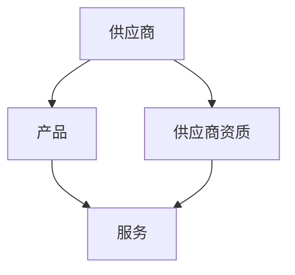
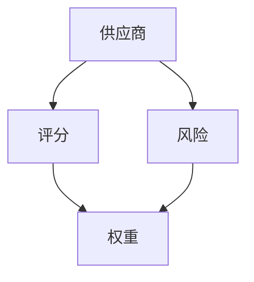
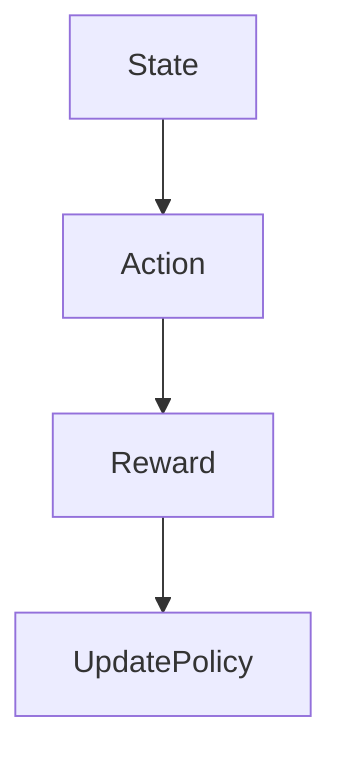
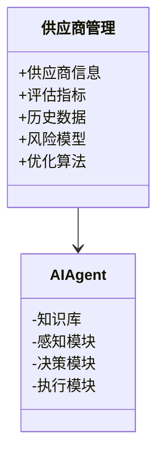
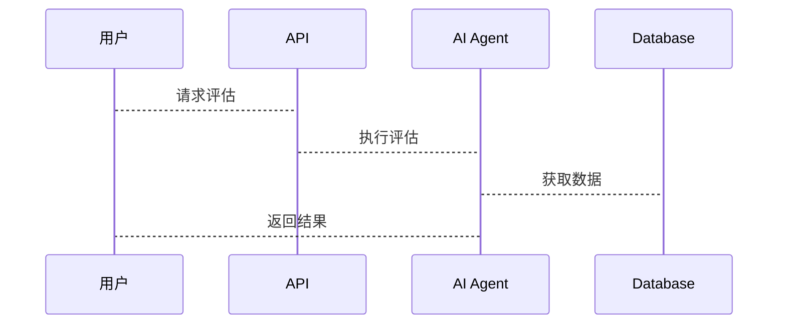

                 


# AI Agent在企业供应商管理与评估中的角色

## 关键词
- AI Agent, 企业供应商管理, 供应商评估, 人工智能技术, 知识图谱, 多目标优化算法, 系统架构设计

## 摘要
本文详细探讨AI Agent在企业供应商管理与评估中的角色，涵盖从基本概念到系统架构设计的各个方面，结合实际案例和项目实战，分析AI Agent如何优化供应商管理流程，提升供应链效率。

## 第一部分：AI Agent的背景与概念

### 第1章：AI Agent的背景与概念

#### 1.1 AI Agent的基本概念
- 1.1.1 什么是AI Agent
AI Agent（人工智能代理）是一种智能系统，能够感知环境、执行任务并做出决策，帮助用户完成特定目标。它不同于传统软件，具备学习和自适应能力，能够处理复杂问题。

- 1.1.2 AI Agent的核心特征
| 核心特征 | 描述 |
|----------|------|
| 感知能力 | 通过传感器或数据源获取环境信息 |
| 决策能力 | 基于感知信息做出最优决策 |
| 学习能力 | 通过数据和经验改进性能 |
| 自适应能力 | 根据环境变化调整行为 |

- 1.1.3 AI Agent与传统软件代理的区别
| 特性 | AI Agent | 传统软件代理 |
|------|---------|-------------|
| 智能性 | 高 | 低 |
| 学习能力 | 强 | 无 |
| 适应性 | 强 | 弱 |

#### 1.2 企业供应商管理中的问题背景
- 1.2.1 供应商管理的主要挑战
1. 数据分散：供应商信息分布在不同系统中，难以整合。
2. 评估复杂：涉及多维度指标，人工评估耗时且易出错。
3. 风险管理：难以实时监控供应商风险，影响供应链稳定性。

- 1.2.2 传统供应商评估方法的局限性
传统方法依赖人工审核，耗时且主观，难以应对海量数据和动态变化。

- 1.2.3 引入AI Agent的必要性
AI Agent能够高效处理数据，实时监控，提供智能化决策支持，提升供应商管理效率。

#### 1.3 AI Agent在供应商管理中的角色
- 1.3.1 AI Agent如何优化供应商评估流程
通过自动化数据收集和分析，AI Agent可以快速生成评估报告，减少人工干预。

- 1.3.2 AI Agent在供应商关系管理中的应用
AI Agent可以监控供应商绩效，预测潜在问题，优化供应商关系。

- 1.3.3 AI Agent如何提升供应链效率
通过实时数据分析和预测，AI Agent帮助优化库存管理和采购计划，提升整体供应链效率。

## 第二部分：AI Agent的核心概念与联系

### 第2章：AI Agent的核心概念与联系

#### 2.1 AI Agent的核心原理
- 2.1.1 AI Agent的感知与决策机制
AI Agent通过传感器或数据源感知环境，利用算法处理信息，做出决策。例如，使用强化学习算法在不同环境中选择最优动作。

- 2.1.2 基于知识图谱的供应商信息处理
知识图谱将供应商信息结构化，帮助AI Agent更好地理解和关联信息。例如，构建供应商-产品-服务的实体关系图，便于分析供应商之间的关系和影响。

- 2.1.3 多目标优化算法在供应商评估中的应用
多目标优化算法（如NSGA-II）在供应商评估中用于平衡多个目标（成本、质量、交货时间）的优化。

#### 2.2 AI Agent的实体关系图
- 2.2.1 供应商、产品、服务的实体关系

- 2.2.2 供应商评分与风险评估


## 第三部分：算法原理讲解

### 第3章：AI Agent的算法原理

#### 3.1 决策树算法在供应商评估中的应用
决策树用于分类供应商等级，根据指标（如交货时间、质量评分）构建模型，预测供应商表现。

- 3.1.1 决策树算法流程
```mermaid
graph TD
    Start --> ChooseRoot
    ChooseRoot --> SplitData
    SplitData --> [是/否] --> ChooseLeaf
    ChooseLeaf --> End
```

- 3.1.2 Python代码示例
```python
from sklearn.tree import DecisionTreeClassifier
model = DecisionTreeClassifier()
model.fit(X, y)
```

- 3.1.3 数学模型
决策树基于信息论中的信息增益，公式为：
$$ \text{信息增益} = \text{熵}(D) - \sum \text{熵}(D_i) $$

#### 3.2 基于强化学习的供应商关系管理
使用强化学习算法优化供应商选择策略，通过状态、动作、奖励机制调整选择。

- 3.2.1 强化学习流程


- 3.2.2 算法实现
```python
import gym
env = gym.make('SupplierManagement-v0')
```

- 3.2.3 数学公式
价值函数：
$$ Q(s, a) = Q(s, a) + \alpha (r + \gamma Q(s', a') - Q(s, a)) $$

## 第四部分：系统分析与架构设计

### 第4章：AI Agent的系统架构设计

#### 4.1 供应商管理场景介绍
构建一个AI Agent系统，用于自动化供应商评估和风险监控，优化供应链管理。

#### 4.2 领域模型设计


#### 4.3 系统架构设计
```mermaid
graph TD
    API --> AI Agent
    AI Agent --> Database
    Database --> [供应商数据]
    Database --> [评估结果]
```

#### 4.4 接口与交互设计


## 第五部分：项目实战

### 第5章：AI Agent的项目实战

#### 5.1 环境安装
安装必要的库：
```bash
pip install numpy scikit-learn gym
```

#### 5.2 核心代码实现
```python
from sklearn.tree import DecisionTreeClassifier

class SupplierEvaluator:
    def __init__(self):
        self.model = DecisionTreeClassifier()
    
    def train(self, X, y):
        self.model.fit(X, y)
    
    def predict(self, X):
        return self.model.predict(X)
```

#### 5.3 代码解读与分析
解释代码功能，展示如何训练模型和进行预测。

#### 5.4 案例分析与详细解读
通过实际案例分析AI Agent如何优化供应商评估流程，减少人工干预，提升效率。

#### 5.5 项目小结
总结项目实现的关键点和收获的经验，为后续项目提供参考。

## 第六部分：最佳实践与小结

### 第6章：AI Agent的最佳实践

#### 6.1 应用中的注意事项
- 数据质量：确保数据准确性和完整性。
- 模型选择：根据不同场景选择合适的算法。
- 系统维护：定期更新模型和优化参数。

#### 6.2 小结
AI Agent在供应商管理中展现了巨大的潜力，通过自动化和智能化提升效率，降低风险。

#### 6.3 注意事项
- 数据隐私：确保数据安全和合规性。
- 系统集成：与现有系统无缝对接，减少迁移成本。
- 持续学习：定期更新模型，适应变化。

#### 6.4 拓展阅读
推荐相关书籍和资源，供读者深入学习AI Agent技术。

---

通过以上结构，文章系统地介绍了AI Agent在企业供应商管理中的应用，从概念到实践，结合实际案例和代码实现，帮助读者全面理解并应用这一技术。

