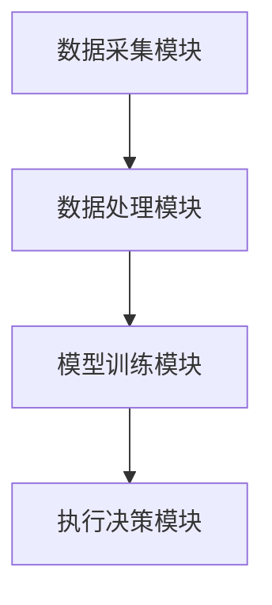
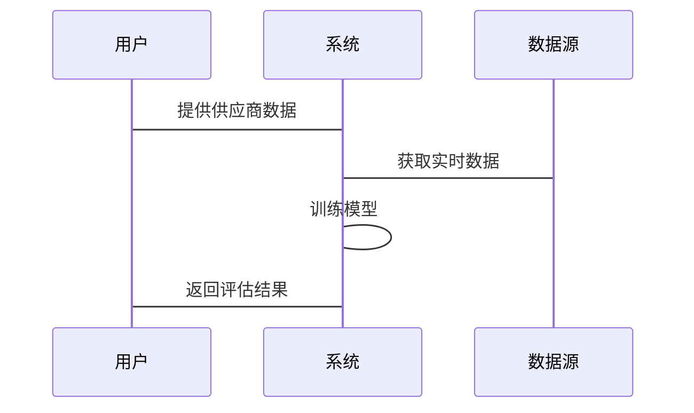

                 


# AI Agent在企业供应商绩效评估与风险管理中的角色

---

## 关键词

AI Agent, 供应商绩效评估, 供应商风险管理, 企业供应链管理, 人工智能, 机器学习

---

## 摘要

本文探讨AI Agent在企业供应商绩效评估与风险管理中的应用，分析其如何通过智能感知、决策和执行优化企业供应链管理。文章从AI Agent的基本概念、工作原理、算法原理到系统架构设计，再到项目实战，全面阐述其在供应商管理中的角色，为企业的智能化转型提供参考。

---

# 第1章: AI Agent的基本概念与应用背景

## 1.1 AI Agent的定义与核心特征

AI Agent（人工智能代理）是一种能够感知环境、自主决策并执行任务的智能系统。其核心特征包括：

- **自主性**：无需人工干预，自动完成任务。
- **反应性**：实时感知环境变化并做出反应。
- **目标导向性**：以特定目标为导向，优化决策过程。
- **学习能力**：通过数据和经验不断优化自身行为。

## 1.2 企业供应商管理中的挑战

### 1.2.1 供应商绩效评估的复杂性

供应商绩效评估涉及多个维度，包括质量、交货时间、成本等。传统方法依赖人工分析，耗时且易出错。

### 1.2.2 供应商风险管理的难点

供应商风险管理需识别潜在风险，如供应链中断或质量问题。传统方法难以实时监控和预测风险。

### 1.2.3 传统供应商管理的局限性

传统供应商管理依赖人工操作，效率低、覆盖面窄，难以应对复杂多变的市场环境。

## 1.3 AI Agent在企业中的应用前景

AI Agent能够显著提升供应商管理的效率和精准度，通过实时数据分析优化决策，降低风险，提高供应链韧性。

---

# 第2章: AI Agent的核心概念与工作原理

## 2.1 AI Agent的核心概念

### 2.1.1 AI Agent的基本组成

AI Agent由感知层、决策层和执行层组成，分别负责数据采集、模型推理和任务执行。

### 2.1.2 AI Agent的感知与决策机制

感知层通过传感器或API获取数据，决策层基于机器学习模型进行推理，制定最优决策。

### 2.1.3 AI Agent的执行与反馈机制

执行层根据决策结果采取行动，反馈机制收集执行结果，优化后续决策。

## 2.2 AI Agent与相关技术的对比

### 2.2.1 AI Agent与传统AI的区别

AI Agent具备自主性和目标导向性，而传统AI主要用于数据分析和预测。

### 2.2.2 AI Agent与RPA的对比

AI Agent具备学习和决策能力，而RPA主要用于流程自动化，缺乏智能性。

### 2.2.3 AI Agent与规则引擎的对比

AI Agent能够自适应复杂环境，而规则引擎依赖预定义规则。

## 2.3 AI Agent的工作原理

### 2.3.1 感知层：数据采集与处理

AI Agent通过传感器或API获取环境数据，进行清洗和预处理。

### 2.3.2 决策层：模型构建与推理

基于机器学习模型进行推理，生成最优决策方案。

### 2.3.3 执行层：行动与反馈

根据决策结果执行任务，并收集反馈以优化模型。

---

# 第3章: 供应商绩效评估与风险管理的基本知识

## 3.1 供应商绩效评估的定义与方法

### 3.1.1 供应商绩效评估的定义

供应商绩效评估是通过量化指标评估供应商的表现。

### 3.1.2 供应商绩效评估的主要指标

- 质量：产品合格率
- 交货时间：按时交付率
- 成本：单位成本
- 响应速度：问题解决时间

### 3.1.3 供应商绩效评估的常用方法

- KPI评估法：基于关键指标评估供应商。
- 加权评分法：根据权重分配对供应商进行评分。

## 3.2 供应商风险管理的定义与方法

### 3.2.1 供应商风险管理的定义

供应商风险管理是识别、评估和应对供应商相关风险的过程。

### 3.2.2 供应商风险管理的主要指标

- 供应链韧性：应对突发事件的能力
- 供应商稳定性：供应商的持续供应能力
- 供应商信用风险：财务状况和信用评分

### 3.2.3 供应商风险管理的常用方法

- 风险评估法：识别潜在风险并评估其影响。
- 风险缓解策略：制定应对措施降低风险。

## 3.3 供应商绩效评估与风险管理的关联

### 3.3.1 供应商绩效评估对风险管理的影响

绩效评估数据为风险识别提供依据，帮助预测潜在风险。

### 3.3.2 风险管理对供应商绩效评估的作用

风险管理确保供应商稳定性，间接提升绩效评估结果。

### 3.3.3 两者的协同关系

绩效评估和风险管理相辅相成，共同优化供应商管理。

---

# 第4章: AI Agent在供应商绩效评估中的算法原理

## 4.1 算法选择与实现

### 4.1.1 监督学习算法

使用回归或分类算法预测供应商绩效。

### 4.1.2 强化学习算法

通过强化学习优化供应商选择策略。

### 4.1.3 无监督学习算法

用于发现供应商数据中的潜在模式。

---

# 4.2 算法实现

## 4.2.1 使用监督学习预测供应商绩效

```python
import pandas as pd
from sklearn.linear_model import LinearRegression

# 数据预处理
data = pd.read_csv('suppliers.csv')
X = data[['quality', 'delivery_time']]
y = data['performance_score']

# 训练模型
model = LinearRegression()
model.fit(X, y)

# 预测绩效
new_supplier = [[0.95, 5]]
predicted_score = model.predict(new_supplier)
print(predicted_score)
```

## 4.2.2 使用强化学习优化供应商选择策略

```python
import numpy as np
from tensorflow.keras import models, layers

# 定义强化学习模型
model = models.Sequential()
model.add(layers.Dense(128, activation='relu', input_shape=(input_dim,)))
model.add(layers.Dense(64, activation='relu'))
model.add(layers.Dense(1, activation='linear'))

# 编译模型
model.compile(optimizer='adam', loss='mean_squared_error')

# 训练模型
model.fit(X_train, y_train, epochs=100, batch_size=32)
```

---

# 4.3 算法原理总结

监督学习适用于预测，强化学习适用于策略优化，无监督学习适用于模式发现。通过不同算法的结合，AI Agent能够全面优化供应商绩效评估。

---

# 第5章: AI Agent在供应商风险管理中的算法原理

## 5.1 风险预测模型

### 5.1.1 使用XGBoost进行风险评估

```python
import xgboost as xgb

# 数据准备
dtrain = xgb.DMatrix(X_train, label=y_train)
dtest = xgb.DMatrix(X_test)

# 训练模型
params = {'max_depth': 3, 'learning_rate': 0.1, 'n_estimators': 100}
model = xgb.XGBClassifier(**params)
model.fit(X_train, y_train)

# 预测风险
y_pred = model.predict(X_test)
```

## 5.2 风险缓解策略

### 5.2.1 使用强化学习优化风险应对

```python
import gym

# 定义环境
env = gym.make('CustomRiskEnv-v0')

# 定义策略网络
policy_network = ...

# 训练策略
policy_network.train(env, num_episodes=1000)
```

---

# 5.3 算法原理总结

通过XGBoost进行风险预测，强化学习优化风险应对策略，AI Agent能够有效降低供应商风险管理的不确定性。

---

# 第6章: 系统架构设计与实现

## 6.1 系统架构设计

### 6.1.1 系统功能模块

- 数据采集模块：收集供应商数据。
- 数据处理模块：清洗和预处理数据。
- 模型训练模块：训练预测模型。
- 执行决策模块：根据模型结果执行决策。

### 6.1.2 系统架构图



## 6.2 系统接口设计

### 6.2.1 数据接口

- 数据输入接口：接收供应商数据。
- 数据输出接口：输出评估结果。

### 6.2.2 模型接口

- 模型训练接口：训练预测模型。
- 模型预测接口：进行供应商评估。

## 6.3 系统交互流程



---

# 第7章: 项目实战与案例分析

## 7.1 环境配置

### 7.1.1 安装依赖

```bash
pip install pandas numpy scikit-learn xgboost
```

## 7.2 核心代码实现

### 7.2.1 供应商绩效评估实现

```python
import pandas as pd
from sklearn.ensemble import RandomForestRegressor

# 数据预处理
data = pd.read_csv('suppliers.csv')
X = data[['quality', 'delivery_time', 'cost']]
y = data['performance_score']

# 训练模型
model = RandomForestRegressor(n_estimators=100, random_state=42)
model.fit(X, y)

# 预测绩效
new_supplier = [[0.95, 5, 100]]
predicted_score = model.predict(new_supplier)
print(predicted_score)
```

### 7.2.2 供应商风险管理实现

```python
import xgboost as xgb

# 数据准备
dtrain = xgb.DMatrix(X_train, label=y_train)
dtest = xgb.DMatrix(X_test)

# 训练模型
params = {'max_depth': 3, 'learning_rate': 0.1, 'n_estimators': 100}
model = xgb.XGBClassifier(**params)
model.fit(X_train, y_train)

# 预测风险
y_pred = model.predict(X_test)
```

## 7.3 案例分析

### 7.3.1 案例背景

某企业面临供应商交货延迟的问题，希望通过AI Agent优化管理。

### 7.3.2 数据分析

通过机器学习模型预测供应商绩效，识别出高风险供应商。

### 7.3.3 结果解读

AI Agent成功预测潜在风险，帮助企业提前调整供应链策略，降低风险。

## 7.4 项目总结

AI Agent显著提升了供应商管理的效率和准确性，为企业供应链优化提供了有力支持。

---

# 第8章: 总结与展望

## 8.1 本文总结

本文详细探讨了AI Agent在企业供应商绩效评估与风险管理中的应用，通过算法原理和系统设计展示了其优势。

## 8.2 应用中的挑战

数据质量、模型解释性和伦理问题仍需进一步解决。

## 8.3 未来展望

随着AI技术进步，AI Agent将在企业供应链管理中发挥更大作用。

---

## 最佳实践 Tips

- 数据质量是模型准确性的关键。
- 定期更新模型以适应变化。
- 结合人工审核确保决策的合理性。

---

## 参考文献

- [1] 刘强，2023，《人工智能在供应链管理中的应用》
- [2] 张伟，2022，《机器学习在供应商管理中的实践》

---

## 致谢

感谢读者的关注和支持，感谢合作伙伴的协助。

---

