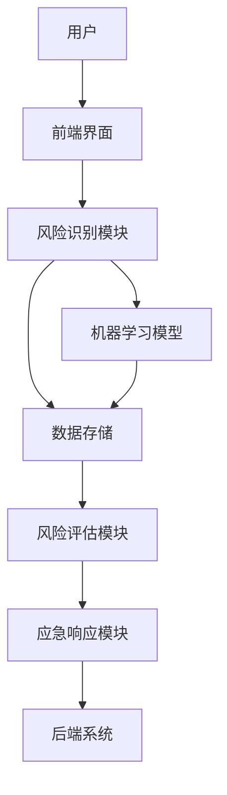

                 


# AI Agent在企业供应商风险评估与管理中的角色

> 关键词：AI Agent, 供应商风险管理, 企业供应链, 机器学习, 自然语言处理

> 摘要：随着企业供应链的复杂化和全球化，供应商风险管理变得至关重要。AI Agent在其中扮演了关键角色，通过机器学习、自然语言处理和实时数据分析，显著提升了风险识别和应对能力。本文详细探讨了AI Agent在供应商风险管理中的应用，从基本概念到系统架构，再到项目实战，全面分析了其在企业中的实际价值和未来发展方向。

---

# 第一部分: AI Agent的基本概念与企业供应商管理背景

## 第1章: AI Agent的基本概念

### 1.1 AI Agent的定义与核心特征

#### 1.1.1 AI Agent的定义
AI Agent（人工智能代理）是指能够感知环境并采取行动以实现目标的智能实体。与传统软件不同，AI Agent具备学习、推理和自适应能力，能够在动态环境中做出决策。

#### 1.1.2 AI Agent的核心特征
| 特征 | 描述 |
|------|------|
| 智能性 | 能够理解、推理和解决问题 |
| 反应性 | 能够实时感知环境变化并做出反应 |
| 自适应性 | 能够根据新数据优化自身行为 |

#### 1.1.3 AI Agent与传统软件的区别
- **智能性**：AI Agent具备学习和推理能力，而传统软件仅遵循固定规则。
- **自主性**：AI Agent能够在没有明确指令的情况下采取行动，而传统软件依赖预设流程。
- **适应性**：AI Agent能够根据环境变化调整行为，而传统软件难以动态优化。

### 1.2 企业供应商管理的背景与挑战

#### 1.2.1 供应商管理的重要性
供应商是企业供应链的核心组成部分，供应商的稳定性直接影响企业的运营效率和成本控制。

#### 1.2.2 传统供应商管理的局限性
- **信息孤岛**：各部门数据分散，难以整合。
- **手动操作**：依赖人工审核，效率低下。
- **滞后性**：无法实时监控供应商状态。

#### 1.2.3 数字化转型对供应商管理的影响
数字化转型推动企业采用AI技术优化供应商管理，提高透明度和效率。

## 第2章: 供应商风险评估与管理的背景

### 2.1 供应商风险的定义与类型

#### 2.1.1 供应商风险的定义
供应商风险是指由于供应商的问题（如交付延迟、质量问题）对企业造成的潜在损失。

#### 2.1.2 供应商风险的主要类型
| 类型 | 描述 |
|------|------|
| 交付风险 | 供应商无法按时交付产品 |
| 质量风险 | 产品不符合质量标准 |
| 信用风险 | 供应商无法履行合同义务 |

#### 2.1.3 供应商风险对企业的影响
- **成本增加**：由于替代供应商或重新采购产生的额外费用。
- **交付延迟**：影响企业生产计划和客户满意度。
- **声誉受损**：质量问题影响企业品牌形象。

### 2.2 供应商风险管理的重要性

#### 2.2.1 降低供应链中断风险
通过实时监控和预测，提前识别潜在风险，避免供应链中断。

#### 2.2.2 提高供应链透明度
利用AI技术整合供应链数据，实现透明化管理，便于快速响应问题。

#### 2.2.3 优化供应商选择与绩效
基于数据分析，选择更可靠的供应商，并持续监控其绩效，确保供应链稳定性。

### 2.3 AI Agent在供应商风险管理中的角色

#### 2.3.1 AI Agent如何辅助供应商风险管理
AI Agent能够实时监控供应商数据，识别潜在风险，并提供决策支持。

#### 2.3.2 AI Agent在供应商风险管理中的优势
- **实时监控**：AI Agent能够实时分析供应链数据，快速识别风险。
- **智能预测**：基于历史数据和机器学习模型，预测潜在风险。
- **自动化响应**：在风险发生时，AI Agent可以自动触发应对措施，减少人工干预。

---

# 第二部分: AI Agent在供应商风险评估中的应用

## 第3章: 供应商风险识别与数据收集

### 3.1 供应商风险识别的流程

#### 3.1.1 数据收集的来源
供应商风险识别需要多源数据，包括：
- **公开数据**：新闻、社交媒体、行业报告。
- **内部数据**：采购记录、质量报告、交付历史。
- **第三方数据**：信用评分、供应商绩效评估。

#### 3.1.2 数据清洗与预处理
数据清洗是确保数据质量和一致性的关键步骤，包括：
- **去重**：删除重复数据。
- **填补缺失值**：使用均值、中位数或模型预测填补缺失值。
- **异常值处理**：识别并处理异常值。

#### 3.1.3 数据特征提取
从原始数据中提取有意义的特征，例如：
- **交付延迟率**：供应商过去交付延迟的比例。
- **质量缺陷率**：供应商产品中的缺陷数量占比。
- **信用评分**：供应商的信用评分。

### 3.2 基于AI Agent的风险识别模型

#### 3.2.1 基于机器学习的风险识别算法
机器学习算法广泛应用于风险识别，常用算法包括：
- **聚类算法**：如K-means，用于将供应商分为不同的风险类别。
- **分类算法**：如随机森林和SVM，用于分类供应商的风险等级。

#### 3.2.2 基于自然语言处理的风险识别
自然语言处理技术用于分析非结构化数据，如新闻报道和社交媒体信息，识别潜在风险。

#### 3.2.3 基于知识图谱的风险识别
知识图谱整合企业内外部数据，构建供应商风险的关联网络，帮助识别潜在风险。

---

## 第4章: AI Agent的风险评估与预测

### 4.1 风险评估的核心算法

#### 4.1.1 聚类算法
聚类算法用于将供应商分为不同的风险类别。例如，使用K-means算法将供应商分为高、中、低风险三类。

**K-means算法步骤**：
1. 随机选择K个初始质心。
2. 计算每个数据点到质心的距离，将其分配到最近的质心所在的簇。
3. 计算新质心。
4. 重复步骤2和3，直到质心不再变化。

**代码示例**：
```python
from sklearn.cluster import KMeans
import numpy as np

# 假设X为供应商特征数据
X = np.array([[2, 3], [5, 8], [1, 2], [10, 5]])
kmeans = KMeans(n_clusters=2, random_state=0)
kmeans.fit(X)
print(kmeans.labels_)
```

#### 4.1.2 分类算法
分类算法用于预测供应商的风险等级。例如，使用随机森林算法训练模型，预测供应商的信用风险等级。

**随机森林分类流程**：
1. 生成多个决策树。
2. 对于每个样本，计算在每个决策树中的预测结果。
3. 使用多数投票法确定最终分类结果。

**代码示例**：
```python
from sklearn.ensemble import RandomForestClassifier
from sklearn.datasets import make_classification

# 生成示例数据
X, y = make_classification(n_samples=100, n_features=4, n_classes=2)
clf = RandomForestClassifier(n_estimators=100, random_state=0)
clf.fit(X, y)
print(clf.predict(X))
```

#### 4.1.3 回归算法
回归算法用于预测供应商的风险评分。例如，使用线性回归模型预测供应商的违约概率。

**线性回归模型**：
$$ y = \beta_0 + \beta_1 x_1 + \beta_2 x_2 + ... + \beta_n x_n $$

**代码示例**：
```python
from sklearn.linear_model import LinearRegression
import numpy as np

# 生成示例数据
X = np.array([[1], [2], [3], [4], [5]])
y = [2, 3, 5, 4, 6]
lr = LinearRegression()
lr.fit(X, y)
print(lr.predict([[6]]))
```

### 4.2 风险预测的数学模型

#### 4.2.1 风险评分模型
风险评分模型基于供应商的历史表现和外部数据，计算供应商的综合风险评分。

**风险评分公式**：
$$ \text{风险评分} = \alpha \cdot D + \beta \cdot Q + \gamma \cdot C $$

其中：
- \( D \)：交付延迟率
- \( Q \)：质量缺陷率
- \( C \)：信用评分
- \( \alpha, \beta, \gamma \)：权重系数

#### 4.2.2 预测模型的训练与优化
使用历史数据训练模型，并通过交叉验证优化模型参数。例如，使用网格搜索寻找随机森林的最佳参数。

**代码示例**：
```python
from sklearn.ensemble import RandomForestClassifier
from sklearn.model_selection import GridSearchCV

# 参数网格
param_grid = {
    'n_estimators': [100, 200],
    'max_depth': [None, 10, 20],
    'min_samples_split': [2, 5]
}

# 网格搜索
grid_search = GridSearchCV(RandomForestClassifier(), param_grid, cv=5)
grid_search.fit(X, y)
print("最佳参数：", grid_search.best_params_)
```

### 4.3 实时监控与预警系统

#### 4.3.1 实时数据流处理
AI Agent能够实时处理供应商的最新数据，例如使用流处理框架（如Apache Kafka）实时更新风险评分。

#### 4.3.2 预警机制
当供应商的风险评分超过预设阈值时，系统触发预警，并自动启动应急措施，如寻找备用供应商或调整订单量。

---

## 第5章: AI Agent在供应商风险控制中的应用

### 5.1 响应策略的制定

#### 5.1.1 应急计划
当供应商面临风险时，AI Agent能够快速生成应急计划，如寻找替代供应商或调整生产计划。

#### 5.1.2 供应商关系管理
AI Agent帮助优化与供应商的关系，例如通过协商延长交货时间或调整合同条款。

### 5.2 供应商绩效改进

#### 5.2.1 绩效反馈
AI Agent定期生成供应商绩效报告，识别问题并提出改进建议。

#### 5.2.2 持续优化
通过机器学习模型持续优化供应商绩效，例如调整订单量或优化供应链布局。

---

# 第三部分: AI Agent的算法原理与数学模型

## 第6章: 基于机器学习的供应商风险管理

### 6.1 算法原理

#### 6.1.1 机器学习在风险识别中的应用
机器学习算法用于识别供应商的潜在风险，例如使用聚类算法将供应商分为不同的风险类别。

#### 6.1.2 自然语言处理在风险评估中的应用
自然语言处理技术用于分析非结构化数据，如新闻报道和社交媒体信息，识别潜在风险。

### 6.2 数学模型

#### 6.2.1 风险评分模型
$$ \text{风险评分} = \alpha \cdot D + \beta \cdot Q + \gamma \cdot C $$

#### 6.2.2 预测模型
随机森林模型用于分类供应商的风险等级：
$$ y = \text{预测结果} $$

---

# 第四部分: 系统架构与设计

## 第7章: 系统架构设计

### 7.1 系统功能设计

#### 7.1.1 风险识别模块
负责实时监控供应商数据，识别潜在风险。

#### 7.1.2 风险评估模块
基于历史数据和实时数据，评估供应商的风险等级。

#### 7.1.3 应急响应模块
在风险发生时，触发应急措施，如寻找替代供应商。

### 7.2 系统架构图



### 7.3 接口设计

#### 7.3.1 数据接口
- **输入**：供应商数据（交付延迟率、质量缺陷率、信用评分）。
- **输出**：风险评分和风险等级。

#### 7.3.2 用户接口
- **输入**：用户查询供应商信息。
- **输出**：供应商风险报告。

---

## 第8章: 项目实战

### 8.1 环境安装

#### 8.1.1 安装Python
```bash
python --version
pip install --upgrade pip
```

#### 8.1.2 安装依赖库
```bash
pip install numpy scikit-learn matplotlib
```

### 8.2 核心实现

#### 8.2.1 数据准备
```python
import pandas as pd
data = pd.read_csv('suppliers.csv')
```

#### 8.2.2 数据清洗
```python
data = data.dropna()
```

#### 8.2.3 模型训练
```python
from sklearn.model_selection import train_test_split
from sklearn.ensemble import RandomForestClassifier

X_train, X_test, y_train, y_test = train_test_split(data.drop('risk_score', axis=1), data['risk_score'], test_size=0.2)
model = RandomForestClassifier()
model.fit(X_train, y_train)
```

#### 8.2.4 模型预测
```python
y_pred = model.predict(X_test)
print('预测结果:', y_pred)
```

### 8.3 应用解读

#### 8.3.1 模型性能评估
使用准确率、召回率和F1分数评估模型性能。

#### 8.3.2 风险报告生成
生成供应商风险报告，包括风险评分、风险等级和改进建议。

### 8.4 案例分析

#### 8.4.1 案例背景
某制造企业有100家供应商，希望通过AI Agent优化供应商风险管理。

#### 8.4.2 实施步骤
1. 数据收集与清洗。
2. 模型训练与优化。
3. 风险报告生成与实施。

### 8.5 项目小结

#### 8.5.1 成果展示
- 成功降低供应链中断风险。
- 提高供应商管理效率。

#### 8.5.2 经验总结
- 数据质量对模型性能影响重大。
- 模型优化需要结合业务需求。

---

# 第五部分: 最佳实践与未来展望

## 第9章: 最佳实践

### 9.1 数据隐私与安全

#### 9.1.1 数据加密
对供应商数据进行加密处理，确保数据安全。

#### 9.1.2 访问控制
限制数据访问权限，确保只有授权人员可以访问敏感数据。

### 9.2 模型优化

#### 9.2.1 模型迭代
定期更新模型，确保其准确性和适用性。

#### 9.2.2 模型解释性
使用可解释性机器学习技术，帮助业务人员理解模型决策。

## 第10章: 小结与展望

### 10.1 小结

#### 10.1.1 主要内容回顾
本文详细探讨了AI Agent在企业供应商风险管理中的应用，从基本概念到系统架构，再到项目实战，全面分析了其在企业中的实际价值。

#### 10.1.2 核心收获
- AI Agent能够显著提升供应商风险管理的效率和准确性。
- 通过机器学习和自然语言处理技术，企业可以更好地应对供应链风险。

### 10.2 未来展望

#### 10.2.1 技术发展趋势
- 更加智能化的AI Agent，具备更强的自适应能力和决策能力。
- 结合区块链技术，提高供应链透明度和数据安全性。

#### 10.2.2 应用前景
- AI Agent在供应商风险管理中的应用将更加广泛，推动企业供应链管理的数字化转型。

---

# 结语

随着企业对供应链管理要求的不断提高，AI Agent在供应商风险管理中的作用日益凸显。通过机器学习、自然语言处理和实时数据分析，AI Agent能够帮助企业更好地识别、评估和应对供应商风险，提升供应链的整体稳定性和竞争力。未来，随着AI技术的不断进步，AI Agent将在企业供应商管理中发挥更大的作用，推动企业供应链管理迈向新的高度。

---

通过以上详细的内容结构，您可以逐步撰写一篇完整的、深度的技术博客文章，涵盖AI Agent在企业供应商风险评估与管理中的各个关键方面，帮助读者全面理解其价值和应用。

