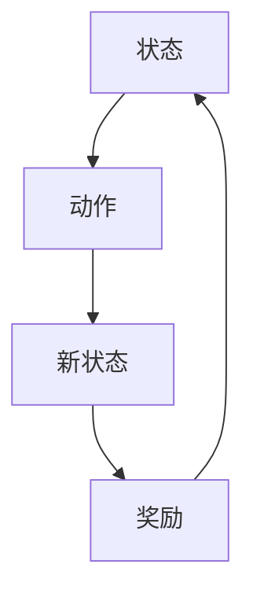
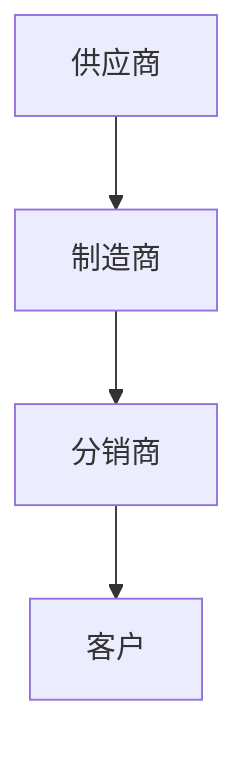
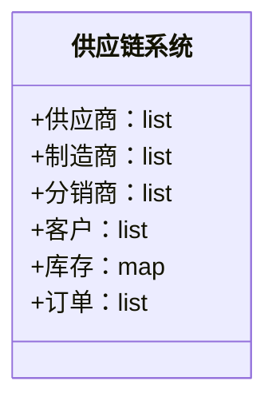
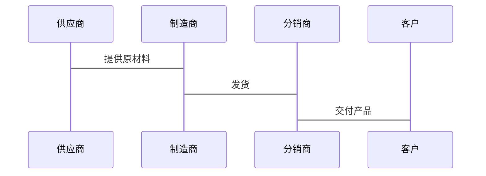

                 


# AI Agent在企业供应链管理中的应用

> 关键词：AI Agent，供应链管理，企业，算法原理，系统架构，项目实战

> 摘要：本文详细探讨了AI Agent在企业供应链管理中的应用，从基本概念到算法原理，再到系统架构和项目实战，全面分析了AI Agent如何优化供应链管理的各个环节。文章结合实际案例和代码实现，帮助读者深入了解AI Agent在供应链管理中的潜力和应用价值。

---

# 第1章: AI Agent与企业供应链管理概述

## 1.1 AI Agent的基本概念

### 1.1.1 AI Agent的定义与特征
AI Agent（人工智能代理）是指能够感知环境、自主决策并执行任务的智能体。它具有以下特征：
- **自主性**：能够在没有外部干预的情况下独立运行。
- **反应性**：能够根据环境的变化实时调整行为。
- **目标导向**：通过设定目标来驱动行动。
- **学习能力**：能够从经验中学习并优化性能。

### 1.1.2 AI Agent与传统自动化系统的区别
传统自动化系统基于固定的规则和逻辑，而AI Agent具备学习和自适应能力，能够应对复杂多变的环境。例如，在供应链管理中，AI Agent可以动态调整库存策略，而传统系统只能按照预设规则执行。

### 1.1.3 企业供应链管理的定义与目标
供应链管理是指从原材料采购到产品交付的全生命周期管理。其目标是提高效率、降低成本、增强灵活性和响应速度。

## 1.2 AI Agent在供应链管理中的应用背景

### 1.2.1 供应链管理的痛点与挑战
- **复杂性**：供应链涉及多个环节和参与者，协调难度大。
- **不确定性**：市场波动、物流延迟等不可预测因素影响供应链效率。
- **数据孤岛**：信息分散，难以实现高效协同。

### 1.2.2 AI Agent如何解决供应链问题
AI Agent通过实时数据分析、智能决策和自适应优化，能够有效解决供应链中的复杂问题，如库存优化、需求预测和风险防控。

### 1.2.3 当前AI Agent在供应链中的应用现状
目前，AI Agent在供应链中的应用主要集中在库存管理、订单处理和物流优化等领域。随着技术进步，其应用范围将进一步扩大。

## 1.3 本书的核心内容与目标

### 1.3.1 本书的核心问题
本书将探讨AI Agent在供应链管理中的具体应用，分析其技术原理和实际效果。

### 1.3.2 本书的结构安排
- 第1章：概述AI Agent和供应链管理的基本概念。
- 第2章：详细讲解AI Agent的核心概念和原理。
- 第3章：分析AI Agent在供应链管理中的算法原理。
- 第4章：探讨供应链管理系统的分析与架构设计。
- 第5章：通过项目实战展示AI Agent的应用。
- 第6章：总结并展望未来的发展。

### 1.3.3 本书的目标读者
本书适合对AI技术感兴趣的企业管理者、供应链从业者以及AI开发人员阅读。

---

# 第2章: AI Agent的核心概念与原理

## 2.1 AI Agent的核心概念

### 2.1.1 知识表示与推理
知识表示是AI Agent理解环境的基础。常用的知识表示方法包括语义网络和规则表示。例如，使用语义网络表示产品之间的关系。

### 2.1.2 计划与决策
AI Agent通过规划算法制定行动方案。规划算法包括启发式搜索和动态规划等方法。

### 2.1.3 学习与自适应
AI Agent通过机器学习技术不断优化性能。监督学习和强化学习是常用的两种方法。

## 2.2 AI Agent的特征对比

### 2.2.1 基于表格的核心概念属性特征对比
| 特征      | 传统自动化系统 | AI Agent                     |
|-----------|----------------|------------------------------|
| 自主性     | 无              | 高                           |
| 反应性     | 低              | 高                           |
| 学习能力   | 无              | 有                           |

### 2.2.2 基于ER模型的实体关系图
```mermaid
er
actor: AI Agent
schema: 供应链系统
entity1: 供应商
entity2: 制造商
entity3: 分销商
entity4: 客户
```

---

# 第3章: AI Agent在供应链管理中的算法原理

## 3.1 基于强化学习的决策算法

### 3.1.1 强化学习的基本原理
强化学习通过奖励机制优化决策。例如，AI Agent在库存管理中，每做出一个决策，系统会根据结果给予正向或负向的反馈。

### 3.1.2 在供应链管理中的应用
强化学习可以用于需求预测和库存优化。例如，AI Agent可以根据历史销售数据预测未来的需求量。

### 3.1.3 算法流程图（mermaid）


### 3.1.4 算法实现代码示例
```python
import numpy as np
from collections import deque

class AI_Agent:
    def __init__(self, state_size, action_size):
        self.state_size = state_size
        self.action_size = action_size
        self.gamma = 0.99
        self.epsilon = 1.0
        self.epsilon_min = 0.01
        self.memory = deque(maxlen=1000)
        self.model = self._build_model()

    def _build_model(self):
        # 构建神经网络模型
        pass

    def act(self, state):
        if np.random.random() < self.epsilon:
            return np.random.randint(0, self.action_size)
        else:
            return np.argmax(self.model.predict(state))

    def remember(self, state, action, reward, next_state):
        self.memory.append((state, action, reward, next_state))

    def replay(self, batch_size):
        # 回放记忆并训练模型
        pass
```

### 3.1.5 算法的数学模型
AI Agent的决策过程可以用以下公式表示：
$$ Q(s, a) = (1 - \alpha) Q(s, a) + \alpha (r + \gamma \max_a Q(s', a')) $$
其中，$\alpha$是学习率，$\gamma$是折扣因子。

## 3.2 基于图神经网络的关联分析

### 3.2.1 图神经网络的基本原理
图神经网络能够处理图结构数据，适用于分析复杂的关系网络。

### 3.2.2 在供应链中的应用
图神经网络可以用于分析供应商之间的关系，识别潜在的风险点。

### 3.2.3 算法流程图（mermaid）


### 3.2.4 算法实现代码示例
```python
import tensorflow as tf
from tensorflow.keras import layers

class GNN:
    def __init__(self, input_dim, output_dim):
        self.model = self._build_model(input_dim, output_dim)

    def _build_model(self, input_dim, output_dim):
        x = layers.Input(shape=(input_dim,))
        embedding = layers.Dense(64, activation='relu')(x)
        output = layers.Dense(output_dim, activation='softmax')(embedding)
        return tf.keras.Model(inputs=x, outputs=output)

    def call(self, inputs):
        return self.model(inputs)
```

### 3.2.5 算法的数学模型
图神经网络的传播规则可以表示为：
$$ h_i^{(l+1)} = \sigma(\sum_{j \in N(i)} W_{ij} h_j^{(l)} + b_i) $$
其中，$h_i$表示节点i在第l层的表示，$W$是权重矩阵，$b$是偏置项。

---

# 第4章: 供应链管理系统的分析与架构设计

## 4.1 供应链管理系统的功能设计

### 4.1.1 领域模型（mermaid类图）


## 4.2 系统架构设计

### 4.2.1 分层架构设计（mermaid架构图）
```mermaid
C4Context
    title 供应链管理系统架构
    <<Component>> 供应链管理系统
    <<Component>> 数据层
    <<Component>> 业务逻辑层
    <<Component>> 表现层
    表现层 --> 业务逻辑层
    业务逻辑层 --> 数据层
```

## 4.3 系统接口与交互设计

### 4.3.1 系统接口设计
- **输入接口**：接收供应商、制造商和分销商的数据。
- **输出接口**：提供库存状态和订单信息。

### 4.3.2 系统交互流程（mermaid序列图）


---

# 第5章: 项目实战——AI Agent在供应链中的应用

## 5.1 项目环境与工具安装

### 5.1.1 开发环境搭建
- **操作系统**：Windows 10或更高版本
- **编程语言**：Python 3.8+
- **框架**：TensorFlow、Keras
- **工具**：Jupyter Notebook、VS Code

### 5.1.2 依赖库安装
```bash
pip install tensorflow keras numpy matplotlib
```

## 5.2 系统核心功能实现

### 5.2.1 AI Agent模块实现
```python
class SupplyChainAI:
    def __init__(self):
        self.agent = AI_Agent(state_size=10, action_size=5)

    def process_order(self, order):
        state = self.get_state()
        action = self.agent.act(state)
        return action
```

### 5.2.2 供应链数据处理模块实现
```python
class DataProcessor:
    def __init__(self):
        self.data = {}

    def update_data(self, key, value):
        self.data[key] = value

    def get_data(self, key):
        return self.data.get(key, None)
```

## 5.3 代码应用与案例分析

### 5.3.1 代码实现与解读
- **AI Agent模块**：通过强化学习算法优化库存管理。
- **数据处理模块**：实时更新和获取供应链数据。

### 5.3.2 实际案例分析
假设某制造企业面临库存积压问题，AI Agent可以通过分析销售数据，动态调整采购策略，减少库存浪费。

---

# 第6章: 总结与展望

## 6.1 本章小结

### 6.1.1 核心概念回顾
- AI Agent在供应链管理中的核心作用
- 算法原理和系统架构的设计思路

### 6.1.2 项目实战总结
通过实际案例，展示了AI Agent在供应链管理中的巨大潜力。

## 6.2 未来展望

### 6.2.1 技术发展
随着AI技术的进步，AI Agent将更加智能化和自适应。

### 6.2.2 应用场景扩展
AI Agent将在更多领域得到应用，如智能物流和智能制造。

---

# 总结
本文系统地介绍了AI Agent在企业供应链管理中的应用，从理论到实践，全面分析了其技术原理和实际效果。通过项目实战，读者可以深入了解AI Agent的应用价值和实现方法。未来，随着技术的进一步发展，AI Agent将在供应链管理中发挥更大的作用。

--- 

希望这篇技术博客文章能满足您的需求！如果需要进一步调整或补充，请随时告诉我。

