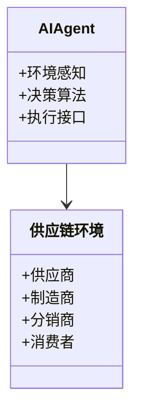
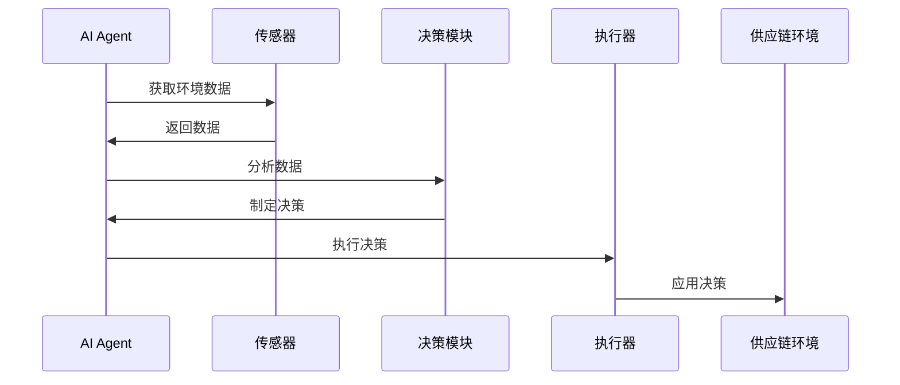

                 


# AI Agent在企业供应链韧性提升中的角色

## 关键词：
- AI Agent
- 供应链韧性
- 企业供应链管理
- 人工智能技术
- 供应链风险管理
- 供应链优化策略

## 摘要：
AI Agent（人工智能代理）在企业供应链管理中扮演着越来越重要的角色。随着全球化和市场竞争的加剧，企业供应链面临的不确定性增加，如原材料短缺、物流中断和需求波动等。AI Agent通过智能化的感知、决策和执行能力，能够实时监控供应链状态，预测潜在风险，并主动采取措施优化供应链运营。本文将深入探讨AI Agent在提升供应链韧性中的核心作用，分析其算法原理、系统架构，并通过实际案例展示其在供应链管理中的应用价值。

---

# 第1章: 供应链韧性与AI Agent概述

## 1.1 供应链韧性的定义与重要性

### 1.1.1 供应链的基本概念
供应链是指从原材料采购到产品交付给最终用户的整个过程，包括供应商、制造商、分销商、零售商和消费者等多个环节。供应链的有效运作依赖各环节的协同合作和信息共享。

### 1.1.2 供应链韧性的定义
供应链韧性是指在面对外部干扰（如自然灾害、疫情、地缘政治冲突等）时，供应链能够快速恢复、适应变化并维持正常运作的能力。具有韧性的供应链能够在不确定性中保持稳定，最大限度地减少中断带来的损失。

### 1.1.3 提升供应链韧性的必要性
现代供应链面临着诸多挑战，如全球化带来的复杂性、客户需求的多样化、环保法规的严格要求等。提升供应链韧性可以帮助企业：
- 减少因中断导致的损失。
- 快速响应市场变化。
- 提高整体运营效率。
- 实现可持续发展目标。

## 1.2 AI Agent的基本概念

### 1.2.1 AI Agent的定义
AI Agent是一种能够感知环境、自主决策并采取行动以实现目标的智能体。它能够通过传感器或数据源获取信息，利用机器学习算法进行分析，并根据结果采取相应行动。

### 1.2.2 AI Agent的核心特征
| 特征 | 描述 |
|------|------|
| 感知能力 | 能够从环境中获取数据并理解信息。 |
| 决策能力 | 基于感知信息，利用算法做出最优决策。 |
| 执行能力 | 能够通过执行器或接口采取实际行动。 |
| 学习能力 | 能够通过反馈不断优化自身的算法和行为。 |

### 1.2.3 AI Agent与传统供应链管理的区别
传统供应链管理依赖人工操作和固定规则，而AI Agent能够实时分析数据、自主决策并优化流程。例如，AI Agent可以自动调整供应商订单量，以应对原材料短缺的风险。

## 1.3 AI Agent在供应链中的应用前景

### 1.3.1 AI Agent的潜在应用场景
- **需求预测**：通过历史数据和市场趋势，预测未来的需求。
- **库存管理**：优化库存水平，避免过剩或短缺。
- **风险预警**：实时监控供应链中的潜在风险，如供应商延迟交付。
- **应急响应**：在发生中断时，快速调整供应链策略，寻找替代供应商或调整生产计划。

### 1.3.2 企业采用AI Agent的优势
- 提高供应链的透明度和可视化能力。
- 实现供应链各环节的智能化协同。
- 减少人为错误，提高决策效率。
- 提高供应链的弹性和适应性。

### 1.3.3 AI Agent应用的挑战与机遇
- **挑战**：数据隐私问题、算法的可解释性、多智能体协作的复杂性。
- **机遇**：通过AI Agent实现更高效的供应链管理，提升企业的竞争力。

---

# 第2章: AI Agent的核心概念与联系

## 2.1 AI Agent的原理

### 2.1.1 AI Agent的基本原理
AI Agent通过以下步骤实现其功能：
1. **感知**：通过传感器或数据源获取环境信息。
2. **分析**：利用机器学习算法对信息进行分析和处理。
3. **决策**：基于分析结果，制定行动方案。
4. **执行**：通过执行器或接口采取实际行动。

### 2.1.2 AI Agent的感知与决策机制
AI Agent的感知能力依赖于数据采集和分析技术，例如：
- 数据采集：通过物联网设备实时采集供应链各环节的数据。
- 数据分析：利用大数据技术对数据进行清洗、建模和预测。

决策机制通常基于强化学习或决策树等算法，例如：
- **强化学习**：通过试错和反馈不断优化决策策略。
- **决策树**：基于预设规则和优先级做出决策。

### 2.1.3 AI Agent的学习与优化能力
AI Agent能够通过自我学习不断优化其算法和行为。例如，通过强化学习，AI Agent可以在模拟环境中不断试验，找到最优的行动策略。

## 2.2 AI Agent与供应链韧性之间的关系

### 2.2.1 AI Agent如何提升供应链的灵活性
AI Agent能够快速适应市场变化和供应链环境的波动。例如，在需求激增时，AI Agent可以迅速调整生产计划和采购策略。

### 2.2.2 AI Agent如何增强供应链的抗风险能力
AI Agent能够实时监控供应链中的潜在风险，并提前采取预防措施。例如，当检测到某个供应商可能延迟交付时，AI Agent可以自动寻找替代供应商。

### 2.2.3 AI Agent如何优化供应链的协同效率
AI Agent能够协调供应链中的多个参与者，确保信息共享和协同合作。例如，通过AI Agent，供应商、制造商和分销商可以实时共享库存和订单信息，避免信息孤岛。

---

# 第3章: AI Agent的算法原理

## 3.1 AI Agent的核心算法

### 3.1.1 强化学习算法
强化学习是一种通过试错和反馈优化决策策略的算法。AI Agent通过与环境的交互，不断学习最优的行动方案。

### 3.1.2 Q-learning算法
Q-learning是一种常用的强化学习算法，其核心公式为：
$$ Q(s,a) = Q(s,a) + \alpha [r + \gamma \max Q(s',a') - Q(s,a)] $$
其中：
- \( Q(s,a) \) 表示当前状态 \( s \) 下采取行动 \( a \) 的价值。
- \( \alpha \) 表示学习率。
- \( r \) 表示奖励。
- \( \gamma \) 表示折扣因子。
- \( s' \) 表示下一状态。
- \( a' \) 表示下一行动。

### 3.1.3 多智能体协作算法
在复杂的供应链环境中，AI Agent通常需要与多个智能体协作。例如，可以通过分布式强化学习算法实现多智能体之间的协同决策。

## 3.2 算法原理的数学模型

### 3.2.1 Q-learning算法的数学公式
$$ Q(s,a) = Q(s,a) + \alpha [r + \gamma \max Q(s',a') - Q(s,a)] $$

### 3.2.2 多智能体协作的数学模型
$$ V(s) = \max_{a} [r 

---

# 第4章: 系统分析与架构设计方案

## 4.1 问题场景介绍
供应链中断可能导致生产延迟、成本增加和客户满意度下降。例如，原材料供应商突然停产，可能导致整个生产流程中断。

## 4.2 系统功能设计

### 4.2.1 领域模型设计


### 4.2.2 系统架构设计
```mermaid
graph TD
    AI Agent --> 传感器
    传感器 --> 数据源
    AI Agent --> 决策模块
    决策模块 --> 执行器
    执行器 --> 供应链环境
```

### 4.2.3 系统交互设计


---

# 第5章: 项目实战

## 5.1 环境安装
- **Python**：安装Python 3.x
- **库**：安装numpy、pandas、scikit-learn、tensorflow等。

## 5.2 核心代码实现

### 5.2.1 Q-learning算法实现
```python
import numpy as np
import random

class AI_Agent:
    def __init__(self, state_space, action_space):
        self.state_space = state_space
        self.action_space = action_space
        self.Q = np.zeros((state_space, action_space))

    def take_action(self, state):
        if random.uniform(0, 1) < 0.1:
            return random.randint(0, self.action_space-1)
        else:
            return np.argmax(self.Q[state, :])

    def learn(self, state, action, reward, next_state):
        self.Q[state, action] = self.Q[state, action] + 0.1 * (reward + 0.9 * np.max(self.Q[next_state, :]) - self.Q[state, action])
```

### 5.2.2 应用场景示例
```python
# 初始化环境
state_space = 5
action_space = 3
agent = AI_Agent(state_space, action_space)

# 训练过程
for _ in range(1000):
    state = random.randint(0, state_space-1)
    action = agent.take_action(state)
    reward = 0
    if action == 2:
        reward = 1
    next_state = state + 1 if action == 2 else state
    agent.learn(state, action, reward, next_state)
```

---

# 第6章: 总结与展望

## 6.1 最佳实践
- 确保数据的质量和完整性。
- 定期更新AI Agent的算法模型。
- 与供应链各环节的参与者密切合作。

## 6.2 小结
AI Agent通过智能化的感知、决策和执行能力，能够显著提升供应链的韧性。随着技术的不断进步，AI Agent将在未来的供应链管理中发挥越来越重要的作用。

## 6.3 注意事项
- 数据隐私和安全问题需要重点关注。
- 算法的可解释性需要进一步研究。
- 多智能体协作的复杂性需要有效的解决方案。

## 6.4 拓展阅读
- 《强化学习导论》
- 《人工智能在供应链管理中的应用》
- 《分布式系统与多智能体协作》

---

通过以上内容，我们详细探讨了AI Agent在企业供应链韧性提升中的角色，从理论到实践，从算法到系统设计，为读者提供了一个全面的视角。希望本文能够为企业的供应链管理提供有价值的参考和启示。

