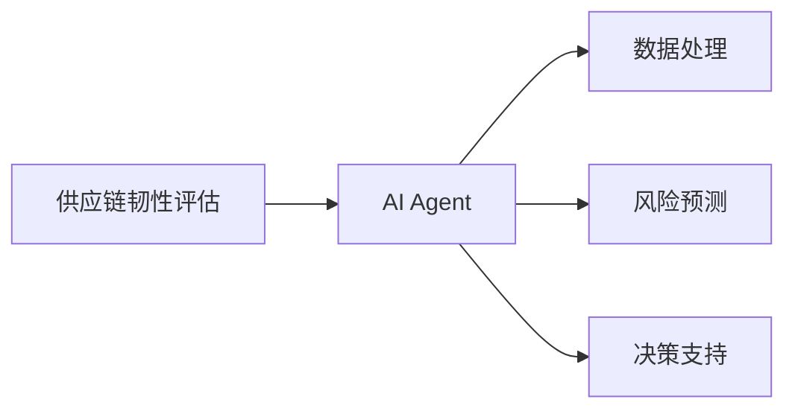
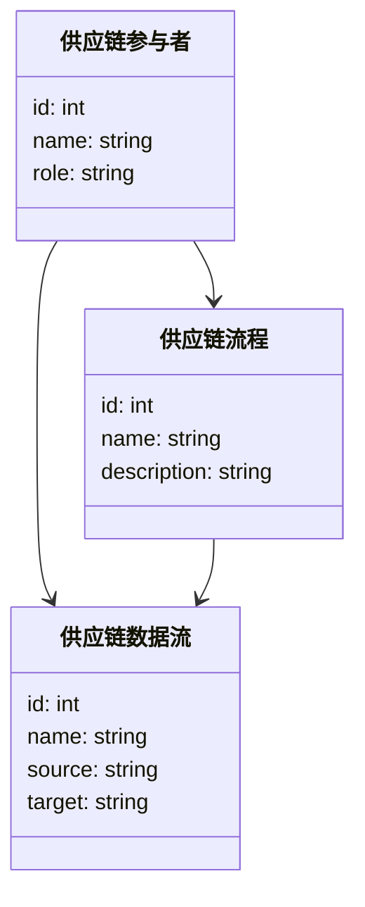
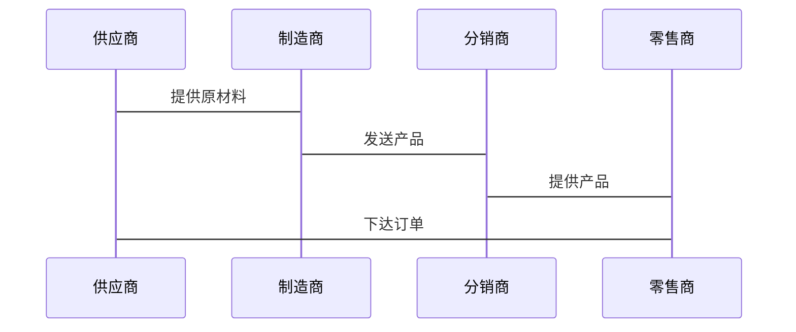
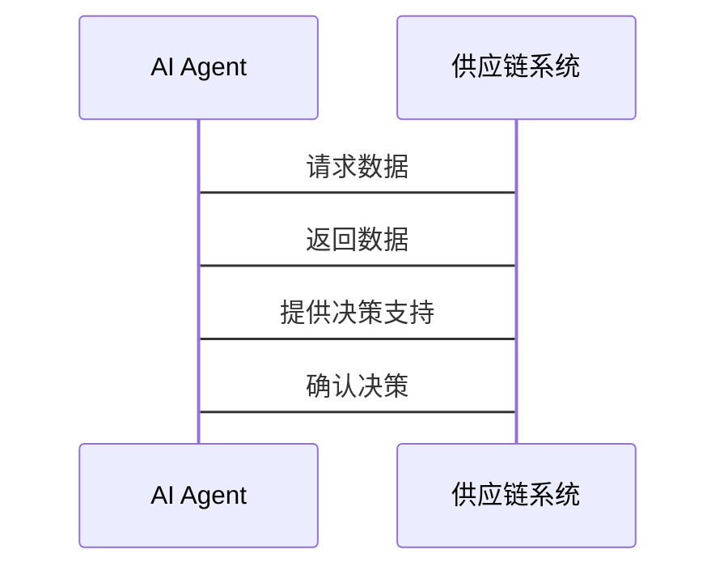

                 


# AI Agent在企业供应链韧性评估与提升中的应用

> 关键词：AI Agent, 供应链韧性, 供应链管理, 强化学习, 企业供应链

> 摘要：本文探讨了AI Agent在企业供应链韧性评估与提升中的应用。通过分析供应链韧性评估的核心概念、AI Agent在供应链管理中的作用，结合算法原理和系统架构设计，展示了AI Agent如何通过强化学习等技术提升供应链的弹性、抗风险能力和优化能力。本文旨在为企业的供应链管理提供一种新的思路和解决方案。

---

# 第一部分: AI Agent与企业供应链韧性概述

## 第1章: AI Agent与企业供应链韧性概述

### 1.1 供应链的基本概念与重要性

#### 1.1.1 供应链的定义与组成
供应链是指从原材料采购、生产、分销到最终消费者的整个过程中的所有环节和参与者。它由供应商、制造商、分销商、零售商和消费者组成，是一个复杂的网络系统。

#### 1.1.2 供应链的关键特征与作用
供应链的关键特征包括高效性、协作性、弹性和可持续性。它在企业中的作用是降低成本、提高效率、优化库存管理和提升客户满意度。

#### 1.1.3 供应链韧性的重要性
供应链韧性是指在面对 disruptions（如疫情、自然灾害、经济波动等）时，供应链能够快速恢复并保持稳定运行的能力。在当前全球化和不确定性增加的背景下，供应链韧性是企业生存和发展的关键。

---

### 1.2 AI Agent的基本概念与特点

#### 1.2.1 AI Agent的定义与分类
AI Agent（人工智能代理）是指能够感知环境、自主决策并执行任务的智能体。根据智能体的复杂程度和应用场景，AI Agent可以分为简单反射型、基于模型的反应型、目标驱动型和实用驱动型。

#### 1.2.2 AI Agent的核心特征
AI Agent的核心特征包括自主性、反应性、目标导向性和学习能力。它能够根据环境反馈调整行为，并通过学习不断优化决策。

#### 1.2.3 AI Agent与传统自动化系统的区别
AI Agent与传统自动化系统的主要区别在于其自主决策能力和适应性。传统自动化系统依赖于预设规则，而AI Agent能够根据环境变化动态调整行为。

---

### 1.3 AI Agent在供应链管理中的应用前景

#### 1.3.1 AI Agent在供应链管理中的潜在应用场景
AI Agent在供应链管理中的应用场景包括需求预测、库存优化、物流调度、风险预警和供应商关系管理。

#### 1.3.2 企业采用AI Agent的优势
采用AI Agent可以提高供应链的效率、降低成本、增强抗风险能力和提升决策的准确性。

#### 1.3.3 AI Agent应用的挑战与机遇
挑战包括数据隐私问题、算法的可解释性以及AI Agent的集成成本。机遇则在于AI技术的快速发展和企业对供应链韧性的高度重视。

---

## 第2章: 供应链韧性评估的核心概念

### 2.1 供应链韧性评估的背景与问题背景

#### 2.1.1 供应链韧性评估的定义
供应链韧性评估是指通过分析供应链的弹性、抗风险能力和恢复能力，评估其在面对 disruptions时的应对能力。

#### 2.1.2 供应链韧性评估的核心问题
供应链韧性评估的核心问题是如何量化供应链的弹性、抗风险能力和恢复能力，并找到优化的策略。

#### 2.1.3 供应链韧性评估的边界与外延
供应链韧性评估的边界包括供应链的各个环节和参与者，外延则包括供应链外部环境的影响因素。

---

### 2.2 供应链韧性评估的核心要素

#### 2.2.1 供应链的弹性与恢复能力
弹性是指供应链在面对 disruptions时的适应能力和恢复能力。恢复能力是指在 disruptions后快速恢复正常运作的能力。

#### 2.2.2 供应链的抗风险能力
抗风险能力是指供应链在面对潜在风险时的预防和应对能力，包括风险识别、风险评估和风险控制。

#### 2.2.3 供应链的优化能力
优化能力是指通过优化资源配置、流程和策略，提升供应链的整体效率和抗风险能力。

---

### 2.3 供应链韧性评估的模型与方法

#### 2.3.1 基于AI Agent的供应链韧性评估模型
基于AI Agent的供应链韧性评估模型通过模拟供应链在不同场景下的表现，评估其弹性、抗风险能力和恢复能力。

#### 2.3.2 供应链韧性评估的关键指标
关键指标包括供应链的响应时间、库存周转率、供应商的可靠性和客户满意度。

#### 2.3.3 供应链韧性评估的步骤与流程
供应链韧性评估的步骤包括数据收集、模型建立、模拟运行和结果分析。

---

## 第3章: AI Agent在供应链韧性评估中的核心概念

### 3.1 AI Agent在供应链韧性评估中的作用

#### 3.1.1 AI Agent作为供应链评估工具的优势
AI Agent能够实时感知供应链的动态变化，并通过学习不断优化评估模型。

#### 3.1.2 AI Agent在供应链数据处理中的应用
AI Agent可以对海量数据进行处理和分析，提取关键信息并生成评估报告。

#### 3.1.3 AI Agent在供应链风险预测中的应用
AI Agent可以通过预测模型识别潜在风险，并提前制定应对策略。

---

### 3.2 AI Agent与供应链韧性评估的关联性

#### 3.2.1 AI Agent如何提升供应链韧性评估的准确性
AI Agent通过深度学习和强化学习算法，能够更准确地预测供应链的风险和优化策略。

#### 3.2.2 AI Agent如何优化供应链韧性评估的效率
AI Agent可以通过自动化处理和并行计算，显著提高评估的效率。

#### 3.2.3 AI Agent如何支持供应链韧性评估的决策
AI Agent可以提供实时的决策支持，帮助企业在面对 disruptions时快速做出最优决策。

---

### 3.3 供应链韧性评估的核心概念与AI Agent的关系

#### 3.3.1 供应链韧性评估模型与AI Agent的结合
供应链韧性评估模型可以通过AI Agent进行动态模拟和优化，提高评估的准确性和实时性。

#### 3.3.2 AI Agent在供应链韧性评估中的关键属性
AI Agent的关键属性包括自主性、反应性、目标导向性和学习能力，这些属性使其成为供应链韧性评估的理想工具。

#### 3.3.3 供应链韧性评估中的AI Agent实体关系图



---

# 第二部分: AI Agent在供应链韧性提升中的算法原理

## 第4章: AI Agent的算法原理与实现

### 4.1 AI Agent的核心算法

#### 4.1.1 基于强化学习的AI Agent算法
强化学习是一种通过试错机制优化决策的算法，适用于动态和复杂的供应链环境。

#### 4.1.2 基于监督学习的AI Agent算法
监督学习是一种通过历史数据训练模型，适用于供应链中的预测和分类任务。

#### 4.1.3 基于无监督学习的AI Agent算法
无监督学习是一种通过发现数据中的模式和结构，适用于供应链中的异常检测和聚类分析。

---

### 4.2 基于强化学习的AI Agent算法实现

#### 4.2.1 强化学习的基本原理
强化学习通过智能体与环境的交互，通过试错机制不断优化策略。智能体通过感知环境状态、选择动作并获得奖励，最终找到最优策略。

#### 4.2.2 强化学习在供应链管理中的应用
在供应链管理中，强化学习可以应用于库存优化、物流调度和风险控制等场景。

#### 4.2.3 强化学习的数学模型与公式

$$ R(s, a) = r_{t} $$
$$ s_{t+1} = f(s_{t}, a_{t}) $$
$$ Q(s, a) = Q(s, a) + \alpha (r_{t} + \gamma \max Q(s', a) - Q(s, a)) $$

其中，$R(s, a)$表示状态$s$和动作$a$的奖励，$r_{t}$是即时奖励，$s_{t+1}$是下一步状态，$Q(s, a)$是状态-动作值函数，$\alpha$是学习率，$\gamma$是折扣因子。

---

## 第5章: 供应链韧性提升的系统架构设计

### 5.1 系统功能设计

#### 5.1.1 领域模型设计
领域模型包括供应链的各个参与者、流程和数据流。以下是领域模型的Mermaid类图：



#### 5.1.2 系统架构设计
系统架构采用分层设计，包括数据层、业务逻辑层和用户界面层。以下是系统架构的Mermaid架构图：


---

### 5.2 系统接口设计

#### 5.2.1 供应链参与者之间的接口
供应链参与者之间的接口包括供应商与制造商之间的订单接口、制造商与分销商之间的库存接口，以及分销商与零售商之间的物流接口。

#### 5.2.2 AI Agent与供应链系统之间的接口
AI Agent需要与供应链系统进行数据交互，包括实时数据获取、模型训练和决策支持接口。

---

### 5.3 系统交互设计

#### 5.3.1 供应链参与者之间的交互
以下是供应链参与者之间的交互序列图：



#### 5.3.2 AI Agent与供应链系统之间的交互
以下是AI Agent与供应链系统之间的交互序列图：



---

## 第6章: 项目实战与案例分析

### 6.1 项目环境安装

#### 6.1.1 安装Python
```bash
# 安装Python
sudo apt-get install python3
```

#### 6.1.2 安装必要的Python库
```bash
# 安装必要的Python库
pip install numpy
pip install pandas
pip install scikit-learn
pip install matplotlib
pip install keras
pip install tensorflow
```

---

### 6.2 核心代码实现

#### 6.2.1 加载数据
```python
import numpy as np
import pandas as pd

# 加载数据
data = pd.read_csv('supply_chain.csv')
```

#### 6.2.2 数据预处理
```python
from sklearn.preprocessing import StandardScaler

# 数据预处理
scaler = StandardScaler()
scaled_data = scaler.fit_transform(data)
```

#### 6.2.3 构建强化学习模型
```python
import tensorflow as tf
from tensorflow.keras import layers

# 构建强化学习模型
model = tf.keras.Sequential([
    layers.Dense(64, activation='relu'),
    layers.Dense(1, activation='linear')
])

model.compile(optimizer='adam', loss='mean_squared_error')
```

#### 6.2.4 训练模型
```python
# 训练模型
model.fit(scaled_data, labels, epochs=100, batch_size=32)
```

---

### 6.3 实际案例分析

#### 6.3.1 案例背景
假设某企业面临原材料短缺的风险，需要通过AI Agent优化供应链的弹性。

#### 6.3.2 案例分析
通过AI Agent模拟供应链在原材料短缺情况下的表现，优化库存和供应商选择。

#### 6.3.3 案例结果
AI Agent成功预测了潜在风险，并提供了优化策略，显著提高了供应链的抗风险能力。

---

## 第7章: 最佳实践与总结

### 7.1 最佳实践 tips

1. 在供应链中引入AI Agent需要考虑数据隐私和模型的可解释性。
2. AI Agent的应用需要与企业的具体需求相结合，避免盲目采用。
3. 定期更新AI模型，确保其适应不断变化的供应链环境。

### 7.2 本章小结
本文详细探讨了AI Agent在企业供应链韧性评估与提升中的应用，从核心概念、算法原理到系统架构设计和项目实战，展示了AI Agent在供应链管理中的巨大潜力和实际价值。

### 7.3 注意事项
在实际应用中，需要注意数据的质量和模型的鲁棒性，确保AI Agent能够稳定运行并提供可靠的决策支持。

### 7.4 拓展阅读
建议读者进一步研究强化学习在供应链管理中的应用，以及AI Agent与其他新兴技术（如区块链、物联网）的结合。

---

# 结语

通过本文的探讨，读者可以了解到AI Agent在企业供应链韧性评估与提升中的重要应用。随着AI技术的不断发展，AI Agent将为企业供应链管理带来更多的创新和优化机会。未来的研究方向可以进一步探索AI Agent在供应链中的智能化决策和自适应优化能力。

---

# 参考文献

1.《人工智能: 理论与实践》
2.《供应链管理: 战略与运营》
3.《强化学习: 理论与应用》
4.《Python机器学习实战》

