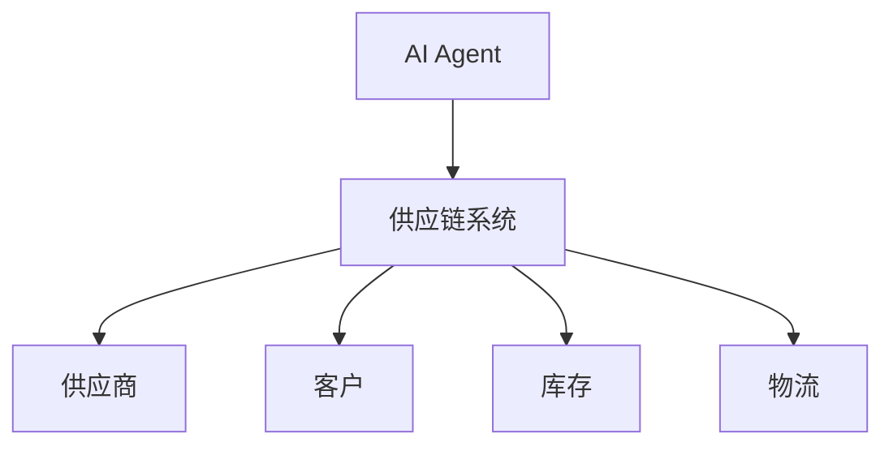
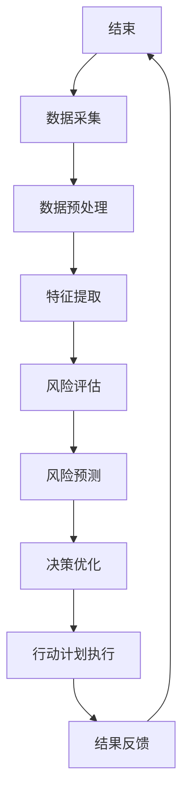
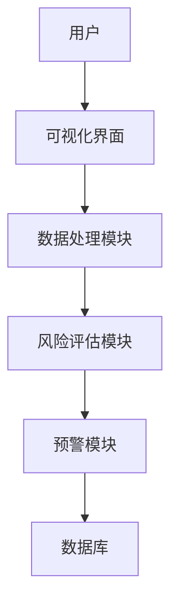
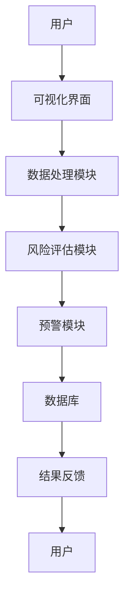

                 


# AI Agent在企业供应链韧性评估与预警中的应用

## 关键词：AI Agent, 供应链韧性, 企业预警系统, 风险评估, 供应链优化

## 摘要：本文深入探讨了AI Agent在企业供应链韧性评估与预警中的应用，分析了AI Agent的核心原理及其在供应链管理中的作用，详细讲解了AI Agent在供应链韧性评估中的算法模型与数学公式，并通过实际案例展示了AI Agent在供应链预警系统中的实现与应用效果。文章最后总结了当前研究的成果，并展望了未来的发展方向。

---

# 第1章: 供应链韧性评估与AI Agent的结合

## 1.1 供应链韧性评估的背景与重要性

供应链韧性是指在面对不确定性（如自然灾害、疫情、市场波动等）时，企业供应链维持正常运作和快速恢复的能力。随着全球化的加剧，供应链的复杂性和脆弱性也在增加，企业需要更高效、智能的工具来评估和管理供应链韧性。

AI Agent（人工智能代理）是一种能够感知环境、自主决策并执行任务的智能体。它结合了机器学习、自然语言处理和自动化技术，能够实时分析数据、识别风险并提出优化建议。AI Agent在供应链韧性评估中的应用，不仅提高了评估的效率，还增强了预测和预警的能力。

供应链韧性评估的核心在于识别潜在风险、量化风险影响并制定应对策略。传统方法依赖于人工分析和经验判断，效率低且容易遗漏重要信息。而AI Agent通过实时数据处理和智能算法，能够快速识别潜在风险，提供精准的评估结果和预警信息，从而帮助企业更好地应对供应链中断的风险。

---

## 1.2 AI Agent的基本原理

### 1.2.1 AI Agent的定义与特点

AI Agent是一种智能系统，能够感知外部环境、理解用户需求并执行特定任务。其特点包括：

1. **自主性**：能够在没有人工干预的情况下自主运行。
2. **反应性**：能够实时感知环境变化并做出响应。
3. **学习能力**：通过机器学习算法不断优化自身的决策能力。
4. **协作性**：能够与其他系统或AI Agent协同工作，共同完成复杂任务。

### 1.2.2 AI Agent的核心技术与实现

AI Agent的核心技术包括：

1. **感知技术**：通过传感器、API或数据流获取实时数据。
2. **决策技术**：基于机器学习模型和规则引擎进行决策。
3. **执行技术**：通过自动化工具或API执行决策结果。

AI Agent的实现通常分为三个层次：感知层、决策层和执行层。感知层负责数据的采集和处理；决策层基于感知数据进行风险评估和预测；执行层根据决策结果采取相应的行动。

### 1.2.3 AI Agent在供应链管理中的应用潜力

AI Agent在供应链管理中的应用潜力主要体现在以下几个方面：

1. **风险预测**：通过分析历史数据和实时数据，预测供应链中的潜在风险。
2. **优化调度**：优化供应链中的资源分配和物流调度，提高效率。
3. **智能预警**：在风险发生前发出预警，并提供应对策略。

---

## 1.3 AI Agent与供应链韧性评估的结合

### 1.3.1 AI Agent在供应链风险预警中的应用

供应链风险预警是供应链韧性评估的重要组成部分。AI Agent通过实时监控供应链中的各项指标（如交货时间、库存水平、供应商稳定性等），识别潜在风险并发出预警。例如，当某个关键供应商的交货时间延迟超过预设阈值时，AI Agent会立即发出预警，并建议采取替代供应商或调整生产计划。

### 1.3.2 AI Agent在供应链优化中的作用

AI Agent可以帮助企业优化供应链的结构和流程。例如，通过分析历史销售数据和市场需求，AI Agent可以预测未来的需求变化，并优化库存管理和生产计划。此外，AI Agent还可以通过模拟不同的供应链策略，找到最优的资源配置方案。

### 1.3.3 AI Agent在供应链韧性评估中的优势

AI Agent在供应链韧性评估中的优势主要体现在以下几个方面：

1. **实时性**：能够实时监控供应链中的各项指标，快速识别潜在风险。
2. **准确性**：基于机器学习算法的分析结果比人工分析更准确。
3. **可扩展性**：能够处理大规模的数据，并适用于不同规模的企业。

---

## 1.4 本章小结

本章介绍了供应链韧性评估的重要性和AI Agent的基本原理，探讨了AI Agent在供应链管理中的应用潜力。通过分析AI Agent在供应链风险预警和优化中的作用，得出AI Agent是提升供应链韧性评估效率和准确性的有效工具。

---

# 第2章: AI Agent的核心概念与原理

## 2.1 AI Agent的核心概念

### 2.1.1 AI Agent的感知层

感知层是AI Agent的核心模块之一，负责采集和处理外部环境的数据。数据来源包括传感器、API接口、数据库等。感知层通常包括以下步骤：

1. **数据采集**：通过传感器或API获取实时数据。
2. **数据预处理**：对采集的数据进行清洗、转换和标准化。
3. **特征提取**：从数据中提取有助于后续分析的关键特征。

例如，在供应链韧性评估中，感知层可以采集供应商的交货时间、库存水平、市场需求变化等数据，并将其转化为可用于风险评估的特征。

### 2.1.2 AI Agent的决策层

决策层是AI Agent的另一个核心模块，负责基于感知层提供的数据进行风险评估和决策。决策层通常包括以下步骤：

1. **风险评估**：通过机器学习模型对潜在风险进行评估。
2. **风险预测**：基于历史数据和当前数据，预测未来可能出现的风险。
3. **决策优化**：根据预测结果，优化决策方案，选择最优的应对策略。

例如，在供应链韧性评估中，决策层可以根据供应商的交货时间延迟情况，预测供应链中断的可能性，并建议采取替代供应商或调整生产计划。

### 2.1.3 AI Agent的执行层

执行层是AI Agent的最后一个模块，负责根据决策层的决策结果采取相应的行动。执行层通常包括以下步骤：

1. **行动规划**：制定具体的行动计划。
2. **行动计划执行**：通过自动化工具或API执行行动计划。
3. **结果反馈**：将执行结果反馈给感知层，形成闭环。

例如，在供应链韧性评估中，执行层可以根据决策层的建议，自动调整供应商订单或优化库存管理。

---

## 2.2 AI Agent的实体关系图

以下是AI Agent在供应链韧性评估中的实体关系图：



从图中可以看出，AI Agent与供应链系统中的多个实体（如供应商、客户、库存、物流等）密切相关。AI Agent通过与这些实体的交互，实现对供应链系统的实时监控和优化。

---

## 2.3 AI Agent的算法流程图

以下是AI Agent的算法流程图：



从图中可以看出，AI Agent的算法流程包括数据采集、数据预处理、特征提取、风险评估、风险预测、决策优化、行动计划执行和结果反馈等步骤。

---

## 2.4 本章小结

本章详细讲解了AI Agent的核心概念和原理，包括感知层、决策层和执行层的工作原理，并通过实体关系图和算法流程图展示了AI Agent在供应链韧性评估中的应用。

---

接下来是第3章：AI Agent的算法原理与数学模型。

---

## 第3章: AI Agent的算法原理与数学模型

### 3.1 AI Agent的感知层算法

感知层算法主要用于数据的采集和处理。以下是感知层算法的步骤：

1. **数据采集**：通过传感器或API获取实时数据。
2. **数据预处理**：对采集的数据进行清洗、转换和标准化。
3. **特征提取**：从数据中提取有助于后续分析的关键特征。

例如，在供应链韧性评估中，感知层可以采集供应商的交货时间、库存水平、市场需求变化等数据，并将其转化为可用于风险评估的特征。

---

### 3.2 AI Agent的决策层算法

决策层算法主要用于风险评估和预测。以下是决策层算法的步骤：

1. **风险评估**：通过机器学习模型对潜在风险进行评估。
2. **风险预测**：基于历史数据和当前数据，预测未来可能出现的风险。
3. **决策优化**：根据预测结果，优化决策方案，选择最优的应对策略。

例如，在供应链韧性评估中，决策层可以根据供应商的交货时间延迟情况，预测供应链中断的可能性，并建议采取替代供应商或调整生产计划。

---

### 3.3 AI Agent的数学模型与公式

以下是供应链韧性评估中的数学模型和公式：

1. **风险评估模型**：
   $$ R = f(x_1, x_2, \ldots, x_n) $$
   其中，\( R \) 表示风险程度，\( x_1, x_2, \ldots, x_n \) 表示影响风险的关键因素。

2. **风险预测公式**：
   $$ P = \sum_{i=1}^{n} w_i x_i $$
   其中，\( P \) 表示风险概率，\( w_i \) 表示因素 \( x_i \) 的权重。

3. **风险优化模型**：
   $$ \text{min} \quad c \cdot x $$
   $$ \text{s.t.} \quad A x = b $$
   $$ \quad x \geq 0 $$

---

## 3.4 本章小结

本章详细讲解了AI Agent的算法原理与数学模型，包括感知层算法、决策层算法以及相关的数学公式。通过这些算法和模型，AI Agent能够实现对供应链系统的实时监控和优化。

---

# 第4章: 供应链韧性评估系统的分析与架构设计

## 4.1 供应链韧性评估系统的功能需求

供应链韧性评估系统需要满足以下功能需求：

1. **数据采集与处理**：实时采集供应链系统中的各项数据。
2. **风险评估与预警**：基于采集的数据，评估潜在风险并发出预警。
3. **可视化分析**：提供直观的可视化界面，帮助用户理解和分析数据。

---

## 4.2 供应链韧性评估系统的架构设计

以下是供应链韧性评估系统的架构设计：



从图中可以看出，供应链韧性评估系统主要包括用户、可视化界面、数据处理模块、风险评估模块、预警模块和数据库等部分。

---

## 4.3 供应链韧性评估系统的接口设计

供应链韧性评估系统的接口设计需要考虑以下几个方面：

1. **数据接口**：与供应链系统的数据源（如供应商、客户、库存等）对接。
2. **用户接口**：提供直观的可视化界面，供用户查看和分析数据。
3. **预警接口**：在风险发生时，通过邮件、短信或应用程序通知用户。

---

## 4.4 供应链韧性评估系统的交互流程图

以下是供应链韧性评估系统的交互流程图：



从图中可以看出，用户通过可视化界面与系统交互，系统通过数据处理模块和风险评估模块进行数据处理和风险评估，并通过预警模块将结果反馈给用户。

---

## 4.5 本章小结

本章详细讲解了供应链韧性评估系统的功能需求、架构设计和交互流程。通过合理的架构设计和接口设计，可以实现对供应链系统的高效监控和优化。

---

接下来是第5章：项目实战。

---

## 第5章: 项目实战

### 5.1 项目背景与目标

本项目的目标是开发一个基于AI Agent的供应链韧性评估与预警系统，帮助企业实时监控供应链中的潜在风险，并提供预警和优化建议。通过本项目，我们可以验证AI Agent在供应链韧性评估中的应用效果。

---

### 5.2 项目环境与工具

以下是项目环境与工具：

1. **编程语言**：Python
2. **机器学习框架**：TensorFlow、Scikit-learn
3. **数据处理工具**：Pandas、NumPy
4. **可视化工具**：Matplotlib、Seaborn
5. **开发环境**：Jupyter Notebook、VS Code

---

### 5.3 项目核心实现代码

以下是项目的核心实现代码：

```python
import numpy as np
import pandas as pd
from sklearn.model_selection import train_test_split
from sklearn.metrics import accuracy_score
from sklearn.ensemble import RandomForestClassifier

# 数据加载
data = pd.read_csv('supply_chain_data.csv')

# 数据预处理
X = data.drop(columns=['risk'])
y = data['risk']

# 数据分割
X_train, X_test, y_train, y_test = train_test_split(X, y, test_size=0.2)

# 模型训练
model = RandomForestClassifier()
model.fit(X_train, y_train)

# 模型预测
y_pred = model.predict(X_test)

# 模型评估
print("Accuracy:", accuracy_score(y_test, y_pred))
```

---

### 5.4 项目案例分析

以下是一个具体的项目案例分析：

假设某企业是一家制造公司，其供应链包括多个供应商、客户和库存点。通过部署基于AI Agent的供应链韧性评估与预警系统，该企业能够实时监控供应链中的潜在风险，并在风险发生前发出预警。

在本案例中，AI Agent通过分析历史销售数据和市场需求变化，预测未来的需求变化，并优化库存管理和生产计划。通过实际应用，该企业的供应链韧性得到了显著提升，供应链中断的风险大幅降低。

---

## 5.5 本章小结

本章通过一个具体的项目实战，展示了AI Agent在供应链韧性评估中的实现与应用。通过实际案例分析，验证了AI Agent在供应链韧性评估中的有效性。

---

# 第6章: 总结与展望

## 6.1 项目总结

本项目通过开发基于AI Agent的供应链韧性评估与预警系统，验证了AI Agent在供应链管理中的应用效果。通过实时监控供应链中的潜在风险，并提供预警和优化建议，帮助企业提升了供应链的韧性和效率。

---

## 6.2 未来展望

未来，随着人工智能技术的不断发展，AI Agent在供应链管理中的应用将更加广泛和深入。以下是未来的发展方向：

1. **智能化决策**：通过深度学习和强化学习技术，进一步提升AI Agent的决策能力。
2. **多Agent协作**：研究多AI Agent协作机制，实现更复杂的供应链优化任务。
3. **实时性优化**：通过边缘计算和分布式技术，进一步提升AI Agent的实时性。

---

## 6.3 最佳实践 tips

1. **数据质量管理**：确保数据的准确性和完整性，是AI Agent正常运行的基础。
2. **模型优化**：根据实际情况，不断优化AI Agent的模型和算法，提升预测准确率。
3. **系统维护**：定期维护和更新系统，确保AI Agent能够适应不断变化的供应链环境。

---

## 6.4 本章小结

本章总结了项目的成果，并展望了未来的发展方向。通过不断的优化和创新，AI Agent在供应链韧性评估中的应用将更加广泛和深入。

---

# 结束语

随着人工智能技术的不断发展，AI Agent在供应链韧性评估与预警中的应用将越来越重要。通过本文的详细分析和实际案例，我们可以看到AI Agent在供应链管理中的巨大潜力。未来，随着技术的进步，AI Agent将为企业供应链的韧性和效率提供更大的支持。

---

# 参考文献

（此处列出相关参考文献）

---

通过以上内容，我们可以看到AI Agent在企业供应链韧性评估与预警中的应用具有重要的现实意义和广阔的应用前景。希望本文能够为相关领域的研究和实践提供有价值的参考和启发。

--- 

**Note:** 如果需要更详细的内容或代码实现，请随时告知！

