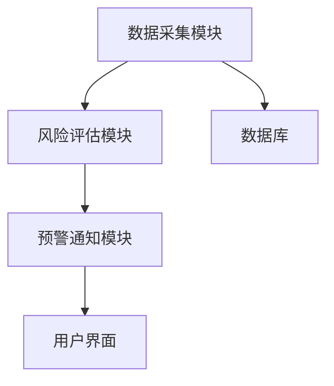

                 


# AI Agent在企业供应链风险预警中的应用

> 关键词：AI Agent，供应链管理，风险预警，企业风险管理，人工智能技术

> 摘要：随着全球供应链的复杂化和不确定性增加，企业面临着越来越多的供应链风险。本文深入探讨了AI Agent在企业供应链风险预警中的应用，从背景、概念、算法、系统架构到项目实战，全面分析了如何利用AI技术提升供应链的抗风险能力。

---

## 第一章：供应链风险预警的背景与挑战

### 1.1 供应链管理的重要性

供应链管理是企业运营的核心环节，涉及从原材料采购到最终产品交付的整个流程。一个高效的供应链能够显著降低成本、提高效率并增强企业的市场竞争力。

#### 1.1.1 供应链在企业运营中的核心地位
供应链管理贯穿企业的整个价值链，影响着企业的成本、交付速度和客户满意度。现代企业越来越依赖全球化的供应链网络，这使得供应链的复杂性和脆弱性也在增加。

#### 1.1.2 供应链面临的常见风险
供应链风险包括供应商风险、物流风险、市场需求波动风险、自然灾害风险和政策风险等。这些风险可能导致供应链中断，进而影响企业的生产计划和财务稳定性。

### 1.2 供应链风险预警的必要性

#### 1.2.1 风险预警的概念与意义
供应链风险预警是指通过监测和分析供应链中的潜在风险因素，提前发出警报，以便企业采取应对措施，降低风险的影响。其意义在于能够将风险消灭在萌芽状态，减少损失。

#### 1.2.2 传统供应链管理的局限性
传统供应链管理通常依赖人工经验和静态数据，难以实时监测和预测风险。面对复杂多变的市场环境，传统方法往往显得力不从心。

#### 1.2.3 现代供应链管理的需求
现代企业需要更加智能化、动态化的供应链管理方式，能够实时监测风险、快速响应变化并优化供应链的整体性能。

### 1.3 供应链风险预警的核心要素

#### 1.3.1 数据采集与处理
供应链风险预警的基础是数据。企业需要收集包括供应商信息、物流数据、市场需求、天气预警等多方面的数据。

#### 1.3.2 风险识别与评估
通过数据分析和模型构建，识别潜在风险并评估其影响程度。这需要结合历史数据和实时数据，利用统计分析和机器学习技术。

#### 1.3.3 风险应对与优化
在识别和评估风险的基础上，制定应对策略，优化供应链布局，降低风险发生的概率和影响。

---

## 第二章：AI Agent的核心原理与供应链中的应用

### 2.1 AI Agent的基本概念

#### 2.1.1 AI Agent的定义
AI Agent是指具有感知环境、自主决策和执行任务能力的智能体。它可以理解并处理信息，做出决策，并与外部环境进行交互。

#### 2.1.2 AI Agent的特点
- **自主性**：能够在没有人为干预的情况下自主运行。
- **反应性**：能够实时感知环境变化并做出响应。
- **目标导向性**：以特定目标为导向，优化决策过程。

### 2.2 供应链风险预警中的AI Agent应用

#### 2.2.1 AI Agent在供应链中的角色
AI Agent可以在供应链的各个环节中发挥作用，包括供应商选择、库存管理、物流监控和风险预警等。

#### 2.2.2 AI Agent如何实现风险预警
通过实时监测供应链中的各种数据，AI Agent能够识别潜在风险，并通过数据分析和模型预测，提前发出预警信号。

### 2.3 供应链风险预警的核心要素

#### 2.3.1 数据流与信息处理
供应链中的数据需要经过采集、处理和分析，才能为风险预警提供支持。AI Agent能够高效地处理这些数据，并生成有用的信息。

#### 2.3.2 风险评估与预测
通过机器学习算法，AI Agent可以对供应链中的风险进行评估和预测，帮助企业在风险发生前做好准备。

---

## 第三章：AI Agent在供应链风险预警中的算法原理

### 3.1 算法概述

#### 3.1.1 算法的基本流程
1. 数据采集与预处理
2. 风险特征提取
3. 风险评估与预测
4. 预警信号生成

#### 3.1.2 算法的核心模块
- 数据处理模块
- 风险评估模块
- 预警通知模块

### 3.2 数据流与处理流程

#### 3.2.1 数据预处理
数据预处理包括数据清洗、特征提取和数据标准化等步骤。这些步骤能够提高数据的质量和一致性，为后续分析提供基础。

#### 3.2.2 风险评估模型
常用的供应链风险评估模型包括基于统计的模型（如回归分析）和基于机器学习的模型（如随机森林、支持向量机等）。这些模型能够根据历史数据和实时数据，预测潜在风险的发生概率。

#### 3.2.3 预警信号生成
根据风险评估结果，系统会生成不同级别的预警信号。企业可以根据预警信号采取相应的应对措施。

### 3.3 机器学习算法在供应链风险预警中的应用

#### 3.3.1 支持向量机（SVM）
支持向量机是一种常用的分类算法，可以用于风险分类和预测。通过训练数据，SVM能够找到最优的分类边界，实现风险的准确分类。

#### 3.3.2 随机森林（Random Forest）
随机森林是一种基于决策树的集成学习算法，具有较高的准确性和鲁棒性。它可以用于风险评估和预测，尤其是在处理高维数据时表现优异。

#### 3.3.3 时间序列分析
时间序列分析是一种用于预测未来趋势的统计方法，常用于供应链风险预警中的需求预测和库存管理。

---

## 第四章：AI Agent在供应链风险预警中的系统架构设计

### 4.1 系统功能设计

#### 4.1.1 数据采集模块
数据采集模块负责从供应链的各个环节采集数据，包括供应商信息、物流数据、市场需求等。

#### 4.1.2 风险评估模块
风险评估模块基于机器学习算法，对采集到的数据进行分析和预测，生成风险评估结果。

#### 4.1.3 预警通知模块
预警通知模块根据风险评估结果，生成预警信号，并通过邮件、短信等方式通知相关负责人。

### 4.2 系统架构图



### 4.3 接口设计与交互流程

#### 4.3.1 接口设计
系统需要提供标准化的API接口，以便与其他系统（如ERP、CRM等）进行数据交互。

#### 4.3.2 交互流程
1. 数据采集模块从外部系统获取数据，并存储到数据库中。
2. 风险评估模块从数据库中读取数据，进行分析和预测，生成风险评估结果。
3. 预警通知模块根据风险评估结果，生成预警信号，并通过用户界面通知相关人员。

---

## 第五章：AI Agent在供应链风险预警中的项目实战

### 5.1 项目背景与目标

#### 5.1.1 项目背景
某跨国企业在全球范围内采购和销售产品，面临着复杂的供应链风险，包括供应商延迟交货、物流中断等问题。

#### 5.1.2 项目目标
通过引入AI Agent技术，实现供应链风险的实时监测和预警，提高供应链的抗风险能力。

### 5.2 核心代码实现

#### 5.2.1 数据处理代码
```python
import pandas as pd
from sklearn.preprocessing import StandardScaler

# 数据加载
data = pd.read_csv('supply_chain_data.csv')

# 数据预处理
data_processed = data.dropna()
scaler = StandardScaler()
scaled_data = scaler.fit_transform(data_processed)
```

#### 5.2.2 风险评估算法实现
```python
from sklearn.ensemble import RandomForestClassifier

# 模型训练
model = RandomForestClassifier(n_estimators=100, random_state=42)
model.fit(scaled_data, target_labels)

# 预测结果
predicted_labels = model.predict(new_data)
```

### 5.3 案例分析

#### 5.3.1 数据分析
通过对历史数据的分析，发现某些供应商在特定时间段内交货延迟的概率较高。

#### 5.3.2 风险评估
利用随机森林算法，对数据进行分析，预测未来三个月内供应链中断的风险概率。

#### 5.3.3 预警与应对
根据预测结果，系统会提前发出预警信号，并建议企业采取多元化采购策略，降低风险影响。

---

## 第六章：总结与展望

### 6.1 项目总结

通过引入AI Agent技术，企业能够实现供应链风险的实时监测和预警，显著提高了供应链的抗风险能力。项目实施过程中，团队克服了数据质量、算法选型等多方面的挑战，最终取得了良好的效果。

### 6.2 未来展望

随着人工智能技术的不断发展，供应链风险预警系统将更加智能化和精准化。未来，可以进一步研究更复杂的机器学习模型，如深度学习和强化学习，以提高风险预测的准确性。同时，还可以探索区块链技术的应用，进一步提升供应链的透明度和安全性。

---

## 附录：工具与资源

### 附录A：常用AI工具

- **Python**：数据分析与机器学习的首选语言
- **Scikit-learn**：常用的机器学习库
- **TensorFlow**：深度学习框架
- **Mermaid**：用于绘制图表的工具

### 附录B：供应链管理相关书籍推荐

- 《供应链管理：战略、规划与操作》
- 《人工智能在供应链管理中的应用》
- 《风险管理：理论与实践》

---

通过本文的详细分析，可以得出结论：AI Agent在企业供应链风险预警中的应用前景广阔，能够显著提升供应链的抗风险能力。未来，随着技术的进步，供应链管理将更加智能化和高效化。

