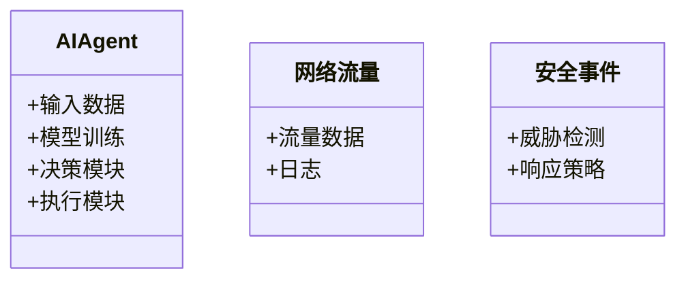
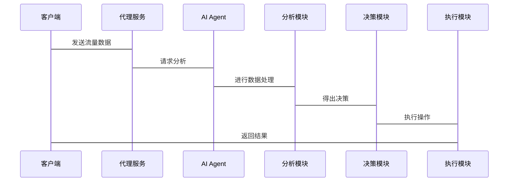

                 


# AI Agent在企业信息安全与隐私保护中的应用

> 关键词：AI Agent，企业信息安全，隐私保护，机器学习，深度学习，自然语言处理

> 摘要：本文探讨了AI Agent在企业信息安全与隐私保护中的应用，分析了AI Agent的基本概念、技术原理及其在企业安全中的实际应用。通过详细介绍AI Agent的核心算法、系统架构和实际案例，本文为读者提供了关于如何利用AI Agent提升企业信息安全能力的深入见解。

---

# 第1章 AI Agent与企业信息安全概述

## 1.1 企业信息安全与隐私保护的背景

### 1.1.1 企业信息安全的定义与重要性
企业信息安全是指保护企业数据、网络和系统免受未经授权的访问、破坏或泄露。随着数字化转型的推进，企业面临的安全威胁日益复杂，信息安全成为企业生存的关键。

### 1.1.2 隐私保护的法律与道德要求
隐私保护不仅是法律要求（如GDPR），也是企业的道德责任。企业必须确保用户和员工的隐私数据不被滥用。

### 1.1.3 数字化时代的安全挑战
数字化时代带来了更多的安全威胁，如网络攻击、数据泄露和内部威胁。传统安全措施已难以应对这些复杂威胁，AI Agent作为一种智能化的安全工具，为企业提供了新的解决方案。

## 1.2 AI Agent的基本概念与特点

### 1.2.1 AI Agent的定义与分类
AI Agent是一种智能代理，能够感知环境、自主决策并执行任务。根据功能，AI Agent可以分为监视型、决策型和执行型。

### 1.2.2 AI Agent的核心功能与优势
AI Agent的核心功能包括感知环境、分析数据、做出决策和执行操作。其优势在于智能化、自主性和高效性。

### 1.2.3 AI Agent与传统安全工具的区别
AI Agent能够自主学习和适应，而传统安全工具依赖于规则和预定义策略。AI Agent在处理复杂威胁时更具灵活性。

## 1.3 AI Agent在企业信息安全中的应用前景

### 1.3.1 AI Agent的潜在应用场景
AI Agent可以在网络监控、威胁检测、数据加密和安全响应等领域发挥作用。

### 1.3.2 企业采用AI Agent的优势
AI Agent能够提高安全效率、降低误报率并增强威胁应对能力。

### 1.3.3 AI Agent应用的挑战与机遇
挑战包括数据隐私和算法依赖，机遇在于智能化和自主性。

---

# 第2章 AI Agent的核心概念与技术原理

## 2.1 AI Agent的基本原理

### 2.1.1 AI Agent的感知机制
AI Agent通过传感器、日志分析和上下文理解等方式感知环境。

### 2.1.2 AI Agent的决策过程
决策过程包括问题建模、特征提取、模型训练和决策推理。

### 2.1.3 AI Agent的执行方式
AI Agent通过执行模块、API调用和反馈机制实现任务执行。

## 2.2 AI Agent的关键技术

### 2.2.1 机器学习与深度学习
机器学习用于模式识别，深度学习用于复杂数据处理。

### 2.2.2 自然语言处理
NLP用于处理文本数据，识别潜在威胁。

### 2.2.3 智能决策算法
基于概率的决策模型、规则模型和强化学习模型。

## 2.3 AI Agent与企业信息安全的结合

### 2.3.1 数据安全的AI Agent解决方案
AI Agent可以检测异常流量、识别恶意文件和加密敏感数据。

### 2.3.2 隐私保护的AI Agent技术
AI Agent通过数据脱敏、访问控制和隐私计算保护隐私。

### 2.3.3 安全事件响应中的AI Agent作用
AI Agent能够自动化响应、协调团队和优化策略。

---

# 第3章 AI Agent的算法原理与数学模型

## 3.1 AI Agent的核心算法

### 3.1.1 机器学习算法
- 支持向量机（SVM）用于分类
- 随机森林用于异常检测

### 3.1.2 深度学习算法
- 卷积神经网络（CNN）用于图像识别
- 循环神经网络（RNN）用于时序数据分析

### 3.1.3 自然语言处理算法
- TF-IDF用于关键词提取
- Word2Vec用于语义分析

## 3.2 AI Agent的决策算法

### 3.2.1 基于概率的决策模型
$$ P(A|B) = \frac{P(B|A)P(A)}{P(B)} $$
该公式用于计算条件概率，指导决策。

### 3.2.2 基于规则的决策模型
通过预定义规则进行决策，如如果流量异常，则标记为威胁。

### 3.2.3 基于强化学习的决策模型
通过奖励机制优化决策策略。

## 3.3 AI Agent的数学模型

### 3.3.1 机器学习模型的数学公式
$$ y = w x + b $$
线性回归模型用于分类任务。

### 3.3.2 深度学习模型的数学公式
$$ z = \sigma(w x + b) $$
sigmoid函数用于分类。

---

# 第4章 系统分析与架构设计

## 4.1 系统功能设计

### 4.1.1 领域模型


### 4.1.2 系统架构设计


### 4.1.3 系统接口设计
- 输入接口：接收网络流量和日志数据
- 输出接口：发送威胁警报和响应指令

### 4.1.4 系统交互流程


---

# 第5章 项目实战

## 5.1 环境安装

### 5.1.1 安装Python
```bash
python --version
pip install --upgrade pip
```

### 5.1.2 安装依赖库
```bash
pip install numpy scikit-learn
```

## 5.2 核心代码实现

### 5.2.1 机器学习模型实现
```python
from sklearn import svm
import numpy as np

# 创建训练数据
X = np.array([[0, 0], [1, 1], [2, 2], [3, 3]])
y = np.array([0, 1, 2, 3])

# 训练模型
model = svm.SVC()
model.fit(X, y)

# 预测
print(model.predict([[4, 4]]))  # 输出: array([3])
```

### 5.2.2 自然语言处理实现
```python
from sklearn.feature_extraction.text import TfidfVectorizer

# 创建向量器
vectorizer = TfidfVectorizer()

# 训练语料库
texts = ["This is a document about AI.", "AI is revolutionizing the industry."]
vectorizer.fit(texts)

# 转换文本
print(vectorizer.transform(["AI is changing the world."]))
```

## 5.3 案例分析与解读
通过实现的代码，我们展示了如何使用机器学习和NLP技术进行威胁检测和数据分类。

---

# 第6章 最佳实践与总结

## 6.1 最佳实践

### 6.1.1 数据加密与访问控制
确保数据在传输和存储过程中加密，并实施严格的访问控制。

### 6.1.2 定期安全审计与漏洞修复
定期进行安全审计，及时修复漏洞。

### 6.1.3 员工安全意识培训
提高员工的安全意识，减少内部威胁。

## 6.2 小结

通过本文的详细介绍，我们了解了AI Agent在企业信息安全与隐私保护中的重要作用。AI Agent结合机器学习和自然语言处理等技术，能够有效提升企业的安全能力。

---

# 第7章 总结与展望

## 7.1 总结
AI Agent作为一种智能化的安全工具，为企业提供了高效、灵活的安全解决方案。通过本文的分析，我们看到了AI Agent在企业信息安全中的巨大潜力。

## 7.2 未来展望
未来，AI Agent将与区块链、零信任架构等技术结合，为企业提供更全面的安全保护。

---

通过以上内容，我们希望为读者提供关于AI Agent在企业信息安全与隐私保护中的深入理解。如果需要进一步探讨或技术交流，请随时联系！

