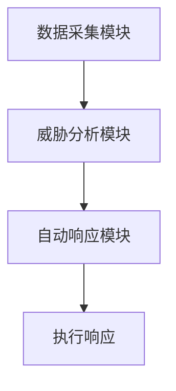

                 


# AI Agent在企业信息安全威胁检测与响应中的前沿应用

## 关键词：AI Agent，企业安全，威胁检测，威胁响应，机器学习，自然语言处理

## 摘要：  
随着企业数字化转型的加速，信息安全威胁日益复杂化和智能化，传统的安全防护手段已难以应对新型威胁。AI Agent（人工智能代理）作为一种智能化的安全解决方案，正在成为企业信息安全领域的焦点。本文将深入探讨AI Agent在企业信息安全威胁检测与响应中的前沿应用，结合实际案例，分析其技术原理、系统架构与实现方案，为企业安全团队提供理论支持和实践指导。

---

## 第1章 AI Agent概述

### 1.1 AI Agent的基本概念  
AI Agent（人工智能代理）是指能够感知环境、自主决策并执行任务的智能实体。在企业信息安全领域，AI Agent通常以软件形式存在，具备以下核心特征：  
- **自主性**：无需人工干预，自动完成任务。  
- **反应性**：能够实时感知环境变化并调整行为。  
- **学习能力**：通过机器学习技术不断优化自身能力。  

与传统安全工具相比，AI Agent的优势在于其智能化和自动化能力，能够应对复杂多变的威胁场景。

### 1.2 AI Agent的工作原理  
AI Agent在企业信息安全中的工作原理可以分为以下几个步骤：  
1. **数据采集**：通过日志、流量、行为数据等多种来源获取安全相关数据。  
2. **威胁分析**：利用机器学习、自然语言处理等技术对数据进行分析，识别潜在威胁。  
3. **决策制定**：基于分析结果，生成响应策略。  
4. **执行响应**：根据决策结果，执行相应的安全操作，如封锁恶意流量、隔离异常设备等。  

### 1.3 AI Agent在企业安全中的作用  
AI Agent在企业安全中的作用主要体现在以下三个方面：  
1. **提高威胁检测效率**：通过自动化分析海量数据，快速发现潜在威胁。  
2. **实现自动化响应**：在检测到威胁后，AI Agent能够立即执行响应操作，减少人工干预时间。  
3. **降低人为错误风险**：通过智能化决策，减少因人为疏忽导致的安全漏洞。  

---

## 第2章 威胁检测中的AI Agent应用

### 2.1 威胁检测的挑战与传统方法的局限性  
传统的威胁检测方法主要依赖规则匹配和基于特征的检测技术，存在以下问题：  
- **检测效率低**：面对海量数据，人工检测效率低下。  
- **漏报率高**：新型攻击手法难以被传统规则覆盖。  
- **误报率高**：部分正常行为可能被误判为威胁。  

AI Agent通过引入机器学习和自然语言处理技术，能够有效克服这些挑战。

### 2.2 基于机器学习的威胁检测  
#### 2.2.1 监督学习在威胁检测中的应用  
监督学习是一种常用机器学习方法，适用于已知威胁的检测。其基本流程如下：  
1. **数据标注**：将数据分为正常和异常两类。  
2. **特征提取**：从数据中提取关键特征，如时间戳、用户行为等。  
3. **模型训练**：利用训练数据训练分类器，如支持向量机（SVM）或随机森林（Random Forest）。  
4. **威胁预测**：将新数据输入模型，预测是否为威胁。  

**示例代码：**  
```python
from sklearn.svm import SVC
# 假设X为特征矩阵，y为标签
model = SVC()
model.fit(X, y)
# 预测新样本
y_pred = model.predict(X_new)
```

#### 2.2.2 无监督学习在异常检测中的应用  
无监督学习适用于未知威胁的检测。其核心思想是通过聚类或异常检测算法，识别出与正常行为显著不同的数据点。常用算法包括k-means和Isolation Forest。  

**示例代码：**  
```python
from sklearn.cluster import KMeans
# 假设X为特征矩阵
model = KMeans(n_clusters=2)
model.fit(X)
# 预测簇标签
y_pred = model.predict(X)
```

#### 2.2.3 混合学习模型的优势  
混合学习模型结合了监督学习和无监督学习的优点，能够同时检测已知和未知威胁。例如，可以在监督学习模型的基础上，使用无监督学习技术进行异常检测。

### 2.3 基于自然语言处理的威胁情报分析  
#### 2.3.1 NLP在安全日志分析中的应用  
通过自然语言处理技术，可以对安全日志进行语义分析，提取威胁相关信息。例如，可以使用词袋模型（Bag of Words）或词嵌入模型（如Word2Vec）对日志文本进行表示。

#### 2.3.2 基于文本挖掘的威胁情报提取  
文本挖掘技术可以帮助从大量安全情报中提取有价值的信息，例如识别新的恶意软件家族或攻击手法。

#### 2.3.3 实时威胁情报的更新与反馈  
AI Agent可以通过持续学习实时更新威胁情报，确保其检测能力与时俱进。

---

## 第3章 威胁响应中的AI Agent应用

### 3.1 威胁响应的挑战与传统方法的局限性  
传统的威胁响应方法主要依赖人工操作，存在以下问题：  
- **响应速度慢**：人工响应无法及时应对快速变化的威胁。  
- **响应策略单一**：缺乏智能化的动态调整能力。  

AI Agent通过自动化和智能化的响应机制，能够有效克服这些挑战。

### 3.2 基于规则的自动响应  
#### 3.2.1 响应规则的制定与优化  
响应规则通常基于威胁情报和安全策略制定，例如“检测到恶意流量时立即封锁相关IP”。  

#### 3.2.2 基于上下文的响应策略  
AI Agent可以根据上下文信息动态调整响应策略，例如根据攻击来源、时间等信息决定响应强度。

#### 3.2.3 响应规则的动态调整  
AI Agent可以通过机器学习技术动态优化响应规则，例如基于历史响应效果调整阈值。

### 3.3 基于决策树的智能响应  
#### 3.3.1 决策树在威胁响应中的应用  
决策树是一种常用的机器学习模型，适用于复杂的安全响应决策。例如，可以通过决策树判断是否需要隔离特定设备。

#### 3.3.2 基于概率的响应决策  
基于概率的响应决策可以提高响应的准确性，例如通过贝叶斯定理计算某个行为是恶意的概率。

#### 3.3.3 响应决策的可解释性  
AI Agent的决策过程需要具备可解释性，以便安全团队能够理解和优化响应策略。

---

## 第4章 AI Agent的系统架构与设计

### 4.1 系统架构设计  
AI Agent的系统架构通常包括以下几个模块：  
1. **数据采集模块**：负责收集各类安全数据，如网络流量、日志等。  
2. **威胁分析模块**：对数据进行分析，识别潜在威胁。  
3. **自动响应模块**：根据分析结果执行响应操作。  

**系统架构图：**  


### 4.2 系统功能设计  
#### 4.2.1 数据采集模块  
- 支持多种数据源，如网络流量、日志、行为数据等。  
- 提供数据预处理功能，如去噪、归一化等。  

#### 4.2.2 威胁分析模块  
- 实现多种分析算法，如监督学习、无监督学习等。  
- 提供威胁优先级评估功能，帮助安全团队优先处理高风险威胁。  

#### 4.2.3 自动响应模块  
- 支持多种响应策略，如封锁IP、隔离设备等。  
- 提供响应效果评估功能，便于优化响应策略。  

---

## 第5章 项目实战：基于AI Agent的威胁检测与响应系统

### 5.1 项目背景  
本项目旨在开发一个基于AI Agent的企业级威胁检测与响应系统，能够实时监控网络流量，检测潜在威胁，并自动执行响应操作。

### 5.2 系统实现  
#### 5.2.1 环境搭建  
- 操作系统：Linux  
- 开发工具：Python、Jupyter Notebook  
- 依赖库：scikit-learn、numpy、pandas  

#### 5.2.2 核心代码实现  
**威胁检测模块：**  
```python
from sklearn.ensemble import RandomForestClassifier
import pandas as pd

# 加载数据
data = pd.read_csv('threat_data.csv')
X = data.drop('label', axis=1)
y = data['label']

# 模型训练
model = RandomForestClassifier()
model.fit(X, y)

# 预测新样本
new_data = pd.read_csv('new_samples.csv')
y_pred = model.predict(new_data)
```

**自动响应模块：**  
```python
def execute_response(action):
    if action == 'block_ip':
        # 封锁IP
        pass
    elif action == 'isolate_device':
        # 隔离设备
        pass
```

### 5.3 案例分析  
通过实际部署，该系统在某企业网络中成功检测并响应了多起未知恶意流量攻击，显著降低了安全事件的响应时间。

---

## 第6章 挑战与解决方案

### 6.1 挑战  
- **数据质量**：低质量数据可能影响模型性能。  
- **模型鲁棒性**：模型需要具备较强的抗干扰能力。  
- **可解释性**：复杂的模型可能难以解释其决策过程。  

### 6.2 解决方案  
- **数据清洗**：通过预处理技术提高数据质量。  
- **模型优化**：采用集成学习和超参数调优提高模型鲁棒性。  
- **可视化工具**：通过可视化工具提高模型决策的可解释性。  

---

## 第7章 总结与展望

### 7.1 总结  
本文详细探讨了AI Agent在企业信息安全威胁检测与响应中的前沿应用，分析了其技术原理、系统架构与实现方案，并通过实际案例展示了其应用价值。

### 7.2 展望  
未来，随着AI技术的不断发展，AI Agent在企业安全中的应用将更加广泛和深入。例如，可以通过强化学习技术进一步提升威胁检测与响应的智能化水平。

---

## 参考文献  
（此处列出相关文献和资料）

