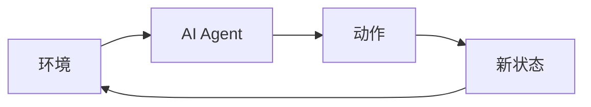
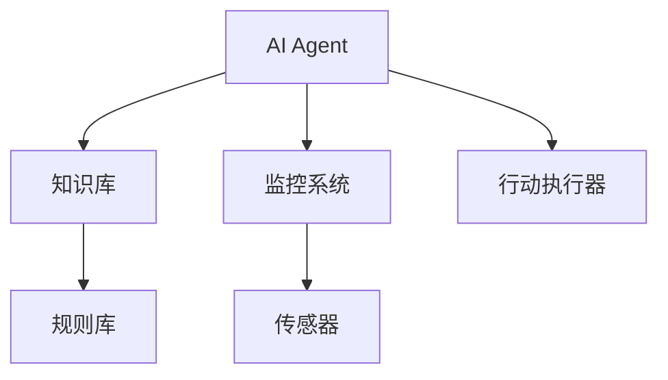
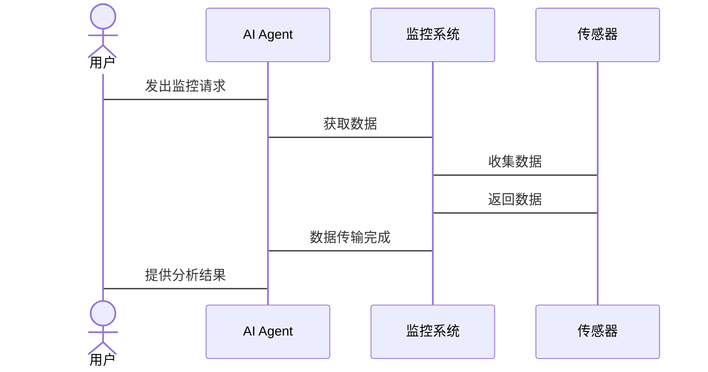

                 


# AI Agent在企业信息安全管理中的应用

## 关键词
AI Agent, 企业信息安全, 知识表示, 强化学习, 行为规划, 实时响应

## 摘要
随着企业信息化程度的不断提高，信息安全问题变得日益复杂和严峻。传统的信息安全技术在应对高级持续性威胁（APT）、零日攻击和复杂网络环境时显得力不从力。AI Agent作为一种具备自主学习、推理和决策能力的智能体，正在成为企业信息安全领域的重要工具。本文将从AI Agent的核心概念、算法原理、系统架构设计、项目实战等方面，详细探讨AI Agent在企业信息安全中的应用，分析其优势、挑战及未来发展方向。

---

# 第一部分: AI Agent与企业信息安全概述

# 第1章: AI Agent与企业信息安全概述

## 1.1 AI Agent的基本概念
### 1.1.1 AI Agent的定义与特点
人工智能代理（AI Agent）是一种能够感知环境、自主决策并采取行动的智能系统。AI Agent具备以下特点：
- **自主性**：无需外部干预，自主完成任务。
- **反应性**：能够实时感知环境变化并做出反应。
- **学习能力**：通过数据和经验不断优化自身行为。
- **协作性**：能够与其他系统或人类协同工作。

### 1.1.2 AI Agent的核心功能与优势
AI Agent的核心功能包括知识表示与推理、行为规划与决策、人机交互与协作。其优势在于能够快速响应、主动防御和智能分析，弥补传统信息安全技术的不足。

### 1.1.3 企业信息安全的现状与挑战
当前企业信息安全面临的主要挑战包括：
- 高级持续性威胁（APT）难以 detection。
- 网络攻击手段日益复杂。
- 数据量激增导致传统规则-based系统效率低下。

---

## 1.2 AI Agent在企业信息安全中的作用
### 1.2.1 AI Agent如何提升企业信息安全能力
AI Agent能够通过实时监控、异常检测和智能响应提升企业信息安全能力。例如，AI Agent可以自动识别网络中的异常流量，并采取阻断措施。

### 1.2.2 AI Agent在风险识别与应对中的应用
AI Agent可以利用机器学习算法分析海量日志数据，识别潜在的安全威胁，并提出应对策略。

### 1.2.3 AI Agent与传统信息安全技术的结合
AI Agent可以与防火墙、入侵检测系统（IDS）等传统技术结合，形成多层次的安全防护体系。

---

## 1.3 本章小结
本章介绍了AI Agent的基本概念及其在企业信息安全中的作用，指出了传统信息安全技术的局限性，并强调了AI Agent在提升企业信息安全能力方面的重要价值。

---

# 第二部分: AI Agent的核心概念与原理

# 第2章: AI Agent的核心概念与原理

## 2.1 AI Agent的核心概念
### 2.1.1 知识表示与推理
知识表示是AI Agent实现智能决策的基础。常见的知识表示方法包括：
- **谓词逻辑**：通过命题逻辑描述事实和关系。
- **语义网络**：通过节点和弧描述概念及其关系。
- **规则表示法**：通过if-then规则描述行为准则。

AI Agent通过推理算法（如逻辑推理和概率推理）对知识进行处理，得出结论。

### 2.1.2 行为规划与决策
行为规划是AI Agent根据当前状态和目标，制定行动方案的过程。常用的行为规划算法包括：
- **启发式搜索**：如A*算法。
- **基于规则的规划**：通过预定义规则生成行动计划。
- **基于学习的规划**：通过强化学习优化决策策略。

### 2.1.3 人机交互与协作
AI Agent需要与人类用户进行有效交互，理解用户需求并提供支持。常见的交互方式包括自然语言处理和图形化界面。

### 2.1.4 核心概念对比分析
以下是核心概念的对比表格：

| 核心概念 | 知识表示 | 行为规划 | 人机交互 |
|----------|----------|----------|----------|
| 定义     | 表示AI Agent的知识结构 | 制定行动计划 | 实现与用户的交流 |
| 方法     | 谓词逻辑、语义网络 | 启发式搜索、规则驱动 | 自然语言处理、图形界面 |
| 作用     | 提供决策依据 | 实现目标导向行动 | 支持用户操作 |

### 2.1.5 ER实体关系图
以下是AI Agent核心要素的ER实体关系图：

```mermaid
er
actor: 用户
agent: AI Agent
knowledge_base: 知识库
action: 行动
monitoring_system: 监控系统
goal: 目标

actor -|> agent: 发出请求
agent -|> knowledge_base: 查询知识
agent -|> monitoring_system: 获取数据
agent --> action: 执行行动
agent -|> goal: 实现目标
```

---

## 2.2 AI Agent的原理与机制
### 2.2.1 AI Agent的原理
AI Agent的核心原理包括：
1. **感知环境**：通过传感器或API获取环境数据。
2. **知识表示**：将感知到的信息转化为结构化知识。
3. **推理与决策**：基于知识进行推理，制定行动计划。
4. **执行行动**：通过执行器或API实现行动计划。
5. **反馈优化**：根据执行结果优化知识库和决策模型。

### 2.2.2 AI Agent的机制
AI Agent的机制主要包括：
- **实时感知**：持续监控环境变化。
- **自主决策**：基于知识和推理结果做出决策。
- **智能学习**：通过机器学习算法优化自身行为。
- **协作通信**：与其他系统或人类进行协作。

---

## 2.3 本章小结
本章详细探讨了AI Agent的核心概念，包括知识表示、行为规划和人机交互，并通过对比分析和ER实体关系图展示了核心要素之间的关系。

---

# 第三部分: AI Agent的算法原理与数学模型

# 第3章: AI Agent的算法原理与数学模型

## 3.1 AI Agent的算法原理
### 3.1.1 基于强化学习的AI Agent算法
强化学习是一种通过试错机制优化决策策略的算法。AI Agent通过与环境交互，获得奖励或惩罚，逐步优化自身行为。



### 3.1.2 基于监督学习的AI Agent算法
监督学习通过标记数据训练AI Agent，使其能够识别特定模式。例如，可以通过监督学习训练AI Agent识别恶意软件。

### 3.1.3 基于无监督学习的AI Agent算法
无监督学习适用于处理无标记数据，帮助AI Agent发现潜在的异常模式。

---

## 3.2 AI Agent的数学模型
### 3.2.1 Q-Learning算法
Q-Learning是一种经典的强化学习算法，适用于离散动作空间的问题。其数学公式为：

$$ Q(s, a) = Q(s, a) + \alpha \left( r + \gamma \max Q(s', a') - Q(s, a) \right) $$

其中：
- \( Q(s, a) \) 表示在状态 \( s \) 下执行动作 \( a \) 的价值。
- \( \alpha \) 是学习率。
- \( \gamma \) 是折扣因子。
- \( r \) 是奖励值。
- \( s' \) 是新状态。

### 3.2.2 多智能体协作算法
在多智能体协作场景中，可以通过分布式强化学习优化各智能体的协作策略。例如，可以通过以下公式优化协作收益：

$$ R = \sum_{i=1}^{n} R_i $$

其中 \( R_i \) 是第 \( i \) 个智能体的收益。

---

## 3.3 本章小结
本章介绍了AI Agent的几种主要算法，包括强化学习、监督学习和无监督学习，并通过数学公式详细讲解了Q-Learning算法和多智能体协作算法。

---

# 第四部分: AI Agent的系统分析与架构设计

# 第4章: AI Agent的系统分析与架构设计

## 4.1 系统分析
### 4.1.1 问题场景介绍
以企业网络中的异常流量检测为例，AI Agent需要实时监控网络流量，识别潜在的攻击行为。

### 4.1.2 系统功能设计
以下是系统功能模型的类图：

```mermaid
classDiagram
class Agent {
    <<Agent>>
    - knowledge_base: 知识库
    - monitoring_system: 监控系统
    - action_executor: 行动执行器
    + get_data(): 获取数据
    + analyze_data(): 分析数据
    + decide_action(): 决策行动
    + execute_action(): 执行行动
}

class KnowledgeBase {
    <<KnowledgeBase>>
    - rules: 规则库
    - patterns: 模式库
    + update_knowledge(): 更新知识
}

class MonitoringSystem {
    <<MonitoringSystem>>
    - sensors: 传感器
    - data_stream: 数据流
    + collect_data(): 收集数据
    + report_anomalies(): 报告异常
}

Agent -|> KnowledgeBase: 访问知识库
Agent -|> MonitoringSystem: 监控系统交互
```

---

## 4.2 系统架构设计
### 4.2.1 系统架构图
以下是系统架构的Mermaid图：



### 4.2.2 系统接口设计
系统接口设计包括：
- **输入接口**：接收传感器数据和用户请求。
- **输出接口**：发送行动计划和执行结果。

### 4.2.3 系统交互序列图
以下是系统交互的序列图：



---

## 4.3 本章小结
本章通过系统分析和架构设计，展示了AI Agent在企业信息安全中的具体应用，并通过类图和序列图详细描述了系统的各个组件及其交互关系。

---

# 第五部分: AI Agent的项目实战

# 第5章: AI Agent的项目实战

## 5.1 环境安装
### 5.1.1 安装Python环境
建议使用Python 3.8及以上版本，并安装以下库：
- `numpy`
- `pandas`
- `scikit-learn`
- `tensorflow`

### 5.1.2 安装AI框架
推荐使用TensorFlow或Keras框架进行AI Agent的开发。

---

## 5.2 系统核心实现
### 5.2.1 知识表示与推理
以下是知识表示的Python代码示例：

```python
# 知识库表示
knowledge_base = {
    '规则': ['if 表现A then 处理方式B', 'if 表现C then 处理方式D'],
    '模式': ['模式1', '模式2']
}

# 推理函数
def infer(pattern):
    for rule in knowledge_base['规则']:
        if pattern匹配 rule:
            return 处理方式
    return None
```

### 5.2.2 行为规划与决策
以下是基于Q-Learning算法的决策函数：

```python
import numpy as np

class AI_Agent:
    def __init__(self, state_space, action_space):
        self.state_space = state_space
        self.action_space = action_space
        self.Q = np.zeros((state_space, action_space))

    def take_action(self, state):
        # 根据Q值选择动作
        return np.argmax(self.Q[state, :])

    def update_Q(self, state, action, reward, next_state):
        # Q-Learning算法更新Q值
        self.Q[state, action] += 0.1 * (reward + 0.9 * max(self.Q[next_state, :]) - self.Q[state, action])
```

### 5.2.3 实时响应机制
以下是实时响应的代码示例：

```python
def real_time_response():
    while True:
        data = 获取实时数据()
        if 检测到异常(data):
           采取应对措施()
```

---

## 5.3 案例分析与详细解读
### 5.3.1 案例背景
假设企业网络中检测到异常流量，AI Agent需要识别并采取阻断措施。

### 5.3.2 案例分析
AI Agent通过分析流量特征，识别出这是典型的DDoS攻击，并触发防火墙阻断策略。

---

## 5.4 本章小结
本章通过项目实战展示了AI Agent的实现过程，包括环境安装、核心代码实现和案例分析，帮助读者理解AI Agent的实际应用。

---

# 第六部分: 总结与展望

# 第6章: 总结与展望

## 6.1 小结
本文详细探讨了AI Agent在企业信息安全中的应用，从核心概念到算法原理，再到系统设计和项目实战，全面分析了AI Agent的优势和潜力。

## 6.2 注意事项
在实际应用中，需要注意以下几点：
- **数据隐私**：确保数据处理过程符合隐私保护要求。
- **算法鲁棒性**：优化算法以应对对抗攻击。
- **可解释性**：提高AI Agent决策的透明度，便于用户理解和信任。

## 6.3 拓展阅读
建议读者进一步阅读以下内容：
- 《强化学习入门》
- 《分布式系统与多智能体协作》
- 《企业信息安全技术与实践》

---

# 结语
AI Agent作为人工智能技术的重要应用，正在改变企业信息安全的防护方式。随着技术的不断进步，AI Agent将在未来发挥更大的作用，帮助企业构建更智能、更安全的信息安全体系。

--- 

希望这个目录大纲和内容能够满足您的需求！如果需要进一步调整或补充，请随时告知。

