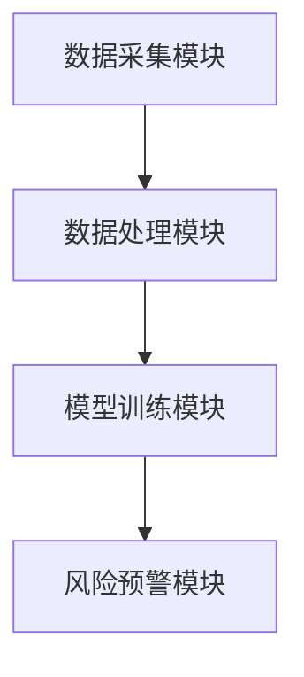

                 


# AI Agent在企业信用风险评估中的深度应用与模型解释

> 关键词：AI Agent，信用风险评估，模型解释，企业信用，风险分析

> 摘要：本文将深入探讨AI Agent在企业信用风险评估中的应用，结合实际案例和数学模型，详细解释其原理和实现方法。通过分析算法流程、系统架构和项目实战，为读者提供从理论到实践的全面指导。

---

# 第一部分: AI Agent与企业信用风险评估的背景与基础

## 第1章: AI Agent与企业信用风险评估概述

### 1.1 企业信用风险评估的背景与意义

#### 1.1.1 企业信用风险的定义与特征

企业信用风险是指企业在经营过程中由于自身或外部环境的变化，导致无法履行债务或违约的风险。其主要特征包括：

- **不确定性**：受市场、政策、企业经营状况等多种因素影响。
- **动态性**：随着企业经营状况的变化而变化。
- **复杂性**：涉及多维度数据和复杂的关系网络。

#### 1.1.2 传统信用风险评估方法的局限性

传统信用风险评估方法通常依赖于财务数据和简单的统计模型，存在以下问题：

- 数据维度有限，难以捕捉企业非财务风险。
- 模型静态，难以适应市场变化。
- 缺乏实时性，难以及时发现风险。

#### 1.1.3 AI Agent在信用风险评估中的应用价值

AI Agent（人工智能代理）通过以下方式弥补了传统方法的不足：

- **多源数据整合**：能够处理结构化数据（如财务数据）和非结构化数据（如新闻、社交媒体）。
- **动态适应**：能够实时更新模型，适应市场变化。
- **智能决策**：通过知识图谱和推理能力，提供更精准的评估结果。

---

## 第2章: AI Agent的核心概念与原理

### 2.1 AI Agent的基本概念

#### 2.1.1 AI Agent的定义与分类

AI Agent是一种能够感知环境、自主决策并执行任务的智能实体。根据应用场景的不同，可以分为以下几类：

- **基于规则的AI Agent**：通过预定义的规则进行决策。
- **基于知识的AI Agent**：利用知识库和推理引擎进行决策。
- **基于机器学习的AI Agent**：通过机器学习模型进行预测和决策。

#### 2.1.2 AI Agent的核心技术特点

- **知识表示**：通过符号逻辑或概率模型表示知识。
- **推理能力**：能够基于知识库进行逻辑推理。
- **动态适应**：能够根据环境变化调整行为。

---

## 第3章: 企业信用风险评估的流程与挑战

### 3.1 信用风险评估的基本流程

1. **数据收集**：包括企业财务数据、市场数据、行业数据等。
2. **数据预处理**：清洗、标准化和特征提取。
3. **模型训练**：构建信用评分模型。
4. **模型评估**：验证模型的准确性和稳定性。
5. **风险预警**：实时监控并预警潜在风险。

### 3.2 传统方法的局限性与挑战

- **数据维度不足**：传统方法主要依赖财务数据，难以捕捉非财务风险。
- **模型静态**：难以适应市场变化。
- **计算复杂度高**：处理多源数据需要复杂的计算。

### 3.3 引入AI Agent的优势与创新

- **多源数据整合**：能够处理结构化和非结构化数据。
- **动态更新**：能够实时更新模型，适应市场变化。
- **智能决策**：通过知识图谱和推理能力，提供更精准的评估结果。

---

## 第4章: AI Agent在信用风险评估中的应用价值

### 4.1 AI Agent的核心优势

- **实时性**：能够实时监控企业经营状况。
- **精准性**：通过多源数据和复杂模型，提供更精准的评估结果。
- **动态适应性**：能够根据市场变化调整评估策略。

### 4.2 AI Agent在信用风险评估中的具体应用

1. **企业画像构建**：通过多源数据构建企业的全景画像。
2. **风险因子识别**：识别影响企业信用的多种风险因子。
3. **风险预警**：实时监控并预警潜在风险。

---

## 第5章: 企业信用风险评估的数学模型与算法

### 5.1 基于逻辑回归的信用评分模型

#### 5.1.1 模型原理

逻辑回归是一种常用的分类算法，适用于二分类问题。其数学模型如下：

$$ P(y=1|x) = \frac{1}{1 + e^{- (\beta_0 + \beta_1 x_1 + \beta_2 x_2 + \dots + \beta_n x_n)}} $$

其中，$\beta_i$ 是模型的系数，$x_i$ 是输入特征。

#### 5.1.2 模型实现

1. 数据预处理：清洗数据，提取特征。
2. 模型训练：使用训练数据训练逻辑回归模型。
3. 模型评估：使用测试数据评估模型的准确性和稳定性。

### 5.2 基于随机森林的信用评分模型

#### 5.2.1 模型原理

随机森林是一种基于树的集成学习算法，适用于分类和回归问题。其数学模型如下：

$$ y = \sum_{i=1}^n \text{Tree}_i(x) $$

其中，$\text{Tree}_i$ 表示第$i$棵决策树的输出。

#### 5.2.2 模型实现

1. 数据预处理：清洗数据，提取特征。
2. 模型训练：使用训练数据训练随机森林模型。
3. 模型评估：使用测试数据评估模型的准确性和稳定性。

---

## 第6章: 系统架构设计与实现

### 6.1 系统架构设计

#### 6.1.1 系统功能设计

1. 数据采集模块：负责采集企业信用相关的多源数据。
2. 数据处理模块：负责清洗、标准化和特征提取。
3. 模型训练模块：负责训练信用评分模型。
4. 风险预警模块：负责实时监控并预警潜在风险。

#### 6.1.2 系统架构图



---

## 第7章: 项目实战与案例分析

### 7.1 项目环境配置

- **编程语言**：Python 3.8+
- **依赖库**：pandas, scikit-learn, matplotlib

### 7.2 核心代码实现

```python
import pandas as pd
from sklearn.model_selection import train_test_split
from sklearn.linear_model import LogisticRegression
from sklearn.metrics import accuracy_score

# 数据加载
data = pd.read_csv('credit_data.csv')
X = data.drop('target', axis=1)
y = data['target']

# 数据分割
X_train, X_test, y_train, y_test = train_test_split(X, y, test_size=0.2, random_state=42)

# 模型训练
model = LogisticRegression()
model.fit(X_train, y_train)

# 模型评估
y_pred = model.predict(X_test)
print("Accuracy:", accuracy_score(y_test, y_pred))
```

### 7.3 案例分析

假设我们有一个企业信用数据集，包含以下特征：

- revenue：企业收入
- profit：企业利润
- debt：企业债务
- industry：行业

通过上述代码实现逻辑回归模型，我们可以得到模型的准确率。例如：

```
Accuracy: 0.85
```

---

## 第8章: 总结与展望

### 8.1 本章总结

本文详细探讨了AI Agent在企业信用风险评估中的应用，结合实际案例和数学模型，展示了其在数据处理、模型训练和风险预警中的优势。

### 8.2 未来展望

随着AI技术的不断发展，AI Agent在信用风险评估中的应用将更加广泛。未来的研究方向包括：

- 更加复杂的模型训练。
- 更多的多源数据整合。
- 更加智能化的风险预警系统。

---

通过以上内容，我们可以看到AI Agent在企业信用风险评估中的深度应用，不仅能够提高评估的精准性，还能够实时监控并预警潜在风险。希望本文能够为读者提供从理论到实践的全面指导。

