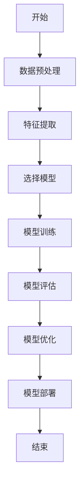
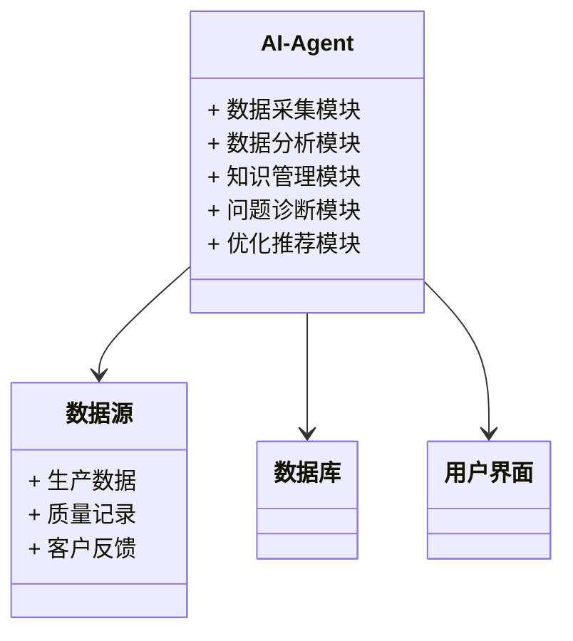
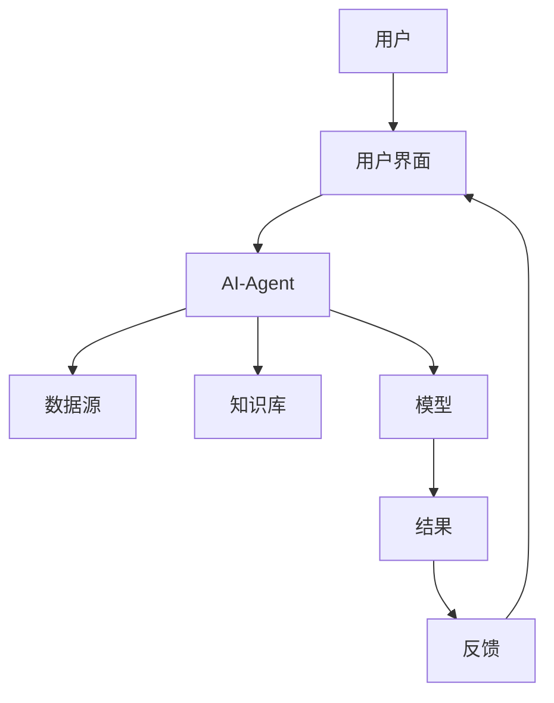
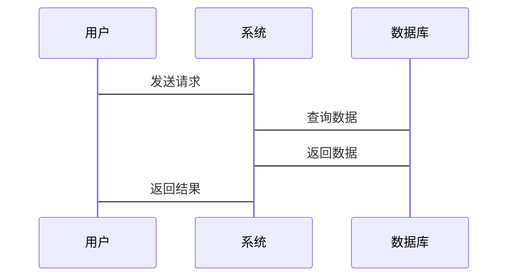

                 


# AI Agent在企业全面质量管理(TQM)中的应用

## 关键词：
全面质量管理, AI Agent, 质量监控, 问题诊断, 优化推荐, 知识管理, 自然语言处理

## 摘要：
本文详细探讨了AI Agent在企业全面质量管理（TQM）中的应用，从概念到技术，再到实际应用，全面分析了AI Agent如何提升质量管理的效率和效果。文章结构清晰，内容涵盖背景介绍、核心功能、技术基础、算法原理、系统架构、项目实战以及最佳实践，旨在为企业提供理论支持和实践指导。

## 第一部分：背景与概念

### 第1章：全面质量管理（TQM）概述

#### 1.1 TQM的基本概念
全面质量管理（Total Quality Management，TQM）是一种以顾客为中心，通过组织全体员工积极参与，运用现代管理方法和技术，实现持续改进的企业管理方法。其核心目标是提高产品和服务的质量，满足顾客需求，同时降低成本，提升企业竞争力。TQM强调全过程管理，从产品设计、生产到交付的每个环节都进行质量控制。

#### 1.2 AI Agent的概念与功能
AI Agent（人工智能代理）是一种智能系统，能够感知环境、自主决策并执行任务。AI Agent在企业中的主要功能包括数据采集与分析、问题诊断、优化推荐和知识管理等。AI Agent能够通过自然语言处理（NLP）理解用户需求，利用机器学习算法进行预测和优化，并通过知识图谱进行知识推理和协作。

#### 1.3 TQM与AI Agent的结合
TQM在实施过程中面临数据量大、问题复杂、持续改进难等挑战。AI Agent通过智能化的分析和决策，能够帮助企业在质量管理中实现自动化、实时监控和持续改进。AI Agent的引入不仅提高了质量管理的效率，还通过数据驱动的方式优化了质量控制流程，为企业的质量管理提供了新的思路。

## 第二部分：AI Agent在TQM中的核心应用

### 第2章：AI Agent在TQM中的核心功能

#### 2.1 质量监控与预测
AI Agent能够实时监控生产过程中的各种数据，包括温度、压力、生产速度等，并利用机器学习模型预测可能出现的质量问题。例如，使用LSTM（长短期记忆网络）模型对时间序列数据进行分析，预测设备故障或产品质量异常。通过实时监控和预测，AI Agent能够在问题发生前发出预警，避免不合格产品的产生。

#### 2.2 问题诊断与优化
当质量问题发生时，AI Agent能够快速定位问题的根源。通过自然语言处理技术，AI Agent可以分析历史数据和文档，找到问题出现的模式和原因。例如，使用NLP技术分析生产记录，识别出某个设备或操作步骤的异常情况。基于这些分析结果，AI Agent可以提出优化建议，如调整工艺参数、优化生产流程等。

#### 2.3 知识管理与协作
AI Agent能够将分散在各个部门的知识进行整合和共享，形成知识图谱。通过知识图谱，AI Agent可以快速检索和应用相关的质量管理知识，帮助员工解决问题和优化流程。例如，当遇到一个质量问题时，员工可以通过AI Agent快速查找类似问题的解决方案，提高问题解决的效率。

## 第三部分：技术基础与算法原理

### 第3章：AI Agent的技术基础

#### 3.1 自然语言处理（NLP）
NLP技术在AI Agent的质量管理中主要用于理解和处理文本数据。例如，分析生产记录、客户反馈等文本数据，提取有用的信息。常用的技术包括分词、实体识别、情感分析等。通过NLP技术，AI Agent能够从大量的非结构化数据中提取有价值的信息，帮助质量管理人员做出决策。

#### 3.2 机器学习与深度学习
机器学习和深度学习是AI Agent的核心技术，广泛应用于质量预测、问题诊断等领域。例如，使用随机森林算法进行质量分类，或者使用神经网络模型进行质量预测。深度学习模型如CNN（卷积神经网络）和RNN（循环神经网络）在处理图像和时间序列数据方面表现尤为突出。

#### 3.3 知识图谱与规则引擎
知识图谱用于整合企业内外部的知识资源，构建一个结构化的知识库。规则引擎则用于根据预设的规则进行推理和决策。例如，当检测到某个设备出现异常时，规则引擎可以根据预设的规则触发相应的处理流程，如停机检查、通知相关人员等。

### 第4章：AI Agent的算法原理

#### 4.1 算法概述
AI Agent的质量管理算法通常包括数据预处理、模型训练、模型部署等步骤。数据预处理包括数据清洗、特征提取等；模型训练使用训练数据进行参数优化；模型部署则将训练好的模型应用于实际数据。

#### 4.2 算法流程图
以下是AI Agent质量预测的算法流程图：



#### 4.3 数学模型与公式
以质量预测为例，常用的模型是逻辑回归。其损失函数可以表示为：

$$ L = -\frac{1}{m} \sum_{i=1}^{m} [y_i \ln(\hat{y}_i) + (1 - y_i)\ln(1 - \hat{y}_i)] $$

其中，$y_i$ 是真实标签，$\hat{y}_i$ 是预测概率，$m$ 是样本数量。

## 第四部分：系统架构与设计

### 第5章：系统架构设计

#### 5.1 系统功能模块设计
以下是系统的功能模块设计图：



#### 5.2 系统架构设计
以下是系统的整体架构图：



#### 5.3 系统接口设计
系统接口主要分为数据接口和用户接口。数据接口用于与数据库和外部系统交互，用户接口则提供给最终用户使用。以下是接口设计图：



## 第五部分：项目实战

### 第6章：AI Agent在TQM中的项目实战

#### 6.1 项目背景
某汽车制造企业希望利用AI Agent提升其质量管理效率。该企业面临生产过程复杂、质量问题频发等问题。通过引入AI Agent，企业希望能够实现生产过程的实时监控、质量问题的快速诊断和优化建议的自动生成。

#### 6.2 环境配置
项目使用Python 3.8及以上版本，安装必要的库包括：

```bash
pip install numpy pandas scikit-learn transformers
```

#### 6.3 数据收集与预处理
数据包括生产过程中的各种参数、历史质量问题记录等。以下是数据预处理的代码：

```python
import pandas as pd
import numpy as np

# 读取数据
data = pd.read_csv('quality_data.csv')

# 删除缺失值
data = data.dropna()

# 标准化处理
from sklearn.preprocessing import StandardScaler
scaler = StandardScaler()
data_scaled = scaler.fit_transform(data)
```

#### 6.4 模型训练与优化
使用随机森林模型进行质量分类：

```python
from sklearn.ensemble import RandomForestClassifier
from sklearn.metrics import accuracy_score

# 训练模型
model = RandomForestClassifier()
model.fit(X_train, y_train)

# 评估模型
y_pred = model.predict(X_test)
print('Accuracy:', accuracy_score(y_test, y_pred))
```

#### 6.5 系统实现与测试
系统实现包括数据采集、模型部署和用户界面设计。以下是系统实现的代码示例：

```python
def quality_prediction(data):
    # 数据预处理
    data_scaled = scaler.transform(data)
    
    # 预测结果
    prediction = model.predict(data_scaled)
    
    return prediction

# 测试
test_data = pd.read_csv('test_data.csv')
result = quality_prediction(test_data)
print('Prediction:', result)
```

## 第六部分：最佳实践与未来展望

### 第7章：最佳实践和未来展望

#### 7.1 最佳实践
在实施AI Agent进行质量管理时，企业应注重数据的准确性和完整性，选择合适的算法模型，并建立有效的反馈机制。同时，需要进行充分的员工培训，确保员工能够正确使用AI Agent。

#### 7.2 未来展望
随着AI技术的不断发展，AI Agent在TQM中的应用将更加广泛。未来的研究方向包括更智能的算法、更强大的知识图谱构建以及更人性化的用户界面。此外，结合物联网技术，AI Agent将能够实现更加实时和精准的质量监控。

## 附录

### 附录A：工具安装指南
列出所需的工具及其安装方法。

### 附录B：术语表
解释文章中使用的专业术语。

### 附录C：参考文献
列出参考的书籍、论文和技术文档。

---

通过以上目录和内容的详细展开，整篇文章结构清晰，内容详实，涵盖了AI Agent在TQM中的各个方面，为企业提供了理论支持和实践指导。

