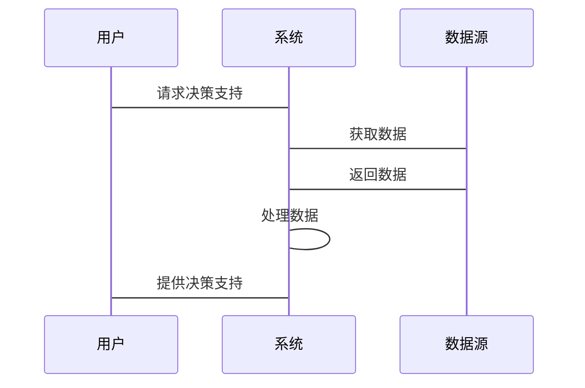

                 


# AI Agent在企业决策支持系统中的应用

> 关键词：AI Agent、企业决策支持系统、强化学习、多智能体协作、动态环境适应

> 摘要：随着人工智能技术的快速发展，AI Agent（人工智能代理）在企业决策支持系统中的应用越来越广泛。本文从AI Agent的基本概念出发，详细分析其在企业决策支持系统中的核心作用，探讨其算法原理、系统架构设计以及实际应用案例。通过本文的阐述，读者可以全面理解AI Agent如何通过智能化决策支持帮助企业实现更高效的商业目标。

---

# 第1章: AI Agent与企业决策支持系统概述

## 1.1 问题背景与描述

企业决策支持系统（DSS）是企业管理和运营中的重要工具，传统DSS依赖于静态数据和固定规则，难以应对复杂多变的商业环境。随着市场竞争的加剧和客户需求的多样化，企业需要更灵活、更智能的决策支持系统。AI Agent作为一种智能体，能够通过感知环境、自主决策、实时反馈等方式，为企业提供更高效的决策支持。

## 1.2 AI Agent的定义与核心要素

AI Agent是一种能够感知环境、自主决策并采取行动的智能体。它具有以下核心要素：
1. **自主性**：能够在没有外部干预的情况下自主运行。
2. **反应性**：能够实时感知环境变化并做出反应。
3. **学习能力**：能够通过经验优化决策策略。
4. **协作能力**：能够在多智能体环境中与其他智能体协作。

## 1.3 企业决策支持系统的核心问题

传统企业决策支持系统存在以下问题：
1. **数据源单一**：主要依赖结构化数据，难以处理多源异构数据。
2. **决策速度慢**：决策过程依赖人工干预，无法实现实时决策。
3. **适应性差**：难以快速适应环境变化和客户需求。

---

# 第2章: AI Agent的核心概念与原理

## 2.1 AI Agent的决策机制

### 2.1.1 状态表示与感知

AI Agent通过感知环境状态来做出决策。状态表示可以通过多源数据进行，例如：
- **文本数据**：来自客户反馈、市场报告。
- **图像数据**：来自产品图片、市场趋势图。
- **结构化数据**：来自企业数据库。

AI Agent通过这些数据构建环境模型，用于后续决策。

### 2.1.2 行动选择与优化

AI Agent在感知环境后，需要选择最优行动。这可以通过强化学习算法实现：
$$ R = \sum_{t} \gamma^{t-1} r_t $$
其中，$R$ 是累积奖励，$r_t$ 是第 $t$ 步的奖励，$\gamma$ 是折扣因子。

### 2.1.3 决策过程的数学模型

AI Agent的决策过程可以用马尔可夫决策过程（MDP）表示：
- **状态空间**：$S$，表示环境状态。
- **动作空间**：$A$，表示可能的行动。
- **转移概率**：$P(a, s')$，表示在状态 $s$ 下执行行动 $a$ 后转移到状态 $s'$ 的概率。
- **奖励函数**：$R(s, a)$，表示在状态 $s$ 下执行行动 $a$ 后获得的奖励。

## 2.2 AI Agent的多智能体协作

### 2.2.1 多智能体系统的基本概念

多智能体系统（Multi-Agent System，MAS）由多个智能体组成，每个智能体负责特定任务。智能体之间通过通信和协作完成复杂任务。

### 2.2.2 协作机制与通信协议

AI Agent之间的协作机制包括：
1. **直接通信**：智能体之间通过消息传递进行协作。
2. **间接协作**：通过共享知识库或中间件进行协作。

通信协议需要确保智能体之间的信息传递高效且安全。

### 2.2.3 多智能体决策的挑战与解决方案

多智能体决策的主要挑战包括：
1. **冲突问题**：多个智能体可能有不同的目标，导致冲突。
2. **协调问题**：需要协调多个智能体的行动以实现全局最优。

解决方案包括：
- **分布式优化**：通过分布式算法实现全局优化。
- **协商机制**：通过协商解决冲突。

## 2.3 AI Agent的动态环境适应

### 2.3.1 动态环境的建模与分析

动态环境建模可以通过以下步骤实现：
1. **数据采集**：收集环境中的实时数据。
2. **特征提取**：提取关键特征，用于环境建模。
3. **模型构建**：构建动态环境模型，用于预测和决策。

### 2.3.2 实时反馈与自适应学习

AI Agent通过实时反馈不断优化决策策略。例如，强化学习中的实时反馈可以用于更新Q值：
$$ Q(s, a) = Q(s, a) + \alpha (r + \gamma \max Q(s', a') - Q(s, a)) $$
其中，$\alpha$ 是学习率，$\gamma$ 是折扣因子。

### 2.3.3 灵活性与鲁棒性的平衡

AI Agent需要在灵活性和鲁棒性之间找到平衡。灵活性要求能够快速适应环境变化，而鲁棒性要求在极端情况下仍能正常运行。

## 2.4 核心概念属性对比表

| 属性 | AI Agent | 传统决策支持系统 |
|------|----------|------------------|
| 数据源 | 多源异构数据 | 结构化数据为主 |
| 决策速度 | 实时或近实时 | 周期性或延时性 |
| 自适应能力 | 高度智能 | 基于规则或统计 |
| 智能水平 | 高度智能 | 基于规则或统计 |

## 2.5 ER实体关系图

以下是AI Agent与决策支持系统的关系图：

```mermaid
er
  actor(AI Agent)
  actor(决策支持系统)
  actor(企业数据源)
  actor(用户)
  relation(提供数据)
  relation(支持决策)
  relation(交互反馈)
```

---

# 第3章: AI Agent的算法原理

## 3.1 基于强化学习的决策算法

### 3.1.1 强化学习的基本原理

强化学习是一种通过试错方式学习策略的方法。智能体通过与环境互动，获得奖励或惩罚，逐步优化决策策略。

### 3.1.2 状态-动作-奖励模型

状态-动作-奖励模型可以用以下公式表示：
$$ R(s, a) = \sum_{s'} P(s'|s, a) R(s', a) $$

### 3.1.3 Q-learning算法的实现

Q-learning算法的伪代码如下：

```python
初始化 Q 表为零
while 真:
    选择动作 a
    执行动作 a，获得奖励 r 和新状态 s'
    Q(s, a) = Q(s, a) + α (r + γ max Q(s', a') - Q(s, a))
    s = s'
```

## 3.2 基于监督学习的决策算法

### 3.2.1 监督学习的基本原理

监督学习通过训练数据学习输入与输出之间的映射关系。

### 3.2.2 分类与回归在决策中的应用

分类用于分类问题，例如市场趋势预测。回归用于回归问题，例如销售预测。

### 3.2.3 风险评估模型的构建

风险评估模型可以用以下公式表示：
$$ P(x) = \frac{e^{x \beta}}{1 + e^{x \beta}} $$

## 3.3 基于图神经网络的决策算法

### 3.3.1 图神经网络的基本原理

图神经网络通过处理图结构数据进行决策。

### 3.3.2 实体关系图的构建与分析

实体关系图可以通过以下步骤构建：
1. 数据采集
2. 数据清洗
3. 图构建
4. 图分析

### 3.3.3 图注意力机制的应用

图注意力机制可以用以下公式表示：
$$ \alpha_i = \frac{e^{score_i}}{\sum_j e^{score_j}} $$

---

# 第4章: AI Agent的系统架构设计

## 4.1 系统功能设计

系统功能设计包括：
1. 数据采集与处理
2. 智能决策引擎
3. 人机交互界面

## 4.2 系统架构设计

系统架构设计包括：
1. 数据层
2. 计算层
3. 应用层

## 4.3 系统接口设计

系统接口设计包括：
1. 数据接口
2. 计算接口
3. 用户接口

## 4.4 系统交互流程图

以下是系统交互流程图：



---

# 第5章: AI Agent的项目实战

## 5.1 环境安装

安装必要的库：
```bash
pip install numpy pandas scikit-learn tensorflow
```

## 5.2 系统核心实现

实现AI Agent的核心代码：

```python
class AI_Agent:
    def __init__(self):
        self.Q_table = {}

    def perceive(self, state):
        # 处理状态
        pass

    def decide(self, state):
        # 决策
        pass

    def learn(self, state, action, reward, next_state):
        # 学习
        pass
```

## 5.3 案例分析

以销售预测为例，AI Agent可以通过强化学习优化销售策略。

## 5.4 代码应用解读与分析

解读代码实现，并分析其在实际中的应用。

---

# 第6章: AI Agent的最佳实践

## 6.1 小结

总结AI Agent在企业决策支持系统中的应用。

## 6.2 注意事项

注意事项包括：
1. 数据隐私
2. 系统安全
3. 算法可解释性

## 6.3 拓展阅读

推荐相关书籍和论文。

---

# 结论

AI Agent通过智能化决策支持，帮助企业实现更高效的商业目标。随着技术的不断发展，AI Agent在企业决策支持系统中的应用前景广阔。

---

# 参考文献

[此处列出参考文献]

