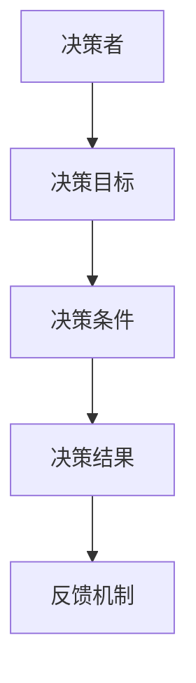
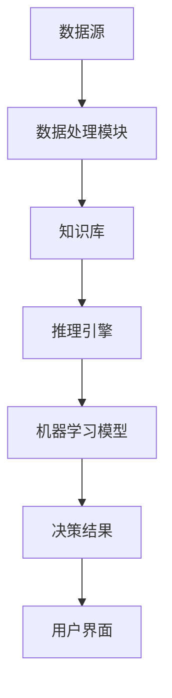
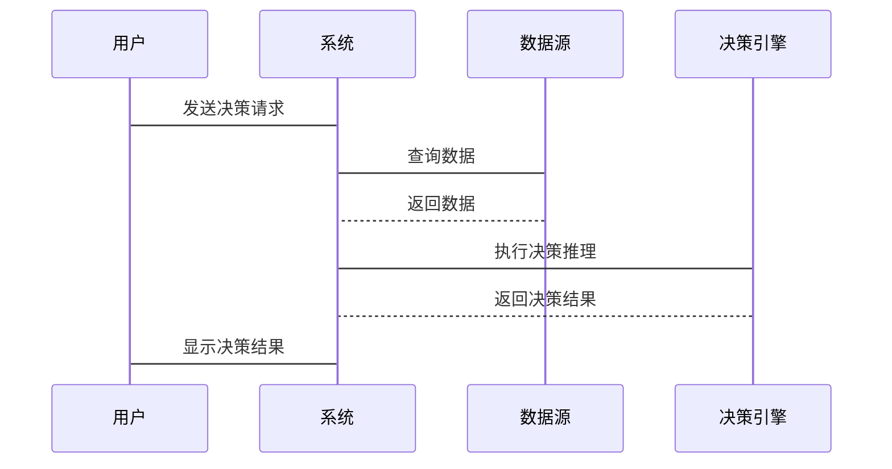

                 


# AI Agent在企业决策支持系统中的角色与实现

## 关键词：AI Agent，企业决策支持系统，机器学习，知识表示，决策树，随机森林，系统架构

## 摘要：  
本文探讨了AI Agent在企业决策支持系统中的角色与实现，分析了其核心概念、算法原理、系统架构，并通过实际案例展示了其在企业中的应用价值。文章从背景介绍出发，逐步深入，结合技术细节和实践案例，为企业决策支持系统的优化提供了新的视角和方法。

---

# 第一部分: AI Agent 在企业决策支持系统中的背景与概念

## 第1章: AI Agent 的基本概念与背景

### 1.1 AI Agent 的定义与特点

AI Agent（人工智能代理）是一种能够感知环境、自主决策并执行任务的智能实体。它通过传感器获取信息，利用知识库和推理机制分析问题，并通过执行器采取行动，以实现预定目标。AI Agent的特点包括：

- **自主性**：无需外部干预，自主完成任务。
- **反应性**：能够实时感知环境变化并做出响应。
- **目标导向**：基于目标驱动决策，而非随机行为。
- **学习能力**：通过经验改进性能，适应新环境。

AI Agent与传统决策支持系统的区别主要体现在智能化、自主性和实时性。传统决策支持系统依赖人工输入和固定规则，而AI Agent能够主动学习和优化，适应复杂多变的环境。

### 1.2 企业决策支持系统的背景与需求

#### 1.2.1 企业决策支持系统的定义

企业决策支持系统（DSS）是利用技术手段辅助企业决策者进行决策的系统，通常包括数据收集、分析、预测和建议功能。传统DSS依赖专家经验，但存在效率低、灵活性差的问题。

#### 1.2.2 传统决策支持系统的局限性

- 数据处理能力有限，难以应对海量数据。
- 决策逻辑固定，难以适应动态变化的市场环境。
- 无法实时反馈，决策周期长。

#### 1.2.3 AI Agent 在企业决策支持中的优势

- 提高决策效率：AI Agent能够快速处理大量数据，提供实时反馈。
- 增强决策准确性：通过机器学习和知识推理，优化决策质量。
- 适应性强：AI Agent能够根据环境变化动态调整决策策略。

### 1.3 AI Agent 在企业中的应用背景

#### 1.3.1 当前企业决策面临的挑战

企业决策者面临数据繁多、市场变化快、竞争激烈等挑战，传统决策方式难以满足需求。

#### 1.3.2 AI 技术对企业决策的支持作用

AI技术能够提供数据挖掘、预测分析、智能推荐等服务，帮助决策者做出更明智的决策。

#### 1.3.3 AI Agent 在企业中的潜在应用场景

- **市场预测**：利用历史销售数据预测未来市场趋势。
- **风险管理**：实时监控企业运营风险，制定应对策略。
- **供应链优化**：通过动态调整库存和物流，降低成本。
- **客户行为分析**：预测客户行为，制定精准营销策略。

---

## 第2章: AI Agent 的核心概念与联系

### 2.1 AI Agent 的核心概念

#### 2.1.1 知识表示与推理

知识表示是将现实世界中的信息转化为计算机可处理的形式，常见的表示方法包括：

- **语义网络**：通过节点和边表示概念及其关系。
- **逻辑推理**：通过逻辑规则进行推理，得出结论。

知识推理是基于知识库进行逻辑推理，帮助AI Agent做出决策。

#### 2.1.2 目标设定与规划

AI Agent需要根据任务需求设定目标，并通过规划模块制定实现目标的步骤。目标设定通常包括：

- **明确目标**：识别问题核心，设定可量化的目标。
- **优先级排序**：根据目标的重要性和紧急性进行排序。
- **路径规划**：制定实现目标的具体步骤和资源分配。

#### 2.1.3 学习与自适应

AI Agent通过机器学习算法不断优化自身性能，增强适应能力。学习过程包括：

- **监督学习**：通过标记数据训练模型，预测新数据。
- **无监督学习**：发现数据中的模式和结构。
- **强化学习**：通过奖励机制优化决策策略。

### 2.2 AI Agent 的核心原理

#### 2.2.1 知识图谱的构建

知识图谱是将分散的知识结构化、关联化的知识网络。构建知识图谱的过程包括：

- 数据收集：从多种数据源获取相关信息。
- 数据清洗：去除冗余和噪声数据。
- 数据建模：将数据转化为结构化的知识表示。
- 数据关联：建立知识之间的关联关系。

#### 2.2.2 基于规则的推理

基于规则的推理通过预定义的逻辑规则进行推理，帮助AI Agent做出决策。常见的推理方法包括：

- **正向推理**：根据已知事实和规则，推导出新的结论。
- **反向推理**：从目标出发，寻找满足条件的事实和规则。

#### 2.2.3 基于机器学习的决策

基于机器学习的决策通过训练模型，从数据中学习决策规律。常用的机器学习算法包括：

- **决策树**：通过树状结构进行分类和回归。
- **随机森林**：通过集成多个决策树，提高模型的准确性和稳定性。
- **神经网络**：通过模拟人脑神经网络，进行复杂模式识别。

### 2.3 AI Agent 的实体关系图

以下是一个简单的AI Agent实体关系图：



---

## 第3章: AI Agent 的算法原理与实现

### 3.1 决策树算法

#### 3.1.1 决策树算法的原理

决策树是一种基于树状结构的分类和回归方法。ID3、C4.5、CART是常用的决策树算法。决策树的构建过程包括：

- **特征选择**：选择对目标变量最有区分度的特征。
- **数据分割**：根据特征将数据分成子节点。
- **树的生成**：递归地构建决策树，直到满足停止条件。

#### 3.1.2 决策树算法的实现

以下是决策树算法的Python实现示例：

```python
from sklearn.tree import DecisionTreeClassifier
from sklearn.model_selection import train_test_split
from sklearn.metrics import accuracy_score

# 数据准备
X = ...  # 特征数据
y = ...  # 标签数据

# 数据分割
X_train, X_test, y_train, y_test = train_test_split(X, y, test_size=0.3)

# 模型训练
clf = DecisionTreeClassifier()
clf.fit(X_train, y_train)

# 模型预测
y_pred = clf.predict(X_test)

# 评估准确率
print("Accuracy:", accuracy_score(y_test, y_pred))
```

#### 3.1.3 决策树算法的数学模型

决策树的特征选择通常使用信息增益或信息增益率作为指标。信息增益的计算公式如下：

$$
\text{信息增益}(D, A) = H(D) - H(D|A)
$$

其中，\( H(D) \) 是数据集 \( D \) 的熵，\( H(D|A) \) 是在特征 \( A \) 下数据集的条件熵。

### 3.2 随机森林算法

#### 3.2.1 随机森林算法的原理

随机森林是一种基于决策树的集成学习算法。通过构建多棵决策树并进行投票或平均，随机森林能够提高模型的准确性和稳定性。

#### 3.2.2 随机森林算法的实现

以下是随机森林算法的Python实现示例：

```python
from sklearn.ensemble import RandomForestClassifier

# 数据准备
X = ...  # 特征数据
y = ...  # 标签数据

# 数据分割
X_train, X_test, y_train, y_test = train_test_split(X, y, test_size=0.3)

# 模型训练
clf = RandomForestClassifier(n_estimators=100)
clf.fit(X_train, y_train)

# 模型预测
y_pred = clf.predict(X_test)

# 评估准确率
print("Accuracy:", accuracy_score(y_test, y_pred))
```

#### 3.2.3 随机森林算法的数学模型

随机森林的特征重要性可以通过特征贡献度进行评估，公式如下：

$$
\text{特征重要性} = \sum_{i=1}^{n} (\text{特征 } i \text{ 的重要性})
$$

---

## 第4章: AI Agent 的系统架构与实现

### 4.1 系统功能设计

AI Agent在企业决策支持系统中的功能模块包括：

- **数据采集**：从企业内外部数据源获取数据。
- **数据处理**：清洗、转换和集成数据。
- **知识表示**：将数据转化为结构化的知识表示。
- **决策推理**：基于知识图谱和机器学习模型进行决策。
- **结果反馈**：将决策结果反馈给决策者或系统。

### 4.2 系统架构设计

企业决策支持系统的架构通常包括：

- **数据源**：数据库、API接口、文件等。
- **AI Agent模块**：包括知识库、推理引擎和机器学习模型。
- **用户界面**：供决策者查看和交互的界面。
- **反馈机制**：将决策结果反馈给系统或用户。

以下是一个简单的系统架构图：



### 4.3 系统接口设计

系统接口设计需要考虑数据输入、处理和输出的规范。例如：

- **数据输入接口**：接收来自数据库或API的数据。
- **数据处理接口**：执行数据清洗和转换。
- **决策输出接口**：将决策结果返回给用户或下游系统。

### 4.4 系统交互流程

以下是系统交互的Mermaid序列图：



---

## 第5章: AI Agent 的项目实战

### 5.1 环境安装与配置

#### 5.1.1 安装Python和相关库

安装Python和必要的机器学习库（如Scikit-learn、XGBoost、TensorFlow等）。

```bash
pip install numpy pandas scikit-learn
```

#### 5.1.2 数据准备与清洗

从企业数据库或外部API获取数据，并进行清洗和预处理。

```python
import pandas as pd
import numpy as np

# 数据加载
data = pd.read_csv('data.csv')

# 数据清洗
data.dropna(inplace=True)
data = pd.get_dummies(data)
```

#### 5.1.3 模型训练与部署

使用训练好的模型进行预测，并将结果输出。

```python
from sklearn.ensemble import RandomForestClassifier

# 数据分割
X_train, X_test, y_train, y_test = train_test_split(X, y, test_size=0.3)

# 模型训练
clf = RandomForestClassifier(n_estimators=100)
clf.fit(X_train, y_train)

# 模型预测
y_pred = clf.predict(X_test)

# 评估准确率
print("Accuracy:", accuracy_score(y_test, y_pred))
```

### 5.2 项目小结

通过实际案例分析，我们可以看到AI Agent在企业决策支持系统中的应用价值。通过机器学习算法和知识图谱，AI Agent能够显著提高决策效率和准确性。

---

## 第6章: 最佳实践与注意事项

### 6.1 最佳实践

- **数据质量**：确保数据的准确性和完整性。
- **模型调优**：通过交叉验证和超参数优化提高模型性能。
- **实时反馈**：建立有效的反馈机制，及时调整决策策略。

### 6.2 小结

AI Agent作为企业决策支持系统的核心组件，具有重要的应用价值。通过合理的系统设计和算法实现，AI Agent能够帮助企业做出更明智的决策。

### 6.3 注意事项

- **数据隐私**：确保数据的保密性和合规性。
- **模型解释性**：选择具有较高解释性的模型，便于决策者理解。
- **系统可扩展性**：设计灵活的架构，适应企业未来发展需求。

### 6.4 拓展阅读

- 推荐阅读《机器学习实战》、《深度学习》等相关书籍，进一步深入了解AI Agent的实现细节。

---

## 总结

通过本文的介绍，我们详细探讨了AI Agent在企业决策支持系统中的角色与实现。从核心概念到算法原理，再到系统架构和项目实战，我们为企业提供了全新的视角和实践方法。希望本文能够为企业的智能化转型提供有价值的参考。

