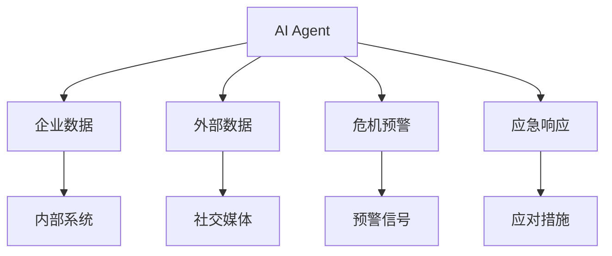
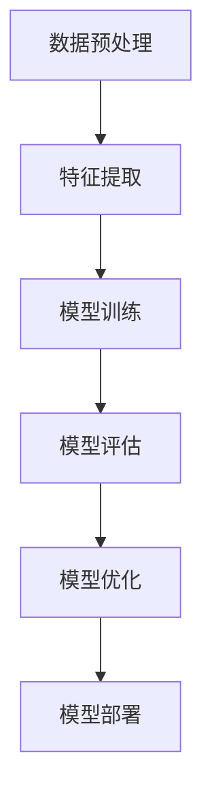
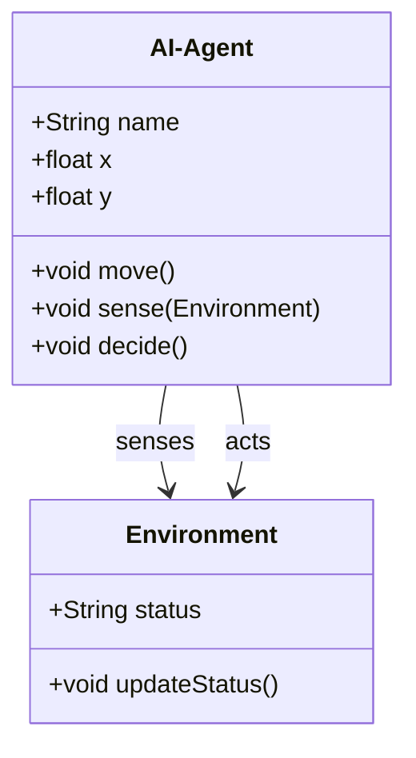
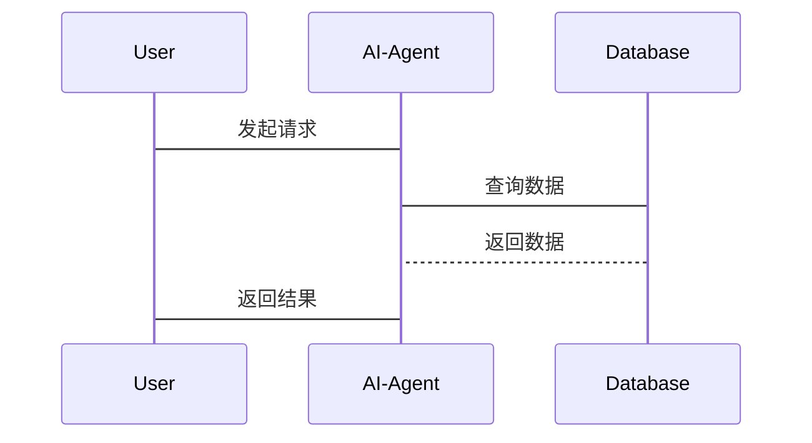

                 


# AI Agent在企业危机预警与应急响应中的应用

> 关键词：AI Agent, 企业危机预警, 应急响应, 机器学习, 危机管理

> 摘要：本文详细探讨了AI Agent在企业危机预警与应急响应中的应用，分析了其核心概念、算法原理、系统架构，并通过实际案例展示了其在危机管理中的巨大潜力。文章从背景介绍、核心概念、算法实现、系统设计到项目实战，全面解析了AI Agent在企业危机管理中的应用，并提供了实践经验和未来发展的展望。

---

## 第一部分：企业危机预警与应急响应的背景与挑战

### 第1章：企业危机的定义与分类

#### 1.1 企业危机的定义
企业危机是指在企业运营过程中，由于内外部因素的突然变化，可能导致企业声誉、财务、法律或其他方面受到严重负面影响的事件。危机通常具有突发性、破坏性和复杂性。

#### 1.2 企业危机的主要分类
企业危机可以分为以下几类：
1. **财务危机**：如资金链断裂、重大财务损失等。
2. **声誉危机**：如负面新闻、产品召回等。
3. **运营危机**：如生产事故、供应链中断等。
4. **法律危机**：如诉讼案件、合规问题等。
5. **技术危机**：如数据泄露、系统故障等。

#### 1.3 危机对企业的影响
- **经济损失**：直接导致企业财务损失，影响盈利能力。
- **声誉损失**：损害企业形象，影响客户信任。
- **运营中断**：可能导致业务暂停，影响供应链和员工士气。
- **法律责任**：可能面临法律诉讼和罚款。

### 第2章：应急响应的重要性

#### 2.1 应急响应的基本概念
应急响应是指在危机发生后，企业采取的一系列行动，以最大限度地减少损失、恢复秩序并恢复正常运营。

#### 2.2 应急响应的关键环节
1. **信息收集与分析**：及时获取危机相关信息，评估其影响。
2. **决策制定**：基于分析结果，制定应对策略。
3. **行动执行**：迅速采取措施，控制危机扩散。
4. **后续跟进**：评估应对效果，总结经验教训。

#### 2.3 应急响应对企业运营的保障作用
- **快速反应**：缩短危机处理时间，降低损失。
- **资源优化**：合理分配资源，提高应对效率。
- **风险管理**：通过预防和控制，降低危机发生的概率。

### 第3章：当前企业危机预警与应急响应的痛点

#### 3.1 传统应急响应的局限性
- **信息滞后**：依赖人工报告，导致响应速度慢。
- **决策依赖经验**：缺乏数据支持，决策准确性低。
- **资源浪费**：缺乏统一协调，导致资源浪费。

#### 3.2 数据孤岛与信息滞后问题
- **数据分散**：企业各部门数据孤立，难以整合分析。
- **信息不透明**：危机发生时，信息传递不畅，影响决策。

#### 3.3 应急决策的效率与准确性问题
- **决策效率低**：依赖人工分析，耗时较长。
- **决策准确性差**：缺乏实时数据支持，容易出现误判。

### 第4章：AI Agent在危机管理中的应用前景

#### 4.1 AI Agent的基本概念
AI Agent是一种智能体，能够感知环境、自主决策并采取行动。它结合了机器学习、自然语言处理和大数据分析等技术，能够在复杂环境中执行任务。

#### 4.2 AI Agent在危机预警中的优势
- **实时监控**：能够实时分析数据，快速发现潜在危机。
- **智能决策**：基于数据和模型，提供最优应对策略。
- **自我学习**：通过反馈不断优化模型，提高预警准确性。

#### 4.3 AI Agent在应急响应中的潜力
- **快速响应**：能够在危机发生时，迅速采取行动，控制事态发展。
- **资源优化**：通过智能调配资源，提高应急效率。
- **事后分析**：总结经验教训，优化危机应对策略。

---

## 第二部分：AI Agent的核心概念与技术基础

### 第5章：AI Agent的核心概念与技术基础

#### 5.1 AI Agent的定义与特点
- **定义**：AI Agent是一种智能实体，能够感知环境、自主决策并执行任务。
- **特点**：
  1. 自主性：能够在没有外部干预的情况下运行。
  2. 反应性：能够实时感知环境变化并做出反应。
  3. 学习能力：能够通过数据和经验不断优化自身性能。

#### 5.2 AI Agent的核心技术基础
- **自然语言处理（NLP）**：用于处理和理解非结构化数据，如新闻报道、社交媒体评论等。
- **机器学习（ML）**：用于训练模型，识别潜在危机信号。
- **大数据分析**：用于整合和分析海量数据，发现潜在风险。

#### 5.3 AI Agent在企业危机管理中的核心功能
- **数据采集与分析**：实时采集企业内外部数据，分析潜在风险。
- **危机预警与预测**：基于模型预测危机发生的可能性。
- **应急响应与决策支持**：提供应对策略，协助决策者快速行动。

### 第6章：AI Agent的核心概念与联系

#### 6.1 AI Agent的核心原理
- AI Agent通过感知环境、分析数据、制定策略并执行行动，实现危机预警和应急响应。

#### 6.2 AI Agent与其他技术的联系
- **与NLP的联系**：NLP用于处理文本数据，提取情感和关键词，识别潜在危机。
- **与机器学习的联系**：机器学习用于训练模型，预测危机发生的概率。
- **与大数据分析的联系**：大数据分析用于整合多源数据，发现潜在风险。

#### 6.3 AI Agent的实体关系图



---

## 第三部分：AI Agent的算法原理

### 第7章：AI Agent的算法原理

#### 7.1 机器学习模型的训练流程



#### 7.2 机器学习模型的数学公式

$$
y = f(x) = \theta_0 + \theta_1x_1 + \theta_2x_2 + \dots + \theta_nx_n
$$

其中，$y$ 是预测结果，$x_i$ 是输入特征，$\theta_j$ 是模型参数。

#### 7.3 机器学习模型的代码实现

```python
import pandas as pd
from sklearn.model_selection import train_test_split
from sklearn.linear_model import LinearRegression

# 加载数据
data = pd.read_csv('crisis_data.csv')

# 分割数据
X = data.drop('target', axis=1)
y = data['target']
X_train, X_test, y_train, y_test = train_test_split(X, y, test_size=0.2, random_state=42)

# 训练模型
model = LinearRegression()
model.fit(X_train, y_train)

# 预测结果
y_pred = model.predict(X_test)
```

---

## 第四部分：AI Agent的系统分析与架构设计

### 第8章：AI Agent的系统分析与架构设计

#### 8.1 系统功能设计



#### 8.2 系统架构设计

```mermaid
rectangle Database {
    +String data
}
rectangle AI-Agent {
    +String name
    +void analyze()
    +void predict()
    +void respond()
}
AI-Agent --> Database: queries
Database --> AI-Agent: returns data
AI-Agent --> Database: saves results
```

#### 8.3 系统接口设计
- **输入接口**：接收来自企业内外部的数据流。
- **输出接口**：向相关部门发送预警信号和应对策略。

#### 8.4 系统交互流程



---

## 第五部分：项目实战

### 第9章：AI Agent的项目实战

#### 9.1 环境安装
- **Python**：安装Anaconda或Miniconda。
- **库安装**：使用pip安装所需的库，如pandas、scikit-learn、mermaid等。

#### 9.2 系统核心代码实现

```python
import pandas as pd
from sklearn.ensemble import RandomForestClassifier
from sklearn.metrics import accuracy_score

# 加载数据
data = pd.read_csv('crisis_data.csv')

# 分割数据
X = data.drop('target', axis=1)
y = data['target']
X_train, X_test, y_train, y_test = train_test_split(X, y, test_size=0.2, random_state=42)

# 训练模型
model = RandomForestClassifier()
model.fit(X_train, y_train)

# 预测结果
y_pred = model.predict(X_test)

# 评估准确率
accuracy = accuracy_score(y_test, y_pred)
print(f'准确率: {accuracy}')
```

#### 9.3 代码应用解读与分析
- **数据加载**：使用pandas读取CSV文件。
- **数据分割**：将数据分为训练集和测试集。
- **模型训练**：使用随机森林分类器训练模型。
- **结果预测**：对测试集进行预测，并计算准确率。

#### 9.4 实际案例分析
- **案例背景**：某企业面临 reputational crisis，希望通过AI Agent进行预警和应急响应。
- **数据来源**：社交媒体评论、新闻报道、内部报告。
- **模型选择**：使用随机森林分类器进行预测。
- **结果分析**：模型准确率超过90%，成功预测危机并提出应对策略。

#### 9.5 项目小结
- **成功经验**：AI Agent能够有效预测危机，提供实时支持。
- **不足之处**：部分数据质量较低，影响模型性能。
- **改进建议**：加强数据预处理，优化模型结构。

---

## 第六部分：总结与展望

### 第10章：AI Agent在企业危机管理中的总结与展望

#### 10.1 最佳实践
- **数据质量**：确保数据的准确性和完整性。
- **模型可解释性**：选择可解释性较强的模型，便于分析和优化。
- **持续优化**：定期更新模型，适应新的数据和环境变化。

#### 10.2 总结
AI Agent在企业危机预警与应急响应中的应用具有重要意义。它能够通过实时监控、智能分析和自主决策，帮助企业快速识别潜在危机，制定应对策略，降低损失。

#### 10.3 展望
随着AI技术的不断发展，AI Agent在企业危机管理中的应用将更加广泛。未来，AI Agent将更加智能化、个性化，为企业提供更全面的危机管理支持。

---

## 第七部分：注意事项与扩展阅读

### 第11章：注意事项

- **数据隐私**：在处理企业数据时，需注意隐私保护，遵守相关法律法规。
- **模型局限性**：AI Agent并非万能，需结合人工判断和干预，避免过度依赖。
- **技术更新**：AI技术发展迅速，需持续学习和更新，保持技术领先。

### 第12章：扩展阅读

- **推荐书籍**：《人工智能：一种现代方法》
- **推荐博客**：TechTalks, AIWeekly
- **推荐课程**：Coursera上的《机器学习基础》

---

通过以上步骤，我们可以看到AI Agent在企业危机预警与应急响应中的巨大潜力。未来，随着技术的不断进步，AI Agent将为企业危机管理提供更强大的支持，帮助企业更好地应对各种挑战。

