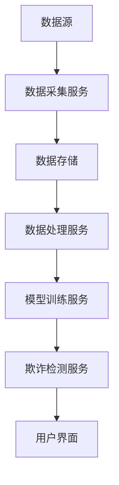
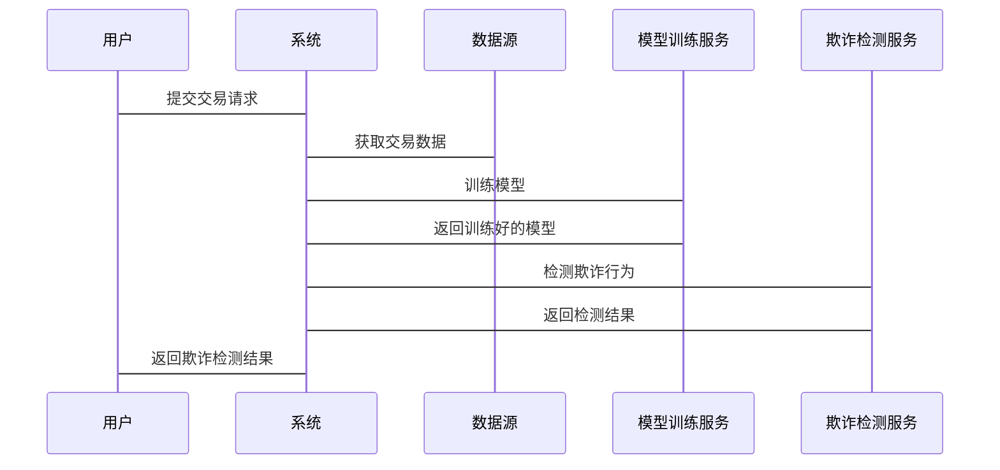

                 


# AI Agent在企业反欺诈与风险控制中的应用

## 关键词：AI Agent, 反欺诈, 风险控制, 机器学习, 系统架构, 项目实战

## 摘要：本文详细探讨了AI Agent在企业反欺诈与风险控制中的应用，从基础概念到算法实现，再到系统架构和项目实战，全面解析了如何利用AI Agent提升企业反欺诈能力。文章通过实际案例分析，展示了AI Agent在反欺诈中的优势和应用场景，并提供了具体的实现方案和代码示例。

---

# 第一章: AI Agent的基本概念与背景

## 1.1 AI Agent的定义与特点

### 1.1.1 AI Agent的定义
AI Agent（人工智能代理）是一种能够感知环境、自主决策并执行任务的智能体。它通过接收输入数据，利用算法进行分析和推理，最终输出决策结果或执行操作。

### 1.1.2 AI Agent的核心特点
- **自主性**：能够在没有外部干预的情况下自主运行。
- **反应性**：能够实时感知环境变化并做出反应。
- **学习能力**：通过机器学习算法不断优化自身的决策能力。
- **可扩展性**：能够处理不同类型和规模的任务。

### 1.1.3 AI Agent与传统规则引擎的区别
| 特性 | AI Agent | 传统规则引擎 |
|------|----------|--------------|
| 决策方式 | 基于机器学习模型 | 基于预定义规则 |
| 灵活性 | 高，能够适应复杂场景 | 低，规则固定 |
| 学习能力 | 具备自适应能力 | 无法自适应 |

## 1.2 企业反欺诈与风险控制的背景

### 1.2.1 欺诈行为对企业的影响
- **经济损失**：欺诈行为导致企业直接经济损失。
- **声誉损害**：欺诈事件可能损害企业的品牌形象。
- **法律风险**：欺诈行为可能引发法律纠纷。

### 1.2.2 风险控制的重要性
- **降低损失**：通过及时发现和阻止欺诈行为，减少经济损失。
- **提升信任**：增强客户对企业的信任。
- **合规性**：满足相关法律法规的合规要求。

### 1.2.3 传统反欺诈手段的局限性
- **规则引擎的局限**：传统规则引擎依赖于预定义规则，难以应对复杂的欺诈手段。
- **人工审核的低效**：人工审核效率低，难以应对海量数据。
- **滞后性**：传统方法难以实时响应欺诈行为。

## 1.3 AI Agent在反欺诈中的应用前景

### 1.3.1 AI Agent的优势
- **高准确性**：通过机器学习算法，AI Agent能够准确识别欺诈行为。
- **实时性**：能够实时监控和响应欺诈行为。
- **自适应性**：能够根据新的数据和场景自适应优化。

### 1.3.2 企业采用AI Agent的挑战
- **技术复杂性**：AI Agent的开发和部署需要较高的技术门槛。
- **数据依赖性**：依赖于高质量的数据，数据不足可能导致模型性能下降。
- **成本问题**：AI Agent的开发和维护成本较高。

### 1.3.3 未来发展趋势
- **多模态学习**：结合文本、图像等多种数据源进行欺诈识别。
- **边缘计算**：在边缘设备上部署AI Agent，提升实时性。
- **联邦学习**：通过联邦学习技术，提升模型的泛化能力。

## 1.4 本章小结
本章介绍了AI Agent的基本概念和特点，分析了企业反欺诈和风险控制的背景，指出了传统反欺诈手段的局限性，并探讨了AI Agent在反欺诈中的应用前景和未来发展趋势。

---

# 第二章: AI Agent的核心概念与原理

## 2.1 AI Agent的核心概念

### 2.1.1 感知层
AI Agent的感知层负责接收外部输入数据，包括：
- **数据采集**：从数据库、日志等来源获取数据。
- **数据预处理**：对数据进行清洗、转换和标准化处理。

### 2.1.2 决策层
AI Agent的决策层负责分析数据并生成决策，包括：
- **特征提取**：从数据中提取有用的特征。
- **模型训练**：利用机器学习算法训练模型。
- **决策生成**：基于模型输出决策结果。

### 2.1.3 执行层
AI Agent的执行层负责根据决策层的指令执行操作，包括：
- **动作执行**：如标记欺诈行为、触发报警等。
- **反馈收集**：收集执行结果的反馈信息。

## 2.2 AI Agent与反欺诈的联系

### 2.2.1 欺诈行为的识别
AI Agent通过分析交易数据、用户行为数据等，识别异常交易和欺诈行为。

### 2.2.2 风险评估与控制
AI Agent能够根据实时数据评估风险等级，并采取相应的风险控制措施。

### 2.2.3 实时监控与响应
AI Agent能够实时监控交易行为，并在检测到异常时立即响应，如暂停交易、报警等。

## 2.3 AI Agent的算法原理

### 2.3.1 分类算法
分类算法用于将交易分为正常和欺诈两类，常用的算法包括：
- **逻辑回归**：通过构建逻辑回归模型进行分类。
- **随机森林**：利用随机森林算法进行分类。
- **神经网络**：通过深度神经网络进行分类。

### 2.3.2 聚类算法
聚类算法用于将交易数据分成不同的类别，识别异常交易：
- **K-means**：将交易数据分成K个簇。
- **DBSCAN**：基于密度的聚类算法。

### 2.3.3 序列模型
序列模型用于分析时间序列数据，识别异常行为：
- **LSTM**：长短期记忆网络，适用于时间序列数据的分析。

## 2.4 本章小结
本章详细讲解了AI Agent的核心概念和算法原理，分析了AI Agent在反欺诈中的具体应用。

---

# 第三章: AI Agent在反欺诈中的算法实现

## 3.1 算法原理

### 3.1.1 分类算法
分类算法用于将交易分为正常和欺诈两类，常用的算法包括：
- **逻辑回归**：通过构建逻辑回归模型进行分类。
- **随机森林**：利用随机森林算法进行分类。
- **神经网络**：通过深度神经网络进行分类。

### 3.1.2 聚类算法
聚类算法用于将交易数据分成不同的类别，识别异常交易：
- **K-means**：将交易数据分成K个簇。
- **DBSCAN**：基于密度的聚类算法。

### 3.1.3 序列模型
序列模型用于分析时间序列数据，识别异常行为：
- **LSTM**：长短期记忆网络，适用于时间序列数据的分析。

## 3.2 算法实现

### 3.2.1 数据预处理
- 数据清洗：处理缺失值、重复值和异常值。
- 数据转换：将数据转换为适合模型输入的格式。

### 3.2.2 模型训练
- 训练逻辑回归模型：
  ```python
  from sklearn.linear_model import LogisticRegression
  model = LogisticRegression()
  model.fit(X_train, y_train)
  ```

- 训练随机森林模型：
  ```python
  from sklearn.ensemble import RandomForestClassifier
  model = RandomForestClassifier()
  model.fit(X_train, y_train)
  ```

- 训练神经网络模型：
  ```python
  import tensorflow as tf
  model = tf.keras.Sequential([
      tf.keras.layers.Dense(64, activation='relu'),
      tf.keras.layers.Dense(1, activation='sigmoid')
  ])
  model.compile(optimizer='adam', loss='binary_crossentropy', metrics=['accuracy'])
  model.fit(X_train, y_train, epochs=10, batch_size=32)
  ```

### 3.2.3 模型评估
- 评估逻辑回归模型的准确率：
  ```python
  accuracy = model.score(X_test, y_test)
  print(f"Accuracy: {accuracy}")
  ```

## 3.3 代码实现

### 3.3.1 数据加载与处理
```python
import pandas as pd
data = pd.read_csv('fraud_data.csv')
# 数据预处理
data = data.dropna()
data['label'] = data['label'].astype(int)
```

### 3.3.2 模型构建与训练
```python
from sklearn.model_selection import train_test_split
X = data.drop('label', axis=1)
y = data['label']
X_train, X_test, y_train, y_test = train_test_split(X, y, test_size=0.2, random_state=42)

# 使用随机森林进行分类
from sklearn.ensemble import RandomForestClassifier
model = RandomForestClassifier(n_estimators=100, random_state=42)
model.fit(X_train, y_train)
```

### 3.3.3 模型评估
```python
from sklearn.metrics import accuracy_score, precision_score, recall_score, f1_score
y_pred = model.predict(X_test)
print(f"Accuracy: {accuracy_score(y_test, y_pred)}")
print(f"Precision: {precision_score(y_test, y_pred)}")
print(f"Recall: {recall_score(y_test, y_pred)}")
print(f"F1 Score: {f1_score(y_test, y_pred)}")
```

## 3.4 本章小结
本章通过具体的代码实现，详细讲解了AI Agent在反欺诈中的算法实现，包括数据预处理、模型训练和评估。

---

# 第四章: 系统架构与设计

## 4.1 系统架构概述

### 4.1.1 分层架构
系统分为数据层、服务层和应用层：
- **数据层**：负责数据的存储和管理。
- **服务层**：负责业务逻辑的处理和AI Agent的运行。
- **应用层**：负责与用户交互和展示结果。

### 4.1.2 微服务架构
系统采用微服务架构，包括数据采集服务、模型训练服务和欺诈检测服务。

### 4.1.3 组件化设计
系统分为数据处理组件、模型训练组件和决策执行组件。

## 4.2 系统功能设计

### 4.2.1 数据处理模块
负责数据的采集、清洗和转换。

### 4.2.2 模型训练模块
负责模型的训练和优化。

### 4.2.3 欺诈检测模块
负责实时检测欺诈行为并触发相应的响应。

## 4.3 系统架构图



## 4.4 系统接口设计

### 4.4.1 数据接口
- **输入接口**：接收原始数据。
- **输出接口**：输出处理后的数据。

### 4.4.2 模型接口
- **训练接口**：接收训练数据和参数。
- **预测接口**：接收实时数据并返回预测结果。

## 4.5 系统交互流程图



## 4.6 本章小结
本章详细讲解了AI Agent反欺诈系统的系统架构与设计，包括分层架构、微服务架构、功能模块设计和系统交互流程。

---

# 第五章: 项目实战

## 5.1 环境安装与配置

### 5.1.1 安装Python和相关库
- 安装Python 3.8及以上版本。
- 安装TensorFlow、Scikit-learn、Pandas等库：
  ```bash
  pip install tensorflow scikit-learn pandas
  ```

### 5.1.2 数据集准备
- 下载欺诈交易数据集，格式为CSV。

## 5.2 系统核心实现

### 5.2.1 数据预处理
```python
import pandas as pd
data = pd.read_csv('fraud_data.csv')
data = data.dropna()
data['label'] = data['label'].astype(int)
```

### 5.2.2 模型训练
```python
from sklearn.ensemble import RandomForestClassifier
model = RandomForestClassifier(n_estimators=100, random_state=42)
model.fit(X_train, y_train)
```

### 5.2.3 模型部署
```python
import joblib
joblib.dump(model, 'fraud_model.pkl')
```

### 5.2.4 实时检测
```python
import joblib
model = joblib.load('fraud_model.pkl')
new_transaction = pd.DataFrame([{'feature1': value1, 'feature2': value2}])
prediction = model.predict(new_transaction)
```

## 5.3 项目实战案例分析

### 5.3.1 数据分析
- 分析欺诈交易的分布情况。
- 统计不同特征在欺诈交易中的分布。

### 5.3.2 模型评估
- 评估模型的准确率、精确率、召回率和F1分数。

### 5.3.3 案例解读
- 分析一个欺诈交易的特征，展示模型如何识别该交易为欺诈。

## 5.4 本章小结
本章通过一个具体的项目实战，详细讲解了AI Agent在反欺诈中的实现过程，包括环境配置、数据处理、模型训练和实时检测。

---

# 第六章: 总结与展望

## 6.1 总结
本文详细探讨了AI Agent在企业反欺诈与风险控制中的应用，从基本概念到算法实现，再到系统架构和项目实战，全面解析了AI Agent的优势和应用场景。

## 6.2 展望
未来，AI Agent在反欺诈中的应用将更加广泛和深入，可能的发展方向包括：
- **多模态学习**：结合文本、图像等多种数据源进行欺诈识别。
- **边缘计算**：在边缘设备上部署AI Agent，提升实时性。
- **联邦学习**：通过联邦学习技术，提升模型的泛化能力。

## 6.3 最佳实践Tips
- 数据是AI Agent的核心，确保数据质量至关重要。
- 模型需要不断优化和更新，以应对新的欺诈手段。
- 系统设计要注重可扩展性和可维护性。

## 6.4 本章小结
本章总结了全文的主要内容，并展望了AI Agent在反欺诈中的未来发展方向，为读者提供了进一步思考的空间。

---

# 附录: 参考文献

1. 《机器学习实战》
2. 《深度学习》
3. TensorFlow官方文档
4. Scikit-learn官方文档

---

# 附录: 源代码

```python
# 数据预处理
import pandas as pd
data = pd.read_csv('fraud_data.csv')
data = data.dropna()
data['label'] = data['label'].astype(int)

# 模型训练
from sklearn.ensemble import RandomForestClassifier
from sklearn.model_selection import train_test_split
X = data.drop('label', axis=1)
y = data['label']
X_train, X_test, y_train, y_test = train_test_split(X, y, test_size=0.2, random_state=42)
model = RandomForestClassifier(n_estimators=100, random_state=42)
model.fit(X_train, y_train)

# 模型评估
from sklearn.metrics import accuracy_score, precision_score, recall_score, f1_score
y_pred = model.predict(X_test)
print(f"Accuracy: {accuracy_score(y_test, y_pred)}")
print(f"Precision: {precision_score(y_test, y_pred)}")
print(f"Recall: {recall_score(y_test, y_pred)}")
print(f"F1 Score: {f1_score(y_test, y_pred)}")

# 模型部署
import joblib
joblib.dump(model, 'fraud_model.pkl')

# 实时检测
import joblib
model = joblib.load('fraud_model.pkl')
new_transaction = pd.DataFrame([{'feature1': value1, 'feature2': value2}])
prediction = model.predict(new_transaction)
```

---

通过以上目录和内容，您可以逐步完成整篇文章的撰写。每个章节都详细展开了核心内容，并提供了代码示例和图表，帮助读者深入理解AI Agent在企业反欺诈与风险控制中的应用。

