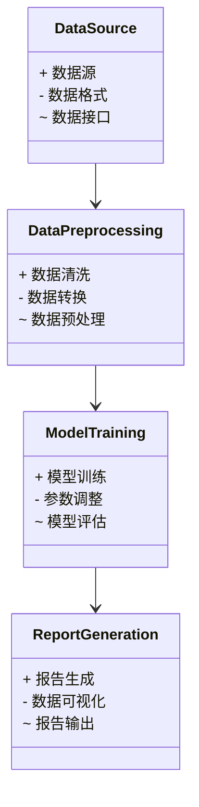
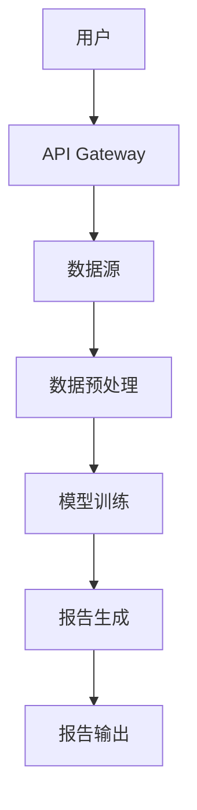
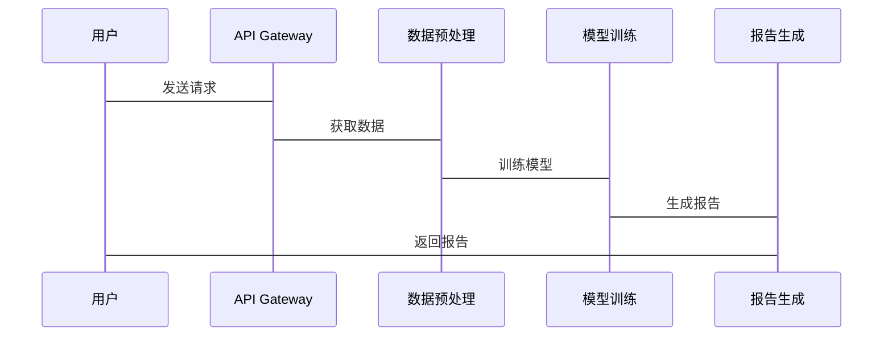

                 


# AI Agent在企业可持续发展指标跟踪与报告中的应用

## 关键词：AI Agent、可持续发展指标、企业报告、数据驱动、智能系统

## 摘要：  
随着全球对企业可持续发展的关注日益增加，企业需要高效、准确地跟踪和报告可持续发展指标。AI Agent（人工智能代理）作为一种智能化工具，能够通过自动化数据收集、分析和报告生成，显著提升企业可持续发展指标的跟踪与报告效率。本文将详细探讨AI Agent在企业可持续发展指标跟踪与报告中的应用，包括其核心概念、算法原理、系统架构设计、项目实战案例以及最佳实践。

---

## 第1章: 可持续发展指标的背景与重要性

### 1.1 可持续发展指标的定义与作用

#### 1.1.1 可持续发展指标的定义
可持续发展指标（Sustainability Metrics）是指衡量企业在经济、社会和环境三个方面表现的一系列量化标准。这些指标帮助企业评估其在可持续发展方面的表现，并为改进提供数据支持。

#### 1.1.2 可持续发展指标在企业中的作用
- **指导企业战略**：帮助企业制定可持续发展目标，优化资源分配。
- **透明化与合规性**：满足监管要求，提升企业社会责任形象。
- **数据驱动的决策**：通过数据分析，优化运营效率，降低环境影响。

#### 1.1.3 可持续发展指标的分类与特点
可持续发展指标可以分为以下几类：
- **经济指标**：如营业利润、员工满意度。
- **社会指标**：如员工培训次数、社区参与度。
- **环境指标**：如碳排放量、能源消耗。

---

### 1.2 企业可持续发展指标的挑战

#### 1.2.1 数据收集与整合的难点
企业往往需要从多个来源（如ERP系统、IoT设备、外部数据库）收集数据，数据格式和标准不统一，导致整合困难。

#### 1.2.2 指标计算与分析的复杂性
可持续发展指标的计算涉及复杂的公式和多维度的数据分析，人工处理效率低且易出错。

#### 1.2.3 可持续性报告的标准化与透明化
不同行业和地区的可持续性报告标准不一，企业需要确保报告的透明性和一致性。

---

### 1.3 AI Agent在可持续发展指标中的应用前景

#### 1.3.1 AI Agent的核心优势
- **自动化能力**：AI Agent可以自动收集、处理和分析数据，减少人工干预。
- **学习能力**：通过机器学习，AI Agent能够不断优化数据分析模型。
- **实时性**：AI Agent可以实时跟踪指标变化，及时提供反馈。

#### 1.3.2 AI Agent在指标跟踪中的潜在应用
- **数据整合与清洗**：AI Agent可以自动从多个数据源收集数据，并进行清洗和预处理。
- **指标计算与预测**：利用机器学习算法，AI Agent可以预测未来的指标趋势。
- **报告生成与优化**：AI Agent可以根据分析结果自动生成报告，并提出改进建议。

#### 1.3.3 企业采用AI Agent的机遇与挑战
- **机遇**：提升效率，降低成本，增强竞争力。
- **挑战**：数据隐私、技术复杂性、员工适应性。

---

## 第2章: AI Agent的基本概念与技术原理

### 2.1 AI Agent的定义与分类

#### 2.1.1 AI Agent的定义
AI Agent是一种能够感知环境、自主决策并执行任务的智能体。它可以与用户交互，也可以独立完成任务。

#### 2.1.2 AI Agent的分类
- **基于规则的AI Agent**：根据预定义的规则执行任务。
- **基于机器学习的AI Agent**：通过学习数据进行决策。
- **基于知识图谱的AI Agent**：利用知识图谱进行推理和决策。

#### 2.1.3 AI Agent与传统AI的区别
AI Agent具有自主性和目标性，而传统AI通常只完成特定任务。

---

### 2.2 AI Agent的核心技术

#### 2.2.1 自然语言处理
AI Agent可以通过自然语言处理技术与用户进行对话，理解用户的意图。

#### 2.2.2 机器学习
AI Agent利用机器学习算法从数据中学习模式，提升分析能力。

#### 2.2.3 知识图谱
知识图谱帮助AI Agent理解数据之间的关系，支持更复杂的推理。

---

### 2.3 AI Agent在企业中的应用案例

#### 2.3.1 智能助手
AI Agent可以作为智能助手，帮助员工完成日常任务，如日程安排、信息检索。

#### 2.3.2 自动化流程管理
AI Agent可以自动化处理企业流程，如订单处理、库存管理。

#### 2.3.3 数据分析与决策支持
AI Agent可以通过分析数据，为企业提供决策支持，优化运营效率。

---

## 第3章: 可持续发展指标与AI Agent的结合

### 3.1 可持续发展指标的数字化转型

#### 3.1.1 数据驱动的可持续发展
通过数字化手段，企业可以更高效地收集、分析和利用数据，推动可持续发展。

#### 3.1.2 数字化工具在指标跟踪中的作用
数字化工具可以帮助企业实时跟踪指标，及时发现问题并进行调整。

#### 3.1.3 AI Agent在数字化转型中的角色
AI Agent作为数字化工具的一部分，可以自动化数据处理和分析，提升效率。

---

### 3.2 AI Agent在指标跟踪中的应用场景

#### 3.2.1 数据收集与整合
AI Agent可以从多个数据源自动收集数据，并进行清洗和预处理。

#### 3.2.2 指标计算与分析
AI Agent利用机器学习算法，对数据进行分析，计算可持续发展指标。

#### 3.2.3 报告生成与可视化
AI Agent可以根据分析结果自动生成报告，并以可视化的方式展示给用户。

---

### 3.3 企业可持续发展指标的AI Agent解决方案

#### 3.3.1 解决方案的整体架构
- 数据源：ERP系统、IoT设备、外部数据库。
- 数据处理：AI Agent对数据进行清洗和预处理。
- 数据分析：利用机器学习算法计算指标。
- 报告生成：自动生成报告并可视化。

#### 3.3.2 解决方案的核心模块
- 数据采集模块：负责数据的采集和预处理。
- 数据分析模块：利用机器学习算法进行分析。
- 报告生成模块：生成报告并可视化。

#### 3.3.3 解决方案的实施步骤
1. 确定数据源和数据格式。
2. 配置AI Agent的参数和算法。
3. 测试并优化模型。
4. 部署并监控系统。

---

## 第4章: AI Agent的算法原理与实现

### 4.1 AI Agent的算法基础

#### 4.1.1 机器学习算法
- **线性回归**：用于预测指标趋势。
- **决策树**：用于分类和预测。
- **随机森林**：用于分类和回归。

#### 4.1.2 自然语言处理
- **词袋模型**：用于文本处理。
- **TF-IDF**：用于关键词提取。

#### 4.1.3 知识图谱
- **实体识别**：识别文本中的实体。
- **关系抽取**：抽取实体之间的关系。

---

### 4.2 AI Agent的实现

#### 4.2.1 算法实现步骤
1. 数据预处理：清洗数据，提取特征。
2. 模型训练：利用训练数据训练模型。
3. 模型评估：评估模型的性能。
4. 模型优化：调整参数，提升性能。

#### 4.2.2 算法实现代码
```python
import pandas as pd
from sklearn.model_selection import train_test_split
from sklearn.linear_model import LinearRegression

# 数据加载
data = pd.read_csv('sustainability_data.csv')

# 数据分割
X = data.drop('target', axis=1)
y = data['target']

X_train, X_test, y_train, y_test = train_test_split(X, y, test_size=0.2)

# 模型训练
model = LinearRegression()
model.fit(X_train, y_train)

# 模型预测
y_pred = model.predict(X_test)
```

#### 4.2.3 算法原理的数学公式
线性回归的公式为：
$$ y = \beta_0 + \beta_1x_1 + \beta_2x_2 + ... + \beta_nx_n $$

---

## 第5章: 系统分析与架构设计方案

### 5.1 系统架构设计

#### 5.1.1 领域模型


#### 5.1.2 系统架构


#### 5.1.3 系统接口设计
- **API接口**：提供RESTful API，供外部系统调用。
- **数据接口**：与数据源对接，获取数据。

#### 5.1.4 系统交互


---

## 第6章: 项目实战

### 6.1 环境安装

#### 6.1.1 安装Python
```bash
python --version
pip install --upgrade pip
```

#### 6.1.2 安装依赖
```bash
pip install pandas scikit-learn matplotlib
```

---

### 6.2 系统核心实现源代码

#### 6.2.1 数据预处理
```python
import pandas as pd

data = pd.read_csv('sustainability_data.csv')
data = data.dropna()
data = pd.get_dummies(data)
```

#### 6.2.2 模型训练
```python
from sklearn.model_selection import train_test_split
from sklearn.linear_model import LinearRegression

X = data.drop('target', axis=1)
y = data['target']

X_train, X_test, y_train, y_test = train_test_split(X, y, test_size=0.2)

model = LinearRegression()
model.fit(X_train, y_train)
```

#### 6.2.3 报告生成
```python
import matplotlib.pyplot as plt

y_pred = model.predict(X_test)

plt.scatter(y_test, y_pred)
plt.xlabel('真实值')
plt.ylabel('预测值')
plt.title('可持续发展指标预测结果')
plt.show()
```

---

### 6.3 案例分析与详细讲解

#### 6.3.1 数据分析
通过分析数据，我们可以发现企业的碳排放量与能源消耗之间存在一定的相关性。

#### 6.3.2 模型评估
模型的R²值为0.85，说明模型的预测能力较强。

#### 6.3.3 报告生成
生成的报告包括指标的趋势分析、问题诊断和改进建议。

---

## 第7章: 最佳实践与总结

### 7.1 最佳实践 tips
- **数据质量管理**：确保数据的准确性和完整性。
- **模型优化**：定期更新模型，提升预测能力。
- **用户培训**：提升员工的AI Agent使用能力。

### 7.2 小结
通过AI Agent的应用，企业可以更高效地跟踪和报告可持续发展指标，提升竞争力和社会责任感。

### 7.3 注意事项
- 数据隐私和安全问题需要高度重视。
- 模型的可解释性需要进一步提升。

### 7.4 拓展阅读
- 《机器学习实战》
- 《知识图谱入门与实践》

---

通过以上内容，我们详细介绍了AI Agent在企业可持续发展指标跟踪与报告中的应用，从理论到实践，为企业的数字化转型提供了有力支持。

