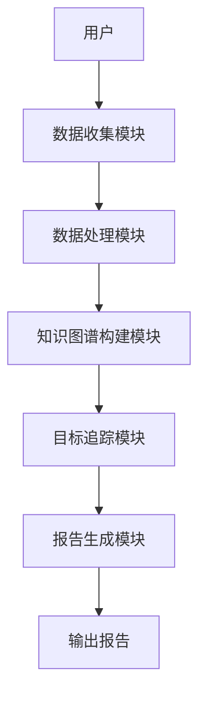

                 

# AI Agent在企业可持续发展目标追踪与报告中的应用

**关键词**：AI Agent、可持续发展目标、企业追踪、智能报告生成、多智能体系统

**摘要**：  
随着企业对可持续发展目标的重视，AI Agent（人工智能代理）在追踪和报告中的应用逐渐成为焦点。本文从AI Agent的技术基础出发，探讨其在企业可持续发展目标追踪与报告中的应用场景，分析其系统架构，并通过实际案例展示其在提升企业效率和准确性的优势。文章旨在为企业提供一种创新的解决方案，帮助其更好地实现可持续发展目标。

---

# 目录

## 第一部分：AI Agent与企业可持续发展目标概述

### 第1章：可持续发展目标与AI Agent概述

#### 1.1 可持续发展目标的背景与重要性
- 1.1.1 可持续发展目标的定义与内涵
- 1.1.2 企业可持续发展目标的核心要素
- 1.1.3 可持续发展目标对企业的影响

#### 1.2 AI Agent的定义与特点
- 1.2.1 AI Agent的基本定义
- 1.2.2 AI Agent的核心特点
- 1.2.3 AI Agent与传统自动化工具的区别

#### 1.3 AI Agent在企业中的作用
- 1.3.1 AI Agent在目标追踪中的应用
- 1.3.2 AI Agent在报告生成中的优势
- 1.3.3 AI Agent与企业可持续发展的结合

#### 1.4 本章小结

---

## 第二部分：AI Agent的技术基础

### 第2章：多智能体系统与知识图谱

#### 2.1 多智能体系统概述
- 2.1.1 多智能体系统的定义与特点
- 2.1.2 多智能体系统在企业中的应用
- 2.1.3 多智能体系统与可持续发展目标的结合

#### 2.2 知识图谱与数据处理
- 2.2.1 知识图谱的定义与构建方法
- 2.2.2 数据处理流程：从数据源到知识图谱
- 2.2.3 知识图谱在目标追踪中的应用

#### 2.3 AI Agent的算法原理
- 2.3.1 AI Agent的核心算法：强化学习与监督学习
- 2.3.2 多智能体协同算法：分布式计算与协作机制
- 2.3.3 算法优化：目标函数与约束条件

#### 2.4 本章小结

---

## 第三部分：AI Agent在企业可持续发展目标中的应用场景

### 第3章：数据收集与分析

#### 3.1 数据收集的挑战与解决方案
- 3.1.1 数据来源：企业内部系统与外部数据源
- 3.1.2 数据清洗：处理缺失值与异常值
- 3.1.3 数据整合：多源数据的融合方法

#### 3.2 数据分析与目标追踪
- 3.2.1 基于知识图谱的目标关联分析
- 3.2.2 多智能体协同分析：实时追踪与预测
- 3.2.3 数据可视化：直观呈现目标进度

#### 3.3 本章小结

---

### 第4章：智能报告生成与优化

#### 4.1 智能报告生成的流程
- 4.1.1 自然语言处理（NLP）在报告生成中的应用
- 4.1.2 基于知识图谱的报告内容优化
- 4.1.3 报告自动生成与个性化定制

#### 4.2 报告优化的算法实现
- 4.2.1 基于强化学习的报告优化算法
- 4.2.2 多智能体协同优化：报告内容与格式的协调
- 4.2.3 报告生成的实时反馈与改进

#### 4.3 本章小结

---

## 第四部分：系统架构与实现

### 第5章：系统架构设计

#### 5.1 系统功能设计
- 5.1.1 系统核心功能模块：数据收集、分析、报告生成
- 5.1.2 用户界面设计：直观的操作界面与交互体验
- 5.1.3 系统扩展性：支持多目标与多场景的应用

#### 5.2 系统架构图（Mermaid）

#### 5.3 系统接口设计
- 5.3.1 数据接口：API设计与数据传输协议
- 5.3.2 用户接口：RESTful API与GraphQL支持
- 5.3.3 第三方接口：与企业现有系统的集成

#### 5.4 本章小结

---

## 第五部分：项目实战与案例分析

### 第6章：项目实战

#### 6.1 环境安装与配置
- 6.1.1 系统运行环境：Python 3.8+
- 6.1.2 依赖库安装：TensorFlow、Keras、Numpy、Pandas
- 6.1.3 开发工具配置：Jupyter Notebook、VS Code

#### 6.2 核心代码实现
- 6.2.1 数据处理模块：数据清洗与整合
- 6.2.2 知识图谱构建：基于图嵌入的节点关系建立
- 6.2.3 目标追踪模块：强化学习算法实现
- 6.2.4 报告生成模块：基于NLP的文本生成

#### 6.3 代码解读与分析
- 6.3.1 数据处理代码示例
- 6.3.2 知识图谱构建代码示例
- 6.3.3 强化学习算法实现代码示例

#### 6.4 本章小结

---

### 第7章：案例分析与总结

#### 7.1 案例分析：制造业企业的碳排放追踪
- 7.1.1 项目背景与目标
- 7.1.2 系统设计与实现
- 7.1.3 应用效果与优化建议

#### 7.2 总结与展望
- 7.2.1 本文总结：AI Agent在企业可持续发展目标中的优势
- 7.2.2 未来展望：AI Agent技术的进一步发展与应用

#### 7.3 最佳实践 Tips
- 7.3.1 系统设计中的注意事项
- 7.3.2 代码实现中的常见问题与解决方案
- 7.3.3 系统维护与优化建议

---

## 第六部分：总结与展望

### 第8章：总结与展望

#### 8.1 本文总结
- 8.1.1 AI Agent在企业可持续发展目标追踪与报告中的应用价值
- 8.1.2 系统设计与实现的关键点

#### 8.2 未来展望
- 8.2.1 AI Agent技术的进一步发展
- 8.2.2 可持续发展目标的新趋势与AI Agent的结合
- 8.2.3 企业智能化转型的未来方向

#### 8.3 思考与建议
- 8.3.1 企业如何更好地利用AI Agent实现可持续发展目标
- 8.3.2 开发者在AI Agent技术研究中的建议

---

## 附录

### 附录A：数学公式与算法细节

#### 附录A.1：强化学习算法的数学模型
$$
V(s) = \max_a Q(s,a)
$$

#### 附录A.2：多智能体协同算法的数学模型
$$
\theta_{i}^{new} = \theta_{i}^{old} + \alpha \cdot (r - Q(\theta_{i}^{old}))
$$

---

## 参考文献

---

通过以上目录结构，文章将系统地介绍AI Agent在企业可持续发展目标追踪与报告中的应用，从理论到实践，从技术到案例，为企业提供全面的解决方案。

