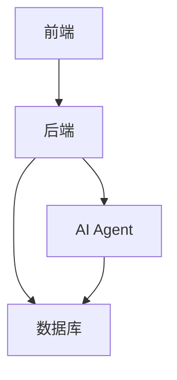
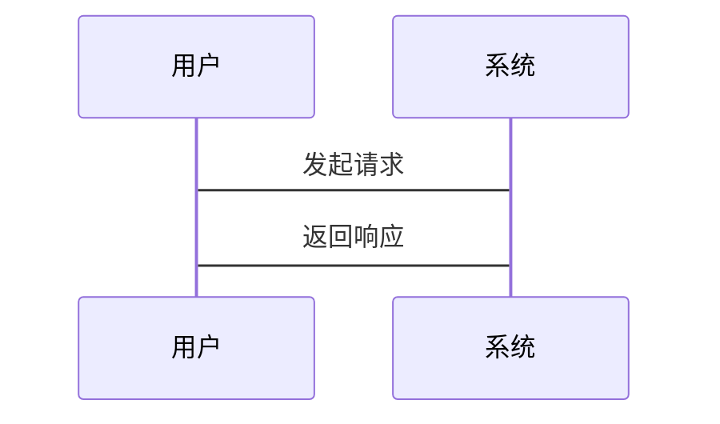

                 


# AI Agent在企业合规培训与审计中的创新应用

## 关键词：AI Agent，企业合规，培训，审计，创新应用

## 摘要：  
随着人工智能技术的快速发展，AI Agent（人工智能代理）在企业合规培训与审计中的应用逐渐展现出巨大的潜力。本文将从AI Agent的基本概念出发，深入分析其在企业合规培训与审计中的创新应用，探讨其技术架构、系统设计、算法原理以及实际案例。通过本文的阐述，读者可以全面了解AI Agent如何通过智能化手段提升企业合规管理的效率与效果。

---

# 第1章: AI Agent与企业合规概述

## 1.1 AI Agent的基本概念

### 1.1.1 AI Agent的定义与特点
AI Agent（人工智能代理）是指能够感知环境、执行任务并做出决策的智能实体。它通过传感器获取信息，利用算法进行分析和推理，并通过执行器完成目标。AI Agent的特点包括：
1. **自主性**：能够在没有外部干预的情况下运行。
2. **反应性**：能够实时感知环境并做出响应。
3. **学习性**：通过数据和经验不断优化自身的决策能力。
4. **协作性**：能够与其他系统或人类用户协同工作。

### 1.1.2 AI Agent的核心原理
AI Agent的核心原理在于其感知、决策和执行能力。感知阶段通过自然语言处理（NLP）、计算机视觉等技术获取环境信息；决策阶段通过机器学习算法分析数据并制定策略；执行阶段通过自动化工具或人类用户完成任务。

### 1.1.3 企业合规的重要性
企业合规是指企业在经营过程中遵守相关法律法规、行业标准和企业内部规章制度。合规管理不仅是企业合法经营的基础，也是企业风险管理的重要组成部分。随着法律法规的不断完善和监管力度的加强，企业合规管理的需求日益迫切。

---

## 1.2 AI Agent在企业合规中的应用背景

### 1.2.1 企业合规培训与审计的现状
传统的企业合规培训与审计存在以下问题：
1. **效率低下**：培训内容繁杂，难以覆盖所有员工。
2. **成本高昂**：需要大量的人力和时间投入。
3. **个性化不足**：难以根据员工的具体需求提供个性化的培训内容。
4. **审计滞后**：传统审计方法依赖人工操作，难以及时发现和解决问题。

### 1.2.2 AI Agent对企业合规的推动作用
AI Agent的引入为企业合规管理带来了新的可能性。通过智能化的分析和决策能力，AI Agent能够实现合规培训的个性化、审计的自动化以及风险的实时预警。

### 1.2.3 企业合规领域的痛点与需求
1. **合规培训的个性化需求**：员工的学习能力和兴趣点各不相同，需要个性化的培训方案。
2. **审计的实时性需求**：企业需要实时监控合规情况，及时发现和解决问题。
3. **合规管理的高效性需求**：通过技术手段提升合规管理的效率和效果。

---

## 1.3 本章小结

本章从AI Agent的基本概念出发，分析了其在企业合规中的应用背景，并总结了企业合规领域的痛点与需求。AI Agent的引入为企业合规管理提供了新的解决方案，能够有效提升合规培训与审计的效率和效果。

---

# 第2章: AI Agent的核心原理与技术架构

## 2.1 AI Agent的工作原理

### 2.1.1 AI Agent的基本工作流程
AI Agent的工作流程包括以下步骤：
1. **感知环境**：通过传感器或API获取环境信息。
2. **分析数据**：利用自然语言处理、机器学习等技术对数据进行分析。
3. **制定决策**：基于分析结果制定行动计划。
4. **执行任务**：通过执行器完成任务。

### 2.1.2 AI Agent的感知与决策机制
AI Agent的感知机制依赖于多模态数据处理技术，包括文本、语音、图像等多种数据形式。决策机制则基于强化学习、监督学习等算法，通过不断优化决策模型来提高决策的准确性。

### 2.1.3 AI Agent的自适应学习能力
AI Agent能够通过在线学习和离线学习两种方式不断优化自身的知识库和决策模型。在线学习是指在任务执行过程中实时更新模型，离线学习则是指定期对历史数据进行分析并优化模型。

---

## 2.2 AI Agent的技术架构

### 2.2.1 知识表示与推理
知识表示是AI Agent的核心技术之一，常用的表示方法包括语义网络、规则库和知识图谱。推理则是基于知识表示进行逻辑推理，以支持决策过程。

### 2.2.2 自然语言处理（NLP）技术
NLP技术在AI Agent中的应用包括文本理解、情感分析、机器翻译等。这些技术能够帮助AI Agent更好地理解和处理人类语言。

### 2.2.3 机器学习与深度学习算法
机器学习和深度学习算法是AI Agent的核心技术，包括监督学习、无监督学习、强化学习等。这些算法能够帮助AI Agent从数据中学习规律，并制定最优决策。

---

## 2.3 AI Agent与传统合规工具的对比

### 2.3.1 传统合规工具的局限性
传统合规工具主要依赖人工操作，效率低、成本高且难以满足个性化需求。

### 2.3.2 AI Agent在合规中的优势
AI Agent具有高效性、智能化和个性化的优势，能够显著提升企业合规管理的效率和效果。

### 2.3.3 AI Agent的创新点
AI Agent的创新点在于其智能化、自动化和个性化的特点，能够实现合规管理的全面优化。

---

## 2.4 本章小结

本章详细介绍了AI Agent的核心原理和技术架构，并分析了其在企业合规中的优势和创新点。AI Agent的技术优势为其在企业合规中的广泛应用奠定了坚实的基础。

---

# 第3章: 企业合规培训中的AI Agent应用

## 3.1 企业合规培训的需求分析

### 3.1.1 合规培训的目标与内容
合规培训的目标是提升员工的合规意识和能力，主要内容包括法律法规、行业标准、企业内部规章制度等。

### 3.1.2 员工合规意识的重要性
员工合规意识是企业合规管理的基础，直接关系到企业的合法经营和风险管理。

### 3.1.3 合规培训的痛点与挑战
1. **培训内容繁杂**：合规法规不断更新，培训内容需要及时更新。
2. **个性化需求难以满足**：员工的学习能力和兴趣点各不相同。
3. **培训效果难以评估**：难以量化培训的实际效果。

---

## 3.2 AI Agent在合规培训中的应用场景

### 3.2.1 个性化学习路径设计
AI Agent能够根据员工的学习能力和兴趣点，为其制定个性化的学习路径。

### 3.2.2 实时反馈与纠错
AI Agent能够实时监控员工的学习过程，及时发现并纠正错误。

### 3.2.3 虚拟导师与互动学习
AI Agent可以模拟虚拟导师，与员工进行互动学习，提升学习效果。

---

## 3.3 AI Agent驱动的合规培训系统设计

### 3.3.1 系统功能模块划分
合规培训系统主要包括知识库管理、学习路径设计、实时反馈与纠错、虚拟导师等功能模块。

### 3.3.2 知识库构建与管理
知识库是AI Agent的核心资源，需要涵盖法律法规、行业标准、企业内部规章制度等内容。

### 3.3.3 用户行为分析与学习效果评估
通过分析用户行为数据，AI Agent能够评估学习效果，并优化学习路径。

---

## 3.4 本章小结

本章详细探讨了AI Agent在企业合规培训中的应用场景和系统设计，分析了其在个性化学习路径设计、实时反馈与纠错等方面的独特优势。

---

# 第4章: 企业合规审计中的AI Agent应用

## 4.1 企业合规审计的基本流程

### 4.1.1 审计的目标与范围
合规审计的目标是检查企业是否遵守相关法律法规和内部规章制度，审计范围包括财务、法律、运营等多个方面。

### 4.1.2 审计的主要方法与工具
传统审计方法包括文档审查、访谈、实地检查等，但效率低下且成本高昂。

### 4.1.3 审计结果的处理与反馈
审计结果需要及时处理和反馈，以优化企业的合规管理。

---

## 4.2 AI Agent在合规审计中的创新应用

### 4.2.1 数据采集与分析
AI Agent能够通过API和数据挖掘技术，实时采集企业数据并进行分析。

### 4.2.2 异常行为检测与风险预警
通过机器学习算法，AI Agent能够实时检测企业的异常行为并发出风险预警。

### 4.2.3 审计报告自动生成
AI Agent能够基于分析结果自动生成审计报告，显著提升审计效率。

---

## 4.3 AI Agent驱动的合规审计系统设计

### 4.3.1 系统架构与功能模块
合规审计系统主要包括数据采集、分析与预警、报告生成等功能模块。

### 4.3.2 数据处理与分析算法
AI Agent利用机器学习算法对数据进行分析，识别潜在风险。

### 4.3.3 审计流程优化与自动化
通过自动化技术，AI Agent能够优化审计流程，提升审计效率。

---

## 4.4 本章小结

本章详细探讨了AI Agent在企业合规审计中的创新应用，分析了其在数据采集与分析、异常行为检测与风险预警等方面的优势。

---

# 第5章: AI Agent与企业合规系统的集成

## 5.1 企业现有合规系统的分析

### 5.1.1 传统合规系统的优缺点
传统合规系统主要依赖人工操作，效率低下且难以满足个性化需求。

### 5.1.2 现有系统的集成需求
企业需要将AI Agent与现有合规系统进行集成，以充分利用其智能化优势。

### 5.1.3 系统集成的关键因素
系统集成的关键因素包括数据接口、算法兼容性、功能模块的协同工作等。

---

## 5.2 AI Agent与企业系统集成的具体实现

### 5.2.1 API设计与数据接口
通过API设计和数据接口，AI Agent能够与企业现有系统实现数据交互。

### 5.2.2 系统功能模块的协同工作
AI Agent需要与企业合规系统的其他功能模块协同工作，确保系统整体的高效运行。

### 5.2.3 系统集成的注意事项
系统集成需要注意数据安全、功能兼容性以及用户体验等问题。

---

## 5.3 本章小结

本章详细探讨了AI Agent与企业合规系统的集成，分析了系统集成的关键因素和实现方法，为企业的智能化合规管理提供了重要参考。

---

# 第6章: 系统架构与实现

## 6.1 问题场景介绍

### 6.1.1 企业合规管理的复杂性
企业合规管理涉及多个方面，包括法律法规、行业标准、内部规章制度等，具有较高的复杂性。

### 6.1.2 项目目标
本项目的目标是通过AI Agent技术，实现企业合规培训与审计的智能化和自动化。

### 6.1.3 项目介绍
本项目将设计并实现一个基于AI Agent的企业合规管理平台，涵盖合规培训与审计两大功能模块。

---

## 6.2 系统功能设计

### 6.2.1 领域模型设计
领域模型是系统设计的重要组成部分，需要涵盖知识库管理、学习路径设计、审计报告生成等功能。

## 6.3 系统架构设计

### 6.3.1 系统架构图
以下是系统架构图的Mermaid代码：



### 6.3.2 功能模块划分
系统功能模块包括前端、后端、数据库、AI Agent等部分。

### 6.3.3 系统接口设计
系统接口设计需要考虑API的调用和数据交互。

---

## 6.4 系统交互设计

### 6.4.1 系统交互流程
以下是系统交互流程的Mermaid代码：



### 6.4.2 系统交互的实现
系统交互的实现需要考虑用户行为、API调用和数据处理等。

---

## 6.5 本章小结

本章详细探讨了系统架构与实现，包括领域模型设计、系统架构图、功能模块划分、系统接口设计和系统交互流程等内容。

---

# 第7章: 项目实战

## 7.1 环境安装与配置

### 7.1.1 Python环境的安装
安装Python和相关库，例如Pip。

```bash
pip install numpy
pip install pandas
pip install scikit-learn
pip install spacy
```

### 7.1.2 系统依赖安装
安装系统运行所需的依赖库。

---

## 7.2 系统核心实现

### 7.2.1 知识库构建
以下是知识库构建的Python代码示例：

```python
import spacy

# 加载英文模型
nlp = spacy.load("en_core_web_sm")

# 定义知识库
knowledge_base = {}

def add_entity(doc):
    for ent in doc.ents:
        knowledge_base[ent.text] = ent.label_

doc = nlp("Company ABC operates in the financial industry and must comply with GDPR.")
add_entity(doc)
print(knowledge_base)
```

### 7.2.2 算法实现
以下是算法实现的Python代码示例：

```python
from sklearn import tree

# 创建数据集
X = [[0, 0], [0, 1], [1, 0], [1, 1]]
y = [0, 1, 1, 1]

# 训练决策树模型
model = tree.DecisionTreeClassifier()
model.fit(X, y)

# 预测新数据
print(model.predict([[1, 0]]))
```

---

## 7.3 代码应用与分析

### 7.3.1 知识库构建的代码分析
上述代码示例展示了如何使用spaCy构建知识库，能够帮助AI Agent理解和处理文本信息。

### 7.3.2 算法实现的代码分析
上述代码示例展示了如何使用Scikit-learn训练决策树模型，能够帮助AI Agent进行分类和预测。

---

## 7.4 项目小结

本章通过实际案例展示了AI Agent在企业合规管理中的应用，包括环境安装、系统核心实现和代码应用分析。

---

# 第8章: 总结与展望

## 8.1 本章总结

本文详细探讨了AI Agent在企业合规培训与审计中的创新应用，分析了其技术原理、系统架构和实际案例。AI Agent的引入显著提升了企业合规管理的效率和效果。

---

## 8.2 未来展望

未来，随着AI技术的不断发展，AI Agent在企业合规管理中的应用将更加广泛和深入。特别是在智能化、自动化和个性化方面，AI Agent将为企业合规管理带来更多的创新和突破。

---

## 关键词：AI Agent，企业合规，培训，审计，创新应用

## 摘要：  
本文详细探讨了AI Agent在企业合规培训与审计中的创新应用，分析了其技术原理、系统架构和实际案例。AI Agent的引入显著提升了企业合规管理的效率和效果。

