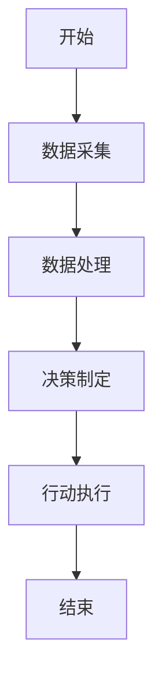
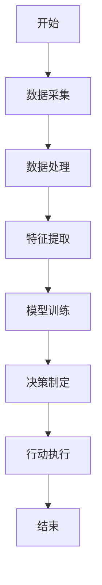
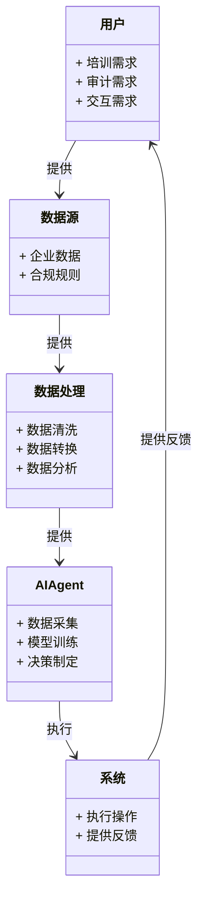

                 


# AI Agent在企业合规培训与审计中的应用

**关键词：** AI Agent, 企业合规, 合规培训, 合规审计, 人工智能, 系统架构

**摘要：** 本文探讨AI Agent在企业合规培训与审计中的应用，从背景、核心概念、算法原理到系统架构、项目实战，详细分析了AI Agent在企业合规领域的价值与实现路径。通过案例分析与系统设计，展示了AI Agent如何助力企业合规培训与审计的智能化发展。

---

# 第一章: AI Agent与企业合规概述

## 1.1 AI Agent的基本概念

### 1.1.1 AI Agent的定义与特点

AI Agent（人工智能代理）是指能够感知环境并采取行动以实现特定目标的智能体。其特点包括：

- **自主性**：能够在没有外部干预的情况下自主决策。
- **反应性**：能够实时感知环境并做出反应。
- **目标导向**：所有行为均以实现特定目标为导向。
- **学习能力**：能够通过数据学习和优化自身行为。

### 1.1.2 AI Agent的核心原理

AI Agent的核心原理是通过感知环境、分析信息、制定策略并执行行动。其工作流程如下：

1. **感知环境**：通过传感器或数据接口获取环境信息。
2. **分析信息**：利用机器学习、NLP等技术对信息进行处理和理解。
3. **制定策略**：基于分析结果，制定最优行动方案。
4. **执行行动**：通过执行器或接口实现目标。

### 1.1.3 企业合规的基本概念

企业合规是指企业在经营过程中遵守相关法律法规、行业标准及企业内部规章制度。合规培训与审计是确保企业合规的两大核心环节：

- **合规培训**：通过培训帮助员工理解和遵守相关法规。
- **合规审计**：通过审查和评估确保企业行为符合合规要求。

---

## 1.2 企业合规培训与审计的重要性

### 1.2.1 企业合规的背景与现状

随着全球化和数字化的深入，企业面临的合规要求日益复杂。企业合规不仅涉及法律法规，还包括行业标准、道德规范等。然而，合规培训与审计的传统方式存在以下问题：

- **效率低**：人工审核效率低下，难以覆盖大规模数据。
- **成本高**：合规培训和审计需要大量人力资源。
- **主观性**：人为判断可能导致偏差。

### 1.2.2 合规培训与审计的核心目标

合规培训与审计的核心目标是确保企业员工能够遵守相关法规，并在实际操作中避免违规行为。具体目标包括：

- **提升合规意识**：通过培训使员工了解合规要求。
- **降低合规风险**：通过审计发现潜在问题并及时整改。
- **优化业务流程**：通过合规审计优化企业内部流程。

### 1.2.3 AI Agent在合规中的应用价值

AI Agent可以通过自动化、智能化的方式提升合规培训与审计的效率和准确性。其应用价值包括：

- **提高效率**：AI Agent可以快速处理大量数据，显著提高合规审计效率。
- **降低成本**：通过自动化减少人工干预，降低合规培训与审计的成本。
- **提升准确性**：AI Agent可以通过算法优化，减少人为错误，提高合规判断的准确性。

---

## 1.3 AI Agent在企业合规中的应用前景

### 1.3.1 AI Agent的技术优势

AI Agent在企业合规中的应用优势主要体现在以下方面：

- **智能化**：AI Agent能够通过学习不断优化自身的判断能力。
- **自动化**：AI Agent可以自动执行合规审计任务，减少人工干预。
- **实时性**：AI Agent可以实时监控企业行为，及时发现违规行为。

### 1.3.2 企业合规领域的痛点与挑战

尽管企业合规的重要性不言而喻，但在实际操作中仍面临诸多痛点与挑战：

- **数据复杂性**：企业合规涉及大量异构数据，数据清洗和处理难度大。
- **法规变化**：法律法规不断变化，合规要求也随之调整，增加了合规工作的难度。
- **合规成本**：合规培训与审计需要投入大量资源，尤其是中小型企业难以负担。

### 1.3.3 AI Agent的解决方案与应用场景

AI Agent可以通过智能化技术解决企业合规中的痛点。其应用场景包括：

- **合规培训**：AI Agent可以为员工提供个性化的合规培训，根据员工的学习情况动态调整培训内容。
- **合规审计**：AI Agent可以自动分析企业数据，发现潜在的合规问题，并提供整改建议。
- **实时监控**：AI Agent可以实时监控企业行为，及时发现违规行为并发出预警。

---

## 1.4 本章小结

本章从AI Agent的基本概念、核心原理出发，详细介绍了企业合规培训与审计的重要性，并分析了AI Agent在企业合规中的应用价值和前景。通过对比传统合规方式与AI Agent的优势，为后续章节的深入探讨奠定了基础。

---

# 第二章: AI Agent的核心概念与联系

## 2.1 AI Agent的核心概念

### 2.1.1 AI Agent的定义与分类

AI Agent可以根据功能和应用场景进行分类。常见的分类方式包括：

- **按智能水平**：
  - **反应式AI Agent**：仅基于当前感知做出反应。
  - **认知式AI Agent**：具备推理、规划等高级智能。
- **按应用场景**：
  - **服务型AI Agent**：提供特定服务，如客服、推荐系统。
  - **监控型AI Agent**：用于实时监控和预警，如合规审计。

### 2.1.2 AI Agent的属性特征对比

以下是几种常见AI Agent的属性特征对比：

| 特性         | 反应式AI Agent | 认知式AI Agent |
|--------------|----------------|----------------|
| 智能水平     | 较低           | 较高           |
| 应用场景     | 实时监控       | 复杂决策       |
| 学习能力     | 有限           | 强大           |

### 2.1.3 AI Agent的实体关系图（ER图）

以下是一个简单的AI Agent实体关系图：

```mermaid
erDiagram
    actor 用户
    actor 系统
    actor 数据源
    class 合规规则
    class 数据处理
    class AI Agent
    用户 --> 合规规则 : 查询
    用户 --> 数据处理 : 提交数据
    数据源 --> 数据处理 : 提供数据
    数据处理 --> AI Agent : 提供处理结果
    AI Agent --> 系统 : 执行操作
```

---

## 2.2 AI Agent的原理与流程

### 2.2.1 AI Agent的基本原理

AI Agent的基本原理可以分为以下步骤：

1. **数据采集**：通过传感器或数据接口获取环境数据。
2. **数据处理**：对数据进行清洗、转换和分析。
3. **决策制定**：基于分析结果，制定最优行动方案。
4. **行动执行**：通过执行器或接口实现目标。

### 2.2.2 AI Agent的流程图

以下是AI Agent的流程图：



---

## 2.3 AI Agent与企业合规的关联

### 2.3.1 AI Agent在合规中的角色

AI Agent在企业合规中可以扮演多种角色，包括：

- **合规顾问**：为员工提供合规建议。
- **合规审计员**：自动审计企业行为，发现潜在问题。
- **合规培训师**：为员工提供个性化的合规培训。

### 2.3.2 AI Agent与合规培训的结合

AI Agent可以通过以下方式与合规培训结合：

- **个性化培训**：根据员工的学习情况动态调整培训内容。
- **实时反馈**：在培训过程中实时评估员工的学习效果。

### 2.3.3 AI Agent与合规审计的结合

AI Agent可以通过以下方式与合规审计结合：

- **自动审计**：自动分析企业数据，发现潜在的合规问题。
- **智能预警**：通过实时监控企业行为，及时发现违规行为并发出预警。

---

## 2.4 本章小结

本章从AI Agent的核心概念出发，详细分析了AI Agent的分类、属性特征及其实体关系图。同时，探讨了AI Agent在企业合规中的角色及其实现方式，为后续章节的深入探讨奠定了基础。

---

# 第三章: AI Agent的算法原理与数学模型

## 3.1 AI Agent的核心算法

### 3.1.1 机器学习算法在AI Agent中的应用

机器学习算法是AI Agent的核心技术之一。常用的机器学习算法包括：

- **监督学习**：用于分类、回归等任务。
- **无监督学习**：用于聚类、异常检测等任务。
- **强化学习**：用于序列决策任务。

### 3.1.2 自然语言处理（NLP）在AI Agent中的应用

NLP技术在AI Agent中的应用主要体现在：

- **文本理解**：将自然语言文本转化为结构化数据。
- **文本生成**：生成符合要求的文本输出。

### 3.1.3 强化学习在AI Agent中的应用

强化学习在AI Agent中的应用主要体现在：

- **策略优化**：通过强化学习优化AI Agent的决策策略。
- **动态规划**：通过动态规划解决复杂的决策问题。

---

## 3.2 AI Agent的数学模型

### 3.2.1 机器学习模型的数学公式

机器学习模型的数学公式因算法而异。以下是一个简单的线性回归模型：

$$ y = \beta_0 + \beta_1x + \epsilon $$

其中，$y$ 是目标变量，$x$ 是自变量，$\beta_0$ 是截距，$\beta_1$ 是回归系数，$\epsilon$ 是误差项。

### 3.2.2 NLP模型的数学公式

NLP模型的数学公式较为复杂。以下是一个简单的词袋模型：

$$ P(\text{class} | \text{words}) = \frac{\prod_{i=1}^n P(word_i | \text{class})}{\sum_{k=1}^K P(\text{class}_k) \prod_{i=1}^n P(word_i | \text{class}_k)} $$

其中，$P(\text{class} | \text{words})$ 是条件概率，表示在给定词语的情况下属于某一类别的概率。

### 3.2.3 强化学习模型的数学公式

强化学习模型的数学公式主要体现在Q-learning算法中：

$$ Q(s, a) = r + \gamma \max_{a'} Q(s', a') $$

其中，$Q(s, a)$ 是状态-动作对的价值，$r$ 是奖励，$\gamma$ 是折扣因子，$s'$ 是下一状态。

---

## 3.3 AI Agent的算法流程图

以下是AI Agent的算法流程图：



---

## 3.4 本章小结

本章详细探讨了AI Agent的核心算法及其数学模型，分析了机器学习、NLP和强化学习在AI Agent中的应用，并通过流程图展示了AI Agent的算法实现过程。

---

# 第四章: AI Agent在企业合规中的系统架构与设计

## 4.1 企业合规培训与审计的系统架构

### 4.1.1 系统功能设计

企业合规培训与审计的系统功能设计包括以下模块：

- **合规培训模块**：提供个性化的合规培训内容。
- **合规审计模块**：自动审计企业数据，发现潜在问题。
- **AI Agent交互模块**：与用户交互，提供合规建议。

### 4.1.2 系统架构设计

以下是企业合规培训与审计的系统架构图：



### 4.1.3 系统接口设计

系统接口设计包括以下部分：

- **输入接口**：用户输入合规需求。
- **输出接口**：系统输出合规建议或审计结果。
- **数据接口**：与企业数据源对接。

### 4.1.4 系统交互流程图

以下是系统交互流程图：

```mermaid
flowchart TD
    A[用户] --> B[数据源] : 提供数据
    B --> C[数据处理] : 处理数据
    C --> D[AI Agent] : 训练模型
    D --> E[系统] : 执行操作
    E --> F[用户] : 提供反馈
```

---

## 4.2 系统功能模块设计

### 4.2.1 合规培训模块

合规培训模块的功能包括：

- **个性化培训**：根据员工的学习情况动态调整培训内容。
- **实时反馈**：在培训过程中实时评估员工的学习效果。
- **培训记录**：记录员工的学习记录和成绩。

### 4.2.2 合规审计模块

合规审计模块的功能包括：

- **自动审计**：自动分析企业数据，发现潜在问题。
- **智能预警**：通过实时监控企业行为，及时发现违规行为并发出预警。
- **审计报告**：生成审计报告，记录审计结果和整改建议。

### 4.2.3 AI Agent交互模块

AI Agent交互模块的功能包括：

- **用户交互**：与用户进行自然语言对话，理解用户需求。
- **决策支持**：基于用户需求提供合规建议。
- **结果反馈**：将AI Agent的决策结果反馈给用户。

---

## 4.3 系统架构优化

### 4.3.1 系统架构优化策略

系统架构优化策略包括：

- **模块化设计**：将系统划分为独立的功能模块，便于维护和升级。
- **分布式架构**：通过分布式架构提高系统的扩展性和容错能力。
- **智能化优化**：通过优化AI Agent的算法提高系统的智能化水平。

### 4.3.2 系统架构优化案例

以下是一个优化后的系统架构图：


---

## 4.4 本章小结

本章详细探讨了AI Agent在企业合规中的系统架构与设计，分析了系统的功能模块、接口设计和交互流程，并通过优化策略和优化案例展示了如何通过系统优化提升AI Agent的性能和效率。

---

# 第五章: AI Agent在企业合规中的项目实战

## 5.1 项目背景与目标

### 5.1.1 项目背景

随着企业合规要求的日益严格，传统的合规培训与审计方式已难以满足需求。为此，我们开发了一个基于AI Agent的企业合规培训与审计系统。

### 5.1.2 项目目标

本项目的旨在通过AI Agent实现企业合规培训与审计的智能化，具体目标包括：

- **提升合规效率**：通过自动化减少人工干预，提高合规效率。
- **降低合规成本**：通过智能化减少合规成本，尤其是中小型企业。
- **提升合规准确性**：通过AI Agent优化合规判断的准确性。

---

## 5.2 项目环境与工具

### 5.2.1 环境安装

以下是项目所需的环境和工具：

- **操作系统**：Linux/Windows/MacOS
- **Python版本**：3.8及以上
- **框架与库**：TensorFlow、Keras、自然语言处理库（如spaCy）、强化学习库（如OpenAI Gym）
- **开发工具**：Jupyter Notebook、PyCharm、Visual Studio Code

### 5.2.2 核心代码实现

以下是AI Agent的核心代码实现：

```python
class AI_Agent:
    def __init__(self, model):
        self.model = model

    def perceive(self, environment):
        return self.model.predict(environment)

    def decide(self, state):
        return self.model.decide(state)

    def act(self, action):
        return action
```

---

## 5.3 项目实现与案例分析

### 5.3.1 项目实现

以下是AI Agent在企业合规中的实现流程：

1. **数据采集**：从企业数据源获取合规数据。
2. **数据处理**：对数据进行清洗、转换和分析。
3. **模型训练**：基于数据训练AI Agent的模型。
4. **决策制定**：基于模型制定合规决策。
5. **行动执行**：执行决策并返回结果。

### 5.3.2 案例分析

以下是一个具体的案例分析：

某企业希望优化其合规培训与审计流程。我们通过AI Agent实现了以下功能：

- **合规培训**：为员工提供个性化的合规培训，根据员工的学习情况动态调整培训内容。
- **合规审计**：自动审计企业数据，发现潜在问题并提供整改建议。
- **实时监控**：实时监控企业行为，及时发现违规行为并发出预警。

---

## 5.4 项目小结

本章通过具体的项目案例展示了AI Agent在企业合规中的实现过程，分析了项目的环境、工具、实现步骤和实际效果，为后续章节的深入探讨奠定了实践基础。

---

# 第六章: AI Agent在企业合规中的最佳实践

## 6.1 最佳实践

### 6.1.1 系统优化

系统优化是提升AI Agent性能的关键。以下是一些系统优化建议：

- **模块化设计**：将系统划分为独立的功能模块，便于维护和升级。
- **分布式架构**：通过分布式架构提高系统的扩展性和容错能力。
- **智能化优化**：通过优化AI Agent的算法提高系统的智能化水平。

### 6.1.2 技术选型

技术选型是系统设计的重要环节。以下是一些技术选型建议：

- **AI框架**：选择适合的AI框架，如TensorFlow、Keras等。
- **NLP库**：选择适合的NLP库，如spaCy、NLTK等。
- **强化学习库**：选择适合的强化学习库，如OpenAI Gym等。

### 6.1.3 数据处理

数据处理是AI Agent的核心环节。以下是一些数据处理建议：

- **数据清洗**：清洗数据，去除噪声数据。
- **数据转换**：将数据转换为适合模型输入的格式。
- **数据分析**：通过数据分析发现数据中的规律和趋势。

---

## 6.2 小结

本章总结了AI Agent在企业合规中的最佳实践，分析了系统优化、技术选型和数据处理的关键点，为读者提供了宝贵的实践经验。

---

## 6.3 注意事项

在实际应用中，需要注意以下几点：

- **数据隐私**：确保数据的隐私性和安全性。
- **系统稳定性**：确保系统的稳定性和可靠性。
- **模型可解释性**：确保模型的可解释性，便于调试和优化。

---

## 6.4 拓展阅读

以下是拓展阅读的建议：

- **《机器学习实战》**：深入理解机器学习算法的实现与应用。
- **《自然语言处理入门》**：掌握自然语言处理的核心技术。
- **《强化学习导论》**：了解强化学习的基本原理和应用。

---

# 第七章: 总结与展望

## 7.1 总结

本文详细探讨了AI Agent在企业合规培训与审计中的应用，从背景、核心概念、算法原理到系统架构、项目实战，全面分析了AI Agent在企业合规中的价值与实现路径。通过案例分析与系统设计，展示了AI Agent如何助力企业合规培训与审计的智能化发展。

## 7.2 展望

随着AI技术的不断进步，AI Agent在企业合规中的应用前景广阔。未来，随着大模型和生成式AI技术的发展，AI Agent将更加智能化、个性化和自动化，为企业合规培训与审计提供更高效、更准确的解决方案。

---

# 附录: AI Agent相关代码与工具

## 附录A: AI Agent核心代码

以下是AI Agent的核心代码：

```python
class AI_Agent:
    def __init__(self, model):
        self.model = model

    def perceive(self, environment):
        return self.model.predict(environment)

    def decide(self, state):
        return self.model.decide(state)

    def act(self, action):
        return action
```

## 附录B: 项目工具与库

以下是项目中常用的工具与库：

- **AI框架**：TensorFlow、Keras
- **NLP库**：spaCy、NLTK
- **强化学习库**：OpenAI Gym
- **开发工具**：Jupyter Notebook、PyCharm、Visual Studio Code

---

# 结束语

感谢您的阅读！希望本文能为您提供有价值的信息和启发，助您更好地理解AI Agent在企业合规中的应用。如果需要进一步了解或合作，欢迎随时联系！

