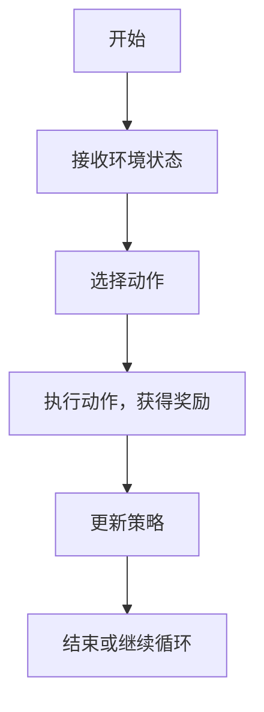
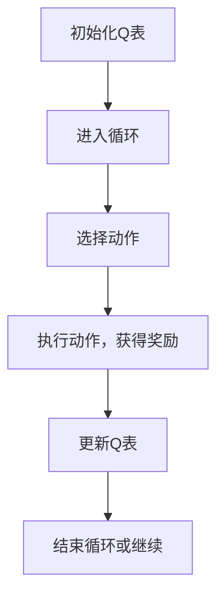
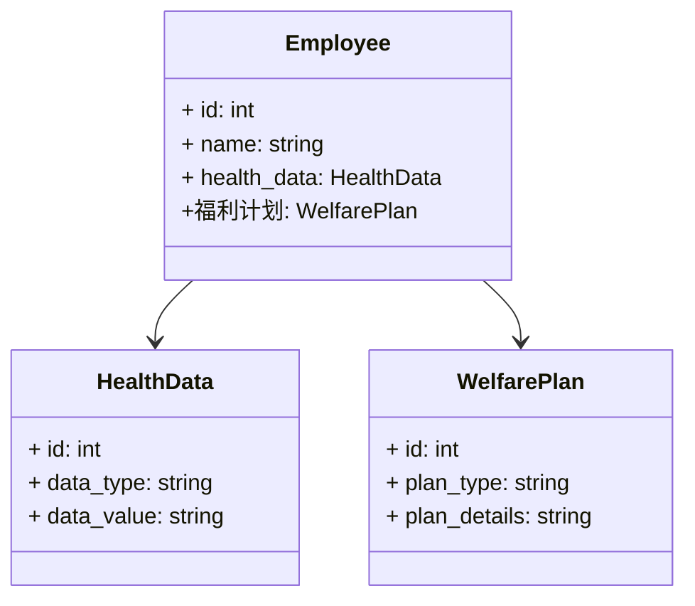
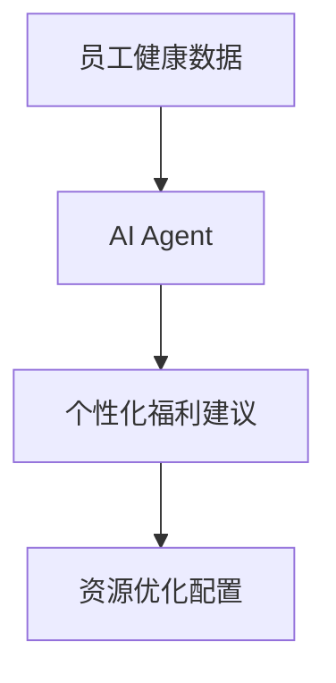
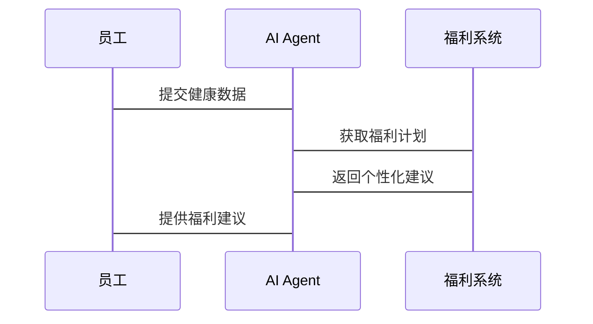

                 


# AI Agent在企业员工健康与福利管理中的应用

> 关键词：AI Agent, 企业员工, 健康管理, 福利管理, 强化学习, 系统架构, 项目实战

> 摘要：本文探讨AI Agent在企业员工健康与福利管理中的应用，从问题背景、核心概念、算法原理到系统架构、项目实战，全面分析AI Agent如何优化员工健康与福利管理流程，提升企业管理效率。

---

## 第1章：AI Agent在企业员工健康与福利管理中的背景介绍

### 1.1 问题背景与描述
现代企业面临着员工健康与福利管理的复杂挑战。员工的健康状况直接影响企业的生产力和员工满意度，而福利管理的复杂性使得传统方法难以高效应对。

#### 1.1.1 企业员工健康与福利管理的现状
企业员工健康与福利管理涉及健康评估、疾病预防、健康管理以及福利计划的设计与执行。传统方法依赖人工操作，效率低下，难以实时响应员工需求。

#### 1.1.2 当前存在的问题与挑战
- 数据分散：员工健康数据、福利政策分散在不同系统中，难以整合。
- 个性化需求：员工健康状况和福利需求差异大，难以统一管理。
- 成本高昂：传统管理方式需要大量人工投入，成本高且效率低。

#### 1.1.3 AI Agent的应用前景
AI Agent（智能体）通过自动化、智能化的方式处理复杂任务，能够在健康评估、疾病预防、福利推荐等方面提供高效解决方案，优化管理流程。

### 1.2 问题解决与边界
AI Agent在健康与福利管理中的应用旨在通过智能化手段解决传统管理中的痛点。

#### 1.2.1 AI Agent在健康与福利管理中的解决方案
AI Agent能够实时分析员工健康数据，推荐个性化福利方案，优化资源分配，降低管理成本。

#### 1.2.2 解决方案的边界与外延
AI Agent的应用范围主要集中在数据处理、决策支持和系统集成方面，不涉及企业的核心业务逻辑和数据安全问题。

#### 1.2.3 核心要素与组成结构
AI Agent系统由数据采集、分析引擎、决策模块和执行模块组成，各模块协同工作，实现智能化管理。

---

## 第2章：AI Agent的核心概念与联系

### 2.1 核心概念定义与原理
AI Agent是一种能够感知环境并采取行动以实现目标的智能体。

#### 2.1.1 AI Agent的基本定义
AI Agent通过感知环境、分析数据、制定决策并执行行动，帮助企业在员工健康与福利管理中实现自动化和智能化。

#### 2.1.2 基于强化学习的AI Agent原理
强化学习是一种通过试错机制优化决策的算法，适用于动态环境下的策略优化。

### 2.2 核心概念对比分析
通过对比分析，明确AI Agent与其他技术的差异与优势。

#### 2.2.1 AI Agent与其他技术的对比分析表
| 技术 | 定义 | 优势 | 劣势 |
|------|------|------|------|
| AI Agent | 智能体，感知环境并行动 | 高度智能化，自适应 | 开发复杂，需要大量数据 |
| 传统规则引擎 | 基于规则的决策系统 | 简单易懂，规则明确 | 难以应对复杂场景 |

### 2.3 实体关系与架构设计
通过ER图展示系统中的实体及其关系。

#### 2.3.1 ER实体关系图
```mermaid
erd
  employee
    + id: int
    + name: string
    + health_data: HealthData
  health_data
    + id: int
    + employee_id: int
    + data_type: string
    + data_value: string
 福利计划
    + id: int
    + employee_id: int
    + plan_type: string
    + plan_details: string
```

---

## 第3章：AI Agent的算法原理

### 3.1 算法原理概述
AI Agent的算法核心是强化学习，通过不断试错优化决策策略。

#### 3.1.1 基于强化学习的AI Agent算法流程


### 3.2 数学模型与公式
强化学习的数学模型是AI Agent决策的基础。

#### 3.2.1 强化学习的数学模型
$$ Q-learning 算法公式：Q(s, a) = r + \gamma \max Q(s', a') $$

### 3.3 算法流程图


---

## 第4章：系统分析与架构设计

### 4.1 问题场景分析
员工健康与福利管理涉及数据采集、分析和决策支持。

#### 4.1.1 问题场景描述
系统需要实时处理员工健康数据，提供个性化福利建议，并优化资源分配。

### 4.2 系统功能设计
通过领域模型类图展示系统功能模块。

#### 4.2.1 领域模型类图


### 4.3 系统架构设计
通过分层架构实现系统的模块化管理。

#### 4.3.1 系统架构图


### 4.4 接口与交互设计
通过序列图展示系统交互流程。

#### 4.4.1 系统接口设计


---

## 第5章：项目实战

### 5.1 环境安装与配置
开发环境的搭建是项目实施的基础。

#### 5.1.1 开发环境搭建
安装Python、TensorFlow、Scikit-learn等工具，配置开发环境。

### 5.2 核心代码实现
通过Python代码实现AI Agent的核心功能。

#### 5.2.1 AI Agent实现代码
```python
import numpy as np
from collections import defaultdict

class AI-Agent:
    def __init__(self):
        self.q_table = defaultdict(lambda: np.zeros(4))  # 动作空间大小为4

    def choose_action(self, state):
        if np.random.random() < 0.9:  # 探索率
            return np.argmax(self.q_table[state])
        else:
            return np.random.randint(4)

    def learn(self, state, action, reward, next_state):
        self.q_table[state][action] = reward + 0.9 * np.max(self.q_table[next_state])
```

### 5.3 案例分析与解读
通过实际案例展示AI Agent的应用效果。

#### 5.3.1 实际案例分析
分析一个员工健康数据，AI Agent如何根据数据推荐个性化福利方案。

### 5.4 项目总结与优化
总结项目经验，提出改进建议。

#### 5.4.1 项目小结
AI Agent显著提升了员工健康与福利管理的效率，但需要进一步优化算法和数据处理能力。

---

## 第6章：最佳实践与总结

### 6.1 最佳实践与注意事项
实施AI Agent系统时需要注意数据隐私、算法优化和系统集成。

#### 6.1.1 实践中的注意事项
- 确保数据隐私和安全
- 定期优化算法模型
- 确保系统兼容性和稳定性

### 6.2 小结与未来展望
AI Agent在企业员工健康与福利管理中的应用前景广阔，未来将更加智能化和个性化。

#### 6.2.1 本章小结
AI Agent通过智能化手段优化管理流程，提升企业管理效率和员工满意度。

#### 6.2.2 未来研究方向
探索更先进的AI算法，结合物联网技术，进一步提升系统的智能化水平。

---

## 附录：术语表
- AI Agent：人工智能代理
- 强化学习：Reinforcement Learning
- ER图：实体关系图
- Q-learning：Q学习算法
- 福利计划：Welfare Plan

---

以上是《AI Agent在企业员工健康与福利管理中的应用》的完整目录和内容概要。希望这篇技术博客能够为读者提供清晰的思路和实用的知识。

