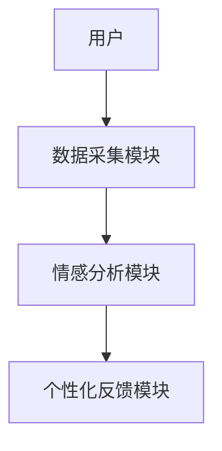
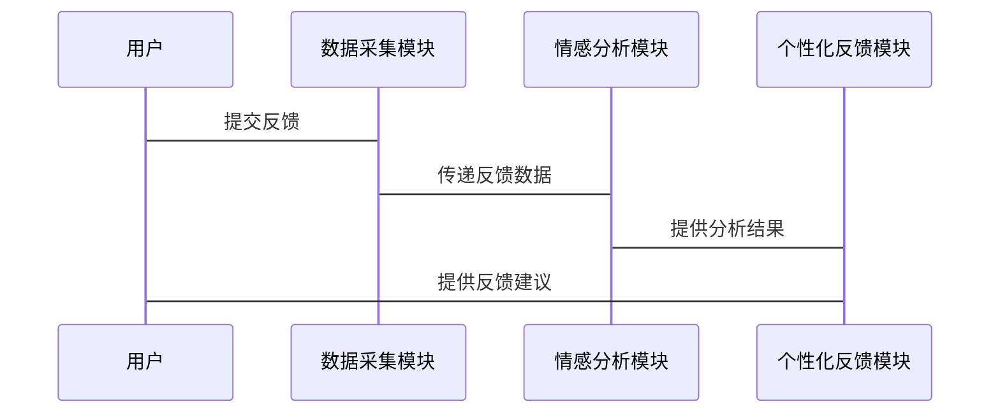

                 

# AI Agent在企业员工满意度分析中的应用

**关键词**：AI Agent，员工满意度，自然语言处理，机器学习，情感分析，数据可视化，反馈机制

**摘要**：随着企业对员工满意度分析的需求不断增加，AI Agent作为一种智能代理技术，能够高效地处理大量数据，提供个性化的反馈和建议。本文将从AI Agent的基本原理出发，结合员工满意度分析的核心要素，探讨如何通过AI Agent提升员工满意度分析的效率和精准度。通过详细的算法原理、系统架构设计和项目实战，本文为读者提供了一套完整的解决方案。

---

## 第一部分：AI Agent与员工满意度分析基础

### 第1章：背景介绍与核心概念

#### 1.1 问题背景与描述
员工满意度是衡量企业健康程度的重要指标。传统的员工满意度分析依赖于问卷调查和人工数据分析，存在效率低、成本高、反馈延迟等问题。随着AI技术的发展，AI Agent作为一种智能代理，能够实时处理员工反馈，提供个性化的解决方案，从而显著提升员工满意度分析的效率和效果。

#### 1.2 核心概念与问题解决
- **AI Agent的定义与特征**：AI Agent是一种智能代理，能够感知环境、执行任务并做出决策。其核心特征包括自主性、反应性、目标导向性和社会能力。
- **员工满意度分析的框架**：包括数据收集、情感分析、主题挖掘和反馈优化四个阶段。
- **AI Agent如何解决员工满意度问题**：AI Agent能够实时处理员工反馈，快速识别问题并提供解决方案，从而提升员工满意度。

#### 1.3 概念结构与核心要素
- **AI Agent的核心要素**：感知能力、决策能力、执行能力和反馈能力。
- **员工满意度分析的关键维度**：工作满意度、薪酬满意度、管理满意度和团队满意度。
- **两者的关联与外延**：AI Agent通过分析员工反馈，提供个性化建议，优化企业内部管理，从而提升员工满意度。

---

### 第2章：AI Agent的核心原理与员工满意度分析

#### 2.1 AI Agent的核心原理
- **AI Agent的基本工作流程**：感知环境、目标设定、决策制定、任务执行和结果反馈。
- **机器学习与自然语言处理在AI Agent中的应用**：机器学习用于模式识别和预测，自然语言处理用于情感分析和语义理解。
- **AI Agent的决策机制**：基于历史数据和实时反馈，采用强化学习和概率推理进行决策。

#### 2.2 员工满意度分析的核心要素
- **数据收集与预处理**：通过问卷、邮件和会议记录等多种渠道收集员工反馈，并进行数据清洗和特征提取。
- **情感分析与主题挖掘**：利用自然语言处理技术，对员工反馈进行情感分析和主题建模，识别关键问题。
- **结果可视化与反馈机制**：将分析结果以可视化形式呈现，并通过反馈机制优化员工满意度。

---

## 第二部分：AI Agent与员工满意度分析的系统架构

### 第3章：AI Agent与员工满意度分析的系统架构

#### 3.1 系统功能设计
- **数据采集模块**：负责从多种渠道收集员工反馈数据。
- **情感分析模块**：对员工反馈进行情感分析和主题挖掘。
- **个性化反馈模块**：根据分析结果，为员工提供个性化的反馈和建议。

#### 3.2 系统架构设计
- **分层架构设计**：包括数据层、逻辑层和表示层。
- **模块间的交互流程**：数据采集模块将反馈数据传递给情感分析模块，情感分析模块生成分析结果后传递给个性化反馈模块。
- **可扩展性设计**：通过模块化设计，方便后续功能的扩展和优化。

---

### 第4章：算法原理与数学模型

#### 4.1 情感分析算法
- **基于深度学习的情感分析模型**：采用卷积神经网络（CNN）或循环神经网络（RNN）进行情感分类。
- **模型训练流程**：数据预处理、模型构建、训练和评估。
- **情感分析的数学公式**：例如，使用概率公式计算文本的情感倾向。

  $$ P(\text{positive}|x) = \frac{\text{count}(x)}{\text{total}} $$

#### 4.2 个性化反馈算法
- **基于协同过滤的反馈推荐**：通过相似员工的行为特征，推荐个性化的反馈建议。
- **反馈算法的数学推导**：例如，使用矩阵分解方法进行推荐。

  $$ \text{score}(i,j) = \mu + b_i + b_j + \sum_{k=1}^n u_k v_k $$

---

### 第5章：项目实战与系统实现

#### 5.1 环境搭建与数据准备
- **开发环境安装**：安装Python、TensorFlow、Keras等工具。
- **数据集获取与预处理**：从企业内部系统获取员工反馈数据，并进行清洗和标注。

#### 5.2 核心代码实现
- **情感分析模型训练**：编写代码训练情感分析模型，并进行测试和优化。
- **个性化反馈系统开发**：基于训练好的模型，开发个性化反馈系统，并进行功能测试。

#### 5.3 实际案例分析
- **案例分析**：通过实际案例展示AI Agent在员工满意度分析中的应用效果。
- **结果解读**：分析模型输出的结果，总结经验教训。

---

### 第6章：最佳实践与注意事项

#### 6.1 小结与总结
- **本书的核心内容回顾**：总结AI Agent在员工满意度分析中的应用方法和优势。
- **AI Agent的未来趋势**：探讨AI Agent技术在员工满意度分析中的进一步发展和应用。

#### 6.2 注意事项与拓展阅读
- **实际应用中的常见问题**：如数据隐私问题、模型泛化能力不足等。
- **相关领域的最新研究**：如多模态情感分析、强化学习在员工满意度分析中的应用。
- **进一步学习的资源推荐**：推荐相关的书籍、论文和在线课程。

---

### 第7章：系统架构与交互流程

#### 7.1 系统架构图

#### 7.2 交互流程图

---

**结语**：通过本文的详细讲解，读者可以全面了解AI Agent在企业员工满意度分析中的应用方法和实际价值。未来，随着AI技术的不断进步，AI Agent将在员工满意度分析中发挥更大的作用，为企业管理提供更智能化的支持。

