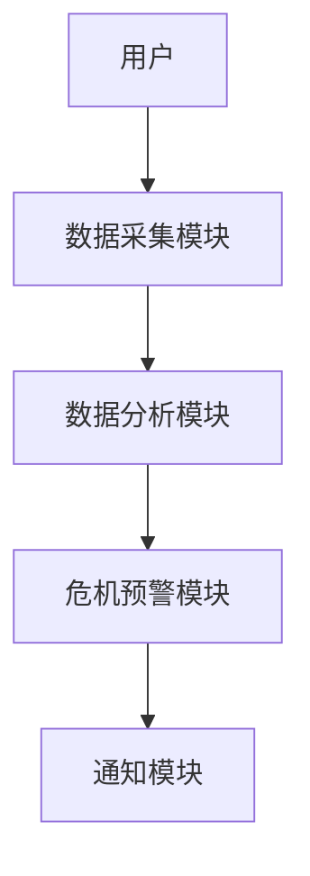
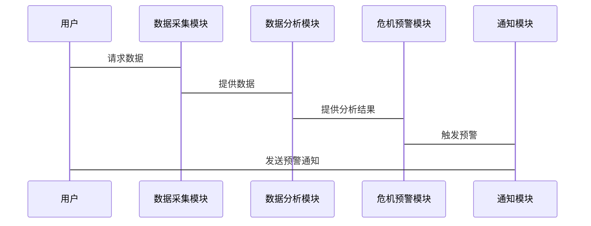

                 


# AI Agent在企业品牌声誉监控与危机预警中的应用

## 关键词：AI Agent, 品牌声誉, 危机预警, 自然语言处理, 机器学习

## 摘要：  
在当今竞争激烈的商业环境中，企业品牌声誉的管理和维护至关重要。随着社交媒体和新闻平台的爆炸式增长，品牌声誉的波动往往即时发生，这对企业的危机管理能力提出了更高的要求。本文将深入探讨AI Agent在企业品牌声誉监控与危机预警中的应用，从核心概念、算法原理、系统架构到实际案例，全面解析如何利用人工智能技术提升品牌声誉管理的效率和准确性。

---

## 第一部分：AI Agent在企业品牌声誉监控与危机预警中的应用概述

### 第1章：品牌声誉与危机预警的背景与挑战

#### 1.1 企业品牌声誉的重要性  
品牌声誉是企业在市场中的形象和信誉的综合体现，直接影响消费者的购买决策和企业的长期发展。  

- **品牌声誉的定义**：品牌声誉是消费者、客户、合作伙伴对企业产品、服务和价值观的感知和评价。  
- **品牌声誉的影响**：良好的品牌声誉可以提升企业的市场地位、客户忠诚度和盈利能力；而负面声誉可能导致销售额下降、客户流失甚至企业声誉的永久损害。  

#### 1.2 传统品牌声誉管理的局限性  
传统的品牌声誉管理依赖人工监控和分析，存在效率低、成本高、覆盖范围有限等问题。  

- **人工监控的效率问题**：人工监控需要大量的人力资源，难以实时跟踪海量社交媒体和新闻数据。  
- **覆盖范围有限**：传统方法通常只能覆盖主流媒体和社交平台，难以捕捉新兴渠道的负面信息。  
- **反应速度慢**：在危机发生时，人工分析难以快速识别和应对，可能导致危机扩大化。  

#### 1.3 AI Agent在品牌声誉管理中的优势  
AI Agent（人工智能代理）通过自动化数据处理、实时监控和智能分析，显著提升了品牌声誉管理的效率和准确性。  

- **自动化数据处理**：AI Agent可以实时采集、分析和分类海量数据，快速识别潜在的危机信号。  
- **智能预警机制**：通过机器学习和自然语言处理技术，AI Agent能够预测危机的发生，并提前制定应对策略。  
- **全天候监控**：AI Agent可以24/7运行，确保品牌声誉的实时监控，不错过任何潜在风险。  

---

### 第2章：AI Agent的核心概念与原理

#### 2.1 AI Agent的定义与分类  
AI Agent是一种能够感知环境、自主决策并执行任务的智能系统。在品牌声誉管理中，AI Agent主要用于数据采集、分析和预警。  

- **AI Agent的定义**：AI Agent通过传感器或API接口采集数据，利用机器学习模型进行分析，并根据结果采取行动。  
- **AI Agent的分类**：根据应用场景的不同，AI Agent可以分为监视型、预测型和决策型三种。  

#### 2.2 AI Agent的核心技术原理  

##### 2.2.1 自然语言处理（NLP）的基础原理  
自然语言处理技术用于理解和分析文本数据，提取情感倾向和关键词。  

- **情感分析**：通过NLP技术，AI Agent可以对社交媒体评论、新闻标题等文本进行情感分析，识别正面、负面或中性情绪。  
- **关键词提取**：利用文本挖掘技术，AI Agent可以提取与品牌相关的关键词，如产品名称、竞争对手名称等。  

##### 2.2.2 机器学习在AI Agent中的应用  
机器学习算法用于训练模型，识别潜在的危机信号。  

- **监督学习**：使用标注的数据集训练模型，识别负面评论的模式和特征。  
- **无监督学习**：通过聚类分析，发现隐藏的舆情趋势和潜在风险。  

##### 2.2.3 知识图谱与语义理解  
知识图谱用于构建品牌相关实体的关系网络，帮助AI Agent更好地理解上下文。  

- **知识图谱构建**：将品牌名称、产品名称、竞争对手等实体及其关系存储在知识图谱中。  
- **语义理解**：基于知识图谱，AI Agent可以理解文本的深层含义，避免误报和漏报。  

---

### 第3章：品牌声誉监控与危机预警的核心概念

#### 3.1 品牌声誉监控的定义与目标  
品牌声誉监控是通过收集和分析数据，实时评估品牌声誉的过程。其目标是发现潜在危机，采取预防措施。  

- **数据采集**：从社交媒体、新闻网站、论坛等渠道采集数据。  
- **数据清洗**：去除噪音数据，如重复内容、垃圾信息等。  
- **数据分析**：通过NLP和机器学习技术，分析数据的情感倾向和关键词。  

#### 3.2 危机预警的核心要素  

##### 3.2.1 危机的定义与分类  
危机是指可能对企业声誉造成重大负面影响的事件或言论。  

- **危机的定义**：任何可能引发公众负面反应的事件，如产品质量问题、高管丑闻等。  
- **危机的分类**：根据影响范围和严重程度，危机可以分为局部危机和全局危机。  

##### 3.2.2 危机预警的指标体系  
危机预警需要建立一套指标体系，包括情感强度、传播速度、关键词出现频率等。  

- **情感强度**：负面评论的比例和强度。  
- **传播速度**：负面信息的扩散速度和范围。  
- **关键词频率**：与品牌相关的关键词的出现频率。  

##### 3.2.3 危机预警的阈值设定  
根据品牌的特点和行业特点，设定危机预警的阈值。  

- **阈值设定**：当负面评论的比例超过一定阈值时，触发预警机制。  
- **动态调整**：根据实时数据和历史数据，动态调整阈值。  

---

## 第二部分：AI Agent在品牌声誉监控与危机预警中的应用

### 第4章：系统架构与实现

#### 4.1 系统功能设计  

##### 4.1.1 数据采集模块  
数据采集模块负责从社交媒体、新闻网站等渠道采集数据。  

- **数据源**：社交媒体（如微博、Twitter）、新闻网站、论坛等。  
- **数据格式**：文本、图片、视频等。  

##### 4.1.2 数据分析模块  
数据分析模块利用NLP和机器学习技术，对数据进行分析。  

- **情感分析**：识别文本的情感倾向。  
- **关键词提取**：提取与品牌相关的关键词。  

##### 4.1.3 危机预警模块  
危机预警模块根据分析结果，判断是否触发预警。  

- **预警条件**：负面评论的比例超过阈值。  
- **预警通知**：通过邮件、短信等方式通知相关人员。  

#### 4.2 系统架构设计  

##### 4.2.1 系统架构图  
以下是系统架构的Mermaid图：



##### 4.2.2 接口设计  
- 数据采集模块提供API接口，供外部系统调用。  
- 数据分析模块提供API接口，供危机预警模块调用。  

#### 4.3 系统交互流程  

##### 4.3.1 交互流程图  
以下是系统交互的Mermaid图：



---

### 第5章：项目实战与案例分析

#### 5.1 项目环境安装  

##### 5.1.1 安装Python  
安装Python 3.8及以上版本。  

##### 5.1.2 安装依赖库  
安装以下依赖库：  
- `numpy`  
- `pandas`  
- `scikit-learn`  
- `textblob`  

#### 5.2 核心代码实现  

##### 5.2.1 数据采集模块  
以下是数据采集模块的代码示例：

```python
import requests
from bs4 import BeautifulSoup

def fetch_data(url):
    response = requests.get(url)
    soup = BeautifulSoup(response.text, 'html.parser')
    data = []
    for item in soup.find_all('div', class_='tweet'):
        data.append(item.text)
    return data
```

##### 5.2.2 数据分析模块  
以下是数据分析模块的代码示例：

```python
from textblob import TextBlob

def analyze_sentiment(text):
    blob = TextBlob(text)
    sentiment = blob.sentiment.polarity
    return 'positive' if sentiment > 0 else 'negative'
```

##### 5.2.3 危机预警模块  
以下是危机预警模块的代码示例：

```python
def trigger预警(sentiment_score):
    if sentiment_score < -0.5:
        return True
    else:
        return False
```

#### 5.3 案例分析  

##### 5.3.1 案例背景  
某知名乳制品企业因产品质量问题引发消费者投诉。  

##### 5.3.2 数据采集与分析  
通过数据采集模块获取社交媒体评论，分析发现负面评论的比例急剧上升。  

##### 5.3.3 危机预警与应对  
系统触发预警机制，企业迅速采取措施，包括公开道歉、召回产品和赔偿消费者。  

---

### 第6章：最佳实践与小结

#### 6.1 最佳实践  

##### 6.1.1 数据质量管理  
确保数据的准确性和完整性，避免误报和漏报。  

##### 6.1.2 模型优化  
定期更新模型，提高情感分析的准确率。  

##### 6.1.3 团队协作  
建立跨部门的协作机制，确保预警信息能够及时传达和处理。  

#### 6.2 小结  
AI Agent在企业品牌声誉监控与危机预警中的应用，显著提升了管理效率和应对能力。通过自动化数据处理和智能分析，企业可以更好地维护品牌形象，降低危机风险。

---

### 第7章：注意事项与拓展阅读

#### 7.1 注意事项  

##### 7.1.1 数据隐私问题  
在数据采集和分析过程中，需遵守相关法律法规，保护用户隐私。  

##### 7.1.2 模型局限性  
AI Agent的分析结果仅供参考，需结合人工判断进行最终决策。  

#### 7.2 拓展阅读  
- 《自然语言处理入门》  
- 《机器学习实战》  
- 《危机公关与媒体管理》  

---

## 结语  
AI Agent作为一项前沿技术，正在为企业品牌声誉监控与危机预警提供新的解决方案。通过结合自然语言处理和机器学习，AI Agent能够帮助企业快速识别潜在风险，制定有效的应对策略，从而在竞争激烈的市场中立于不败之地。未来，随着技术的不断发展，AI Agent的应用场景将更加广泛，为企业管理带来更大的价值。  

--- 

**关键词**：AI Agent, 品牌声誉, 危机预警, 自然语言处理, 机器学习

