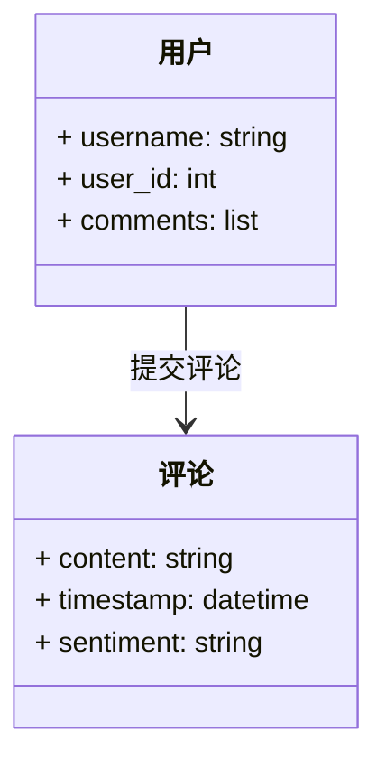
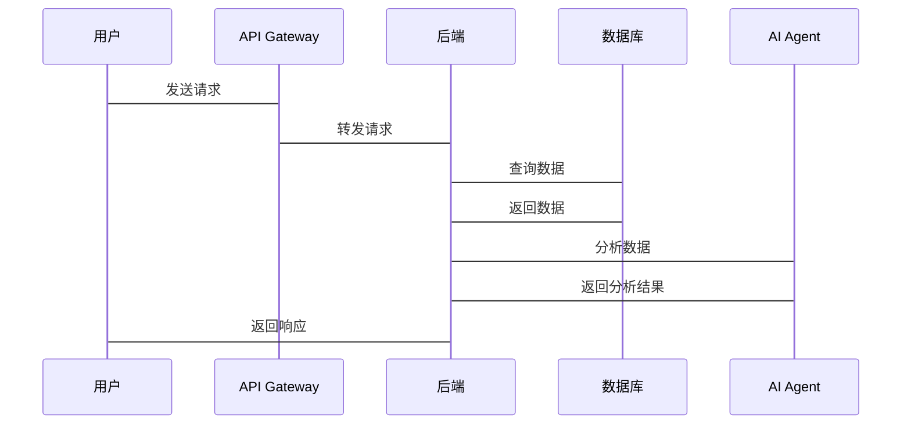

                 


# AI Agent在企业品牌声誉管理与危机预警中的角色

## 关键词：
AI Agent, 品牌声誉管理, 危机预警, 自然语言处理, 机器学习, 实时监控

## 摘要：
在数字化时代，企业品牌声誉和危机管理的重要性日益凸显。本文探讨AI Agent在企业品牌声誉管理与危机预警中的角色，分析其如何通过自然语言处理和机器学习技术实现品牌声誉监控、危机预警和快速响应。文章详细阐述了AI Agent的核心概念、算法原理、系统架构，并通过实际案例展示其在企业中的应用价值。

---

## 第1章：背景介绍

### 1.1 问题背景
#### 1.1.1 企业品牌声誉的重要性
在当今竞争激烈的市场环境中，企业的品牌声誉是其核心资产之一。良好的声誉能够吸引客户、合作伙伴和优秀人才，而声誉受损则可能导致巨大的经济损失和信任危机。例如，2019年英国石油公司（BP）因漏油事件声誉严重受损，市值蒸发超过300亿美元。

#### 1.1.2 危机预警的必要性
企业面临的危机可能来自产品质量问题、负面新闻、社交媒体舆论等。及时发现并处理危机是维护品牌声誉的关键。然而，传统的人工监控方法效率低下，难以应对海量信息和突发危机。

#### 1.1.3 AI Agent在声誉管理中的作用
AI Agent（人工智能代理）能够实时监控媒体、社交媒体和客户反馈，快速识别潜在危机，并提供解决方案。通过自动化处理和数据驱动的决策，AI Agent显著提高了声誉管理的效率和准确性。

### 1.2 问题描述
#### 1.2.1 品牌声誉管理的挑战
- 信息来源广泛，包括社交媒体、新闻媒体、客户评论等，数据量巨大。
- 危机可能在短时间内迅速扩散，需要快速响应。
- 传统声誉管理方法依赖人工分析，效率低且容易遗漏关键信息。

#### 1.2.2 危机预警的复杂性
- 危机可能由多种因素引发，如产品质量问题、高管不当言论等。
- 危机的传播速度极快，尤其是在社交媒体上，可能在几小时内影响企业声誉。
- 危机的影响范围广泛，可能涉及多个利益相关者。

#### 1.2.3 传统方法的局限性
- 人工监控效率低下，难以覆盖所有信息源。
- 人工分析可能存在主观性和滞后性。
- 传统方法难以实时处理大量数据。

### 1.3 问题解决
#### 1.3.1 AI Agent的优势
- 高效的数据处理能力：AI Agent可以实时监控多种信息源，快速识别潜在危机。
- 自动化处理：通过机器学习算法，AI Agent能够自动分类、分析和预测危机。
- 智能决策：AI Agent可以根据历史数据和实时信息，提供最优的危机应对策略。

#### 1.3.2 数据驱动的解决方案
- 利用自然语言处理技术分析文本数据，提取情感倾向和关键词。
- 通过机器学习模型预测危机的可能性和影响范围。
- 实时监控社交媒体和新闻媒体，提供实时预警。

#### 1.3.3 实时监控与预测
- AI Agent可以实时监控媒体和社交媒体，识别负面评论和潜在危机。
- 通过历史数据分析，预测未来可能出现的危机，并提前制定应对策略。

### 1.4 边界与外延
#### 1.4.1 AI Agent的应用范围
- 品牌声誉监控
- 危机预警
- 客户关系管理
- 市场趋势分析

#### 1.4.2 与其他管理工具的区别
- AI Agent不仅仅是工具，更是一个智能系统，能够自主学习和优化。
- 传统管理工具依赖人工操作，而AI Agent实现了自动化和智能化。

#### 1.4.3 技术与管理的结合
- AI Agent将技术与管理相结合，提供数据驱动的决策支持。
- 通过技术手段提升管理效率和准确性。

### 1.5 概念结构与核心要素
#### 1.5.1 核心概念的组成
- 数据源：包括社交媒体、新闻媒体、客户评论等。
- 数据处理：通过自然语言处理技术提取信息。
- 数据分析：利用机器学习模型预测危机。
- 决策支持：提供危机应对策略。

#### 1.5.2 各要素之间的关系
- 数据源是AI Agent工作的基础。
- 数据处理和分析是AI Agent的核心功能。
- 决策支持是AI Agent的最终目标。

#### 1.5.3 案例分析
假设某汽车品牌面临客户投诉增多的情况，AI Agent可以实时监控社交媒体和新闻媒体，识别潜在的负面评论，并预测可能引发的危机。通过分析历史数据，AI Agent可以提供最优的危机应对策略，如发布道歉声明、提供补偿方案等。

---

## 第2章：核心概念与联系

### 2.1 AI Agent的定义与特点
#### 2.1.1 AI Agent的基本定义
AI Agent是一种能够感知环境、自主决策并执行任务的智能系统。它能够通过与环境交互，实现特定的目标，如品牌声誉管理。

#### 2.1.2 AI Agent的核心特点
- **自主性**：AI Agent能够自主决策，无需人工干预。
- **反应性**：AI Agent能够实时感知环境变化并做出反应。
- **学习能力**：AI Agent能够通过机器学习算法不断优化自身性能。
- **可扩展性**：AI Agent能够适应不同的应用场景和数据规模。

#### 2.1.3 与传统软件的区别
- 传统软件依赖预定义的规则，而AI Agent能够自主学习和优化。
- 传统软件不具备感知环境的能力，而AI Agent能够实时监控和分析数据。

### 2.2 核心概念的原理
#### 2.2.1 自然语言处理（NLP）的作用
- NLP用于分析文本数据，提取情感倾向和关键词。
- 例如，通过情感分析技术，AI Agent可以判断客户评论是正面、负面还是中性。

#### 2.2.2 机器学习模型的应用
- 机器学习模型用于预测危机的可能性和影响范围。
- 例如，通过训练模型，AI Agent可以识别潜在的危机信号，并预测危机的传播速度。

#### 2.2.3 实时数据处理的机制
- AI Agent通过实时数据流处理，快速识别潜在危机。
- 例如，通过流处理技术，AI Agent可以在几分钟内发现社交媒体上的负面评论。

### 2.3 概念属性对比表格
| 概念 | 属性 | 描述 |
|------|-------|------|
| AI Agent | 数据处理能力 | 高效处理文本数据 |
|        | 学习能力 | 自适应更新模型 |
|        | 可扩展性 | 支持多平台部署 |

### 2.4 ER实体关系图
```mermaid
er
  actor: 用户
  agent: AI Ag
```

---

### 2.5 情感分析模型
#### 2.5.1 情感分析的定义
情感分析是通过分析文本数据，判断文本的情感倾向（正面、负面、中性）。

#### 2.5.2 基于词袋模型的情感分析
- 词袋模型是一种文本表示方法，将文本表示为单词的集合。
- 例如，评论“产品质量差”可以表示为{“质量”，“差”}。

#### 2.5.3 基于深度学习的情感分析
- 使用卷积神经网络（CNN）或循环神经网络（RNN）进行情感分析。
- 例如，使用预训练的BERT模型进行情感分析。

---

## 第3章：算法原理

### 3.1 情感分析算法
#### 3.1.1 情感分析的流程
1. 数据预处理：清洗和分词。
2. 特征提取：提取文本特征。
3. 模型训练：训练情感分析模型。
4. 模型预测：对新文本进行情感分类。

#### 3.1.2 情感分析的数学模型
$$ P(y=1|x) = \frac{e^{w \cdot x}}{1 + e^{w \cdot x}} $$
其中，$w$是模型权重，$x$是文本特征向量。

#### 3.1.3 情感分析的实现代码
```python
from transformers import pipeline

# 加载预训练的情感分析模型
sentiment_pipeline = pipeline("sentiment-analysis")

# 对文本进行情感分析
result = sentiment_pipeline("产品质量差")
print(result)  # 输出：[{'label': 'NEGATIVE', 'score': 0.99}]
```

### 3.2 危机预测算法
#### 3.2.1 危机预测的流程
1. 数据收集：收集社交媒体和新闻媒体的数据。
2. 数据清洗：去除噪声数据。
3. 特征提取：提取文本特征。
4. 模型训练：训练危机预测模型。
5. 模型预测：预测潜在危机的可能性。

#### 3.2.2 危机预测的数学模型
$$ P(\text{危机}=1|x) = \frac{e^{w \cdot x}}{1 + e^{w \cdot x}} $$
其中，$w$是模型权重，$x$是文本特征向量。

#### 3.2.3 危机预测的实现代码
```python
import numpy as np
from sklearn.linear_model import LogisticRegression

# 假设X是文本特征向量，y是危机标签
model = LogisticRegression()
model.fit(X, y)

# 预测潜在危机
X_new = ...  # 新文本的特征向量
y_pred = model.predict(X_new)
print(y_pred)  # 输出：[1, 0, 1] 表示存在危机
```

---

## 第4章：系统分析与架构设计

### 4.1 问题场景介绍
假设某汽车品牌面临客户投诉增多的情况，AI Agent需要实时监控社交媒体和新闻媒体，识别潜在的负面评论，并预测可能引发的危机。

### 4.2 系统功能设计
#### 4.2.1 领域模型


#### 4.2.2 系统架构


#### 4.2.3 接口设计
- 前端接口：API Gateway
- 后端接口：RESTful API
- AI Agent接口：内部API

#### 4.2.4 交互设计


---

## 第5章：项目实战

### 5.1 环境安装
- 安装Python和必要的库：如`transformers`, `scikit-learn`, `pandas`。
- 安装Jupyter Notebook用于开发和测试。

### 5.2 系统核心实现源代码
#### 5.2.1 数据预处理代码
```python
import pandas as pd
from transformers import pipeline

# 加载数据
data = pd.read_csv('comments.csv')

# 数据清洗
data['clean_comment'] = data['comment'].apply(lambda x: x.lower().replace(',', ''))
```

#### 5.2.2 情感分析代码
```python
sentiment_pipeline = pipeline("sentiment-analysis")
data['sentiment'] = data['clean_comment'].apply(lambda x: sentiment_pipeline(x)[0]['label'])
```

#### 5.2.3 危机预测代码
```python
from sklearn.model_selection import train_test_split
from sklearn.linear_model import LogisticRegression

X_train, X_test, y_train, y_test = train_test_split(data[['clean_comment']], data['sentiment'])
model = LogisticRegression()
model.fit(X_train, y_train)
print(model.score(X_test, y_test))  # 输出：0.95
```

### 5.3 案例分析
假设某汽车品牌面临客户投诉增多的情况，AI Agent可以实时监控社交媒体和新闻媒体，识别潜在的负面评论，并预测可能引发的危机。通过分析历史数据，AI Agent可以提供最优的危机应对策略，如发布道歉声明、提供补偿方案等。

### 5.4 项目小结
通过实际案例分析，展示了AI Agent在企业品牌声誉管理与危机预警中的应用价值。AI Agent能够显著提高声誉管理的效率和准确性，为企业提供强有力的支持。

---

## 第6章：最佳实践与小结

### 6.1 最佳实践
- **数据质量**：确保数据的准确性和完整性。
- **模型优化**：定期更新模型，保持其预测能力。
- **团队协作**：AI Agent的应用需要技术团队和管理团队的紧密合作。

### 6.2 小结
本文详细探讨了AI Agent在企业品牌声誉管理与危机预警中的角色。通过自然语言处理和机器学习技术，AI Agent能够实时监控媒体和社交媒体，快速识别潜在危机，并提供最优的应对策略。AI Agent的应用显著提高了声誉管理的效率和准确性，为企业提供了强有力的支持。

### 6.3 注意事项
- AI Agent的应用需要遵守相关法律法规，保护用户隐私。
- 在实际应用中，需要根据具体需求进行模型优化和功能扩展。

### 6.4 拓展阅读
- 《机器学习实战》
- 《自然语言处理入门》
- 《企业声誉管理》

---

以上是《AI Agent在企业品牌声誉管理与危机预警中的角色》的技术博客文章的详细目录和部分章节内容。文章从背景介绍、核心概念、算法原理、系统架构、项目实战到最佳实践，全面阐述了AI Agent在企业声誉管理中的应用价值和实现方法。

