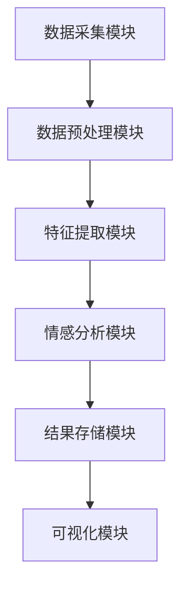
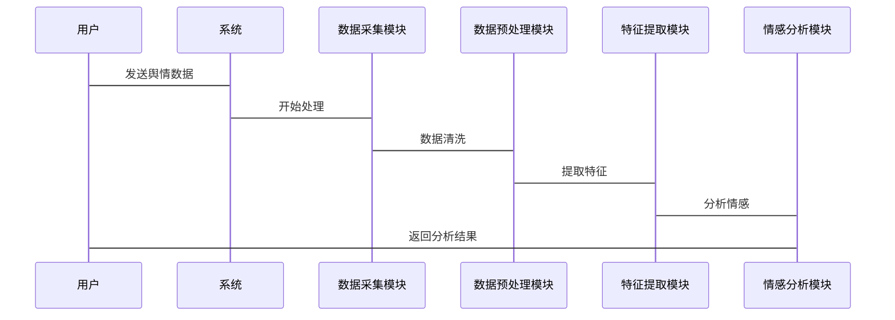

                 


# AI Agent在企业品牌管理与口碑监控中的应用

## 关键词：AI Agent、企业品牌管理、口碑监控、自然语言处理、机器学习、情感分析

## 摘要

随着企业竞争的加剧，品牌管理和口碑监控变得至关重要。AI Agent（人工智能代理）通过自动化处理和智能分析，为企业提供了高效的品牌管理工具。本文探讨AI Agent在企业品牌管理与口碑监控中的应用，从核心原理到实际案例，全面解析其价值与实现方式。

---

## 第1章 AI Agent与企业品牌管理概述

### 1.1 AI Agent的基本概念与定义

AI Agent是一种能够感知环境、自主决策并执行任务的智能实体。其核心特征包括自主性、反应性、目标导向和学习能力。与传统工具不同，AI Agent能够理解上下文并做出适应性决策，这使其在品牌管理中具有独特优势。

### 1.2 企业品牌管理的背景与挑战

现代市场竞争激烈，品牌声誉直接影响企业生存。传统品牌管理依赖人工分析，效率低下且主观性强。AI Agent的引入解决了这些痛点，通过自动化和智能化手段提升管理效率。

### 1.3 口碑监控的核心概念与方法

口碑监控旨在通过收集和分析消费者反馈，评估品牌声誉。常用方法包括情感分析、主题建模和趋势分析。AI Agent通过自然语言处理技术，实现对海量数据的实时监控和深度分析。

---

## 第2章 AI Agent的核心原理与技术基础

### 2.1 AI Agent的核心原理

AI Agent基于感知-决策-执行的闭环工作原理。其决策机制依赖于机器学习模型，能够根据输入数据生成最优策略。学习能力使其能够不断优化性能，适应环境变化。

### 2.2 AI Agent的关键技术

- **自然语言处理（NLP）**：用于文本理解与生成，实现对消费者反馈的深度分析。
- **机器学习（ML）**：构建情感分析模型，识别文本中的情感倾向。
- **数据挖掘**：提取有价值的信息，发现潜在趋势。

### 2.3 AI Agent与企业品牌管理的结合

AI Agent在品牌管理中的核心功能包括舆情监控、声誉管理和竞争分析。通过整合多种技术，AI Agent能够高效处理复杂任务，提供数据支持和决策建议。

---

## 第3章 AI Agent在企业品牌管理中的具体应用

### 3.1 品牌舆情监控与分析

AI Agent通过实时收集和分析社交媒体数据，识别品牌相关的舆情信息。利用情感分析模型，判断公众情感倾向，帮助企业及时应对负面舆情。

### 3.2 品牌声誉管理与修复

基于AI Agent的分析结果，企业可以制定声誉管理策略。例如，通过生成优化建议，改善品牌形象，修复因负面事件受损的声誉。

### 3.3 品牌竞争分析与市场洞察

AI Agent能够监控竞争对手的动态，分析市场趋势。帮助企业制定更具竞争力的市场策略，抢占先机。

---

## 第4章 AI Agent的算法原理与数学模型

### 4.1 算法原理概述

情感分析是AI Agent的关键算法之一。基于机器学习的模型，如支持向量机（SVM）和长短期记忆网络（LSTM），用于分类文本情感。以下是情感分析模型的简单流程：

1. **数据预处理**：清洗和标注文本数据。
2. **特征提取**：提取文本特征，如词袋模型或词嵌入。
3. **模型训练**：使用训练数据训练分类器。
4. **预测与评估**：对新文本进行情感分类，并评估模型性能。

### 4.2 数学模型

情感分析模型的训练通常采用最大熵模型或逻辑回归。以下是逻辑回归的数学表示：

$$ P(y=1|x) = \frac{e^{\beta x}}{1 + e^{\beta x}} $$

其中，$\beta$为模型参数，$x$为输入特征。

---

## 第5章 系统架构设计

### 5.1 项目介绍

本项目旨在构建一个基于AI Agent的品牌管理与口碑监控系统。系统包括数据采集、分析、存储和可视化四个模块。

### 5.2 系统功能设计

- **数据采集模块**：实时采集社交媒体数据。
- **分析模块**：使用NLP和机器学习技术进行舆情分析。
- **存储模块**：存储分析结果和原始数据。
- **可视化模块**：生成图表，展示品牌声誉趋势。

### 5.3 系统架构设计

系统采用分层架构，包括数据层、业务逻辑层和用户界面层。以下是系统架构图：



### 5.4 系统接口设计

系统提供RESTful API接口，供其他系统调用。接口包括数据采集、分析结果查询和报告生成。

### 5.5 系统交互流程

以下是系统交互流程图：



---

## 第6章 项目实战

### 6.1 环境配置

项目使用Python 3.8及以上版本，依赖库包括：

- `numpy`
- `pandas`
- `scikit-learn`
- `transformers`

### 6.2 核心代码实现

以下是情感分析模型的实现代码：

```python
from sklearn.feature_extraction.text import TfidfVectorizer
from sklearn.svm import SVC
from sklearn.pipeline import Pipeline
import pandas as pd

# 数据加载与预处理
data = pd.read_csv('data.csv')
texts = data['text'].tolist()
labels = data['label'].tolist()

# 特征提取与建模
model = Pipeline([
    ('tfidf', TfidfVectorizer()),
    ('svc', SVC())
])
model.fit(texts, labels)

# 模型预测
def predict(text):
    return model.predict([text])[0]

# 使用示例
print(predict("This product is excellent!"))
```

### 6.3 案例分析

以某品牌为例，AI Agent分析了社交媒体上的评论，识别出负面舆情，并及时发出预警。品牌方迅速采取措施，成功避免了声誉危机。

---

## 第7章 最佳实践与未来展望

### 7.1 最佳实践

- **数据质量**：确保数据的准确性和完整性。
- **模型优化**：定期更新模型，提升分类精度。
- **用户反馈**：根据用户反馈持续改进系统。

### 7.2 未来展望

随着AI技术的进步，AI Agent在品牌管理中的应用将更加智能化和个性化。未来，可能出现更复杂的模型和更丰富的功能，为企业提供全方位的品牌管理支持。

---

## 附录

### 附录A AI Agent相关工具

- `spaCy`：用于NLP处理。
- `Gensim`：用于主题建模。

### 附录B 核心代码

以下是完整的情感分析模型代码：

```python
import joblib
from sklearn.model_selection import train_test_split
from sklearn.metrics import accuracy_score

# 数据加载
data = pd.read_csv('data.csv')
X = data['text']
y = data['label']

# 数据分割
X_train, X_test, y_train, y_test = train_test_split(X, y, test_size=0.2)

# 模型训练
model = SVC()
model.fit(TfidfVectorizer().fit_transform(X_train), y_train)

# 模型保存
joblib.dump(model, 'sentiment_model.pkl')

# 模型评估
y_pred = model.predict(TfidfVectorizer().fit_transform(X_test))
print("Accuracy:", accuracy_score(y_test, y_pred))
```

---

通过本文的详细阐述，我们展示了AI Agent在企业品牌管理与口碑监控中的巨大潜力和实际应用价值。未来，随着技术的不断进步，AI Agent将继续推动品牌管理的智能化发展，为企业创造更大的价值。

