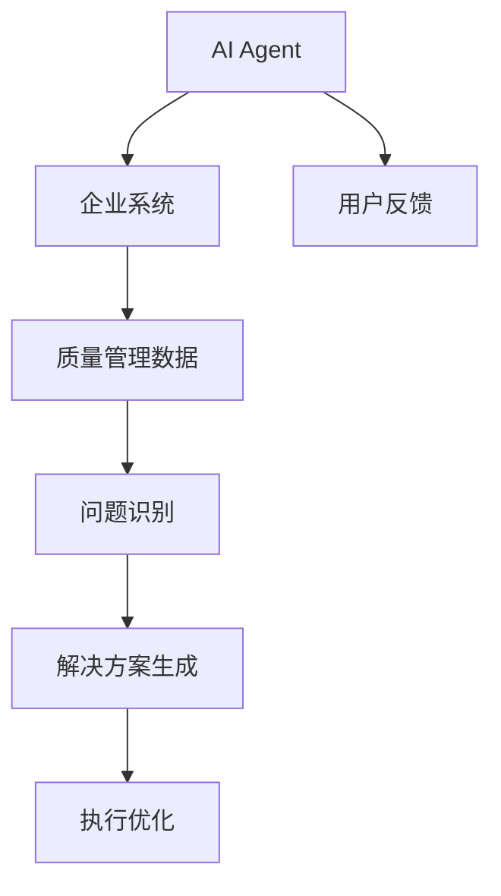
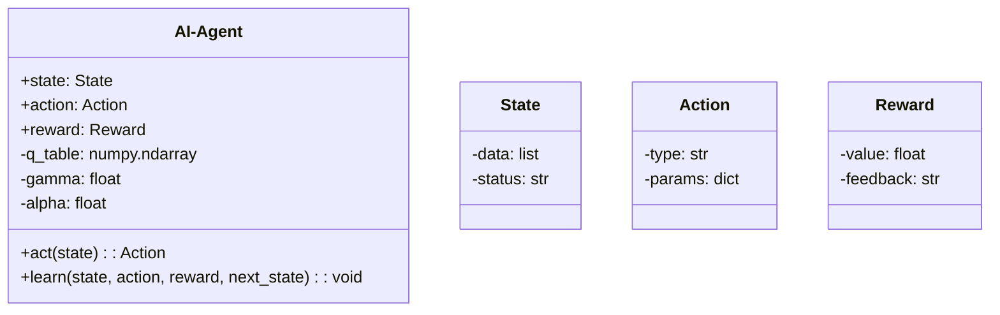
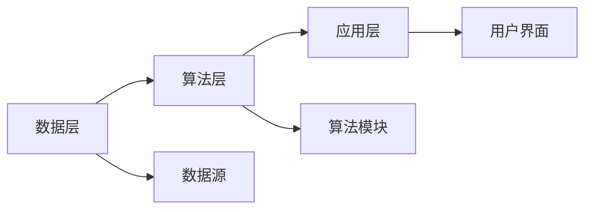
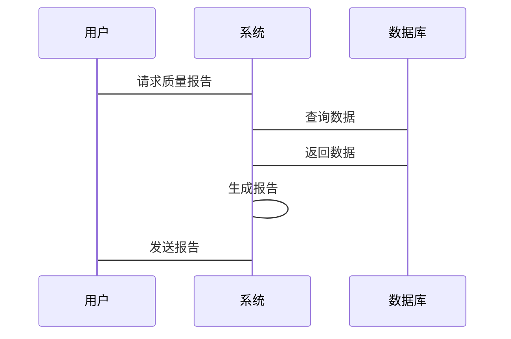

                 


# AI Agent在企业品质管理与持续改进中的应用

> 关键词：AI Agent, 企业品质管理, 持续改进, 人工智能, 机器学习, 算法原理

> 摘要：本文深入探讨了AI Agent在企业品质管理与持续改进中的应用，从背景介绍、核心概念、算法原理到系统架构设计，再到项目实战，全面解析了AI Agent如何通过智能化手段优化企业品质管理流程，提升管理效率和决策准确性。文章结合理论与实践，为读者提供了丰富的技术细节和实际案例，帮助读者更好地理解和应用AI Agent技术。

---

## 第1章: AI Agent与企业品质管理概述

### 1.1 AI Agent的基本概念
AI Agent（人工智能代理）是一种能够感知环境、自主决策并执行任务的智能实体。它结合了机器学习、自然语言处理和自动化技术，能够根据输入的信息生成解决方案或执行操作。AI Agent的核心特征包括自主性、反应性、目标导向性和学习能力。

#### 1.1.1 企业品质管理的定义与目标
企业品质管理是指通过一系列方法和技术，确保产品或服务符合既定的质量标准和客户需求。其目标是提高客户满意度、降低缺陷率、优化流程效率并实现持续改进。

#### 1.1.2 AI Agent与传统管理工具的对比
传统的品质管理工具如检查表、统计分析等依赖人工操作，效率较低且容易出错。AI Agent则通过自动化和智能化手段，能够实时分析数据、识别问题并提出优化建议，显著提高了管理效率和准确性。

### 1.2 AI Agent在企业中的应用背景
#### 1.2.1 企业品质管理的现状与挑战
企业品质管理面临数据量大、问题复杂、人工干预过多等挑战。传统的管理方法难以应对日益复杂的市场需求和高效运营的要求。

#### 1.2.2 AI技术在企业管理中的潜力
AI技术能够通过大数据分析、模式识别和预测建模，帮助企业发现潜在问题、优化流程并提高决策能力。AI Agent作为AI技术的核心应用之一，具有广阔的应用前景。

#### 1.2.3 AI Agent在品质管理中的独特优势
AI Agent能够实时监控生产过程、自动识别异常、优化资源配置并提供个性化解决方案。它的引入不仅提高了管理效率，还能够实现持续改进，帮助企业实现高质量、高效率的目标。

### 1.3 AI Agent在企业品质管理中的应用前景
#### 1.3.1 AI Agent在品质管理中的潜在应用场景
AI Agent可以应用于质量监控、缺陷检测、流程优化、客户反馈分析等多个场景，为企业提供全面的品质管理支持。

#### 1.3.2 企业采用AI Agent的优势与挑战
优势包括提高效率、降低成本、增强决策能力等。挑战则包括技术复杂性、数据隐私和员工适应性等问题。

#### 1.3.3 AI Agent在品质管理中的未来发展趋势
未来，AI Agent将更加智能化、个性化和自动化，与企业管理系统深度融合，成为品质管理的核心工具。

---

## 第2章: AI Agent的核心概念与原理

### 2.1 AI Agent的核心概念
AI Agent通过感知环境、分析数据并执行任务，实现对企业的智能化管理。其核心概念包括任务分解、状态表示、动作选择和奖励机制。

### 2.2 AI Agent的核心算法原理
AI Agent的算法主要包括任务分解、状态表示、动作选择和奖励机制。Q-learning算法是一种常用的强化学习算法，适用于AI Agent的任务分解和状态优化。

#### 2.2.1 Q-learning算法的数学模型
Q-learning算法通过状态-动作价值函数来优化决策，数学模型如下：
$$ Q(s,a) = Q(s,a) + \alpha \left[r + \gamma \max Q(s',a') - Q(s,a)\right] $$

#### 2.2.2 算法实现的Python代码
```python
import numpy as np

class QAgent:
    def __init__(self, state_size, action_size):
        self.state_size = state_size
        self.action_size = action_size
        self.gamma = 0.99  # 折扣因子
        self.alpha = 0.1  # 学习率
        self.q_table = np.zeros((state_size, action_size))
    
    def act(self, state):
        return np.argmax(self.q_table[state])
    
    def learn(self, state, action, reward, next_state):
        self.q_table[state][action] = self.q_table[state][action] + self.alpha * (reward + self.gamma * np.max(self.q_table[next_state]) - self.q_table[state][action])
```

### 2.3 AI Agent的实体关系图


---

## 第3章: AI Agent在企业品质管理中的应用

### 3.1 问题场景介绍
企业品质管理中的常见问题包括质量数据分散、异常检测困难、流程优化不足等。AI Agent可以通过实时数据监控、异常识别和优化建议来解决这些问题。

### 3.2 系统功能设计
系统功能包括数据采集、问题识别、解决方案生成和执行优化。领域模型如下：


### 3.3 系统架构设计
系统架构包括数据层、算法层和应用层。架构图如下：


### 3.4 系统接口设计
系统接口包括数据接口、算法接口和用户接口。接口交互如下：


---

## 第4章: 项目实战

### 4.1 环境安装
安装必要的Python库，如numpy、pandas、scikit-learn等。

### 4.2 系统核心实现
实现AI Agent的核心功能，包括数据采集、问题识别和解决方案生成。

### 4.3 案例分析
通过具体案例分析AI Agent在品质管理中的实际应用，展示其如何优化流程并提高效率。

---

## 第5章: 总结与展望

### 5.1 总结
AI Agent在企业品质管理中的应用前景广阔，能够显著提升管理效率和决策准确性。

### 5.2 展望
未来，AI Agent将更加智能化，与企业管理系统深度融合，成为品质管理的核心工具。

---

通过以上章节的详细讲解，读者可以全面了解AI Agent在企业品质管理中的应用，掌握其核心概念和实现方法，为实际应用提供有力的技术支持。

