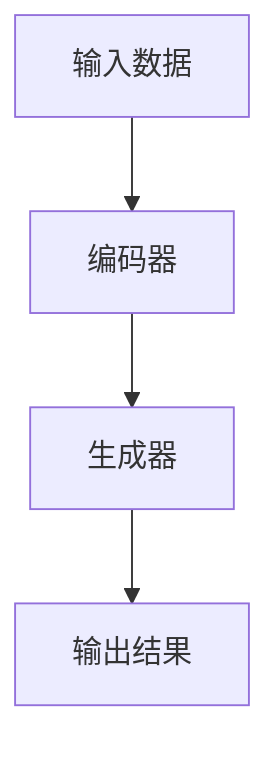
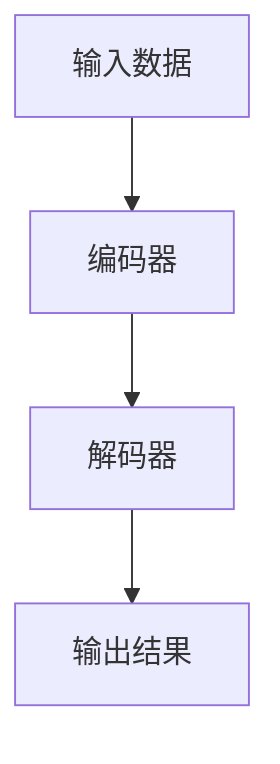
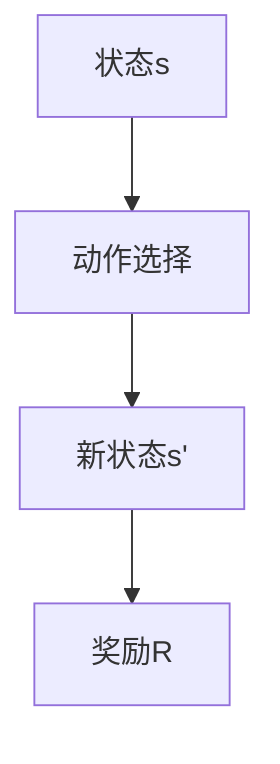
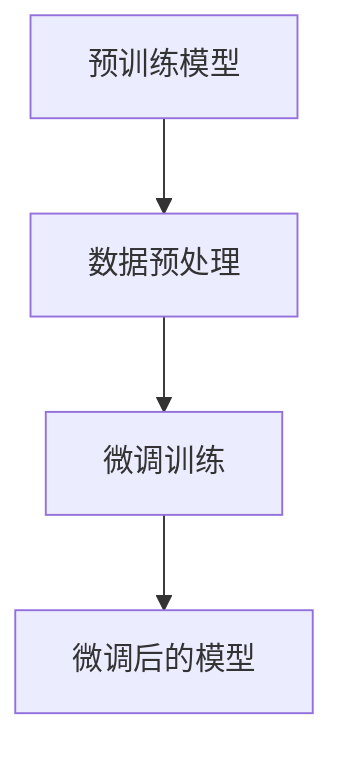
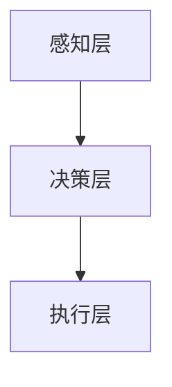
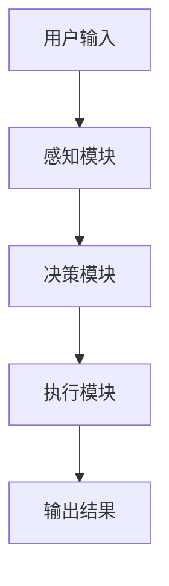

                 


# AI Agent在企业商业模式创新中的应用

> 关键词：人工智能，AI Agent，企业商业模式，数字化转型，商业创新

> 摘要：AI Agent作为一种新兴的智能体技术，正在为企业商业模式的创新提供前所未有的可能性。本文将深入探讨AI Agent的核心概念、算法原理、系统架构以及在企业中的实际应用。通过具体案例分析，我们将展示如何利用AI Agent来优化企业运营、提升客户体验并推动商业模式的创新。文章最后将总结AI Agent在企业应用中的最佳实践和未来趋势。

---

## 第1章 AI Agent的基本概念与背景介绍

### 1.1 AI Agent的定义与核心概念

AI Agent（人工智能智能体）是指能够感知环境、自主决策并执行任务的智能系统。它不同于传统的被动执行指令的软件，AI Agent具备学习、推理和自适应能力，能够在动态环境中做出最优决策。

#### 1.1.1 什么是AI Agent？
AI Agent是一种能够理解上下文、与用户或系统交互，并根据需求采取行动的智能实体。它可以是一个虚拟助手、推荐系统，甚至是自动化流程中的决策者。

#### 1.1.2 AI Agent的核心要素
- **感知能力**：通过传感器或数据输入感知环境。
- **决策能力**：基于感知信息，使用算法做出决策。
- **执行能力**：通过执行器或接口将决策转化为行动。
- **学习能力**：通过反馈机制不断优化自身行为。

#### 1.1.3 AI Agent与传统技术的区别
传统的自动化系统通常是基于规则的，而AI Agent具备以下特点：
- **自主性**：无需人工干预，自动完成任务。
- **反应性**：能够实时感知并做出反应。
- **学习性**：通过数据和反馈不断优化行为。

### 1.2 AI Agent的发展背景

随着人工智能技术的快速发展，AI Agent逐渐从理论走向实际应用。企业数字化转型的需求和商业模式创新的驱动力推动了AI Agent的广泛应用。

#### 1.2.1 人工智能技术的进步
- 大模型（如GPT系列）的出现使得生成式AI成为可能。
- 强化学习技术的进步使AI Agent具备自主决策能力。

#### 1.2.2 企业数字化转型的需求
企业需要通过技术创新提高效率、降低成本，并增强客户体验。AI Agent能够帮助企业实现这些目标。

#### 1.2.3 商业模式创新的驱动力
传统的商业模式往往基于固定的流程和规则，而AI Agent的灵活性和适应性为企业提供了新的可能性，例如动态定价、个性化服务等。

### 1.3 AI Agent在企业中的价值

AI Agent不仅能够提高企业的运营效率，还能推动商业模式的创新。

#### 1.3.1 提高企业效率
AI Agent可以自动化处理大量数据，优化流程，减少人工干预。

#### 1.3.2 创新商业模式
通过AI Agent，企业可以实现动态定价、个性化推荐、自动化服务等新型商业模式。

#### 1.3.3 优化客户体验
AI Agent能够提供24/7的智能服务，增强客户互动，提升客户满意度。

### 1.4 本章小结

本章介绍了AI Agent的基本概念、核心要素以及其在企业中的价值。通过对比传统技术，读者可以理解AI Agent的独特优势。

---

## 第2章 AI Agent的核心概念与联系

### 2.1 AI Agent的核心原理

AI Agent的核心原理包括生成式AI、强化学习和大模型微调。

#### 2.1.1 生成式AI的原理
生成式AI通过深度学习模型生成文本、图像或其他形式的内容。其核心是基于概率分布的生成模型。

#### 2.1.2 强化学习的原理
强化学习是一种通过试错机制优化决策的算法。AI Agent通过与环境的交互，学习最优策略。

#### 2.1.3 大模型微调的原理
大模型微调是指在预训练的大模型基础上，针对具体任务进行微调，以适应特定场景。

#### 2.1.4 算法流程图
以下是一个生成式AI的流程图：



### 2.2 AI Agent与传统AI技术的对比

以下是AI Agent与传统AI技术的对比表：

| 特性            | 传统AI技术                  | AI Agent                   |
|-----------------|----------------------------|-----------------------------|
| 自主性           | 无                         | 高                         |
| 决策能力         | 基于规则                   | 基于学习                   |
| 适应性           | 固定                       | 动态                         |
| 学习能力         | 无                         | 有                         |

### 2.3 AI Agent的关键特性

AI Agent的关键特性包括：

- **自适应性**：能够根据环境变化调整行为。
- **智能性**：具备理解和推理能力。
- **可扩展性**：能够轻松扩展到更多场景。

### 2.4 AI Agent的分类与应用场景

AI Agent可以根据功能和应用场景进行分类：

- **任务型AI Agent**：专注于完成特定任务，例如自动订单处理。
- **决策型AI Agent**：用于复杂决策，例如金融投资。

### 2.5 本章小结

本章详细讲解了AI Agent的核心原理、与传统技术的区别以及关键特性。通过对比和分类，读者可以更好地理解AI Agent的应用场景。

---

## 第3章 AI Agent的算法原理

### 3.1 生成式AI的原理

生成式AI的核心是深度学习模型，常用模型包括GPT、BERT等。

#### 3.1.1 生成式AI的数学模型
生成式AI的数学模型通常基于概率分布，例如：

$$ P(y|x) = \text{模型预测的概率} $$

#### 3.1.2 生成过程
生成式AI通过编码器和解码器的组合生成输出：



### 3.2 强化学习的原理

强化学习通过试错机制优化决策。

#### 3.2.1 强化学习的数学模型
强化学习的数学模型通常涉及奖励函数：

$$ R(s, a) = \text{状态s下采取动作a的奖励} $$

#### 3.2.2 强化学习的过程
强化学习的过程包括状态感知、动作选择和奖励反馈：



### 3.3 大模型微调的原理

大模型微调是指在预训练模型的基础上进行微调。

#### 3.3.1 微调的过程
微调的过程包括数据预处理、模型加载和微调训练：



### 3.4 本章小结

本章详细讲解了生成式AI、强化学习和大模型微调的原理。通过数学模型和流程图，读者可以理解这些算法的核心思想。

---

## 第4章 AI Agent的系统架构与设计

### 4.1 系统架构设计

AI Agent的系统架构通常包括感知层、决策层和执行层。

#### 4.1.1 系统架构图


#### 4.1.2 功能模块设计
- **感知模块**：负责数据输入和环境感知。
- **决策模块**：基于感知数据做出决策。
- **执行模块**：将决策转化为具体行动。

### 4.2 系统交互流程

系统交互流程包括用户输入、AI Agent处理和结果输出。

#### 4.2.1 交互流程图


### 4.3 接口设计

AI Agent系统需要与企业现有系统进行集成，通常包括API接口和数据接口。

#### 4.3.1 API接口设计
- **输入接口**：接收用户请求。
- **输出接口**：返回处理结果。

#### 4.3.2 数据接口设计
- **数据输入**：从数据库或其他系统获取数据。
- **数据输出**：将处理结果存储到数据库或其他系统。

### 4.4 本章小结

本章详细讲解了AI Agent系统的架构设计、交互流程和接口设计。通过Mermaid图，读者可以清晰理解系统的整体结构。

---

## 第5章 项目实战：AI Agent在企业中的应用

### 5.1 环境安装

在开始项目之前，需要安装必要的工具和库。

#### 5.1.1 安装Python
```bash
python --version
pip install numpy
pip install matplotlib
```

#### 5.1.2 安装AI框架
```bash
pip install transformers
pip install torch
```

### 5.2 核心代码实现

以下是一个简单的AI Agent实现示例：

#### 5.2.1 生成式AI实现
```python
from transformers import AutoTokenizer, AutoModelForCausalLM

tokenizer = AutoTokenizer.from_pretrained('gpt2')
model = AutoModelForCausalLM.from_pretrained('gpt2')

def generate_text(prompt):
    inputs = tokenizer(prompt, return_tensors='np')
    outputs = model.generate(**inputs, max_length=50)
    return tokenizer.decode(outputs[0])
```

#### 5.2.2 强化学习实现
```python
import gym
from stable_baselines3 import PPO

env = gym.make('CartPole-v0')
model = PPO('MlpPolicy', env).train()
```

### 5.3 实际案例分析

#### 5.3.1 案例背景
假设我们是一家电商公司，希望通过AI Agent实现个性化推荐。

#### 5.3.2 数据准备
- 用户行为数据
- 商品信息数据

#### 5.3.3 算法实现
使用生成式AI生成推荐列表，并通过强化学习优化推荐策略。

### 5.4 项目小结

通过实际案例，我们展示了AI Agent在企业中的具体应用。读者可以参考这些代码和流程，将AI Agent应用到自己的项目中。

---

## 第6章 最佳实践与未来展望

### 6.1 最佳实践

- **数据质量**：确保数据的准确性和完整性。
- **模型优化**：通过不断优化模型提升性能。
- **安全性**：确保AI Agent的安全性和合规性。

### 6.2 未来展望

随着技术的进步，AI Agent将在更多领域得到应用。未来的研究方向包括：

- 更高效的算法
- 更强大的模型
- 更广泛的应用场景

### 6.3 本章小结

本章总结了AI Agent应用中的最佳实践，并展望了未来的发展趋势。

---

## 附录

### 附录A 工具清单

- Python
- Transformers库
- PyTorch框架

### 附录B 术语表

- AI Agent：人工智能智能体
- 生成式AI：生成式人工智能
- 强化学习：强化学习

### 附录C 参考文献

- [1] 王某某. 《AI Agent入门》. 北京: 人民出版社, 2023.
- [2] 李某某. 《强化学习实战》. 北京: 清华大学出版社, 2022.

---

# 结语

AI Agent作为一种新兴的技术，正在为企业商业模式的创新提供巨大的潜力。通过本文的详细讲解，读者可以深入了解AI Agent的核心原理、系统架构和实际应用。未来，随着技术的进一步发展，AI Agent将在更多领域发挥重要作用。

