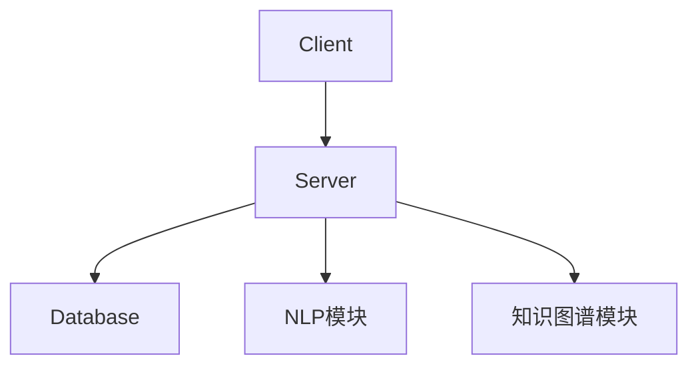

                 


# AI Agent在企业培训与技能评估中的创新应用

> 关键词：AI Agent, 企业培训, 技能评估, 自然语言处理, 知识图谱, 技能评分算法

> 摘要：  
随着人工智能技术的快速发展，AI Agent（智能体）在企业培训与技能评估中的应用日益广泛。本文从AI Agent的基本概念出发，结合企业培训与技能评估的实际需求，详细探讨了AI Agent在其中的应用场景、技术实现和创新价值。通过分析自然语言处理、知识图谱和大模型技术，本文提出了基于AI Agent的智能化培训与评估系统的设计思路，并通过实际案例展示了其在提升企业培训效率和评估准确性方面的显著优势。

---

# 第一部分: AI Agent在企业培训与技能评估中的创新应用概述

# 第1章: AI Agent的基本概念与应用背景

## 1.1 AI Agent的定义与核心特征
### 1.1.1 AI Agent的定义
AI Agent（人工智能智能体）是指能够感知环境、自主决策并执行任务的智能系统。它具备以下核心特征：
- **自主性**：无需外部干预，自主完成任务。
- **反应性**：能够实时感知环境并做出反应。
- **目标导向**：基于目标驱动行为。
- **学习能力**：通过数据和反馈不断优化自身性能。

### 1.1.2 AI Agent与传统培训工具的区别
| 特性               | 传统培训工具                     | AI Agent                     |
|--------------------|----------------------------------|-------------------------------|
| 交互方式           | 单向输出                        | 双向互动                     |
| 决策能力           | 预设规则                        | 自主决策                     |
| 个性化支持         | 有限                            | 强大                          |
| 学习与优化         | 不具备                          | 具备                          |

### 1.1.3 AI Agent在企业中的应用前景
AI Agent可以通过以下方式提升企业培训与技能评估的效率：
- **个性化学习路径**：根据员工特点推荐学习内容。
- **实时反馈与指导**：在培训过程中提供即时反馈。
- **自动化评估**：基于AI算法自动评估员工技能水平。

## 1.2 企业培训与技能评估的现状与挑战
### 1.2.1 传统企业培训模式的局限性
- **成本高**：传统培训需要大量人力资源和时间。
- **个性化不足**：难以满足不同员工的个性化需求。
- **评估滞后**：技能评估结果通常滞后于培训过程。

### 1.2.2 技能评估中的痛点与难点
- **评估标准不统一**：不同岗位的技能评估标准差异大。
- **主观性问题**：传统评估方式存在主观性，难以量化。
- **数据孤岛**：各部门数据分散，难以形成统一的评估体系。

### 1.2.3 企业对智能化培训工具的需求
- **高效性**：快速响应员工需求，提升培训效率。
- **精准性**：基于数据分析提供个性化建议。
- **持续优化**：通过数据反馈不断优化培训内容和方法。

## 1.3 AI Agent在企业培训与技能评估中的应用前景
### 1.3.1 AI Agent在培训中的潜在应用场景
- **个性化学习推荐**：基于员工特点推荐学习内容。
- **实时互动指导**：在培训过程中提供即时反馈和建议。
- **虚拟培训助手**：通过虚拟助手形式与员工互动。

### 1.3.2 AI Agent在技能评估中的创新价值
- **自动化评估**：基于AI算法自动评估员工技能水平。
- **动态评估**：实时跟踪员工技能变化，提供动态评估结果。
- **数据驱动决策**：通过数据分析为培训策略提供支持。

### 1.3.3 企业采用AI Agent的优势与挑战
- **优势**：
  - 提高培训效率和效果。
  - 降低培训成本。
  - 增强员工学习体验。
- **挑战**：
  - 数据隐私和安全问题。
  - 技术实现难度大。
  - 用户接受度问题。

## 1.4 本章小结
本章介绍了AI Agent的基本概念和核心特征，分析了传统企业培训与技能评估的局限性，探讨了AI Agent在其中的应用前景和价值，并总结了企业采用AI Agent的优势与挑战。

---

# 第2章: AI Agent的技术基础与实现原理

## 2.1 自然语言处理技术
### 2.1.1 自然语言处理技术的核心模块
自然语言处理（NLP）是AI Agent实现人机交互的基础技术，主要包含以下模块：
- **文本分词**：将连续的文本分割成词语或短语。
- **句法分析**：分析句子的语法结构。
- **语义理解**：理解文本的语义含义。
- **对话生成**：基于上下文生成自然语言回复。

### 2.1.2 大模型在NLP中的应用
- **大模型的优势**：参数量大，能够捕捉复杂的语言模式。
- **大模型的应用**：广泛应用于对话生成、文本摘要、情感分析等领域。

### 2.1.3 NLP在企业培训中的具体应用
- **个性化推荐**：基于员工的交互历史推荐学习内容。
- **实时问答**：员工在学习过程中可以随时提问，AI Agent提供即时解答。
- **情感分析**：分析员工的学习态度和情绪，提供针对性的指导。

### 2.1.4 本节小结
本节介绍了自然语言处理技术的核心模块和大模型的应用，重点阐述了NLP在企业培训中的具体应用场景。

---

## 2.2 知识图谱构建与管理
### 2.2.1 知识图谱的定义与构建方法
- **知识图谱的定义**：一种结构化的知识表示形式，由节点（实体）和边（关系）组成。
- **知识图谱的构建方法**：
  1. 数据收集：从企业内部文档、外部知识库等来源收集数据。
  2. 数据清洗：去除噪声数据，确保数据质量。
  3. 实体识别与链接：识别文本中的实体并建立关联。
  4. 关系抽取：从文本中抽取实体之间的关系。
  5. 知识图谱存储：将构建的知识图谱存储在数据库中。

### 2.2.2 知识图谱在技能评估中的应用
- **技能关联分析**：通过知识图谱分析不同技能之间的关联关系。
- **技能推荐**：基于知识图谱推荐相关技能的学习内容。
- **技能评估优化**：利用知识图谱优化技能评估的准确性。

### 2.2.3 知识图谱的动态更新与维护
- **动态更新**：随着企业需求的变化，实时更新知识图谱。
- **维护策略**：制定合理的维护策略，确保知识图谱的准确性和时效性。

### 2.2.4 本节小结
本节详细介绍了知识图谱的定义、构建方法及其在技能评估中的应用，探讨了知识图谱的动态更新与维护策略。

---

## 2.3 本章小结
本章重点介绍了AI Agent在企业培训与技能评估中的技术基础，包括自然语言处理技术和知识图谱构建与管理。通过结合NLP和知识图谱，AI Agent能够实现高效的培训内容推荐和精准的技能评估。

---

# 第3章: AI Agent的算法原理与数学模型

## 3.1 基于大模型的对话生成算法
### 3.1.1 大模型的编码与解码机制
- **编码器**：将输入的文本转换为向量表示。
- **解码器**：基于编码器的输出生成目标文本。

### 3.1.2 对话生成的损失函数
- **交叉熵损失函数**：用于衡量生成文本与真实文本之间的差异。
  $$ \text{损失函数} = -\sum_{i=1}^{n} \text{log}p(y_i|x) $$

### 3.1.3 基于Transformer的对话模型
- **Transformer架构**：由编码器和解码器组成，广泛应用于对话生成任务。
  ```mermaid
  graph TD
      Encoder --> Decoder
      Encoder --> Attention
      Decoder --> Attention
  ```

---

## 3.2 技能评估的评分算法
### 3.2.1 基于规则的评分系统
- **规则定义**：根据预设的规则对技能进行评分。
  - 例如，基于关键词匹配评估员工的回答质量。

### 3.2.2 基于深度学习的评分模型
- **模型选择**：使用预训练的大模型进行评分。
  $$ \text{评分} = f(x) $$

### 3.2.3 混合型评分算法的设计与实现
- **混合型算法**：结合规则和深度学习模型的评分结果，通过加权的方式得到最终评分。
  $$ \text{最终评分} = \alpha \times \text{规则评分} + (1-\alpha) \times \text{模型评分} $$

---

## 3.3 知识图谱的匹配与推理算法
### 3.3.1 知识图谱的匹配算法
- **基于嵌入的匹配**：通过计算实体嵌入的相似度进行匹配。
  $$ \text{相似度} = \text{cos}(\text{向量}_1, \text{向量}_2) $$

### 3.3.2 基于图的推理算法
- **路径推理**：通过图中的路径进行推理，判断实体之间的关系。
  ```mermaid
  graph TD
      A --> B
      B --> C
      A --> C
  ```

### 3.3.3 知识图谱推理的优化方法
- **优化策略**：通过剪枝等方法优化推理过程，提高推理效率。

---

## 3.4 本章小结
本章详细介绍了AI Agent在企业培训与技能评估中的算法原理，包括基于大模型的对话生成算法、技能评估的评分算法以及知识图谱的匹配与推理算法。这些算法为AI Agent的实现提供了理论基础。

---

# 第4章: AI Agent的系统架构与设计

## 4.1 系统功能
### 4.1.1 系统概述
- **系统目标**：实现基于AI Agent的企业培训与技能评估。
- **系统功能模块**：
  - **用户交互界面**：员工与AI Agent交互的界面。
  - **培训内容管理**：管理企业培训内容。
  - **技能评估模块**：评估员工技能水平。

### 4.1.2 系统功能流程
- **培训推荐流程**：
  1. 用户登录系统。
  2. 系统根据用户特点推荐学习内容。
  3. 用户选择学习内容并开始学习。
  4. 学习完成后，系统提供反馈和建议。
- **技能评估流程**：
  1. 用户提交评估申请。
  2. 系统基于知识图谱和算法进行评估。
  3. 输出评估结果并提供改进建议。

---

## 4.2 系统架构设计
### 4.2.1 系统架构图


### 4.2.2 系统组件说明
- **客户端**：用户与系统交互的界面。
- **服务器端**：负责处理用户的请求并返回结果。
- **数据库**：存储企业培训内容和员工数据。
- **NLP模块**：实现自然语言处理功能。
- **知识图谱模块**：管理和应用知识图谱。

---

## 4.3 系统实现细节
### 4.3.1 系统接口设计
- **API接口**：定义了系统对外提供的接口，如注册、登录、学习推荐等。

### 4.3.2 系统交互流程
- **登录流程**：
  1. 用户输入用户名和密码。
  2. 系统验证用户身份。
  3. 登录成功后进入主界面。
- **学习推荐流程**：
  1. 系统分析用户特点。
  2. 推荐学习内容。
  3. 用户选择学习内容并开始学习。

---

## 4.4 本章小结
本章详细介绍了AI Agent在企业培训与技能评估中的系统架构与设计，包括系统功能、架构图和实现细节。通过合理的系统设计，可以实现高效的培训推荐和精准的技能评估。

---

# 第5章: 项目实战——基于AI Agent的企业培训系统开发

## 5.1 项目概述
### 5.1.1 项目目标
- 开发一个基于AI Agent的企业培训系统。
- 实现个性化学习推荐和自动化技能评估。

### 5.1.2 项目技术选型
- **前端**：React框架。
- **后端**：Python + Flask框架。
- **NLP模型**：预训练的大模型（如GPT-3）。
- **知识图谱**：使用知识图谱构建工具（如Neo4j）。

---

## 5.2 环境安装与配置
### 5.2.1 安装Python
- 使用Anaconda安装Python 3.8及以上版本。
### 5.2.2 安装Flask框架
- 使用pip安装Flask：
  ```bash
  pip install flask
  ```

### 5.2.3 安装NLP库
- 使用pip安装transformers库：
  ```bash
  pip install transformers
  ```

---

## 5.3 系统核心实现
### 5.3.1 培训推荐模块实现
- **代码实现**：
  ```python
  from transformers import AutoTokenizer, AutoModelForCausalLM
  model_name = "gpt2"
  tokenizer = AutoTokenizer.from_pretrained(model_name)
  model = AutoModelForCausalLM.from_pretrained(model_name)
  def generate_response(prompt):
      inputs = tokenizer.encode(prompt, return_tensors="pt")
      outputs = model.generate(inputs, max_length=50)
      response = tokenizer.decode(outputs[0], skip_special_tokens=True)
      return response
  ```

### 5.3.2 技能评估模块实现
- **代码实现**：
  ```python
  import numpy as np
  def calculate_similarity(embedding1, embedding2):
      return np.dot(embedding1, embedding2) / (np.linalg.norm(embedding1) * np.linalg.norm(embedding2))
  ```

---

## 5.4 项目部署与测试
### 5.4.1 系统部署
- 使用Docker容器化部署。
### 5.4.2 系统测试
- **功能测试**：测试个性化推荐和技能评估功能。
- **性能测试**：测试系统的响应时间和处理能力。

---

## 5.5 项目小结
本章通过一个实际项目展示了基于AI Agent的企业培训系统的开发过程，包括环境安装、代码实现和系统测试。通过本章的学习，读者可以掌握基于AI Agent的企业培训系统的开发方法。

---

# 第6章: 最佳实践与总结

## 6.1 最佳实践
### 6.1.1 数据质量管理
- 确保数据的准确性和完整性。
### 6.1.2 系统安全性
- 加强数据隐私保护，防止数据泄露。
### 6.1.3 用户体验优化
- 提供友好的用户界面和交互体验。

## 6.2 小结
本文从AI Agent的基本概念出发，结合企业培训与技能评估的实际需求，详细探讨了AI Agent在其中的应用场景、技术实现和创新价值。通过分析自然语言处理、知识图谱和大模型技术，本文提出了基于AI Agent的智能化培训与评估系统的设计思路，并通过实际案例展示了其在提升企业培训效率和评估准确性方面的显著优势。

## 6.3 注意事项
- **数据隐私**：在实际应用中，需严格遵守数据隐私相关法律法规。
- **模型优化**：根据实际需求不断优化模型性能。
- **用户体验**：注重用户体验设计，提升用户满意度。

## 6.4 拓展阅读
- 推荐阅读相关领域的最新研究论文和技术博客，以获取更多关于AI Agent的创新应用的灵感。

---

# 附录: 参考文献与工具清单
1. **自然语言处理工具**：
   - TensorFlow
   - PyTorch
   - Transformers
2. **知识图谱构建工具**：
   - Neo4j
   - GraphDB
3. **大模型框架**：
   - OpenAI API
   - Hugging Face

---

# 结语
AI Agent在企业培训与技能评估中的创新应用前景广阔，随着技术的不断进步，AI Agent将为企业培训和技能评估带来更多的可能性。通过本文的学习，读者可以深入了解AI Agent在其中的应用，并为实际应用提供参考和启发。

