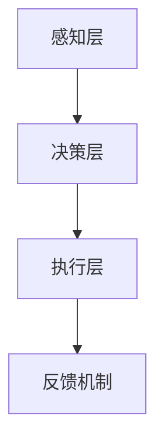
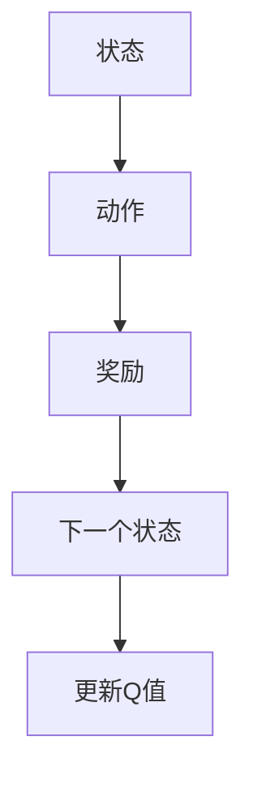
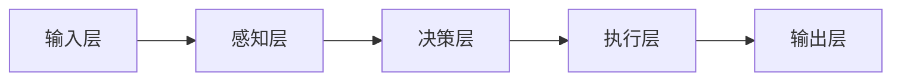
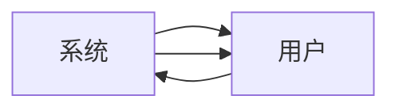

                 


# AI Agent在企业培训与技能评估中的应用

> 关键词：AI Agent, 企业培训, 技能评估, 强化学习, 系统架构

> 摘要：本文探讨了AI Agent在企业培训与技能评估中的应用，分析了其核心概念、算法原理、系统架构，并通过实际案例展示了其在提升企业培训效果和评估效率中的巨大潜力。

---

## 第二章: AI Agent的核心概念与原理

### 2.1 AI Agent的核心概念

#### 2.1.1 感知层：信息的获取与处理
AI Agent的感知层负责从环境中获取信息，通常包括以下步骤：
1. 数据采集：通过传感器、数据库或API接口获取数据。
2. 数据预处理：对采集的数据进行清洗、转换和特征提取。
3. 数据分析：使用机器学习模型对数据进行分析，提取有价值的信息。

#### 2.1.2 决策层：策略的选择与优化
决策层是AI Agent的核心，负责根据感知到的信息制定行动策略。常用的决策算法包括：
- **强化学习（Reinforcement Learning）**：通过试错机制优化策略，常用于动态环境。
- **监督学习（Supervised Learning）**：基于已有数据进行分类或回归预测。
- **混合学习（Hybrid Learning）**：结合强化学习和监督学习的优势。

#### 2.1.3 执行层：行动的实施与反馈
执行层负责将决策层制定的策略转化为具体行动，并通过反馈机制不断优化行动效果。反馈机制通常包括以下步骤：
1. 行动执行：根据决策结果执行具体操作。
2. 反馈收集：收集环境对行动的反馈，如用户评分、系统日志等。
3. 性能评估：根据反馈评估行动效果，并更新策略。

### 2.2 AI Agent的原理与流程

#### 2.2.1 感知层的实现方式
感知层的主要实现方式包括：
1. 数据采集：通过API接口获取实时数据，例如从企业培训系统中获取员工的学习记录和评估结果。
2. 数据预处理：使用数据清洗和特征工程技术，确保数据质量和一致性。
3. 数据分析：利用机器学习模型（如随机森林、神经网络）对数据进行分析，提取关键特征。

#### 2.2.2 决策层的算法选择
决策层的算法选择取决于具体应用场景。例如：
- 在技能评估中，强化学习适用于动态评估环境，能够根据员工表现实时调整评估策略。
- 在培训推荐中，监督学习适用于基于历史数据预测员工的学习需求。

#### 2.2.3 执行层的反馈机制
反馈机制是AI Agent优化行动的关键。例如：
1. 在技能评估中，AI Agent根据员工的表现调整评估难度，确保评估既不过于简单也不过于困难。
2. 在培训推荐中，AI Agent根据员工的学习效果调整推荐内容，确保推荐内容的个性化和高效性。

### 2.3 AI Agent的核心算法

#### 2.3.1 强化学习算法
强化学习是一种通过试错机制优化策略的算法，适用于动态环境。例如，Q-learning算法是一种经典的强化学习算法，其数学模型如下：

$$ Q(s, a) = Q(s, a) + \alpha [r + \max_{a'} Q(s', a') - Q(s, a)] $$

其中：
- \( Q(s, a) \) 表示状态 \( s \) 下采取动作 \( a \) 的价值。
- \( \alpha \) 表示学习率。
- \( r \) 表示奖励。
- \( \max_{a'} Q(s', a') \) 表示下一状态 \( s' \) 下的最大价值动作。

#### 2.3.2 监督学习算法
监督学习是一种基于历史数据预测的算法，适用于静态环境。例如，线性回归算法的数学模型如下：

$$ y = \beta_0 + \beta_1 x + \epsilon $$

其中：
- \( y \) 表示目标变量。
- \( x \) 表示自变量。
- \( \beta_0 \) 和 \( \beta_1 \) 表示回归系数。
- \( \epsilon \) 表示误差项。

#### 2.3.3 混合学习算法
混合学习算法结合了强化学习和监督学习的优点，适用于复杂环境。例如，可以先使用监督学习进行初步预测，再使用强化学习进行策略优化。

### 2.4 本章小结
本章详细介绍了AI Agent的核心概念，包括感知层、决策层和执行层的作用和实现方式。同时，分析了强化学习、监督学习和混合学习算法的特点和应用场景，为后续章节的系统设计和应用实现奠定了基础。

---

### 图表展示

#### 图2.1: AI Agent的核心概念对比表
| **核心概念** | **特点** | **应用场景** |
|--------------|----------|--------------|
| 感知层       | 数据采集与处理 | 培训数据预处理 |
| 决策层       | 策略选择与优化 | 技能评估优化 |
| 执行层       | 行动实施与反馈 | 培训效果反馈 |

#### 图2.2: AI Agent的决策流程mermaid图


#### 图2.3: Q-learning算法流程图


#### 图2.4: AI Agent系统架构图


#### 图2.5: 系统交互流程图


---

### 代码实现

#### 2.1 基于强化学习的评估系统代码
```python
import numpy as np

class AI-Agent:
    def __init__(self, state_space, action_space):
        self.state_space = state_space
        self.action_space = action_space
        self.Q = np.zeros((state_space, action_space))

    def perceive(self, state):
        # 返回当前状态下的最佳动作
        return np.argmax(self.Q[state, :])

    def learn(self, state, action, reward, next_state):
        # 更新Q值
        self.Q[state, action] += 0.1 * (reward + np.max(self.Q[next_state, :]) - self.Q[state, action])

# 示例使用
agent = AI-Agent(5, 3)
state = 0
action = agent.perceive(state)
next_state = ...  # 根据环境反馈
reward = ...      # 根据环境反馈
agent.learn(state, action, reward, next_state)
```

#### 2.2 基于监督学习的培训推荐系统代码
```python
from sklearn.linear_model import LinearRegression

class Training_Recommender:
    def __init__(self):
        self.model = LinearRegression()

    def train(self, X, y):
        # 训练模型
        self.model.fit(X, y)

    def predict(self, X_new):
        # 预测
        return self.model.predict(X_new)

# 示例使用
recommender = Training_Recommender()
X = ...  # 特征矩阵
y = ...  # 目标向量
recommender.train(X, y)
X_new = ...  # 新的特征矩阵
predictions = recommender.predict(X_new)
```

---

### 图表解析

#### 图2.1: AI Agent的核心概念对比表
- **感知层**：负责从环境中获取信息，包括数据采集、预处理和分析。
- **决策层**：负责根据感知到的信息制定行动策略，包括策略选择和优化。
- **执行层**：负责将决策层制定的策略转化为具体行动，并通过反馈机制不断优化行动效果。

#### 图2.2: AI Agent的决策流程图
- **流程说明**：感知层获取信息后传递给决策层，决策层制定策略后传递给执行层，执行层根据策略执行行动，并将反馈传递给决策层进行优化。

#### 图2.3: Q-learning算法流程图
- **流程说明**：系统根据当前状态选择一个动作，执行动作后获得奖励和下一个状态，根据这些信息更新Q值，优化策略。

#### 图2.4: AI Agent系统架构图
- **架构说明**：输入层接收数据，传递给感知层进行处理，决策层根据处理结果制定策略，执行层根据策略执行行动，输出层展示结果。

#### 图2.5: 系统交互流程图
- **流程说明**：系统与用户交互，用户根据系统反馈进行操作，系统根据用户操作进行响应。

---

### 代码实现解析

#### 2.1 基于强化学习的评估系统代码
- **代码说明**：定义了一个AI Agent类，初始化Q值矩阵，实现感知和学习方法。通过与环境交互，更新Q值，优化评估策略。
- **应用场景**：适用于动态环境，如实时技能评估，能够根据员工表现实时调整评估策略。

#### 2.2 基于监督学习的培训推荐系统代码
- **代码说明**：定义了一个训练推荐器类，训练监督学习模型，根据历史数据预测员工的学习需求。
- **应用场景**：适用于静态环境，如基于历史数据推荐培训课程，能够根据员工的历史表现推荐个性化课程。

---

## 小结
通过本章的学习，我们了解了AI Agent的核心概念，包括感知层、决策层和执行层的作用和实现方式。同时，分析了强化学习、监督学习和混合学习算法的特点和应用场景，为后续章节的系统设计和应用实现奠定了基础。

