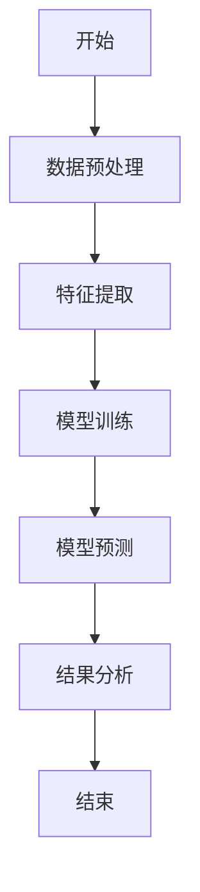
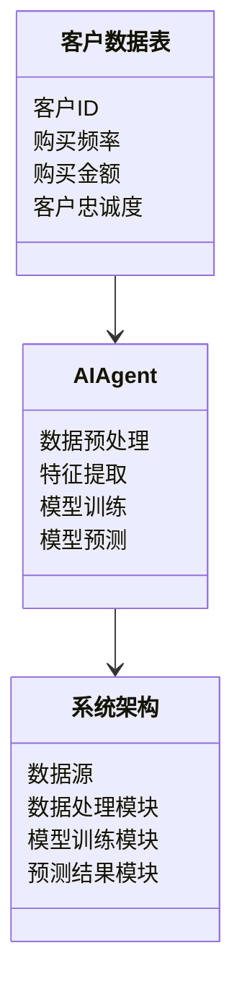
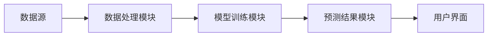
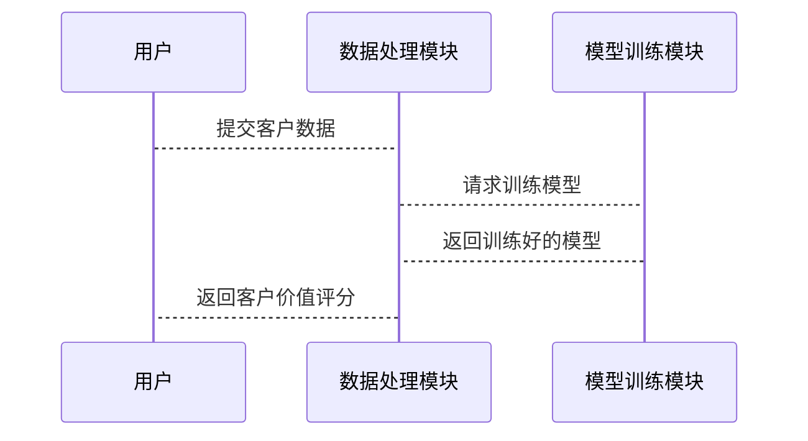

                 


# AI Agent在企业客户价值分析与精准营销中的应用

## 关键词：AI Agent、客户价值分析、精准营销、机器学习、数据分析、自然语言处理、市场营销

## 摘要：  
随着人工智能技术的快速发展，AI Agent（智能代理）在企业客户价值分析与精准营销中的应用越来越广泛。本文将深入探讨AI Agent的核心概念、算法原理、系统架构设计以及在实际项目中的应用案例。通过结合机器学习、自然语言处理和数据分析等技术，AI Agent能够帮助企业高效地进行客户价值分析，并制定精准的营销策略，从而提升客户满意度和企业收益。本文将从背景、原理、实现到应用，全面解析AI Agent在企业客户价值分析与精准营销中的应用价值。

---

# 第1章: AI Agent与企业客户价值分析概述

## 1.1 AI Agent的基本概念
### 1.1.1 什么是AI Agent
AI Agent（人工智能代理）是指能够感知环境、自主决策并执行任务的智能系统。它能够通过数据输入、模型分析和决策执行来实现特定的目标。

### 1.1.2 AI Agent的核心特点
- **自主性**：AI Agent能够自主执行任务，无需人工干预。
- **反应性**：能够实时感知环境变化并做出响应。
- **学习能力**：通过机器学习算法不断优化自身的决策能力。
- **可扩展性**：能够处理不同类型和规模的数据。

### 1.1.3 AI Agent与传统营销工具的区别
AI Agent通过智能化的分析和决策，能够实现个性化、动态化的客户价值分析和营销策略制定，而传统营销工具通常依赖人工分析和固定策略。

---

## 1.2 企业客户价值分析的背景与挑战
### 1.2.1 客户价值分析的重要性
客户价值分析是企业制定营销策略的核心基础，它能够帮助企业识别高价值客户、优化资源配置并提升客户满意度。

### 1.2.2 传统客户价值分析的局限性
- 数据分析效率低，难以应对海量数据。
- 客户行为预测准确性不足，难以实现精准营销。
- 人工成本高，难以实时响应客户需求。

### 1.2.3 AI Agent在客户价值分析中的优势
- **高效性**：通过自动化数据分析和模型预测，显著提高分析效率。
- **准确性**：利用机器学习算法，提高客户行为预测的准确性。
- **实时性**：能够实时感知客户需求并快速做出响应。

---

## 1.3 精准营销的核心理念
### 1.3.1 精准营销的定义
精准营销是指基于客户特征和行为数据，制定个性化的营销策略，以实现更高的客户转化率和满意度。

### 1.3.2 精准营销与传统营销的区别
- **个性化**：精准营销注重客户的个性化需求，而传统营销往往采用通用策略。
- **数据驱动**：精准营销依赖数据分析和模型预测，而传统营销更多依赖经验和直觉。
- **动态调整**：精准营销能够实时调整策略，而传统营销策略相对固定。

### 1.3.3 AI Agent在精准营销中的作用
AI Agent通过实时分析客户数据、预测客户行为并优化营销策略，帮助企业实现精准营销。

---

## 1.4 本章小结
本章介绍了AI Agent的基本概念、核心特点以及在企业客户价值分析和精准营销中的优势。通过对比传统营销工具和AI Agent，明确了AI Agent在现代营销中的重要地位。

---

# 第2章: AI Agent的核心概念与原理

## 2.1 AI Agent的核心概念
### 2.1.1 AI Agent的基本构成
- **感知层**：通过数据采集和处理获取环境信息。
- **决策层**：利用机器学习算法进行分析和预测。
- **执行层**：根据决策结果执行具体任务。

### 2.1.2 AI Agent的分类
- **基于规则的AI Agent**：通过预定义的规则进行决策。
- **基于学习的AI Agent**：通过机器学习算法不断优化决策模型。
- **混合型AI Agent**：结合规则和学习的双重优势。

### 2.1.3 AI Agent的工作原理
AI Agent通过数据输入、模型分析和决策执行三个步骤，实现从数据到行动的闭环流程。

---

## 2.2 AI Agent与客户价值分析的联系
### 2.2.1 AI Agent如何提升客户价值分析的效率
- **自动化数据处理**：通过AI Agent自动采集和处理客户数据，提高分析效率。
- **实时预测**：利用机器学习模型实时预测客户价值，优化资源分配。

### 2.2.2 AI Agent如何实现客户行为预测
- **特征提取**：通过自然语言处理技术提取客户行为特征。
- **模型训练**：利用机器学习算法训练客户行为预测模型。
- **结果分析**：根据预测结果制定精准的营销策略。

### 2.2.3 AI Agent如何优化客户分层
- **客户分层模型**：通过聚类分析将客户分为不同层次，制定差异化的营销策略。
- **动态调整**：根据实时数据不断优化客户分层模型。

---

## 2.3 AI Agent的核心算法与技术
### 2.3.1 机器学习算法在AI Agent中的应用
- **监督学习**：用于客户价值评分和行为预测。
- **无监督学习**：用于客户分层和聚类分析。

### 2.3.2 自然语言处理技术在AI Agent中的应用
- **文本挖掘**：从客户反馈中提取情感倾向和关键词。
- **意图识别**：通过自然语言处理技术识别客户的购买意图。

### 2.3.3 数据挖掘技术在AI Agent中的应用
- **数据清洗**：去除噪声数据，提高模型准确性。
- **特征工程**：提取关键特征，优化模型性能。

---

## 2.4 本章小结
本章详细介绍了AI Agent的核心概念、工作原理以及在客户价值分析中的应用。通过机器学习、自然语言处理和数据挖掘技术，AI Agent能够显著提升客户价值分析的效率和准确性。

---

# 第3章: AI Agent的算法原理与数学模型

## 3.1 算法原理
### 3.1.1 机器学习算法的原理
机器学习算法通过训练数据建立模型，并利用模型对新数据进行预测。常用的算法包括线性回归、逻辑回归和随机森林等。

### 3.1.2 自然语言处理算法的原理
自然语言处理算法通过文本预处理、特征提取和模型训练，实现对客户反馈的语义理解和意图识别。

### 3.1.3 数据挖掘算法的原理
数据挖掘算法通过数据清洗、特征工程和模型训练，发现数据中的潜在规律和模式。

---

## 3.2 数学模型与公式
### 3.2.1 客户价值评分模型
$$ CV = a \times RF + b \times FM + c \times CL $$
其中，$RF$ 表示客户购买频率，$FM$ 表示客户购买金额，$CL$ 表示客户忠诚度，$a$、$b$、$c$ 为权重系数。

### 3.2.2 客户分层模型
$$ P(Y=y|x) = \frac{P(Y=y) \times P(x|Y=y)}{P(x)} $$
其中，$Y$ 表示客户分层，$x$ 表示客户特征。

---

## 3.3 算法流程图


---

## 3.4 本章小结
本章通过数学公式和流程图详细讲解了AI Agent的核心算法原理，包括机器学习、自然语言处理和数据挖掘技术的应用。

---

# 第4章: AI Agent的系统分析与架构设计

## 4.1 问题场景介绍
本章将从一个实际的客户价值分析项目出发，介绍AI Agent在系统设计中的应用。

## 4.2 系统功能设计
### 4.2.1 领域模型


### 4.2.2 系统架构设计


### 4.2.3 接口设计
- **数据输入接口**：接收客户数据并进行预处理。
- **模型训练接口**：训练客户价值分析模型。
- **预测结果接口**：输出客户价值评分和营销策略建议。

### 4.2.4 交互序列图


---

## 4.3 本章小结
本章通过系统架构设计和交互序列图，详细介绍了AI Agent在客户价值分析系统中的应用。

---

# 第5章: AI Agent的项目实战

## 5.1 环境安装
- **Python**：安装Python 3.x及以上版本。
- **机器学习库**：安装Scikit-learn、XGBoost等。
- **自然语言处理库**：安装NLTK、spaCy等。
- **数据处理工具**：安装Pandas、NumPy等。

## 5.2 核心代码实现
### 5.2.1 数据预处理
```python
import pandas as pd
import numpy as np

# 读取数据
data = pd.read_csv('customer_data.csv')

# 删除缺失值
data = data.dropna()

# 标准化处理
from sklearn.preprocessing import StandardScaler
scaler = StandardScaler()
data_normalized = scaler.fit_transform(data)
```

### 5.2.2 特征提取
```python
from sklearn.feature_selection import SelectKBest
selector = SelectKBest(k=10)
selected_features = selector.fit_transform(data_normalized, target)
```

### 5.2.3 模型训练
```python
from sklearn.ensemble import RandomForestClassifier
model = RandomForestClassifier(n_estimators=100, max_depth=5)
model.fit(selected_features, target)
```

### 5.2.4 模型预测
```python
from sklearn.metrics import accuracy_score
预测结果 = model.predict(selected_features_test)
print(accuracy_score(目标值_test, 预测结果))
```

---

## 5.3 实际案例分析
以某电商平台的客户数据为例，通过AI Agent进行客户价值分析，预测客户购买行为，并制定精准的营销策略。

---

## 5.4 本章小结
本章通过实际项目案例，详细讲解了AI Agent在客户价值分析中的具体应用，包括环境安装、代码实现和案例分析。

---

# 第6章: AI Agent的最佳实践与未来趋势

## 6.1 小结
AI Agent在客户价值分析与精准营销中的应用前景广阔，通过机器学习、自然语言处理和数据挖掘技术，能够显著提升企业的营销效率和客户满意度。

## 6.2 注意事项
- 数据隐私保护：在处理客户数据时，必须遵守相关法律法规，保护客户隐私。
- 模型优化：定期更新模型，确保预测结果的准确性。
- 人机结合：AI Agent的应用需要与人工决策相结合，避免过度依赖算法。

## 6.3 未来趋势
- **AI Agent的智能化**：通过深度学习和强化学习，进一步提升AI Agent的智能化水平。
- **多模态数据处理**：结合文本、图像和语音等多种数据源，实现更全面的客户分析。
- **实时响应**：通过边缘计算和实时数据处理，实现客户行为的实时响应。

## 6.4 拓展阅读
- 《机器学习实战》
- 《自然语言处理入门》
- 《数据挖掘导论》

---

## 6.5 本章小结
本章总结了AI Agent在客户价值分析与精准营销中的应用经验，并展望了未来的发展趋势。

---

# 附录

## 附录A: 术语表
- **AI Agent**：人工智能代理。
- **客户价值分析**：通过对客户数据的分析，评估客户的经济价值和潜力。
- **精准营销**：基于客户特征和行为数据，制定个性化的营销策略。

## 附录B: 参考文献
1. 周志华. 《机器学习实战》. 清华大学出版社, 2016.
2. Jacob Eisenstein. 《自然语言处理入门》. MIT Press, 2020.
3. Thomas H. Davenport, Jean-Luc Legrand. 《数据挖掘导论》. 清华大学出版社, 2003.

---

# 结语

通过本文的详细讲解，读者可以全面了解AI Agent在企业客户价值分析与精准营销中的应用。从算法原理到系统设计，再到实际案例，本文为读者提供了丰富的理论和实践指导。未来，随着人工智能技术的不断进步，AI Agent将在更多领域发挥重要作用，为企业创造更大的价值。

