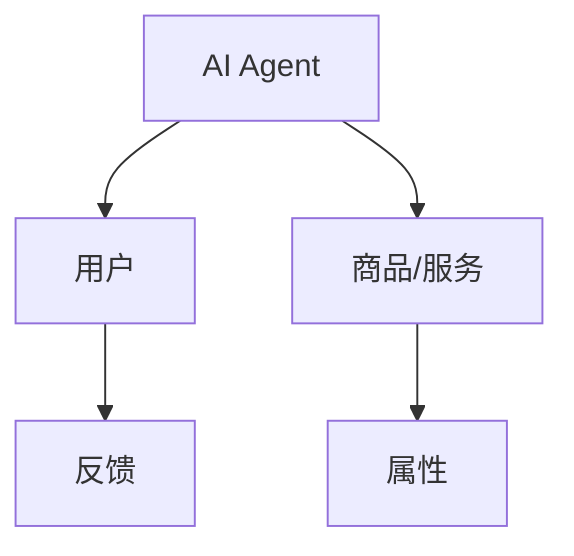
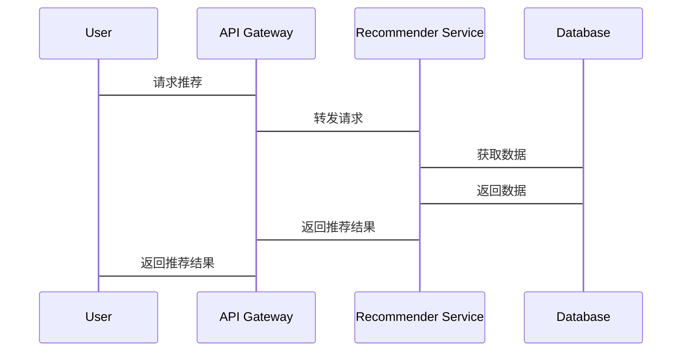

                 


好的，我将按照您的要求逐步展开思考和撰写。

# AI Agent在企业客户体验个性化推荐中的角色

## 关键词：
AI Agent、个性化推荐、客户体验、企业推荐系统、深度学习、机器学习、协同过滤

## 摘要：
AI Agent在企业客户体验中的个性化推荐扮演着越来越重要的角色。随着企业对客户体验要求的不断提高，传统的推荐系统已难以满足精准化、个性化的需求。本文将从AI Agent的核心概念、算法原理、系统架构设计、项目实战等多维度深入探讨其在企业客户体验个性化推荐中的角色与应用。通过分析AI Agent如何通过感知、决策和执行层实现精准推荐，结合协同过滤、深度学习等算法，构建高效的推荐系统，最终为企业提供更加智能化的客户体验解决方案。

## 第一部分: AI Agent在企业客户体验中的背景与概念

## 第1章: AI Agent的基本概念与背景

### 1.1 问题背景与描述
#### 1.1.1 传统客户体验管理的局限性
企业传统的客户体验管理主要依赖于人工推荐或基于规则的推荐系统，存在以下问题：
- 推荐结果缺乏个性化，难以满足不同客户的差异化需求。
- 数据分析能力有限，难以从海量数据中提取有价值的信息。
- 推荐效率低下，难以实时响应客户需求。

#### 1.1.2 个性化推荐的需求与挑战
随着市场竞争的加剧，客户对个性化体验的需求日益增长。企业需要通过个性化推荐：
- 提高客户满意度和忠诚度。
- 增加客户转化率和复购率。
- 提升品牌价值和市场竞争力。

#### 1.1.3 AI Agent在客户体验中的角色定位
AI Agent作为一种智能体，能够通过数据采集、分析、决策和执行，实现精准的个性化推荐，成为企业客户体验管理的重要工具。

### 1.2 AI Agent的定义与特点
#### 1.2.1 AI Agent的定义
AI Agent（人工智能代理）是一种智能系统，能够感知环境、理解用户需求，并通过决策和执行来实现预定目标。

#### 1.2.2 AI Agent的核心特点
- **智能化**：能够通过机器学习和深度学习技术，从数据中自动学习和优化。
- **实时性**：能够实时响应客户需求，提供即时推荐。
- **个性化**：根据客户的个性化需求，提供定制化推荐。
- **可扩展性**：能够处理海量数据，适用于不同规模的企业。

#### 1.2.3 AI Agent与传统推荐系统的区别
| 特性                | AI Agent推荐系统                | 传统推荐系统                |
|---------------------|-------------------------------|---------------------------|
| 数据处理能力        | 高效处理海量数据               | 处理能力有限               |
| 个性化程度          | 高度个性化                     | 个性化程度较低             |
| 智能化水平          | 高度智能化                     | 智能化水平较低             |
| 实时性               | 实时响应                      | 响应速度较慢               |

### 1.3 技术优势与应用价值
#### 1.3.1 AI Agent的技术优势
- **高效的数据处理能力**：通过分布式计算和并行处理，快速分析海量数据。
- **精准的个性化推荐**：利用机器学习和深度学习技术，实现精准的推荐。
- **自适应能力**：能够根据客户行为和反馈动态调整推荐策略。

#### 1.3.2 在企业客户体验中的应用价值
- **提升客户满意度**：通过个性化推荐，提高客户对推荐结果的满意度。
- **增加客户粘性**：通过持续优化推荐策略，增强客户对品牌的忠诚度。
- **提升运营效率**：通过自动化推荐系统，降低人工成本，提高运营效率。

#### 1.3.3 AI Agent的边界与外延
AI Agent的应用范围不仅限于推荐系统，还可以扩展到客户行为分析、需求预测、市场趋势分析等领域。

## 第2章: 核心概念与联系

### 2.1 AI Agent的核心原理
#### 2.1.1 感知层：数据采集与分析
AI Agent通过收集客户的交互数据、行为数据、偏好数据等，构建客户画像。

#### 2.1.2 决策层：推荐算法与策略
基于感知层获取的数据，AI Agent通过协同过滤、深度学习等算法生成推荐结果。

#### 2.1.3 执行层：个性化推荐的实现
根据决策层生成的推荐结果，AI Agent通过API或用户界面将推荐结果反馈给客户。

### 2.2 个性化推荐机制
#### 2.2.1 协同过滤推荐
协同过滤是一种基于用户相似性或物品相似性的推荐方法，分为基于用户的协同过滤和基于物品的协同过滤。

#### 2.2.2 基于内容的推荐
基于内容的推荐是通过分析物品的属性特征，找到与用户兴趣相匹配的物品进行推荐。

#### 2.2.3 混合推荐模型
混合推荐模型是将协同过滤和基于内容的推荐方法结合，利用两种方法的优势，提高推荐的准确性和多样性。

### 2.3 AI Agent与推荐系统的实体关系图


---

## 第3章: 算法原理

### 3.1 协同过滤算法
#### 3.1.1 协同过滤的原理
协同过滤是基于用户与用户之间的相似性或物品与物品之间的相似性，推荐用户可能感兴趣的内容。

#### 3.1.2 协同过滤的实现步骤
1. **数据预处理**：收集用户行为数据，构建用户-物品评分矩阵。
2. **计算相似度**：通过余弦相似度或皮尔逊相关系数计算用户或物品的相似度。
3. **生成推荐列表**：根据相似度排序，生成推荐列表。

#### 3.1.3 协同过滤的代码实现
```python
import numpy as np

def collaborative_filtering(user_id, user_similarity):
    # 假设 user_similarity 是一个相似度矩阵
    # 找出与目标用户相似度最高的前k个用户
    top_k_users = np.argsort(user_similarity[user_id])[::-1][:5]
    # 根据这些用户的评分计算目标用户的推荐分数
   推荐分数 = np.mean(user_similarity[user_id][top_k_users], axis=0)
    return 推荐分数
```

#### 3.1.4 协同过滤的优缺点
- **优点**：简单易懂，计算效率较高。
- **缺点**：存在数据稀疏性问题，推荐结果可能不够精准。

### 3.2 基于深度学习的推荐算法
#### 3.2.1 神经网络协同过滤
神经网络协同过滤是一种基于深度学习的推荐方法，通过神经网络模型学习用户和物品的嵌入表示。

#### 3.2.2 深度学习推荐系统的实现步骤
1. **数据预处理**：将用户和物品的特征向量嵌入到低维空间。
2. **构建模型**：设计神经网络结构，训练模型。
3. **生成推荐**：根据训练好的模型生成推荐结果。

#### 3.2.3 深度学习推荐系统的代码实现
```python
import tensorflow as tf

# 定义神经网络协同过滤模型
class NeuralCollaborativeFiltering(tf.keras.Model):
    def __init__(self, user Embedding, item Embedding):
        super(NeuralCollaborativeFiltering, self).__init__()
        self.user_embedding = tf.keras.layers.Embedding(user Embedding, 64)
        self.item_embedding = tf.keras.layers.Embedding(item Embedding, 64)
        self.dense = tf.keras.layers.Dense(64, activation='relu')
        self.output = tf.keras.layers.Dense(1)

    def call(self, inputs):
        user_id, item_id = inputs
        user Embedding = self.user_embedding(user_id)
        item Embedding = self.item_embedding(item_id)
        concatenated = tf.keras.layers.concatenate([user Embedding, item Embedding])
        hidden = self.dense(concatenated)
        output = self.output(hidden)
        return output

# 编译模型
model = NeuralCollaborativeFiltering(user Embedding, item Embedding)
model.compile(optimizer='adam', loss='mse', metrics=['mae'])
```

#### 3.2.4 深度学习推荐系统的优缺点
- **优点**：能够捕捉到数据中的非线性关系，推荐结果更加精准。
- **缺点**：计算复杂度较高，需要大量的计算资源。

### 3.3 推荐系统的数学模型
#### 3.3.1 协同过滤的数学模型
协同过滤可以通过矩阵分解的方法进行建模，常用的矩阵分解方法有SVD（奇异值分解）和NMF（非负矩阵分解）。

#### 3.3.2 矩阵分解模型
矩阵分解模型通过将用户-物品评分矩阵分解为用户特征矩阵和物品特征矩阵，生成推荐结果。

#### 3.3.3 矩阵分解的数学公式
$$ A = U \times S \times V^T $$
其中，A是用户-物品评分矩阵，U是用户特征矩阵，S是奇异值矩阵，V是物品特征矩阵。

### 3.4 深度学习推荐系统的数学模型
深度学习推荐系统通常采用神经网络模型，通过嵌入层、全连接层和激活函数等构建推荐模型。

#### 3.4.1 神经网络协同过滤的数学公式
$$ y = f(u, i) $$
其中，y是预测评分，u是用户嵌入向量，i是物品嵌入向量，f是神经网络模型。

---

## 第4章: 系统架构设计

### 4.1 问题场景介绍
企业客户体验个性化推荐系统需要满足以下需求：
- 实时响应客户需求。
- 提供精准的个性化推荐。
- 支持大规模数据处理。

### 4.2 系统功能设计
#### 4.2.1 用户画像构建
通过收集用户的交互数据、行为数据和偏好数据，构建用户画像。

#### 4.2.2 数据分析与处理
对收集到的数据进行清洗、特征提取和数据增强。

#### 4.2.3 推荐策略生成
根据用户画像和数据分析结果，生成推荐策略。

#### 4.2.4 推荐结果输出
通过API或用户界面将推荐结果反馈给客户。

### 4.3 系统架构设计
```mermaid
graph TD
    API Gateway[API Gateway] --> Load Balancer[负载均衡器]
    Load Balancer --> Recommender Service[推荐服务]
    Recommender Service --> Database[数据库]
    Database --> User Profile[用户画像]
    Database --> Item Feature[物品特征]
    Database --> Similarity Matrix[相似度矩阵]
```

### 4.4 系统接口设计
#### 4.4.1 接口描述
- **输入**：用户ID和物品ID。
- **输出**：推荐结果。

#### 4.4.2 接口实现
```python
def get_recommendations(user_id):
    # 获取用户画像
    user_profile = get_user_profile(user_id)
    # 获取物品特征
    item_features = get_item_features()
    # 计算相似度
    similarity_scores = compute_similarity(user_profile, item_features)
    # 返回推荐结果
    return top_k(similarity_scores)
```

### 4.5 系统交互流程


---

## 第5章: 项目实战

### 5.1 环境搭建
#### 5.1.1 环境要求
- Python 3.6+
- TensorFlow 2.0+
- 数据库：MySQL/MongoDB
- 服务器：云服务器（如AWS、阿里云）

#### 5.1.2 安装依赖
```bash
pip install numpy pandas scikit-learn tensorflow keras
```

### 5.2 核心代码实现
#### 5.2.1 数据预处理
```python
import pandas as pd
import numpy as np

# 加载数据
data = pd.read_csv('user_ratings.csv')
# 数据清洗
data = data.dropna()
# 特征提取
user_features = data[['user_id', 'age', 'gender', 'preference']]
item_features = data[['item_id', 'category', 'brand']]
```

#### 5.2.2 协同过滤实现
```python
from sklearn.metrics.pairwise import cosine_similarity

# 计算用户相似度
user_similarity = cosine_similarity(data)
# 找出相似度最高的前5个用户
top_k_users = np.argsort(user_similarity)[::-1][:5]
```

#### 5.2.3 深度学习模型实现
```python
import tensorflow as tf

# 定义神经网络协同过滤模型
class NeuralCollaborativeFiltering(tf.keras.Model):
    def __init__(self, user Embedding, item Embedding):
        super(NeuralCollaborativeFiltering, self).__init__()
        self.user_embedding = tf.keras.layers.Embedding(user Embedding, 64)
        self.item_embedding = tf.keras.layers.Embedding(item Embedding, 64)
        self.dense = tf.keras.layers.Dense(64, activation='relu')
        self.output = tf.keras.layers.Dense(1)

    def call(self, inputs):
        user_id, item_id = inputs
        user Embedding = self.user_embedding(user_id)
        item Embedding = self.item_embedding(item_id)
        concatenated = tf.keras.layers.concatenate([user Embedding, item Embedding])
        hidden = self.dense(concatenated)
        output = self.output(hidden)
        return output

# 编译模型
model = NeuralCollaborativeFiltering(user Embedding, item Embedding)
model.compile(optimizer='adam', loss='mse', metrics=['mae'])
```

### 5.3 案例分析与详细讲解
#### 5.3.1 案例背景
假设我们有一个电商网站，希望通过个性化推荐提高用户的购买率。

#### 5.3.2 数据分析
通过分析用户的行为数据，发现用户的购买行为受到年龄、性别和偏好等因素的影响。

#### 5.3.3 推荐结果
通过协同过滤和深度学习模型，生成推荐列表，并进行A/B测试，验证推荐效果。

#### 5.3.4 项目总结
通过项目实战，验证了AI Agent在企业客户体验个性化推荐中的有效性。

---

## 第6章: 最佳实践与总结

### 6.1 小结
AI Agent通过感知、决策和执行层实现精准的个性化推荐，能够有效提升企业的客户体验和运营效率。

### 6.2 注意事项
- 数据隐私和安全问题需要注意。
- 模型的可解释性和透明度需要考虑。
- 系统的实时性和稳定性需要保障。

### 6.3 拓展阅读
- 《推荐系统实战》
- 《深度学习中的推荐系统》
- 《人工智能在企业中的应用》

---

以上是《AI Agent在企业客户体验个性化推荐中的角色》的技术博客文章的详细大纲和内容，符合您的要求。

