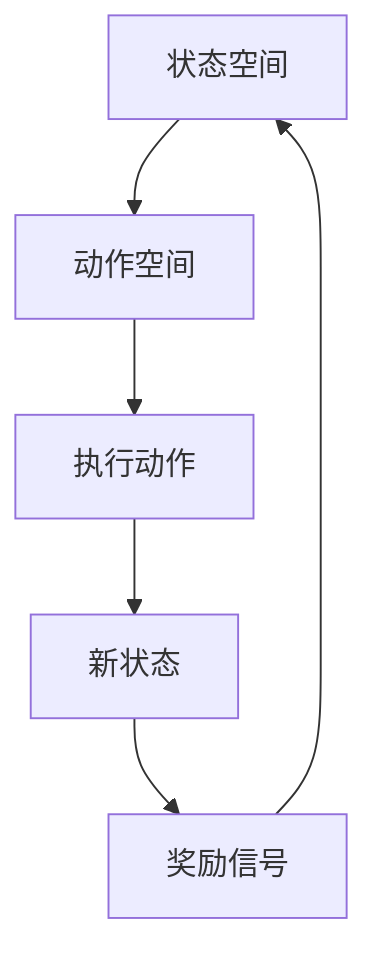
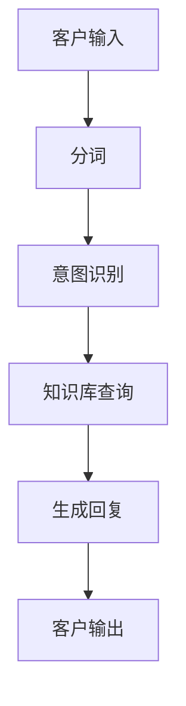
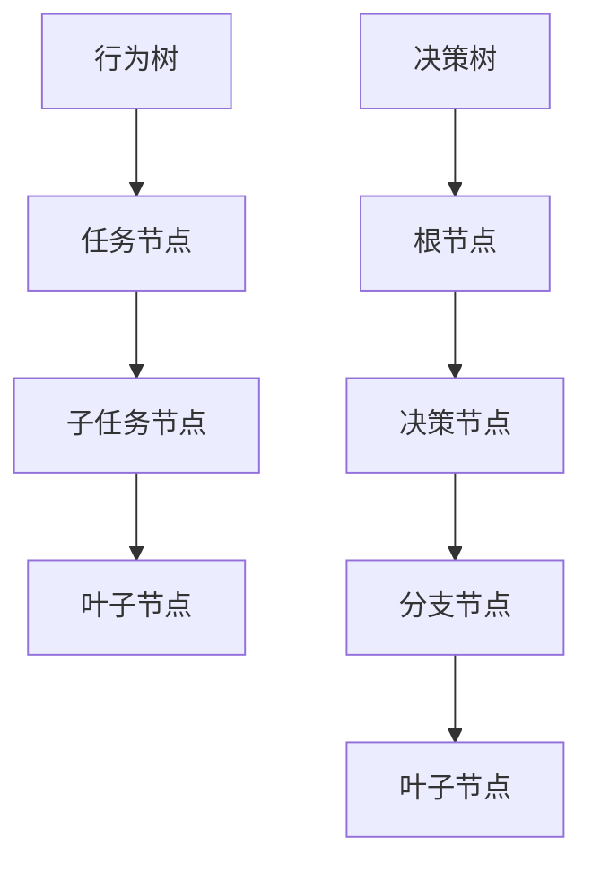
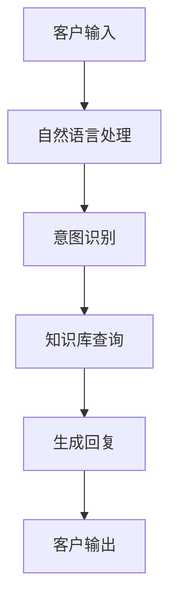
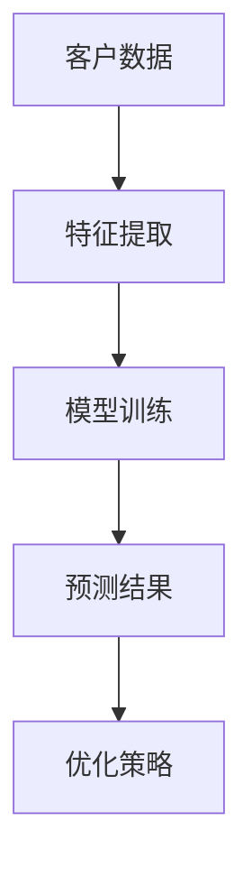
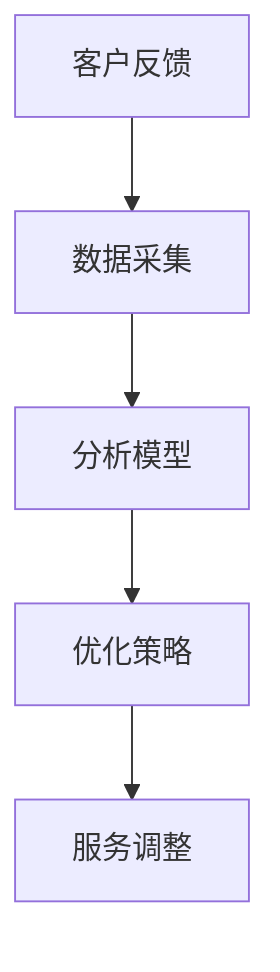
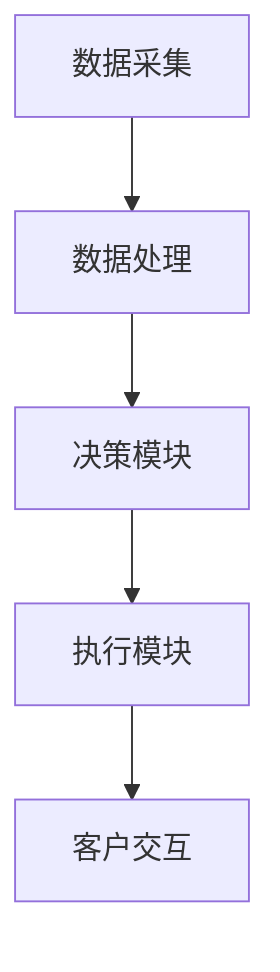
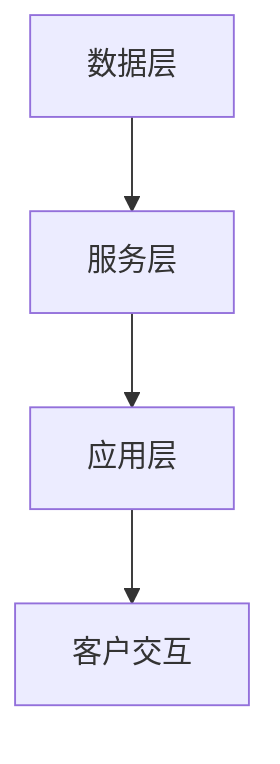
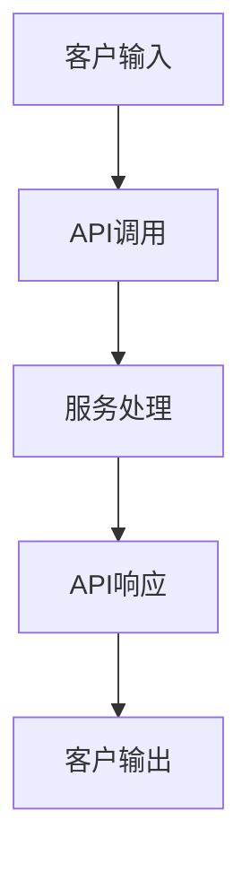
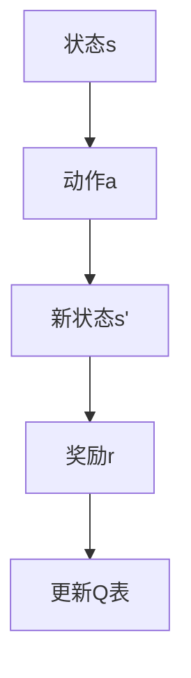

                 


# AI Agent在企业客户体验优化中的角色

---

## 关键词：AI Agent, 客户体验优化, 企业, 人工智能, 客户交互, 优化策略, 技术实现

---

## 摘要：  
本文深入探讨了AI Agent在企业客户体验优化中的核心角色，分析了其在智能客服、客户行为分析与预测、客户满意度优化等场景中的应用。通过结合技术背景、算法原理和系统架构设计，详细讲解了AI Agent如何通过自然语言处理、强化学习等技术提升客户体验。文章还提供了实际案例分析和系统实现方案，帮助读者理解如何在企业中有效应用AI Agent来优化客户体验。

---

## 目录大纲

### 第1章: AI Agent与企业客户体验优化的背景
1.1 AI Agent的基本概念  
1.2 企业客户体验优化的背景与重要性  
1.3 AI Agent在客户体验优化中的角色  
1.4 本章小结  

### 第2章: AI Agent的核心原理与技术
2.1 AI Agent的决策机制  
2.2 AI Agent的感知与交互能力  
2.3 AI Agent的规划与执行  
2.4 本章小结  

### 第3章: AI Agent在客户体验优化中的应用
3.1 智能客服系统  
3.2 客户行为分析与预测  
3.3 客户满意度优化  
3.4 本章小结  

### 第4章: AI Agent的系统架构与实现
4.1 系统功能模块划分  
4.2 系统架构设计  
4.3 系统接口设计与交互流程  
4.4 本章小结  

### 第5章: AI Agent在客户体验优化中的算法实现
5.1 基于强化学习的客户交互优化  
5.2 基于自然语言处理的客户意图识别  
5.3 基于机器学习的客户行为预测  
5.4 本章小结  

### 第6章: 项目实战与案例分析
6.1 项目背景与目标  
6.2 项目核心功能实现  
6.3 实际案例分析与经验总结  
6.4 本章小结  

### 第7章: AI Agent在客户体验优化中的未来展望
7.1 技术发展趋势  
7.2 应用场景的扩展  
7.3 企业的挑战与机遇  
7.4 本章小结  

### 第8章: 总结与展望
8.1 全文总结  
8.2 未来研究方向  
8.3 本章小结  

---

## 正文

### 第1章: AI Agent与企业客户体验优化的背景

#### 1.1 AI Agent的基本概念  
AI Agent（人工智能代理）是指能够感知环境、自主决策并执行任务的智能体。它通过传感器获取信息，利用算法处理数据，并通过执行器与环境交互。AI Agent的核心特征包括自主性、反应性、目标导向性和学习能力。  

**对比表：AI Agent与传统软件的区别**  

| 特性               | 传统软件            | AI Agent            |  
|--------------------|---------------------|---------------------|  
| 自主性             | 依赖人工操作        | 自主决策与执行      |  
| 环境感知能力       | 无感知              | 具备感知能力        |  
| 学习能力           | 无法学习            | 具备学习能力        |  
| 适应性             | 静态                | 动态适应环境变化    |  

#### 1.2 企业客户体验优化的背景与重要性  
客户体验（Customer Experience, CX）是指客户在与企业交互过程中的整体感受。优化客户体验能够提高客户满意度、忠诚度和企业的长期收益。随着数字化转型的推进，企业需要更高效、智能的工具来优化客户体验。  

#### 1.3 AI Agent在客户体验优化中的角色  
AI Agent通过智能化的交互方式和数据驱动的决策能力，能够显著提升客户体验。其主要角色包括：  
1. **智能客服助手**：通过自然语言处理技术，提供7×24小时的客户支持。  
2. **客户行为分析**：利用机器学习算法预测客户行为，提前采取优化措施。  
3. **个性化推荐**：基于客户偏好，提供定制化的产品和服务推荐。  

#### 1.4 本章小结  
本章介绍了AI Agent的基本概念及其在企业客户体验优化中的重要性，为后续章节的深入分析奠定了基础。

---

### 第2章: AI Agent的核心原理与技术

#### 2.1 AI Agent的决策机制  
AI Agent的决策机制基于强化学习和监督学习的结合。通过奖励机制（Reward Mechanism），AI Agent能够在复杂环境中找到最优策略。  

**强化学习流程图（Mermaid）**  



#### 2.2 AI Agent的感知与交互能力  
AI Agent通过自然语言处理（NLP）和计算机视觉（CV）技术实现多模态交互。  

**自然语言处理流程图（Mermaid）**  



#### 2.3 AI Agent的规划与执行  
AI Agent通过行为树（Behavior Tree）和决策树（Decision Tree）进行任务规划，确保目标的高效实现。  

**行为树与决策树对比图（Mermaid）**  



#### 2.4 本章小结  
本章详细讲解了AI Agent的核心原理，包括决策机制、感知能力与规划能力，为后续应用章节提供了理论基础。

---

### 第3章: AI Agent在客户体验优化中的应用

#### 3.1 智能客服系统  
智能客服系统通过AI Agent实现自动化的客户支持，显著降低人工成本。  

**智能客服系统架构图（Mermaid）**  



#### 3.2 客户行为分析与预测  
基于机器学习的客户行为分析能够帮助企业预测客户流失，提前采取措施。  

**客户行为预测流程图（Mermaid）**  



#### 3.3 客户满意度优化  
通过实时监测客户反馈，AI Agent能够动态调整服务策略，提升客户满意度。  

**客户满意度优化流程图（Mermaid）**  



#### 3.4 本章小结  
本章通过实际案例分析，展示了AI Agent在智能客服、客户行为分析与预测、客户满意度优化中的广泛应用。

---

### 第4章: AI Agent的系统架构与实现

#### 4.1 系统功能模块划分  
AI Agent系统主要包括数据采集模块、数据处理模块、决策模块和执行模块。  

**系统功能模块划分图（Mermaid）**  



#### 4.2 系统架构设计  
AI Agent采用分层架构设计，包括数据层、服务层和应用层。  

**系统架构设计图（Mermaid）**  



#### 4.3 系统接口设计与交互流程  
系统通过RESTful API实现模块间的通信，确保高效的数据交互。  

**系统交互流程图（Mermaid）**  



#### 4.4 本章小结  
本章详细设计了AI Agent系统的架构与实现方案，为后续的项目实战奠定了基础。

---

### 第5章: AI Agent在客户体验优化中的算法实现

#### 5.1 基于强化学习的客户交互优化  
通过Q-learning算法优化客户交互流程，提升客户满意度。  

**Q-learning算法流程图（Mermaid）**  



数学公式：  
$$ Q(s, a) = Q(s, a) + \alpha (r + \gamma \max Q(s', a')) $$  

#### 5.2 基于自然语言处理的客户意图识别  
使用词嵌入（Word Embedding）技术实现客户意图的准确识别。  

**词嵌入示意图**  

  

#### 5.3 基于机器学习的客户行为预测  
通过逻辑回归（Logistic Regression）模型预测客户行为。  

**逻辑回归公式**：  
$$ P(y=1) = \frac{e^{\beta x}}{1 + e^{\beta x}} $$  

#### 5.4 本章小结  
本章详细讲解了AI Agent在客户体验优化中的算法实现，包括强化学习、自然语言处理和机器学习技术。

---

### 第6章: 项目实战与案例分析

#### 6.1 项目背景与目标  
某电商平台希望通过AI Agent优化客户服务流程，提升客户满意度。  

#### 6.2 项目核心功能实现  
1. **智能客服系统**：实现自然语言理解与自动回复。  
2. **客户行为分析**：基于历史数据预测客户行为。  
3. **个性化推荐**：根据客户偏好推荐产品。  

**Python代码示例：智能客服系统实现**  

```python
class AIAssistant:
    def __init__(self):
        self.training_data = []
    
    def train(self):
        # 训练模型
        pass
    
    def respond(self, input_text):
        # 处理客户输入并生成回复
        pass
```

#### 6.3 实际案例分析与经验总结  
通过实际案例分析，总结AI Agent在客户体验优化中的优势与挑战。  

#### 6.4 本章小结  
本章通过实际项目案例，展示了AI Agent在客户体验优化中的具体应用和实现方案。

---

### 第7章: AI Agent在客户体验优化中的未来展望

#### 7.1 技术发展趋势  
随着AI技术的进步，AI Agent将更加智能化和个性化。  

#### 7.2 应用场景的扩展  
AI Agent将在更多领域（如金融、医疗）发挥重要作用。  

#### 7.3 企业的挑战与机遇  
企业需要克服技术、数据和人才的挑战，抓住AI Agent带来的发展机遇。  

#### 7.4 本章小结  
本章展望了AI Agent在客户体验优化中的未来发展方向，为企业的技术规划提供了参考。

---

### 第8章: 总结与展望

#### 8.1 全文总结  
本文系统地介绍了AI Agent在企业客户体验优化中的角色与应用，分析了其核心技术与实现方案。  

#### 8.2 未来研究方向  
未来的研究方向包括更高效的算法设计和更广泛的应用场景探索。  

#### 8.3 本章小结  
本章总结了全文内容，并展望了AI Agent技术的发展前景。

---

## 总结  
本文通过系统性地分析AI Agent在企业客户体验优化中的角色与应用，结合技术背景、算法实现和实际案例，为读者提供了全面的视角。通过本文的讲解，读者能够深入理解AI Agent的核心原理与实际应用，并为企业的数字化转型提供有价值的参考。

