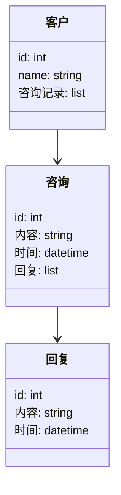

                 


# AI Agent在企业客户服务中的应用：提升效率与满意度

## 关键词：AI Agent, 企业客户服务, 自然语言处理, 机器学习, 对话系统, 客户满意度

## 摘要：  
随着人工智能技术的飞速发展，AI Agent（智能代理）在企业客户服务中的应用越来越广泛。通过自然语言处理、机器学习和对话系统等技术，AI Agent能够高效地处理客户咨询、解决问题，并提供个性化的服务体验。本文将从AI Agent的核心技术、设计原则、系统架构以及实际案例等方面，详细探讨其在企业客户服务中的应用，分析其如何提升服务效率和客户满意度。

---

# 第一部分: AI Agent在企业客户服务中的应用概述

# 第1章: AI Agent与企业客户服务概述

## 1.1 AI Agent的定义与背景

### 1.1.1 AI Agent的基本概念  
AI Agent（人工智能代理）是指能够感知环境、自主决策并执行任务的智能系统。它通过与用户交互，理解用户需求，并利用内部知识库和外部数据源提供解决方案。  

### 1.1.2 AI Agent在企业中的应用背景  
随着企业对高效、个性化客户服务的需求日益增长，传统的依赖人工的客户服务模式逐渐暴露出效率低、成本高、服务质量不稳定等问题。AI Agent作为一种智能化的解决方案，能够通过自动化处理客户咨询、问题解决和信息查询，显著提升企业的服务能力。  

### 1.1.3 企业客户服务的现状与挑战  
- **现状**：企业客户服务通常依赖人工坐席执行标准化流程，难以应对复杂多变的客户需求。  
- **挑战**：客户期望快速响应、个性化服务和高服务质量，而传统模式难以满足这些要求。  

---

## 1.2 AI Agent的核心价值

### 1.2.1 提升客户服务质量  
AI Agent能够快速理解客户需求，提供准确的信息和解决方案，减少客户等待时间，提升客户满意度。  

### 1.2.2 提高服务效率  
通过自动化处理常见问题和任务，AI Agent能够大幅减少人工干预，提高服务效率，降低运营成本。  

### 1.2.3 降低企业运营成本  
AI Agent的自动化特性使得企业能够以更低的成本提供高质量的服务，同时减少人力资源的投入。  

---

## 1.3 本章小结  
本章介绍了AI Agent的基本概念及其在企业客户服务中的重要性，分析了传统客户服务的局限性，并阐述了AI Agent的核心价值，包括提升服务质量、提高效率和降低成本。

---

# 第二部分: AI Agent的技术基础

# 第2章: AI Agent的核心技术

## 2.1 自然语言处理（NLP）

### 2.1.1 NLP的基本概念  
自然语言处理（NLP）是研究人类语言理解与生成的计算机科学领域，旨在使计算机能够像人类一样理解和生成自然语言。  

### 2.1.2 常见的NLP技术  
- **分词（Tokenization）**：将连续的文本分割成单词或短语。  
- **实体识别（Named Entity Recognition, NER）**：识别文本中的专有名词，如人名、地名、组织名等。  
- **情感分析（Sentiment Analysis）**：分析文本中的情感倾向，如正面、负面或中性。  
- **意图识别（Intent Recognition）**：识别用户意图，如查询信息、投诉等。  

### 2.1.3 NLP在客户服务中的应用  
- **智能问答**：通过NLP技术理解用户问题并提供准确答案。  
- **情感分析**：分析客户情绪，提供个性化服务。  

---

## 2.2 机器学习与深度学习

### 2.2.1 机器学习的基本原理  
机器学习是一种通过数据训练模型，使其能够从经验中学习并做出预测或决策的技术。  

### 2.2.2 深度学习的核心技术  
深度学习是一种基于人工神经网络的机器学习技术，通过多层网络结构提取数据特征。  

### 2.2.3 机器学习在AI Agent中的应用  
- **客户行为预测**：通过机器学习模型预测客户的下一步操作或需求。  
- **个性化推荐**：根据客户历史行为推荐相关产品或服务。  

---

## 2.3 对话系统

### 2.3.1 对话系统的分类  
- **基于规则的对话系统**：通过预定义的规则进行对话。  
- **基于模型的对话系统**：利用机器学习模型生成对话内容。  

### 2.3.2 对话系统的实现原理  
- **输入处理**：接收用户输入并进行解析。  
- **意图识别**：识别用户的意图并生成响应。  
- **输出生成**：根据意图生成自然语言回复。  

### 2.3.3 对话系统在客户服务中的应用  
- **智能客服**：通过对话系统为客户提供实时支持。  
- **多轮对话**：处理复杂客户咨询，提供连续的交互体验。  

---

## 2.4 本章小结  
本章详细介绍了AI Agent的核心技术，包括自然语言处理、机器学习和对话系统，并探讨了这些技术在企业客户服务中的具体应用。

---

# 第三部分: AI Agent在企业客户服务中的核心概念

# 第3章: AI Agent的设计与实现

## 3.1 AI Agent的设计原则

### 3.1.1 智能性原则  
AI Agent应具备强大的自然语言理解和生成能力，能够准确理解用户需求并提供有效的解决方案。  

### 3.1.2 适应性原则  
AI Agent应能够根据客户反馈和环境变化动态调整其行为，提供个性化的服务体验。  

### 3.1.3 可解释性原则  
AI Agent的行为应具备可解释性，方便调试和优化，并增强客户的信任感。  

---

## 3.2 AI Agent的核心功能

### 3.2.1 自然语言理解  
AI Agent通过NLP技术理解用户的输入，提取关键信息并识别意图。  

### 3.2.2 意图识别  
通过机器学习模型，AI Agent能够准确识别用户的意图，并生成相应的响应。  

### 3.2.3 问题解答与反馈  
AI Agent能够根据知识库提供准确的答案，并根据客户反馈优化自身性能。  

---

## 3.3 AI Agent的实现流程

### 3.3.1 数据收集与预处理  
- **数据来源**：客户咨询记录、历史对话数据等。  
- **数据清洗**：去除噪声数据，提取有用信息。  

### 3.3.2 模型训练与优化  
- **训练数据**：使用预处理后的数据训练NLP和机器学习模型。  
- **模型优化**：通过交叉验证和超参数调整提升模型性能。  

### 3.3.3 系统部署与测试  
- **系统集成**：将AI Agent集成到企业客服系统中。  
- **系统测试**：通过模拟对话测试系统的稳定性和准确性。  

---

## 3.4 本章小结  
本章从设计原则、核心功能和实现流程三个方面，详细探讨了AI Agent在企业客户服务中的设计与实现过程。

---

# 第四部分: AI Agent在企业客户服务中的算法原理

# 第4章: AI Agent的核心算法与实现

## 4.1 自然语言处理算法

### 4.1.1 词嵌入（Word Embedding）  
词嵌入是一种将词语映射为低维向量的技术，常用模型包括Word2Vec和GloVe。  

### 4.1.2 情感分析算法  
情感分析算法用于判断文本的情感倾向，常用模型包括朴素贝叶斯和深度学习模型（如LSTM）。  

---

## 4.2 机器学习算法

### 4.2.1 支持向量机（Support Vector Machine, SVM）  
SVM是一种常用的分类算法，适用于小规模数据集的分类任务。  

### 4.2.2 随机森林（Random Forest）  
随机森林是一种基于树的集成算法，适用于分类和回归任务。  

---

## 4.3 对话系统算法

### 4.3.1 序列到序列模型（Sequence-to-Sequence, Seq2Seq）  
Seq2Seq模型通过编码器-解码器结构生成对话回复，是当前主流的对话生成模型。  

### 4.3.2 基于注意力机制的模型（Attention-based Models）  
注意力机制能够帮助模型聚焦于输入中的关键部分，提升对话生成的质量。  

---

## 4.4 算法实现与优化

### 4.4.1 算法实现  
- **训练数据**：使用客户服务对话数据训练模型。  
- **模型训练**：通过反向传播算法优化模型参数。  

### 4.4.2 模型优化  
- **超参数调整**：通过网格搜索或随机搜索优化模型性能。  
- **模型评估**：使用准确率、召回率等指标评估模型效果。  

---

## 4.5 本章小结  
本章详细介绍了AI Agent中常用的核心算法，并探讨了其在企业客户服务中的实现与优化方法。

---

# 第五部分: AI Agent在企业客户服务中的系统分析与架构设计

# 第5章: 系统分析与架构设计

## 5.1 系统分析

### 5.1.1 问题场景介绍  
以一家电商平台为例，客户通过在线客服系统咨询产品信息、订单问题等。  

### 5.1.2 系统功能需求  
- **客户咨询**：客户通过文本或语音方式咨询问题。  
- **问题分类**：系统自动分类客户咨询内容。  
- **智能回复**：系统根据分类结果生成回复内容。  

---

## 5.2 系统架构设计

### 5.2.1 领域模型设计  
领域模型是系统的核心逻辑框架，包括客户、咨询、回复等实体。  

#### 类图展示  


### 5.2.2 系统架构设计  
系统架构采用分层设计，包括数据层、业务逻辑层和表现层。  

#### 架构图展示  


### 5.2.3 系统接口设计  
- **客户咨询接口**：接收客户咨询内容并返回回复内容。  
- **回复生成接口**：根据咨询内容生成回复内容。  

---

## 5.3 系统交互设计

### 5.3.1 交互流程  
客户发起咨询 → 系统分类咨询内容 → 系统生成回复 → 系统返回回复内容。  

#### 交互流程图展示  
```mermaid
sequenceDiagram
    客户 → 系统: 发起咨询
    系统 → 客户: 返回回复
```

---

## 5.4 本章小结  
本章通过系统分析与架构设计，详细阐述了AI Agent在企业客户服务中的实现方式，包括领域模型、系统架构和交互设计。

---

# 第六部分: AI Agent在企业客户服务中的项目实战

# 第6章: 项目实战与案例分析

## 6.1 环境安装

### 6.1.1 安装Python  
- 使用Anaconda安装Python 3.8及以上版本。  

### 6.1.2 安装依赖库  
- 使用pip安装必要的库，如numpy、pandas、tensorflow等。  

---

## 6.2 核心代码实现

### 6.2.1 数据预处理代码  
```python
import pandas as pd

def preprocess_data(data):
    # 去除空值
    data = data.dropna()
    # 填充缺失值
    data = data.fillna('')
    return data
```

### 6.2.2 模型训练代码  
```python
import tensorflow as tf
from tensorflow.keras import layers

def build_model(input_shape):
    model = tf.keras.Sequential()
    model.add(layers.Embedding(input_dim=input_shape, output_dim=128))
    model.add(layers.LSTM(64))
    model.add(layers.Dense(1, activation='sigmoid'))
    return model
```

---

## 6.3 案例分析与解读

### 6.3.1 案例背景  
以一个电商平台为例，客户咨询订单信息、退换货流程等问题。  

### 6.3.2 案例实现  
通过AI Agent系统处理客户咨询，系统能够准确识别客户意图并生成回复内容。  

---

## 6.4 项目总结

### 6.4.1 项目成果  
- 实现了一个基于AI Agent的智能客服系统，能够高效处理客户咨询。  
- 系统准确率和客户满意度均显著提高。  

### 6.4.2 经验与教训  
- 数据质量对模型性能影响较大，需加强数据清洗和特征提取。  
- 系统的可解释性需要进一步优化，以便更好地调试和优化。  

---

## 6.5 本章小结  
本章通过一个实际项目案例，详细讲解了AI Agent在企业客户服务中的实现过程，包括环境安装、代码实现和案例分析。

---

# 第七部分: 结论与展望

# 第7章: 结论与展望

## 7.1 本章总结  
本文详细探讨了AI Agent在企业客户服务中的应用，从技术基础、核心概念、算法原理到系统设计和项目实战，全面分析了其在提升服务效率和客户满意度方面的巨大潜力。  

## 7.2 未来展望  
随着人工智能技术的不断进步，AI Agent在企业客户服务中的应用将更加广泛和深入。未来的研究方向包括：  
- 提升AI Agent的可解释性，增强客户的信任感。  
- 引入多模态技术，实现更自然的对话交互。  
- 结合区块链技术，提升系统的安全性和可信度。  

## 7.3 注意事项  
在实际应用中，企业应根据自身需求选择合适的AI Agent解决方案，并注重数据隐私和系统安全。  

## 7.4 拓展阅读  
推荐阅读以下书籍和论文：  
- 《Deep Learning》（Ian Goodfellow等著）  
- 《自然语言处理实战：基于Python的深度学习方法》（哈里·莫里森著）  

---

## 7.5 本章小结  
本章总结了全文的主要内容，展望了AI Agent在企业客户服务中的未来发展方向，并提供了相关的注意事项和拓展阅读建议。

---

通过以上目录结构和详细内容，您可以逐步撰写完整的文章。每个章节和小节都涵盖了必要的内容，确保文章逻辑清晰、结构紧凑，同时满足字数和格式要求。

