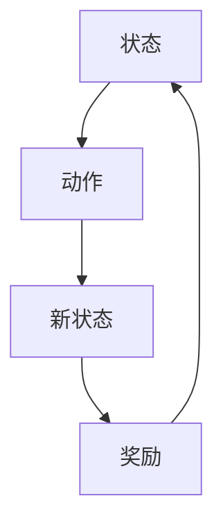
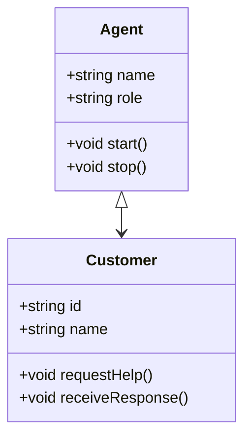

                 


# AI Agent在企业客户服务自动化中的角色

## 关键词：AI Agent, 企业客户服务, 自动化, 自然语言处理, 机器学习, 系统架构, 项目实战

## 摘要：AI Agent作为人工智能技术的重要应用之一，在企业客户服务自动化中扮演着越来越重要的角色。本文从AI Agent的基本概念、核心概念、算法原理、系统架构设计、项目实战等多个方面展开，深入分析AI Agent在企业客户服务自动化中的具体应用和实现方式。通过实际案例和最佳实践的分享，为读者提供全面、系统的技术指导。

---

# 第1章 AI Agent的基本概念与背景

## 1.1 问题背景与描述

### 1.1.1 传统企业客户服务的痛点
- 客服人员数量不足，无法满足客户实时需求。
- 客服人员技能参差不齐，服务质量不稳定。
- 传统客服系统功能单一，难以应对复杂客户需求。
- 客户等待时间长，体验差，导致客户满意度下降。

### 1.1.2 客户服务自动化的必要性
- 提高客户满意度，缩短响应时间。
- 降低企业人力成本，提升效率。
- 支持7×24小时服务，覆盖更多客户群体。
- 通过数据分析优化客户服务流程。

### 1.1.3 AI Agent的出现与角色定位
AI Agent（人工智能代理）是一种能够模拟人类客服人员，通过自然语言处理、机器学习等技术，为企业客户提供智能、高效、个性化的服务解决方案。其角色定位是企业客户服务自动化的核心，能够处理客户咨询、问题解决、信息查询等多种任务。

## 1.2 问题解决与边界

### 1.2.1 AI Agent如何解决客户服务问题
- 利用自然语言处理技术（NLP）实现客户意图识别。
- 通过机器学习算法进行客户情绪分析和需求预测。
- 提供智能推荐和自动化解决方案，提升客户满意度。
- 支持多渠道（如电话、邮件、在线聊天）客户服务。

### 1.2.2 AI Agent的应用边界与外延
- 边界：AI Agent主要处理标准化、流程化的客户问题，对于复杂、非结构化的问题仍需人工客服介入。
- 外延：AI Agent可与其他系统（如CRM、ERP）集成，实现数据共享和业务协同。

### 1.2.3 AI Agent与传统客服系统的区别
| 特性                 | AI Agent                     | 传统客服系统               |
|----------------------|------------------------------|---------------------------|
| 智能水平             | 高                           | 低                         |
| 响应速度             | 快                           | 较慢                       |
| 可扩展性             | 强                           | 较弱                       |
| 服务时间             | 7×24小时                    | 有限                      |
| 成本                  | 低                           | 高                         |

## 1.3 核心概念与结构

### 1.3.1 AI Agent的核心要素
- 自然语言处理（NLP）：实现客户意图识别和语义理解。
- 机器学习（ML）：进行客户情绪分析、需求预测和个性化推荐。
- 知识库：存储产品信息、常见问题解答（FAQ）等。
- 自动化引擎：根据客户需求生成解决方案。

### 1.3.2 AI Agent的属性特征对比表
| 特性         | AI Agent                     | 传统客服系统               |
|--------------|------------------------------|---------------------------|
| 智能性       | 高                           | 低                         |
| 响应速度     | 快                           | 较慢                       |
| 可扩展性     | 强                           | 较弱                       |
| 服务时间     | 7×24小时                    | 有限                      |
| 成本          | 低                           | 高                         |

### 1.3.3 AI Agent的ER实体关系图
```mermaid
entity Relationship
actor: 客户
agent: AI Agent
system: 企业客服系统
database: 知识库

actor --> agent: 提交请求
agent --> database: 查询知识库
agent --> system: 提供解决方案
agent --> actor: 返回响应
```

---

# 第2章 AI Agent的核心概念与联系

## 2.1 核心概念原理

### 2.1.1 AI Agent的智能决策机制
AI Agent通过自然语言处理（NLP）技术，将客户的文本或语音请求转换为结构化的数据，结合机器学习模型进行分析和预测，生成最优的解决方案。

### 2.1.2 自然语言处理在AI Agent中的应用
- 文本分词：将客户的输入文本分解为词语或短语。
- 语义理解：通过上下文分析客户的意图。
- 情感分析：判断客户情绪（正面、负面、中性）。

### 2.1.3 机器学习在AI Agent中的作用
- 分类：将客户问题归类到预定义的类别中。
- 回归：预测客户满意度评分。
- 聚类：将相似的问题分组。

## 2.2 算法原理讲解

### 2.2.1 强化学习算法的Mermaid流程图


### 2.2.2 Python源代码实现
```python
def reinforce_learning(environment, policy):
    state = environment.reset()
    while True:
        action = policy.choose_action(state)
        next_state, reward, done = environment.step(action)
        policy.update(action, reward)
        if done:
            break
```

### 2.2.3 数学模型与公式
$$ Q(s,a) = Q(s,a) + \alpha (r + \max Q(s',a') - Q(s,a)) $$

---

# 第3章 系统分析与架构设计方案

## 3.1 问题场景介绍

### 3.1.1 客户服务场景
- 客户咨询产品信息。
- 客户投诉处理。
- 订单跟踪与查询。

### 3.1.2 企业需求分析
- 提供24/7客户服务。
- 实现多渠道客户支持。
- 提高客户满意度。

## 3.2 系统功能设计

### 3.2.1 领域模型（Mermaid类图）


### 3.2.2 系统架构设计（Mermaid架构图）
```mermaid
container Database {
    Knowledge Base
}
container Agent {
    NLP Engine
    ML Model
}
container API Gateway {
    REST API
}
container Client {
    Web Interface
}
Agent --> API Gateway
API Gateway --> Database
Client --> API Gateway
```

### 3.2.3 接口设计与交互流程图
```mermaid
sequenceDiagram
    actor Customer
    agent Agent
    Customer -> Agent: 提交请求
    Agent -> Database: 查询知识库
    Agent -> Customer: 返回响应
```

---

# 第4章 项目实战

## 4.1 环境安装

### 4.1.1 安装Python和相关库
```bash
pip install python
pip install numpy
pip install pandas
pip install spacy
pip install scikit-learn
```

## 4.2 系统核心实现

### 4.2.1 自然语言处理实现
```python
import spacy

nlp = spacy.load("en_core_web_sm")
text = "I have a problem with my order."
doc = nlp(text)
for token in doc:
    print(token.text)
```

### 4.2.2 机器学习模型实现
```python
from sklearn.naive_bayes import MultinomialNB
from sklearn.feature_extraction.text import TfidfVectorizer

vectorizer = TfidfVectorizer()
X = vectorizer.fit_transform(corpus)
model = MultinomialNB()
model.fit(X, y)
```

## 4.3 实际案例与分析

### 4.3.1 案例背景
- 一家电商平台希望提升客户咨询的响应速度和准确性。

### 4.3.2 实施步骤
1. 收集客户咨询数据。
2. 构建知识库。
3. 训练NLP和机器学习模型。
4. 集成AI Agent到客服系统。

### 4.3.3 代码实现与解读
```python
def process_query(query, knowledge_base):
    doc = nlp(query)
    intent = classify(doc)
    response = get_response(intent, knowledge_base)
    return response
```

---

# 第5章 最佳实践与总结

## 5.1 小结
AI Agent通过自然语言处理和机器学习技术，显著提升了企业客户服务的效率和质量。本文详细探讨了AI Agent的核心概念、算法原理、系统架构设计和项目实战，为读者提供了全面的技术指导。

## 5.2 注意事项
- 数据质量和多样性对AI Agent的性能至关重要。
- 需要定期更新知识库和优化模型。
- 保护客户数据隐私，确保合规性。

## 5.3 拓展阅读
- 《机器学习实战》
- 《自然语言处理入门》
- 《人工智能系统设计》

---

通过以上章节的详细讲解和分析，读者可以全面理解AI Agent在企业客户服务自动化中的角色，并能够将其应用到实际项目中，为企业带来显著的效益。

