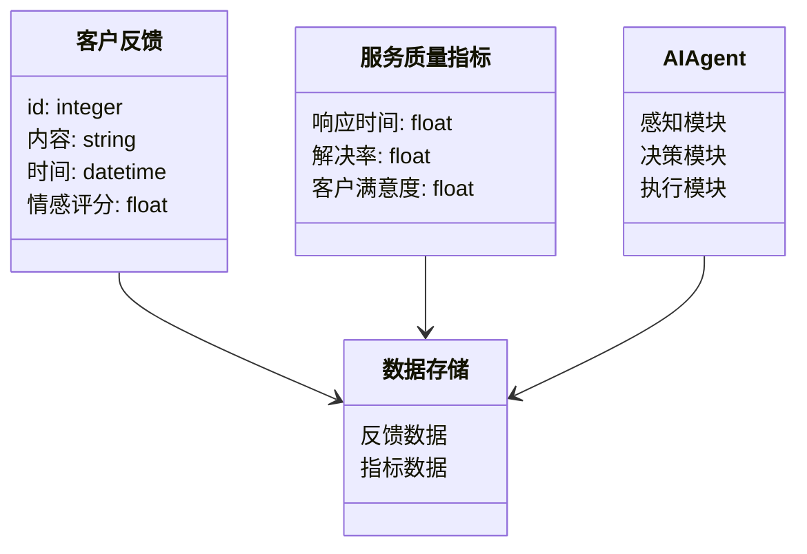
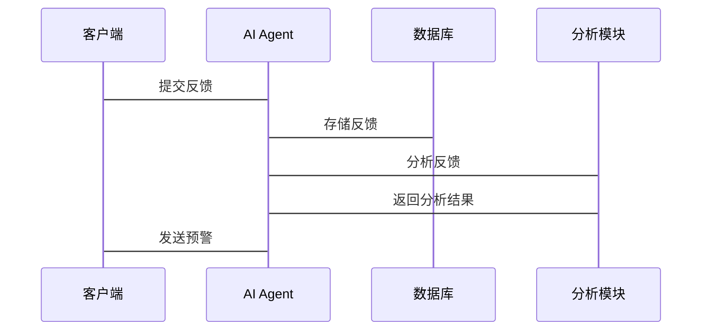

                 


# 《AI Agent在企业客户服务质量监控与智能升级中的角色》

## 关键词：AI Agent, 企业客户服务质量, 智能升级, 客服监控, 机器学习

## 摘要：
随着人工智能技术的迅速发展，AI Agent在企业客户服务质量监控和智能升级中的角色变得越来越重要。本文详细探讨了AI Agent的核心概念、工作原理、算法原理以及在客户服务质量监控中的系统架构。通过实际案例分析，展示了AI Agent如何通过自然语言处理、机器学习和深度学习等技术提升客户服务质量，并提供了系统设计与实现的详细指导。文章还介绍了项目实战中的环境配置、核心代码实现及实际案例分析，帮助读者全面理解和应用AI Agent技术。

---

# 第一章: AI Agent与企业客户服务质量概述

## 1.1 AI Agent的基本概念
### 1.1.1 AI Agent的定义与特点
- AI Agent的定义
- AI Agent的特点：智能性、自主性、反应性、社会性
- AI Agent的核心功能：感知、决策、执行

### 1.1.2 AI Agent的核心功能与应用场景
- 感知功能：数据采集与分析
- 决策功能：基于数据的智能决策
- 执行功能：自动化操作与反馈

### 1.1.3 企业客户服务质量监控的定义与重要性
- 客户服务质量监控的定义
- 服务质量监控的重要性：提升客户满意度、提高企业竞争力
- 服务质量监控的边界与外延

## 1.2 AI Agent在企业客户服务质量中的价值
### 1.2.1 提高客户服务质量的潜力
- AI Agent如何提升服务质量：快速响应、个性化服务
- AI Agent在客户服务质量监控中的优势：实时性、准确性、智能化

### 1.2.2 AI Agent在客户服务质量监控中的创新
- 传统客户服务质量监控的局限性
- AI Agent的创新：自动化、智能化、数据闭环

### 1.2.3 企业客户服务质量升级的目标与路径
- 目标：提高客户满意度、优化服务流程
- 路径：AI Agent技术的应用、数据驱动的优化

---

# 第二章: AI Agent的核心概念与原理

## 2.1 AI Agent的核心概念
### 2.1.1 AI Agent的感知能力
- 数据采集：文本、语音、图像等多模态数据
- 数据分析：自然语言处理、情感分析

### 2.1.2 AI Agent的决策机制
- 机器学习模型：监督学习、无监督学习、强化学习
- 决策逻辑：基于规则的决策、基于模型的决策

### 2.1.3 AI Agent的执行能力
- 自动化操作：任务执行、流程优化
- 反馈机制：实时调整、持续优化

## 2.2 AI Agent在客户服务质量监控中的工作原理
### 2.2.1 数据采集与分析
- 数据来源：客户反馈、服务记录、系统日志
- 数据分析：统计分析、趋势分析、异常检测

### 2.2.2 智能决策与优化
- 机器学习模型的应用：分类、回归、聚类
- 决策优化：基于模型的策略调整

### 2.2.3 反馈机制与持续改进
- 数据闭环：从数据采集到反馈的循环
- 持续优化：基于反馈的模型迭代

## 2.3 AI Agent的核心算法与技术
### 2.3.1 自然语言处理（NLP）技术
- NLP的核心任务：文本分类、实体识别、情感分析
- NLP在客户服务质量监控中的应用：识别客户情绪、分析反馈内容

### 2.3.2 机器学习与深度学习算法
- 监督学习：分类模型（如支持向量机、随机森林）
- 无监督学习：聚类分析（如K-means）
- 深度学习：神经网络（如LSTM、Transformer）

### 2.3.3 数据挖掘与分析技术
- 数据清洗：去除噪音数据
- 数据建模：构建客户满意度模型
- 数据可视化：展示数据趋势

---

# 第三章: AI Agent在客户服务质量监控中的系统架构

## 3.1 系统整体架构
### 3.1.1 问题场景介绍
- 客户服务质量监控的典型场景：客服中心、在线支持
- 系统目标：实时监控、智能预警、优化建议

### 3.1.2 项目介绍
- 项目背景：企业客户服务质量提升的需求
- 项目目标：构建基于AI Agent的客户服务质量监控系统

## 3.2 系统功能设计
### 3.2.1 领域模型（Mermaid类图）


### 3.2.2 系统架构设计（Mermaid架构图）


### 3.2.3 系统接口设计
- 输入接口：客户反馈接口、服务质量指标接口
- 输出接口：预警接口、优化建议接口

### 3.2.4 系统交互设计（Mermaid序列图）


## 3.3 系统实现细节
### 3.3.1 环境安装
- 开发环境：Python、Jupyter Notebook
- 依赖库安装：NLTK、Scikit-learn、TensorFlow

### 3.3.2 核心代码实现（Python）
```python
import numpy as np
from sklearn.feature_extraction.text import TfidfVectorizer
from sklearn.svm import SVC

# 数据预处理
def preprocess(text):
    # 假设text是客户反馈的内容
    return text.lower()

# 情感分析模型训练
def train_model(X, y):
    vectorizer = TfidfVectorizer()
    X_vec = vectorizer.fit_transform(X)
    model = SVC()
    model.fit(X_vec, y)
    return model, vectorizer

# 模型预测
def predict(model, vectorizer, text):
    X_test = vectorizer.transform([preprocess(text)])
    return model.predict(X_test)[0]
```

### 3.3.3 代码应用解读与分析
- 数据预处理：将文本转换为小写
- 模型训练：使用TF-IDF向量化和SVM进行情感分类
- 模型预测：基于预处理后的文本进行情感预测

---

# 第四章: 项目实战与案例分析

## 4.1 项目实战
### 4.1.1 环境安装
- 安装Python和相关库：NLTK、Scikit-learn、TensorFlow

### 4.1.2 核心代码实现
```python
import numpy as np
from sklearn.feature_extraction.text import TfidfVectorizer
from sklearn.svm import SVC

# 数据预处理
def preprocess(text):
    return text.lower()

# 情感分析模型训练
def train_model(X, y):
    vectorizer = TfidfVectorizer()
    X_vec = vectorizer.fit_transform(X)
    model = SVC()
    model.fit(X_vec, y)
    return model, vectorizer

# 模型预测
def predict(model, vectorizer, text):
    X_test = vectorizer.transform([preprocess(text)])
    return model.predict(X_test)[0]
```

### 4.1.3 代码应用解读与分析
- 数据预处理：将文本转换为小写
- 模型训练：使用TF-IDF向量化和SVM进行情感分类
- 模型预测：基于预处理后的文本进行情感预测

### 4.1.4 实际案例分析
- 案例背景：某企业客服中心
- 数据分析：客户反馈的情感分布
- 模型优化：调整参数、优化特征提取

### 4.1.5 项目小结
- 项目成果：构建了基于AI Agent的客户服务质量监控系统
- 项目经验：数据质量的重要性、模型调优的技巧

---

# 第五章: 最佳实践与注意事项

## 5.1 小结
- AI Agent在企业客户服务质量监控中的核心作用
- 项目实施的关键步骤：数据采集、模型训练、系统设计

## 5.2 注意事项
- 数据隐私与安全：确保数据处理符合相关规定
- 模型解释性：选择可解释性更强的模型
- 系统稳定性：确保系统的高可用性

## 5.3 拓展阅读
- 推荐书籍：《机器学习实战》、《深度学习入门》
- 推荐文章：AI Agent在金融领域的应用

---

# 结语
随着AI技术的不断进步，AI Agent在企业客户服务质量监控与智能升级中的作用将越来越重要。通过本文的详细讲解，读者可以全面理解AI Agent的核心概念、算法原理和系统设计，并能够将其应用于实际项目中，提升企业的客户服务质量。

---

# 附录
## 附录A: 相关术语解释
- AI Agent：人工智能代理
- NLP：自然语言处理
- SVM：支持向量机
- TF-IDF：词频-逆文档频率

## 附录B: 参考文献
- [1] 周志华. 《机器学习实战》
- [2] Andrew Ng. 《深度学习导论》
- [3] 《Python机器学习》

