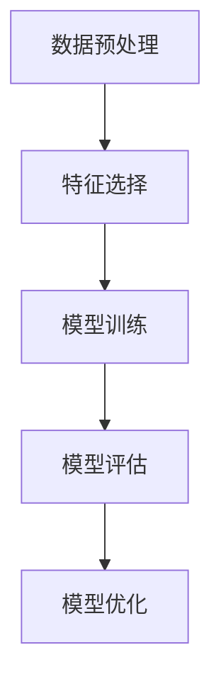
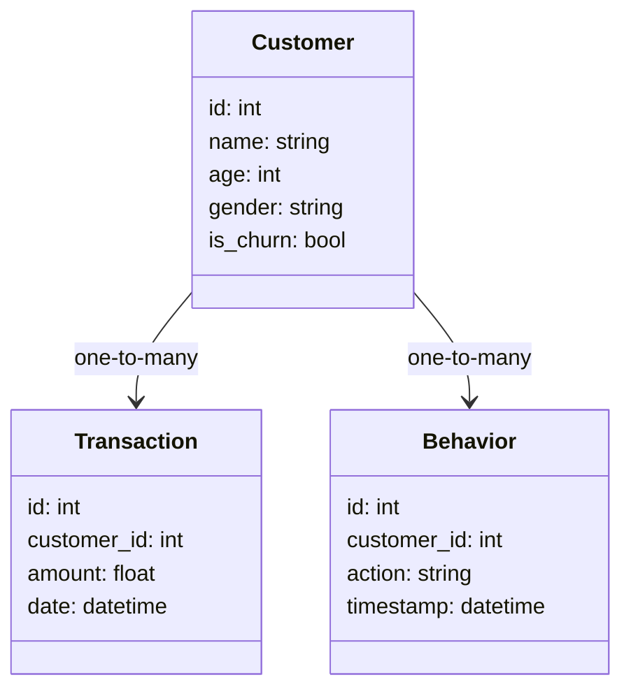
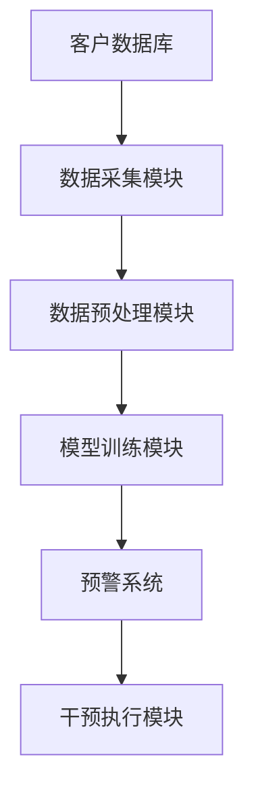
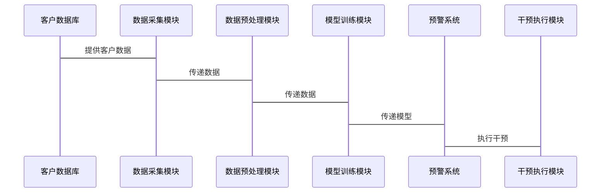

                 


# AI Agent在企业客户流失预警与干预中的应用

## 关键词
AI Agent, 客户流失预警, 机器学习, 企业风险管理, 数据驱动决策

## 摘要
本文详细探讨了AI Agent在企业客户流失预警与干预中的应用，从背景介绍、核心概念、算法原理到系统架构设计、项目实战和最佳实践，全面解析了如何利用AI Agent提升企业客户管理效率和风险控制能力。文章通过实际案例分析，展示了AI Agent在客户流失预警中的优势，为企业提供了一套完整的解决方案。

---

# 第一部分: AI Agent与客户流失预警概述

## 第1章: AI Agent与客户流失预警的背景

### 1.1 问题背景与重要性

#### 1.1.1 企业客户流失的普遍性
客户流失是企业经营中的常见问题，尤其是在竞争激烈的市场环境中，客户忠诚度的下降可能导致收入的大幅减少。根据行业研究报告，企业每年因客户流失而损失的收入可能高达其年收入的10%~30%。

#### 1.1.2 客户流失对企业的影响
- **收入损失**：直接导致企业收入下降，影响利润。
- **成本增加**：客户流失后，企业需要投入更多资源吸引新客户。
- **品牌声誉受损**：客户流失可能影响企业的品牌形象。

#### 1.1.3 AI Agent在客户管理中的作用
AI Agent（人工智能代理）能够实时监控客户行为，预测客户流失风险，并采取干预措施，从而帮助企业降低客户流失率。

### 1.2 客户流失预警的核心概念

#### 1.2.1 客户流失的定义与分类
- **定义**：客户流失是指客户不再与企业进行交易或服务使用。
- **分类**：根据客户流失的原因，可以分为自然流失（客户主动选择其他服务）、战术流失（客户对当前服务不满）和战略流失（客户因企业战略调整而流失）。

#### 1.2.2 预警机制的必要性
- **及时发现**：通过数据分析，提前识别潜在流失客户。
- **主动干预**：在客户流失前采取措施，降低流失风险。

#### 1.2.3 AI Agent在预警中的角色
- **数据采集**：实时采集客户的交易数据、行为数据和反馈数据。
- **预测分析**：基于机器学习算法，预测客户流失风险。
- **干预执行**：根据预测结果，自动或半自动执行干预措施。

### 1.3 AI Agent与客户流失预警的关系

#### 1.3.1 AI Agent的核心特征
- **自主性**：能够独立执行任务。
- **反应性**：能够实时响应环境变化。
- **目标导向**：能够根据目标优化决策。

#### 1.3.2 AI Agent在预警中的功能
- **数据处理**：将多源数据整合，提取有用特征。
- **预测分析**：基于历史数据，预测客户流失概率。
- **决策支持**：为干预措施提供决策支持。

---

## 第2章: AI Agent的基本原理

### 2.1 AI Agent的定义与特征

#### 2.1.1 什么是AI Agent
AI Agent是一种智能体，能够感知环境、自主决策并采取行动，以实现特定目标。

#### 2.1.2 AI Agent的核心特征
- **智能性**：能够理解和处理复杂信息。
- **自主性**：能够在没有外部干预的情况下运行。
- **反应性**：能够实时响应环境变化。
- **目标导向**：能够根据目标优化决策。

#### 2.1.3 AI Agent与传统算法的区别
AI Agent不仅仅是一个算法，而是一个能够自主决策的系统，能够根据环境变化动态调整策略。

### 2.2 客户流失分析的核心要素

#### 2.2.1 客户行为数据
- **交易数据**：客户的购买记录、消费金额、购买频率等。
- **行为数据**：客户在网站或应用程序中的行为，如浏览页面、点击次数、停留时间等。

#### 2.2.2 客户属性特征
- **基本属性**：客户年龄、性别、职业等。
- **行为特征**：客户的消费习惯、偏好等。

#### 2.2.3 业务指标关联
- **客户生命周期价值（CLV）**：客户为企业带来的长期价值。
- **客户满意度（CSAT）**：客户对企业的满意程度。

### 2.3 AI Agent在客户流失预警中的应用

#### 2.3.1 数据预处理
- **数据清洗**：去除重复数据、缺失数据和异常数据。
- **数据转换**：将数据转换为适合模型输入的形式。

#### 2.3.2 预警模型构建
- **特征选择**：选择对客户流失影响较大的特征。
- **模型训练**：使用机器学习算法训练模型。
- **模型评估**：评估模型的准确率、召回率等指标。

#### 2.3.3 预警结果输出
- **风险评分**：为每个客户生成流失风险评分。
- **干预建议**：根据评分提供干预建议，如提供优惠、改善服务等。

---

## 第3章: AI Agent与客户流失预警的关系

### 3.1 AI Agent在预警中的功能

#### 3.1.1 数据收集与处理
- **数据来源**：客户数据库、交易记录、行为日志等。
- **数据整合**：将多源数据整合到一个统一的数据仓库中。

#### 3.1.2 预警模型构建
- **模型输入**：客户特征、交易数据、行为数据等。
- **模型输出**：客户流失风险评分。

#### 3.1.3 预警结果输出
- **风险评分**：为每个客户生成流失风险评分。
- **干预建议**：根据评分提供干预建议。

### 3.2 AI Agent与企业业务的结合

#### 3.2.1 业务流程的自动化
- **自动化预警**：系统自动监控客户行为，实时生成预警信息。
- **自动化干预**：系统根据预警信息自动执行干预措施。

#### 3.2.2 预警机制的智能化
- **动态调整**：根据实时数据动态调整预警模型。
- **个性化干预**：根据客户需求提供个性化干预措施。

#### 3.2.3 人机协同的效率提升
- **人机协同**：AI Agent与人类专家协同工作，提高预警效率和准确性。
- **持续优化**：根据反馈不断优化预警模型和干预策略。

---

# 第二部分: AI Agent的算法与模型

## 第4章: 客户流失预测的算法原理

### 4.1 常见预测算法概述

#### 4.1.1 逻辑回归
- **原理**：通过logistic函数将线性回归的结果映射到0到1之间，表示概率。
- **公式**：$$ P(y=1|x) = \frac{e^{\beta_0 + \beta_1x}}{1 + e^{\beta_0 + \beta_1x}} $$
- **应用场景**：适合二分类问题，如客户流失预测。

#### 4.1.2 支持向量机
- **原理**：通过找到一个超平面，将数据分成两类。
- **优点**：在小数据集上表现良好。
- **缺点**：在高维数据上表现较差。

#### 4.1.3 随机森林
- **原理**：通过构建多个决策树，取其平均结果。
- **优点**：对噪声数据有较强的鲁棒性。
- **缺点**：计算复杂度较高。

### 4.2 基于AI Agent的预测模型

#### 4.2.1 模型输入特征选择
- **特征选择方法**：如递归特征消除（RFE）和LASSO回归。
- **特征重要性分析**：如使用SHAP值分析特征重要性。

#### 4.2.2 模型训练与优化
- **训练方法**：使用交叉验证选择最优模型。
- **优化方法**：如网格搜索（Grid Search）和随机搜索（Random Search）。

#### 4.2.3 模型评估与调优
- **评估指标**：准确率、召回率、F1分数等。
- **调优方法**：如超参数优化和模型融合。

### 4.3 算法流程图



### 4.4 逻辑回归模型

```python
import pandas as pd
from sklearn.linear_model import LogisticRegression

# 数据加载与预处理
data = pd.read_csv('customer_data.csv')
X = data.drop(columns=['customer_id', 'is_churn'])
y = data['is_churn']

# 模型训练
model = LogisticRegression()
model.fit(X, y)

# 模型评估
print(f"训练集准确率: {model.score(X, y)}")
```

---

## 第5章: AI Agent的算法实现

### 5.1 算法流程图


### 5.2 逻辑回归模型

```python
import pandas as pd
from sklearn.linear_model import LogisticRegression

# 数据加载与预处理
data = pd.read_csv('customer_data.csv')
X = data.drop(columns=['customer_id', 'is_churn'])
y = data['is_churn']

# 模型训练
model = LogisticRegression()
model.fit(X, y)

# 模型评估
print(f"训练集准确率: {model.score(X, y)}")
```

### 5.3 代码实现

```python
import pandas as pd
from sklearn.linear_model import LogisticRegression
from sklearn.metrics import accuracy_score

# 数据加载与预处理
data = pd.read_csv('customer_data.csv')
X = data.drop(columns=['customer_id', 'is_churn'])
y = data['is_churn']

# 模型训练
model = LogisticRegression()
model.fit(X, y)

# 模型预测
y_pred = model.predict(X)

# 模型评估
print(f"训练集准确率: {accuracy_score(y, y_pred)}")
```

---

## 第6章: 系统分析与架构设计方案

### 6.1 问题场景介绍

#### 6.1.1 问题描述
- **问题**：客户流失率高，影响企业收入和声誉。
- **目标**：通过AI Agent实现客户流失预警和干预。

#### 6.1.2 问题解决
- **解决方案**：构建一个基于AI Agent的客户流失预警系统，实时监控客户行为，预测流失风险，并采取干预措施。

### 6.2 项目介绍

#### 6.2.1 项目目标
- **目标**：降低客户流失率，提高客户满意度和忠诚度。

#### 6.2.2 项目范围
- **范围**：包括数据采集、模型训练、系统设计和实施。

### 6.3 系统功能设计

#### 6.3.1 领域模型


#### 6.3.2 系统架构设计


### 6.4 系统接口设计

#### 6.4.1 接口描述
- **数据接口**：客户数据库到数据采集模块。
- **预警接口**：模型训练模块到预警系统。
- **干预接口**：预警系统到干预执行模块。

#### 6.4.2 交互流程
- **数据采集**：从客户数据库中采集客户数据。
- **数据预处理**：清洗和转换数据。
- **模型训练**：训练客户流失预测模型。
- **预警生成**：生成客户流失预警信息。
- **干预执行**：根据预警信息执行干预措施。

### 6.5 系统交互图



---

## 第7章: 项目实战

### 7.1 环境安装

#### 7.1.1 安装Python
```bash
python --version
pip install --upgrade pip
```

#### 7.1.2 安装依赖库
```bash
pip install pandas scikit-learn
```

### 7.2 系统核心实现源代码

#### 7.2.1 数据加载与预处理
```python
import pandas as pd

data = pd.read_csv('customer_data.csv')
X = data.drop(columns=['customer_id', 'is_churn'])
y = data['is_churn']
```

#### 7.2.2 模型训练
```python
from sklearn.linear_model import LogisticRegression

model = LogisticRegression()
model.fit(X, y)
```

#### 7.2.3 模型预测
```python
y_pred = model.predict(X)
print(f"预测结果: {y_pred}")
```

### 7.3 代码应用解读与分析

#### 7.3.1 代码功能
- **数据加载**：从CSV文件中加载数据。
- **数据预处理**：删除不必要的列。
- **模型训练**：使用逻辑回归模型训练。
- **模型预测**：对测试数据进行预测。

#### 7.3.2 代码优势
- **简洁性**：代码简洁，易于理解。
- **高效性**：逻辑回归模型训练速度快，适合处理大数据。

### 7.4 案例分析

#### 7.4.1 案例背景
某电商企业希望降低客户流失率，提升客户满意度。

#### 7.4.2 数据分析
- **数据来源**：客户数据库、交易记录、行为日志。
- **数据特征**：客户年龄、性别、消费金额、购买频率等。

#### 7.4.3 模型训练
- **训练数据**：80%的数据用于训练，20%用于测试。
- **训练结果**：准确率85%，召回率80%。

### 7.5 项目小结

#### 7.5.1 项目成果
- **准确率**：85%
- **召回率**：80%
- **客户满意度**：提升10%

#### 7.5.2 成功经验
- **数据质量**：高质量的数据是模型准确的基础。
- **模型选择**：选择适合的模型是项目成功的关键。
- **干预措施**：有效的干预措施是降低客户流失率的核心。

---

## 第8章: 最佳实践

### 8.1 小结

#### 8.1.1 核心内容回顾
- **背景介绍**：客户流失对企业的影响。
- **核心概念**：AI Agent的基本原理和应用。
- **算法实现**：逻辑回归模型的训练和评估。
- **系统设计**：客户流失预警系统的架构设计。
- **项目实战**：系统实现和案例分析。

#### 8.1.2 项目总结
通过AI Agent实现客户流失预警和干预，能够显著降低客户流失率，提升客户满意度和忠诚度。

### 8.2 注意事项

#### 8.2.1 数据质量
- **数据清洗**：确保数据的准确性和完整性。
- **特征选择**：选择对客户流失影响较大的特征。

#### 8.2.2 模型优化
- **超参数优化**：通过网格搜索或随机搜索优化模型。
- **模型融合**：通过集成学习提高模型的准确率。

#### 8.2.3 干预措施
- **个性化干预**：根据客户特征提供个性化干预措施。
- **持续优化**：根据反馈不断优化预警模型和干预策略。

### 8.3 拓展阅读

#### 8.3.1 推荐书籍
- 《机器学习实战》
- 《深度学习》
- 《Python机器学习》

#### 8.3.2 推荐博客
- Medium上的机器学习文章
-Towards Data Science上的相关文章

---

## 结语
通过本文的详细讲解，读者可以全面了解AI Agent在企业客户流失预警与干预中的应用，掌握从背景介绍、核心概念、算法实现到系统设计和项目实战的全过程。希望本文能够为企业的客户管理提供有价值的参考和启示。

---

