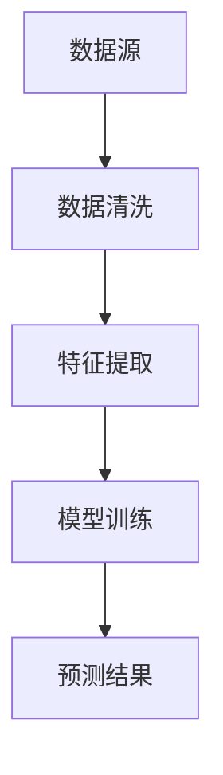
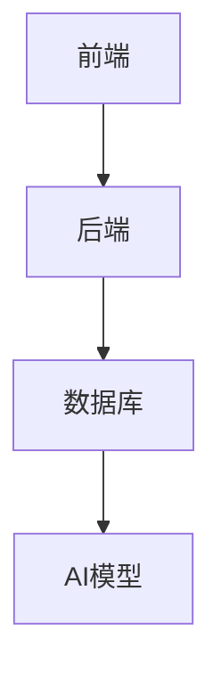

                 


# AI Agent在企业客户流失预警与干预策略制定中的应用

## 关键词：AI Agent, 客户流失预警, 干预策略, 机器学习, 数据分析

## 摘要：本文探讨了AI Agent在企业客户流失预警与干预策略制定中的应用，通过理论分析、算法原理、系统架构和项目实战，详细阐述了如何利用AI技术预测客户流失并制定有效的干预措施，为企业提升客户 retention 提供了实用的解决方案。

---

## 第1章：客户流失问题背景与AI Agent概述

### 1.1 客户流失问题背景

#### 1.1.1 客户流失对企业的影响
客户流失是企业面临的重要挑战，直接影响收入和市场占有率。高客户流失率可能导致企业利润下降，品牌声誉受损，并增加获取新客户的成本。研究表明，客户流失率每降低1%，企业利润可能提升数个百分点。

#### 1.1.2 传统客户流失管理的局限性
传统方法依赖人工分析和经验判断，存在效率低、准确性差的问题。例如，销售人员可能无法及时识别潜在流失客户，导致错过挽回机会。

#### 1.1.3 AI技术在客户管理中的潜力
AI技术能够快速处理大量数据，识别模式和趋势，提供精准的预测和建议。通过AI Agent，企业可以实时监控客户行为，预测流失风险，并自动化执行干预策略。

### 1.2 AI Agent的核心概念

#### 1.2.1 AI Agent的定义与特点
AI Agent是一种智能代理，能够感知环境、执行任务并做出决策。其特点包括自主性、反应性、目标导向和学习能力。

#### 1.2.2 AI Agent在客户流失预警中的作用
AI Agent可以实时分析客户数据，识别流失风险，并推荐干预措施。例如，通过分析客户的购买频率和满意度数据，AI Agent可以预测客户流失风险等级。

#### 1.2.3 AI Agent与传统客户管理工具的对比
| 对比维度         | AI Agent                     | 传统客户管理工具               |
|------------------|------------------------------|-------------------------------|
| 数据处理能力     | 强大，支持大数据分析         | 有限，依赖人工分析             |
| 预测准确性       | 高，基于机器学习模型         | 低，依赖经验判断               |
| 响应速度         | 快，自动化执行               | 慢，依赖人工操作               |

### 1.3 本章小结
本章介绍了客户流失对企业的影响、传统管理的局限性以及AI Agent的优势和作用，为后续章节奠定了基础。

---

## 第2章：客户流失预警的理论基础与模型构建

### 2.1 客户流失预测的理论基础

#### 2.1.1 数据分析与客户行为建模
数据分析是客户流失预测的基础。通过分析客户的交易记录、行为特征和反馈数据，可以构建客户行为模型，识别流失风险。

#### 2.1.2 客户生命周期理论
客户生命周期包括获取、成长、成熟和衰退阶段。通过分析客户在各个阶段的行为，可以制定相应的营销策略。

#### 2.1.3 客户流失预测的数学模型
常用的数学模型包括逻辑回归、决策树和随机森林。这些模型能够根据客户特征预测流失概率。

### 2.2 AI Agent的算法原理

#### 2.2.1 常见算法对比
| 算法名称       | 优点                           | 缺点                           |
|----------------|--------------------------------|--------------------------------|
| 逻辑回归       | 简单，易于解释                 | 非线性关系处理能力差           |
| 决策树         | 易于解释，适合处理混杂数据     | 易受噪声数据影响               |
| 随机森林       | 高准确性，抗过拟合             | 计算复杂性高                   |

#### 2.2.2 支持向量机（SVM）的应用
SVM适用于高维数据分类。在客户流失预测中，SVM可以有效区分流失客户和非流失客户。

#### 2.2.3 神经网络模型的应用
神经网络能够处理复杂非线性关系，适合处理客户行为数据中的复杂模式。

### 2.3 数学模型

#### 2.3.1 逻辑回归模型
$$ P(y=1|x) = \frac{e^{\beta_0 + \beta_1x_1 + ... + \beta_nx_n}}{1 + e^{\beta_0 + \beta_1x_1 + ... + \beta_nx_n}} $$

#### 2.3.2 决策树模型的ID3算法信息增益计算
$$ I(G) = \sum_{i=1}^{k} \frac{N_i}{N} \cdot \log_2\left(\frac{N}{N_i}\right) $$

### 2.4 本章小结
本章介绍了客户流失预测的理论基础和常见算法，为后续章节的模型构建提供了理论支持。

---

## 第3章：AI Agent在客户流失预警中的实现原理

### 3.1 AI Agent的基本工作原理

#### 3.1.1 数据采集与预处理
数据预处理包括数据清洗、特征提取和数据转换。例如，清洗缺失数据，提取客户年龄、购买频率等特征。

#### 3.1.2 特征选择与模型训练
通过特征选择算法（如LASSO回归）选择重要特征，构建预测模型。

#### 3.1.3 模型优化与部署
通过交叉验证优化模型参数，部署模型到生产环境，实时预测客户流失风险。

### 3.2 机器学习预测流程



### 3.3 干预策略制定逻辑

#### 3.3.1 预警级别划分
根据流失概率将客户分为高、中、低风险等级。

#### 3.3.2 干预措施推荐算法
基于客户特征推荐个性化干预措施，例如提高客户满意度或提供优惠政策。

#### 3.3.3 干预效果评估
通过A/B测试评估干预措施的有效性，优化策略。

### 3.4 本章小结
本章详细介绍了AI Agent的实现原理和干预策略制定逻辑，为后续章节的系统设计提供了指导。

---

## 第4章：系统架构与技术实现

### 4.1 系统架构设计

#### 4.1.1 分层架构图



### 4.2 系统功能模块设计

#### 4.2.1 数据采集模块
负责采集客户数据，包括交易记录和行为数据。

#### 4.2.2 数据分析模块
对数据进行预处理和特征提取，构建客户行为模型。

#### 4.2.3 AI Agent模块
基于机器学习模型预测客户流失风险，推荐干预措施。

#### 4.2.4 干预策略执行模块
根据预测结果执行干预措施，例如发送优惠券或调整服务策略。

### 4.3 系统接口设计

#### 4.3.1 数据接口设计
定义数据格式和接口协议，确保数据流畅传输。

#### 4.3.2 API设计
提供RESTful API，供其他系统调用预测结果和干预措施。

### 4.4 本章小结
本章详细描述了系统架构设计和功能模块，为项目实施提供了技术指导。

---

## 第5章：项目实战

### 5.1 项目背景与目标
本项目旨在通过AI Agent预测客户流失风险，并制定干预策略，降低客户流失率。

### 5.2 环境配置与工具安装
安装Python、Scikit-learn、XGBoost等工具，配置开发环境。

### 5.3 核心代码实现

#### 5.3.1 数据预处理代码
```python
import pandas as pd
from sklearn.preprocessing import StandardScaler

# 加载数据
data = pd.read_csv('customer_data.csv')

# 数据清洗
data.dropna(inplace=True)

# 特征提取
features = data[['age', 'purchase_frequency', 'satisfaction_score']]
```

#### 5.3.2 模型训练代码
```python
from sklearn.model_selection import train_test_split
from sklearn.linear_model import LogisticRegression

# 划分训练集和测试集
X_train, X_test, y_train, y_test = train_test_split(features, data['churn'], test_size=0.2)

# 训练逻辑回归模型
model = LogisticRegression()
model.fit(X_train, y_train)
```

#### 5.3.3 预测与评估代码
```python
from sklearn.metrics import accuracy_score

# 预测结果
y_pred = model.predict(X_test)

# 评估准确率
print(accuracy_score(y_test, y_pred))
```

### 5.4 实际案例分析
以某零售企业为例，分析客户数据，预测流失风险，并制定干预策略。

### 5.5 项目总结与优化建议
总结项目成果，提出优化建议，如引入更复杂的模型或增加实时监控功能。

### 5.6 本章小结
本章通过实际案例展示了AI Agent在客户流失预警中的应用，验证了模型的有效性。

---

## 第6章：最佳实践与总结

### 6.1 项目实施中的最佳实践
- 数据预处理：确保数据质量，提取关键特征。
- 模型选择：根据数据特点选择合适的算法。
- 系统设计：模块化设计，便于扩展和维护。

### 6.2 项目小结
本项目通过AI Agent实现了客户流失预警和干预策略制定，为企业提供了高效解决方案。

### 6.3 注意事项与风险提示
- 数据隐私：确保数据安全，遵守相关法律法规。
- 模型泛化能力：避免过拟合，确保模型在不同数据集上表现良好。
- 干预措施的有效性：根据实际效果调整策略。

### 6.4 拓展阅读
推荐阅读《机器学习实战》和《深入理解机器学习》等书籍，深入了解相关理论和实践。

---

## 本章小结
本文详细探讨了AI Agent在企业客户流失预警与干预策略制定中的应用，从理论到实践，为企业的客户管理提供了新的思路和解决方案。通过AI技术的应用，企业可以更精准地预测客户流失风险，并制定有效的干预策略，提升客户 retention 和企业竞争力。

