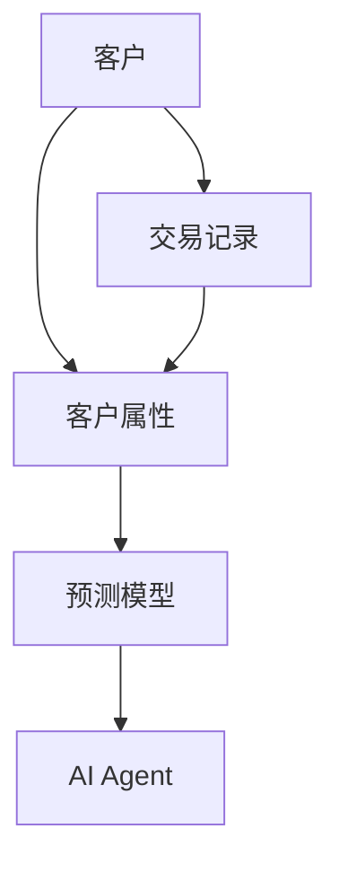
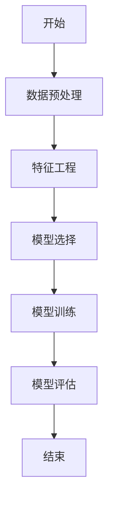
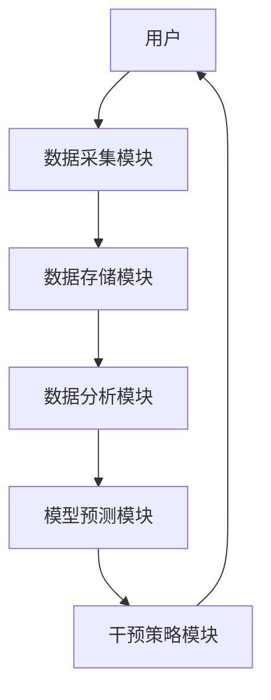

                 


# AI Agent在企业客户流失预警与精准干预中的应用

## 关键词：AI Agent, 客户流失预警, 精准干预, 数据挖掘, 机器学习, 智能预测

## 摘要：  
本文深入探讨了AI Agent在企业客户流失预警与精准干预中的应用，通过理论分析与实践案例相结合的方式，详细阐述了AI Agent的核心概念、算法原理、系统架构设计以及实际应用场景。文章从客户流失问题的背景出发，分析了AI Agent在客户流失预警中的优势与挑战，结合具体算法与数学模型，详细解读了如何利用AI Agent实现客户流失的精准预测与干预。通过系统架构设计和项目实战，展示了如何将AI Agent技术应用于实际企业场景中，为企业提供高效的客户流失预警与干预方案。

---

## 第一部分：AI Agent与企业客户流失预警概述

### 第1章：客户流失问题背景与AI Agent概述

#### 1.1 客户流失的定义与影响
客户流失是指企业客户因各种原因不再继续与企业进行交易的行为。客户流失对企业的负面影响包括收入减少、品牌价值下降以及客户获取成本增加等。客户流失的原因多种多样，包括客户满意度低、市场竞争激烈、客户需求变化等。

#### 1.2 AI Agent的基本概念
AI Agent（人工智能代理）是指能够感知环境、自主决策并执行任务的智能系统。AI Agent的核心特征包括自主性、反应性、目标导向性和社会性。与传统客服系统相比，AI Agent能够通过数据挖掘和机器学习技术，实现客户行为的预测与分析。

#### 1.3 AI Agent在客户流失预警中的应用前景
AI Agent在客户流失预警中的优势在于其能够实时分析客户行为数据，快速识别潜在流失客户，并提供精准的干预策略。企业采用AI Agent不仅可以降低客户流失率，还可以提高客户满意度和忠诚度。然而，AI Agent的应用也面临数据隐私、模型准确性等挑战。

### 第2章：客户流失预警的核心概念与联系

#### 2.1 核心概念原理
客户流失预警的核心在于通过对客户行为数据的分析，识别出潜在流失客户。数据挖掘和机器学习技术是实现客户流失预警的关键工具。AI Agent在其中扮演着数据分析师和决策者的角色。

#### 2.2 核心概念属性特征对比
以下是客户流失预警中几个核心概念的属性特征对比：

| **概念**      | **特征**                                                                 |
|----------------|--------------------------------------------------------------------------|
| 数据挖掘       | 从大量数据中提取有价值的信息                                             |
| 机器学习       | 基于数据训练模型，实现预测和分类                                           |
| AI Agent       | 能够自主决策，执行任务，与客户进行交互                                   |

#### 2.3 ER实体关系图架构
以下是一个简单的ER实体关系图，展示了客户流失预警系统的主要实体及其关系：



---

## 第二部分：AI Agent算法原理与数学模型

### 第3章：AI Agent算法原理与数学模型

#### 3.1 算法原理
AI Agent在客户流失预警中的算法原理主要包括以下步骤：
1. **数据预处理**：清洗数据，处理缺失值和异常值。
2. **特征工程**：提取客户行为特征，如购买频率、交易金额、客户满意度等。
3. **模型选择与训练**：选择合适的机器学习模型（如逻辑回归、决策树、随机森林等）进行训练。
4. **模型评估与优化**：通过交叉验证等方法评估模型性能，并进行调优。

#### 3.2 数学模型与公式
以下是几种常用的数学模型及其公式：

1. **逻辑回归模型**
   $$ P(y=1|x) = \frac{1}{1 + e^{-\beta x}} $$
   其中，$y$ 是目标变量（客户流失），$x$ 是特征变量，$\beta$ 是模型参数。

2. **决策树模型**
   决策树是一种基于树状结构的分类模型，通过特征分裂来实现客户流失的预测。例如，使用ID3或C4.5算法进行决策树的构建。

3. **支持向量机（SVM）**
   SVM是一种监督学习模型，常用于分类问题。其目标是找到一个超平面，使得正负样本点尽可能分开。
   $$ \text{优化目标：} \quad \min_{\mathbf{w}, b, \xi} \frac{1}{2} \|\mathbf{w}\|^2 + C \sum_{i=1}^n \xi_i $$
   $$ \text{约束条件：} \quad y_i (\mathbf{w} \cdot \mathbf{x}_i + b) \geq 1 - \xi_i, \quad \xi_i \geq 0 $$

#### 3.3 算法流程图
以下是一个AI Agent算法的流程图：



---

## 第三部分：系统分析与架构设计

### 第4章：系统分析与架构设计

#### 4.1 系统功能设计
AI Agent客户流失预警系统的功能设计包括以下几个方面：
1. **数据采集**：从数据库中获取客户交易记录、客户属性等数据。
2. **数据分析**：通过数据挖掘技术提取客户行为特征。
3. **模型预测**：利用机器学习模型预测客户流失概率。
4. **干预策略**：根据预测结果，制定精准的客户干预策略。

#### 4.2 系统架构设计
以下是一个AI Agent客户流失预警系统的架构图：



#### 4.3 系统接口设计
系统接口设计包括以下几个方面：
1. **数据接口**：与数据库或其他数据源对接。
2. **模型接口**：与机器学习模型对接，获取预测结果。
3. **用户接口**：提供可视化界面，供用户查看预测结果和干预策略。

#### 4.4 系统交互流程图
以下是一个系统的交互流程图：


---

## 第四部分：项目实战

### 第5章：项目实战

#### 5.1 环境安装与配置
以下是一个典型的AI Agent项目环境配置示例：

1. **安装Python**：`python --version`
2. **安装依赖库**：`pip install numpy, pandas, scikit-learn`
3. **安装Jupyter Notebook**：`pip install jupyter`

#### 5.2 数据准备与清洗
以下是客户流失数据的清洗代码示例：

```python
import pandas as pd

# 读取数据
data = pd.read_csv('customer_churn.csv')

# 查看数据信息
print(data.info())

# 处理缺失值
data = data.dropna()

# 转换分类变量
data = pd.get_dummies(data)
```

#### 5.3 模型实现与优化
以下是使用逻辑回归模型实现客户流失预测的代码示例：

```python
from sklearn.linear_model import LogisticRegression
from sklearn.model_selection import train_test_split
from sklearn.metrics import accuracy_score

# 数据分割
X = data.drop('churn', axis=1)
y = data['churn']

X_train, X_test, y_train, y_test = train_test_split(X, y, test_size=0.2)

# 模型训练
model = LogisticRegression()
model.fit(X_train, y_train)

# 模型预测
y_pred = model.predict(X_test)

# 模型评估
print(accuracy_score(y_test, y_pred))
```

#### 5.4 结果分析与优化
通过模型预测结果，可以识别出潜在流失客户，并制定精准的干预策略。例如，对于高概率流失客户，可以通过邮件、短信或电话等方式进行营销活动，提高客户留存率。

---

## 第五部分：总结与展望

### 第6章：总结与展望

#### 6.1 总结
本文详细探讨了AI Agent在企业客户流失预警与精准干预中的应用，通过理论分析与实践案例相结合的方式，展示了如何利用AI Agent技术实现客户流失的预测与干预。通过数据挖掘、机器学习和智能算法的应用，企业可以显著降低客户流失率，提高客户满意度和忠诚度。

#### 6.2 展望
随着人工智能技术的不断发展，AI Agent在客户流失预警中的应用将更加广泛和深入。未来，可以通过引入更复杂的模型（如深度学习模型）和更丰富的数据源（如社交媒体数据），进一步提高客户流失预测的准确性。同时，AI Agent还可以与其他企业系统（如CRM系统）集成，实现更加智能化的客户管理。

#### 6.3 最佳实践 Tips
1. **数据质量**：确保数据的准确性和完整性，避免因数据问题影响模型性能。
2. **模型调优**：通过交叉验证和超参数优化，提高模型的预测精度。
3. **实时监控**：建立实时监控机制，及时发现潜在流失客户。

通过以上方法，企业可以更好地利用AI Agent技术，实现客户流失预警与精准干预，从而提高企业的竞争力和客户满意度。

