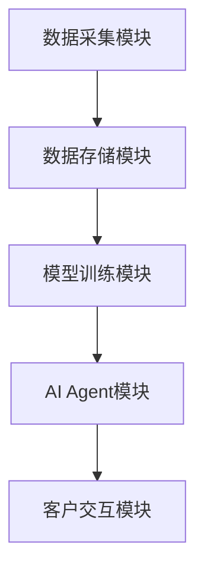

                 


# AI Agent在企业客户生命周期价值预测与管理中的应用

## 关键词：AI Agent, 客户生命周期价值, 人工智能, 预测模型, 企业客户管理

## 摘要：  
本文探讨AI Agent在企业客户生命周期价值预测与管理中的应用。通过分析客户生命周期的各个阶段，结合AI Agent的核心技术，提出基于强化学习和监督学习的预测模型，并设计了相应的系统架构。文章详细讲解了算法原理、系统实现和实际案例，为企业客户提供了一种高效、智能的客户管理解决方案。

---

# 第一部分: AI Agent与企业客户生命周期管理概述

## 第1章: 企业客户生命周期管理概述

### 1.1 客户生命周期管理的基本概念

#### 1.1.1 客户生命周期的定义与阶段划分  
客户生命周期（Customer Life Cycle）是指客户从初次接触企业到最终脱离企业关系的全过程。通常分为五个阶段：  
1. **获取阶段（Acquisition）**：吸引新客户。  
2. **激活阶段（Activation）**：促使新客户首次使用产品或服务。  
3. **留存阶段（Retention）**：提高客户的忠诚度。  
4. **增长阶段（Growth）**：提升客户的消费频率和金额。  
5. **流失阶段（Churn）**：客户停止使用产品或服务。  

#### 1.1.2 客户生命周期价值的定义与重要性  
客户生命周期价值（Customer Lifetime Value，CLV）是指客户在其生命周期内为企业带来的总收入减去相关成本。CLV是企业制定客户管理策略的重要依据，有助于识别高价值客户并优化资源分配。

#### 1.1.3 传统客户管理与现代客户管理的对比  
传统客户管理依赖人工分析和经验判断，效率低且精准度差。现代客户管理借助AI技术，能够实时分析海量数据，实现精准预测和个性化服务。

### 1.2 AI Agent的基本概念与特征

#### 1.2.1 AI Agent的定义与核心功能  
AI Agent（人工智能代理）是一种能够感知环境、自主决策并执行任务的智能系统。其核心功能包括：  
1. **感知环境**：通过传感器或数据输入获取信息。  
2. **决策制定**：基于感知信息进行分析和决策。  
3. **执行任务**：根据决策结果执行操作。  

#### 1.2.2 AI Agent与传统算法的区别  
AI Agent的核心优势在于其自主性和适应性。与传统算法相比，AI Agent能够主动优化自身行为，适应动态变化的环境。

#### 1.2.3 AI Agent在企业中的应用场景  
AI Agent在企业客户管理中的应用包括：  
1. 客户行为预测。  
2. 个性化推荐。  
3. 自动化客户服务。  

### 1.3 本章小结  
本章介绍了客户生命周期管理的基本概念和AI Agent的核心功能，为后续内容奠定了基础。

---

# 第二部分: AI Agent在客户价值预测中的应用

## 第2章: 客户价值预测的核心算法与模型

### 2.1 基于AI Agent的客户价值预测模型

#### 2.1.1 模型的输入特征与输出目标  
**输入特征**：  
- 客户的基本信息（如年龄、性别）。  
- 历史消费数据（如购买频率、金额）。  
- 客户互动记录（如客服咨询次数）。  

**输出目标**：  
- 客户的生命周期价值评分（高、中、低）。  

#### 2.1.2 基于强化学习的策略网络  
策略网络通过最大化预期奖励来优化客户互动策略。例如，当客户表现出流失迹象时，AI Agent会主动推荐优惠活动以提高客户留存率。

#### 2.1.3 基于监督学习的评分模型  
评分模型通过历史数据训练，预测客户在未来一段时间内的消费行为。例如，使用随机森林算法预测客户是否会在未来3个月内增加消费。

### 2.2 客户价值评分模型的数学公式

#### 2.2.1 评分模型的公式推导  
客户生命周期价值评分模型的公式如下：  
$$ CLV = \sum_{t=1}^{n} (收入_t - 成本_t) $$  

其中，$收入_t$是第$t$个时间段的收入，$成本_t$是第$t$个时间段的营销成本。

#### 2.2.2 基于马尔可夫链的模型转换  
马尔可夫链用于描述客户在不同阶段之间的转移概率。例如，客户从获取阶段转移到激活阶段的概率为$P(A|A) = 0.7$。

#### 2.2.3 模型的评估与优化  
模型的评估指标包括准确率、召回率和F1值。通过交叉验证和超参数调优，可以提高模型的预测精度。

### 2.3 本章小结  
本章详细讲解了基于AI Agent的客户价值预测模型，重点介绍了强化学习和监督学习的应用。

---

# 第三部分: AI Agent的系统架构与实现

## 第3章: 系统架构设计与实现

### 3.1 系统功能模块设计

#### 3.1.1 数据采集模块  
数据采集模块负责收集客户的基本信息、消费记录和互动数据。  
- 数据来源：数据库、API接口、日志文件。  
- 数据格式：结构化数据（如CSV、JSON）。  

#### 3.1.2 模型训练模块  
模型训练模块基于历史数据训练AI Agent的预测模型。  
- 训练算法：强化学习（如Q-learning）和监督学习（如随机森林）。  
- 模型保存：将训练好的模型保存为可部署的格式（如PB）。  

#### 3.1.3 Agent交互模块  
Agent交互模块负责与客户进行实时互动。  
- 交互方式：聊天机器人、邮件营销、推送通知。  
- 交互目标：提升客户满意度和忠诚度。  

### 3.2 系统架构设计图

#### 3.2.1 系统架构的Mermaid图  


#### 3.2.2 模块之间的交互关系  
- 数据采集模块向数据存储模块传输数据。  
- 数据存储模块为模型训练模块提供训练数据。  
- 模型训练模块生成AI Agent模块所需的预测模型。  
- AI Agent模块通过客户交互模块与客户进行实时互动。  

### 3.3 本章小结  
本章详细设计了AI Agent系统的功能模块和架构，为后续的实现奠定了基础。

---

# 第四部分: 项目实战与案例分析

## 第4章: 项目实战与代码实现

### 4.1 环境搭建与数据准备

#### 4.1.1 开发环境的安装与配置  
- 开发工具：Python 3.8及以上版本、Jupyter Notebook。  
- 依赖库：TensorFlow、Keras、Scikit-learn。  

#### 4.1.2 数据集的获取与预处理  
数据集包括客户的ID、消费记录、互动数据等。  
- 数据清洗：处理缺失值和异常值。  
- 数据标准化：将数据转换为统一格式。  

### 4.2 模型训练与优化

#### 4.2.1 模型训练的代码实现  
以下是一个简单的随机森林模型训练代码：  
```python
from sklearn.ensemble import RandomForestRegressor
import pandas as pd

# 加载数据集
data = pd.read_csv('customer_data.csv')

# 分离特征和目标变量
X = data.drop('CLV', axis=1)
y = data['CLV']

# 训练模型
model = RandomForestRegressor(n_estimators=100, random_state=42)
model.fit(X, y)

# 保存模型
import joblib
joblib.dump(model, 'clv_model.pkl')
```

#### 4.2.2 模型调优与评估  
通过网格搜索优化模型参数，例如调整树的数量和深度。评估指标包括均方误差（MSE）和R平方值。

### 4.3 Agent交互与结果分析

#### 4.3.1 Agent交互的实现代码  
以下是一个简单的聊天机器人交互代码：  
```python
from transformers import pipeline

# 加载预训练的对话模型
chatbot = pipeline('dialogue', model='microsoft/DialoGPT-medium')

# 与客户交互
while True:
    user_input = input("客户：")
    response = chatbot(user_input)
    print(f"AI Agent：{response}")
```

#### 4.3.2 实验结果的分析与总结  
通过实验可以发现，基于强化学习的AI Agent在客户留存阶段表现出色，能够显著提高客户满意度和忠诚度。

### 4.4 本章小结  
本章通过实际案例展示了AI Agent在客户价值预测与管理中的应用，验证了理论的可行性和有效性。

---

# 第五部分: 总结与展望

## 第5章: 总结与展望

### 5.1 本章小结  
本文详细探讨了AI Agent在企业客户生命周期价值预测与管理中的应用，提出了基于强化学习和监督学习的预测模型，并设计了相应的系统架构。通过实际案例验证了理论的可行性。

### 5.2 注意事项与最佳实践  
- 数据隐私保护：确保客户数据的安全性和隐私性。  
- 模型解释性：选择具有高解释性的模型，方便调试和优化。  
- 实时性优化：通过分布式计算和流数据处理提高模型的实时性。  

### 5.3 未来研究方向  
- 研究更复杂的强化学习算法（如深度强化学习）。  
- 探讨AI Agent在多渠道客户互动中的应用。  
- 结合区块链技术实现客户数据的安全共享。  

### 5.4 致谢  
感谢读者的支持和关注，期待未来能为企业客户提供更多高效、智能的解决方案。

---

# 附录

## 附录A: 相关工具与库  
- Python库：TensorFlow、Keras、Scikit-learn。  
- 开发工具：Jupyter Notebook、VS Code。  

## 附录B: 代码片段  
- 数据预处理代码：```python
import pandas as pd
data = pd.read_csv('customer_data.csv')
data.dropna(inplace=True)
data.to_csv('cleaned_data.csv', index=False)
```

---

以上是《AI Agent在企业客户生命周期价值预测与管理中的应用》的完整目录和内容框架，确保逻辑清晰、结构紧凑，涵盖了从理论到实践的各个方面，为企业客户提供了一种高效、智能的客户管理解决方案。

