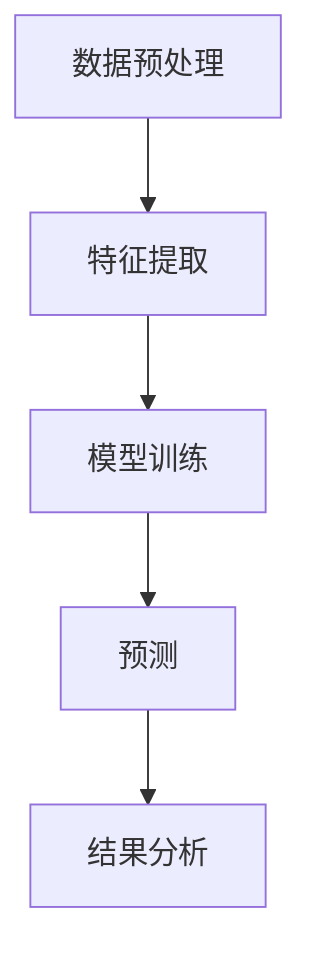
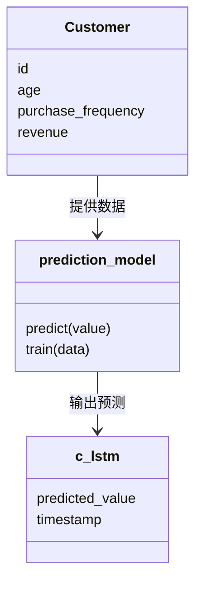
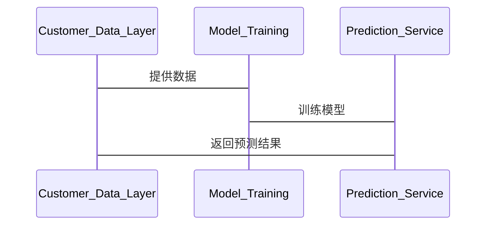

                 


# AI Agent在企业客户生命周期价值预测中的应用

## 关键词：AI Agent, 客户生命周期价值, 预测模型, 机器学习, 系统架构

## 摘要：本文探讨AI Agent在企业客户生命周期价值预测中的应用，分析其核心概念、算法原理、系统架构，并通过项目实战展示其实际应用。文章详细讲解了AI Agent如何通过数据驱动的方法提升客户价值预测的准确性和效率，为企业优化客户关系管理提供新思路。

---

## 第一部分：背景与概念

### 第1章：AI Agent与客户生命周期价值预测的背景

#### 1.1 问题背景
- **企业客户管理的挑战**  
  企业需要通过精准预测客户生命周期价值（Customer Lifetime Value，CLV）来优化资源分配和客户策略。然而，传统方法依赖人工分析，效率低且难以捕捉复杂数据模式。
- **客户生命周期价值的重要性**  
  CLV预测帮助企业识别高价值客户，优化营销策略，降低客户流失率，并提高客户满意度。
- **AI Agent在客户管理中的应用潜力**  
  AI Agent能够实时分析大量数据，提供动态预测，助力企业快速决策。

#### 1.2 问题描述
- **客户生命周期价值预测的核心问题**  
  如何基于历史数据和实时行为预测客户未来价值？
- **AI Agent在预测中的角色**  
  AI Agent通过自然语言处理、机器学习等技术，帮助构建动态预测模型。
- **当前企业客户价值预测的痛点**  
  数据复杂性高、模型更新慢、预测结果缺乏实时性。

#### 1.3 问题解决
- **AI Agent如何提升客户价值预测**  
  AI Agent通过实时数据处理和模型优化，提升预测的准确性和实时性。
- **数据驱动的客户价值预测方法**  
  利用机器学习算法分析客户行为、购买记录和市场反馈，构建预测模型。
- **AI Agent与传统预测模型的结合**  
  AI Agent动态更新模型参数，克服传统模型静态化的缺陷。

#### 1.4 边界与外延
- **AI Agent的应用范围**  
  适用于客户行为分析、市场预测等领域，但需结合具体业务场景。
- **客户生命周期价值预测的边界**  
  不考虑客户隐私问题，且模型依赖高质量数据输入。
- **与其他预测模型的区别**  
  AI Agent具有实时性和动态性，能够根据最新数据快速调整预测结果。

#### 1.5 核心概念与核心要素
- **AI Agent的定义与特性**  
  AI Agent是具有自主决策能力的智能体，能够感知环境并执行任务。
- **客户生命周期价值预测的核心要素**  
  包括客户数据采集、特征提取、模型训练和预测评估。

---

## 第二部分：AI Agent的核心概念与联系

### 第2章：AI Agent与客户生命周期价值预测的核心原理

#### 2.1 核心概念原理
- **AI Agent的核心原理**  
  AI Agent通过感知环境、处理信息、制定策略和执行动作，实现目标。
- **客户生命周期价值预测的核心原理**  
  基于机器学习模型，利用客户数据预测其未来价值。

#### 2.2 核心概念属性特征对比
| 特性 | AI Agent | 客户生命周期价值预测 |
|------|-----------|----------------------|
| 数据输入 | 客户行为数据、市场反馈 | 客户购买记录、互动数据 |
| 输出结果 | 动态预测结果 | 预测的客户价值分数 |
| 模型更新 | 实时更新 | 定期更新 |
| 应用场景 | 客户服务、市场预测 | 客户关系管理、营销策略 |

#### 2.3 ER实体关系图
```mermaid
er
  title 实体关系图
  Customer [客户]
  c_lstm [客户生命周期价值]
  prediction [预测结果]
  Customer --> c_lstm: 提供数据
  c_lstm --> prediction: 输出预测
```

---

## 第三部分：算法原理讲解

### 第3章：AI Agent预测客户生命周期价值的算法原理

#### 3.1 算法流程


#### 3.2 算法实现
```python
# 数据预处理
import pandas as pd
data = pd.read_csv('customer_data.csv')

# 特征提取
from sklearn.preprocessing import StandardScaler
features = data[['age', 'purchase_frequency', 'revenue']]
scaler = StandardScaler()
features_scaled = scaler.fit_transform(features)

# 模型训练（线性回归）
from sklearn.linear_model import LinearRegression
model = LinearRegression()
model.fit(features_scaled, data['target'])

# 预测
import numpy as np
new_customer = np.array([[30, 2, 100]])
new_scaled = scaler.transform(new_customer)
predicted_value = model.predict(new_scaled)
print(predicted_value)
```

#### 3.3 数学模型
$$ y = \beta_0 + \beta_1x_1 + \beta_2x_2 + \dots + \beta_nx_n $$  
其中，$y$ 是预测的客户价值，$x_i$ 是特征变量，$\beta_i$ 是模型参数。

---

## 第四部分：系统分析与架构设计方案

### 第4章：AI Agent预测系统架构设计

#### 4.1 项目介绍
- **问题场景**：构建一个电商企业的客户价值预测系统，帮助识别高价值客户。
- **项目目标**：实现AI Agent驱动的动态预测模型。

#### 4.2 系统功能设计


#### 4.3 系统架构设计


#### 4.4 系统接口设计
- **输入接口**：客户数据输入接口。
- **输出接口**：预测结果输出接口。

#### 4.5 系统交互流程


---

## 第五部分：项目实战

### 第5章：AI Agent预测客户生命周期价值的项目实战

#### 5.1 环境安装
```bash
pip install numpy pandas scikit-learn
```

#### 5.2 系统核心实现
```python
import pandas as pd
from sklearn.linear_model import LinearRegression
from sklearn.preprocessing import StandardScaler

# 数据加载
data = pd.read_csv('customer_data.csv')

# 特征工程
features = data[['age', 'purchase_frequency', 'revenue']]
target = data['target']

# 数据标准化
scaler = StandardScaler()
features_scaled = scaler.fit_transform(features)

# 模型训练
model = LinearRegression()
model.fit(features_scaled, target)

# 模型预测
new_customer = [[30, 2, 100]]
new_scaled = scaler.transform(new_customer)
predicted_value = model.predict(new_scaled)
print(predicted_value)
```

#### 5.3 代码解读
- **数据加载**：读取客户数据。
- **特征工程**：提取年龄、购买频率和收入作为特征。
- **数据标准化**：标准化特征数据。
- **模型训练**：使用线性回归模型训练。
- **模型预测**：预测新客户的价值。

#### 5.4 实际案例分析
- **案例背景**：某电商企业希望预测新客户的价值。
- **数据准备**：收集客户的基本信息和购买记录。
- **模型训练**：使用历史数据训练模型。
- **预测结果**：输出预测价值并分析结果。

#### 5.5 项目小结
通过AI Agent驱动的模型，企业能够实时预测客户价值，优化资源分配和客户策略。

---

## 第六部分：最佳实践与总结

### 第6章：AI Agent预测客户生命周期价值的最佳实践

#### 6.1 最佳实践
- **数据质量**：确保数据准确性和完整性。
- **模型优化**：定期更新模型，避免过时。
- **实时性**：确保预测结果的实时性。

#### 6.2 小结
本文详细讲解了AI Agent在客户生命周期价值预测中的应用，从理论到实践，展示了其在企业中的巨大潜力。

#### 6.3 注意事项
- 数据隐私保护。
- 模型的可解释性。
- 实际应用中的边界条件。

#### 6.4 拓展阅读
- 推荐阅读《机器学习实战》和《深度学习入门》。

---

通过以上内容，读者可以全面理解AI Agent在客户生命周期价值预测中的应用，并将其应用于实际业务中。

