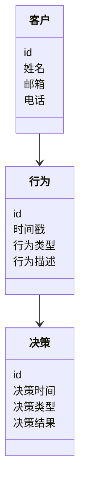
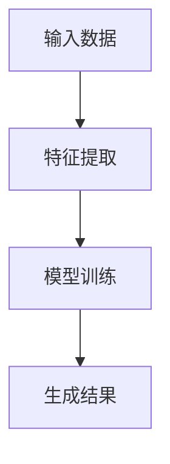
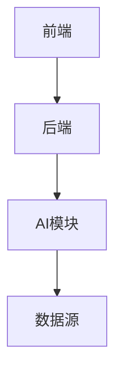
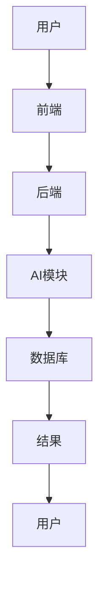

                 


# AI Agent在企业客户生命周期管理中的应用

## 关键词：AI Agent, 客户生命周期管理, 人工智能, 企业客户管理, 智能决策支持, 自动化流程优化

## 摘要：  
本文深入探讨了AI Agent在企业客户生命周期管理中的应用，详细分析了AI Agent的核心概念、算法原理、系统架构以及实际项目中的应用。通过结合客户生命周期的各个阶段，文章展示了AI Agent如何通过智能化决策支持和自动化流程优化，显著提升企业客户管理的效率和精准度。同时，本文还提供了具体的代码实现和系统设计，为读者提供了从理论到实践的全面指导。

---

# 第一部分: AI Agent与客户生命周期管理概述

## 第1章: AI Agent与客户生命周期管理的背景

### 1.1 问题背景  
在现代商业环境中，客户生命周期管理（Customer Life Cycle Management, CLM）是企业实现客户价值最大化的重要手段。然而，传统的客户管理方法依赖人工操作，存在效率低、决策滞后、个性化不足等问题。随着人工智能（AI）技术的发展，AI Agent（智能代理）逐渐成为解决这些问题的关键工具。

#### 1.1.1 客户生命周期管理的定义  
客户生命周期管理是指通过识别、吸引、保留和提升客户，以实现客户与企业双赢的过程。它涵盖了客户从初次接触、购买、忠诚到流失的整个生命周期。

#### 1.1.2 传统客户管理的局限性  
- 数据孤岛：客户信息分散在不同的系统中，难以整合和分析。  
- 个性化不足：传统方法难以根据客户的实时行为和偏好提供个性化服务。  
- 决策滞后：缺乏实时数据分析，导致决策不够及时。  

#### 1.1.3 AI Agent在现代客户管理中的作用  
AI Agent是一种能够感知环境、自主决策并执行任务的智能系统。它可以通过自然语言处理、机器学习和大数据分析等技术，帮助企业实现客户生命周期管理的智能化和自动化。

---

### 1.2 问题描述  
AI Agent在客户生命周期管理中的应用需要解决以下问题：  
- 如何高效收集和分析客户数据？  
- 如何预测客户行为并制定个性化策略？  
- 如何优化客户互动流程以提升客户满意度和忠诚度？  

#### 1.2.1 客户生命周期的四个阶段  
1. **获取阶段**：识别潜在客户并吸引他们。  
2. **转化阶段**：将潜在客户转化为实际购买者。  
3. **保留阶段**：通过优质服务提升客户忠诚度。  
4. **扩展阶段**：挖掘高价值客户，提升其消费频率和金额。  

#### 1.2.2 传统客户管理中的痛点  
- 数据碎片化：客户信息分散在多个系统中，难以统一管理。  
- 人工成本高：需要大量人工参与客户互动和决策。  
- 决策不精准：缺乏实时数据支持，导致客户体验差。  

#### 1.2.3 AI Agent如何解决这些问题  
AI Agent可以通过以下方式优化客户生命周期管理：  
- 实时收集和分析客户数据，提供精准的客户画像。  
- 利用机器学习模型预测客户行为，制定个性化策略。  
- 自动化执行任务，如发送定制化邮件、推荐产品等。  

---

### 1.3 问题解决  
AI Agent在客户生命周期管理中的应用需要结合多种技术手段，包括数据处理、模型训练和系统集成。

#### 1.3.1 AI Agent的核心功能  
- 数据采集与处理：从多源数据中提取客户信息并进行清洗。  
- 行为预测：基于历史数据预测客户的下一步行为。  
- 自动化决策：根据预测结果生成最优决策方案。  
- 任务执行：通过API或其他接口与企业系统集成，自动执行任务。  

#### 1.3.2 AI Agent在客户管理中的应用场景  
- 客户画像构建：通过聚类分析和特征工程，生成详细的客户画像。  
- 客户行为预测：利用时间序列模型预测客户的购买概率。  
- 客户需求匹配：通过推荐算法为客户提供个性化的产品或服务。  

#### 1.3.3 AI Agent的优势与不足  
**优势**：  
- 高效性：AI Agent可以快速处理大量数据并生成决策。  
- 精准性：基于机器学习的模型可以提供高精度的预测结果。  
- 自主性：AI Agent可以在没有人工干预的情况下执行任务。  

**不足**：  
- 复杂性：AI Agent的开发和部署需要较高的技术门槛。  
- 可解释性：部分机器学习模型的决策过程难以解释。  

---

### 1.4 边界与外延  
AI Agent的应用范围受到技术和数据的限制，同时也与其他技术密切相关。

#### 1.4.1 AI Agent的边界  
- 数据范围：AI Agent只能处理已知的数据源，无法获取外部数据。  
- 任务范围：AI Agent主要专注于客户管理任务，无法处理其他领域的任务。  

#### 1.4.2 客户生命周期管理的外延  
- 客户价值评估：通过数据分析确定客户的生命周期价值（Customer Lifetime Value, CLV）。  
- 客户体验优化：通过客户反馈和行为数据优化客户互动流程。  

#### 1.4.3 AI Agent与其他技术的关系  
- 与大数据技术的关系：AI Agent依赖大数据平台进行数据存储和分析。  
- 与云计算的关系：AI Agent可以通过云计算实现弹性扩展和高可用性。  

---

### 1.5 核心要素与概念结构  
AI Agent与客户生命周期管理的结合需要考虑多个核心要素。

#### 1.5.1 AI Agent的核心要素  
- 数据源：包括客户数据库、行为日志等。  
- 模型算法：如随机森林、神经网络等。  
- 执行引擎：用于自动化任务执行。  

#### 1.5.2 客户生命周期管理的要素  
- 客户画像：包括客户的基本信息、行为特征等。  
- 业务规则：如优惠策略、风险控制等。  

#### 1.5.3 两者的结合与相互作用  
AI Agent通过分析客户数据生成决策，并通过客户生命周期管理的业务规则进行优化。两者相互作用，共同实现客户管理的目标。

---

## 第2章: AI Agent的核心概念与原理  

### 2.1 AI Agent的定义与分类  
AI Agent是一种能够感知环境、自主决策并执行任务的智能系统。根据功能和应用场景的不同，AI Agent可以分为以下几类：  
1. **基于规则的AI Agent**：通过预定义的规则进行决策，适用于简单场景。  
2. **基于知识图谱的AI Agent**：利用知识图谱进行推理，适用于复杂场景。  
3. **基于强化学习的AI Agent**：通过与环境交互学习，适用于动态场景。  

---

### 2.2 AI Agent的原理  
AI Agent的核心原理包括信息收集与处理、智能决策和行为执行。

#### 2.2.1 信息收集与处理  
AI Agent通过传感器、API或其他数据源收集客户数据，并进行清洗、转换和存储。  

#### 2.2.2 智能决策  
AI Agent利用机器学习模型对数据进行分析，生成决策建议。  

#### 2.2.3 行为执行  
AI Agent通过API或其他接口与企业系统集成，自动执行任务。  

---

### 2.3 AI Agent与客户生命周期管理的结合  
AI Agent在客户生命周期管理中的应用需要结合客户画像、行为预测和需求匹配。

#### 2.3.1 客户画像构建  
AI Agent通过聚类分析和特征工程生成详细的客户画像。  

#### 2.3.2 客户行为预测  
AI Agent利用时间序列模型预测客户的购买概率。  

#### 2.3.3 客户需求匹配  
AI Agent通过推荐算法为客户提供个性化的产品或服务。  

---

### 2.4 核心概念对比表  
以下是对不同AI Agent模型的对比表：  

| **模型类型**         | **输入数据**      | **输出结果**      | **应用场景**                |  
|----------------------|-------------------|-------------------|-----------------------------|  
| 基于规则的AI Agent   | 结构化数据        | 规则匹配结果      | 简单场景，如优惠策略执行    |  
| 基于知识图谱的AI Agent| 结构化和非结构化数据 | 知识推理结果      | 复杂场景，如客户关系管理    |  
| 基于强化学习的AI Agent| 行为数据          | 最优决策策略      | 动态场景，如实时客户互动    |  

---

### 2.5 ER实体关系图  
以下是一个简单的ER实体关系图：  

```mermaid
erd
    客户信息表: id, 姓名, 邮箱, 电话
    行为记录表: id, 时间戳, 行为类型, 行为描述
    AI Agent决策表: id, 决策时间, 决策类型, 决策结果
    客户信息表 --> 行为记录表: 客户ID
    行为记录表 --> AI Agent决策表: 行为ID
```

---

### 2.6 领域模型类图  
以下是一个领域模型类图：  



---

## 第3章: AI Agent的算法原理  

### 3.1 生成模型  
生成模型主要用于客户画像的构建和需求推荐。

#### 3.1.1 Transformer架构  
Transformer是一种基于注意力机制的深度学习模型，广泛应用于自然语言处理领域。其核心思想是通过自注意力机制捕捉序列中的长距离依赖关系。  

#### 3.1.2 编码器-解码器结构  
编码器将输入序列映射到一个固定长度的向量，解码器根据编码器输出生成目标序列。  

#### 3.1.3 注意力机制  
注意力机制通过计算输入序列中每个位置的权重，生成加权后的序列表示。  

---

### 3.2 推理模型  
推理模型主要用于客户行为预测和需求匹配。

#### 3.2.1 基于规则的推理  
基于预定义的规则进行推理，适用于简单场景。  

#### 3.2.2 基于知识图谱的推理  
通过构建知识图谱进行推理，适用于复杂场景。  

#### 3.2.3 基于强化学习的推理  
通过与环境交互学习，适用于动态场景。  

---

### 3.3 算法流  

以下是一个生成模型的算法流程图：  



---

### 3.4 数学公式  

以下是一个简单的机器学习模型公式：  

$$
y = \theta^T x + b
$$  

其中，$y$ 是输出，$\theta$ 是权重，$x$ 是输入，$b$ 是偏置项。  

---

## 第4章: AI Agent的系统分析与架构设计  

### 4.1 项目背景  

本项目旨在通过AI Agent优化企业客户生命周期管理流程，提升客户满意度和忠诚度。  

---

### 4.2 系统功能设计  

系统功能包括客户画像构建、行为预测、决策支持和反馈优化。  

#### 4.2.1 客户画像构建  
通过聚类分析和特征工程生成客户画像。  

#### 4.2.2 客户行为预测  
利用时间序列模型预测客户行为。  

#### 4.2.3 智能决策支持  
基于机器学习模型生成决策建议。  

#### 4.2.4 反馈优化  
根据客户反馈优化AI Agent的决策策略。  

---

### 4.3 系统架构设计  

系统架构包括前端、后端和AI模块。  

#### 4.3.1 前端  
负责用户交互和界面展示。  

#### 4.3.2 后端  
负责数据处理和业务逻辑实现。  

#### 4.3.3 AI模块  
负责模型训练和推理。  

以下是一个简单的系统架构图：  



---

### 4.4 系统接口设计  

系统接口包括API接口和数据库接口。  

#### 4.4.1 API接口  
用于与第三方系统集成。  

#### 4.4.2 数据库接口  
用于与企业数据库集成。  

---

### 4.5 系统交互流程图  

以下是一个系统交互流程图：  



---

## 第5章: 项目实战  

### 5.1 环境安装  

需要安装以下工具：  
- Python 3.8+  
- PyTorch 1.9+  
- transformers库  
- mermaid CLI  

---

### 5.2 系统核心实现  

以下是一个AI Agent的核心代码实现：  

```python
import torch
from transformers import AutoTokenizer, AutoModelForSeq2Seq
import numpy as np

class AIAgent:
    def __init__(self):
        self.tokenizer = AutoTokenizer.from_pretrained("facebook/pagnet-large")
        self.model = AutoModelForSeq2Seq.from_pretrained("facebook/pagnet-large")

    def predict(self, input_text):
        inputs = self.tokenizer.encode(input_text, return_tensors="pt")
        outputs = self.model.generate(inputs, max_length=100)
        return self.tokenizer.decode(outputs[0], skip_special_tokens=True)
```

---

### 5.3 代码解读与分析  

- **类初始化**：加载预训练模型和分词器。  
- **预测方法**：将输入文本编码为张量，通过模型生成输出，解码后返回结果。  

---

### 5.4 案例分析  

以下是一个案例分析：  

**输入**：客户在网站上浏览了三件商品但未下单。  
**输出**：AI Agent预测客户可能需要优惠券，自动发送优惠信息。  

---

### 5.5 项目小结  

通过本项目，我们可以看到AI Agent在客户生命周期管理中的强大能力。  

---

## 第6章: 总结与展望  

### 6.1 总结  

本文详细探讨了AI Agent在企业客户生命周期管理中的应用，展示了其在客户画像构建、行为预测和决策支持等方面的优势。  

---

### 6.2 当前的挑战与未来展望  

当前，AI Agent的应用还面临以下挑战：  
- 数据隐私问题  
- 模型的可解释性问题  
- 多模态数据处理能力  

未来，随着技术的进步，AI Agent将在客户生命周期管理中发挥更大的作用。  

---

### 6.3 最佳实践 Tips  

- **数据隐私**：确保数据处理符合相关法律法规。  
- **模型优化**：定期更新模型以保持其准确性。  
- **用户体验**：确保AI Agent的决策符合客户预期。  

---

### 6.4 拓展阅读  

- 《机器学习实战》  
- 《深度学习》  
- 《AI Agent与智能决策》  

---

通过以上内容，我们希望读者能够全面理解AI Agent在企业客户生命周期管理中的应用，并能够在实际项目中加以应用。

