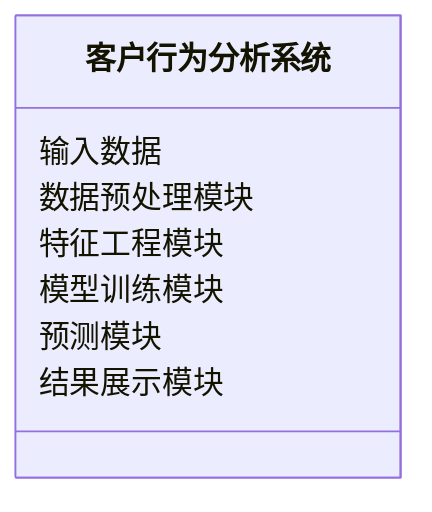
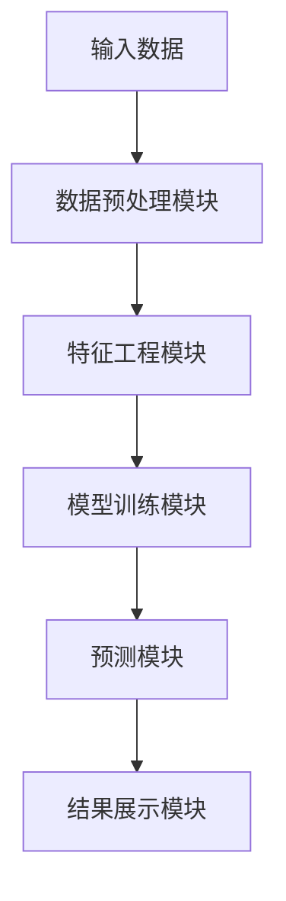

                 


# AI Agent在企业客户行为分析与预测中的应用

**关键词**：AI Agent，客户行为分析，预测模型，机器学习，数据预处理，特征工程

**摘要**：本文探讨AI Agent在企业客户行为分析与预测中的应用，从背景介绍到算法实现，系统性地分析客户行为预测的核心问题，详细阐述数据预处理、特征工程、模型训练、系统架构等关键环节。结合实际案例，展示如何利用AI Agent技术构建客户行为预测系统，并给出系统优化和扩展的建议，为企业的精准营销和决策提供理论和实践支持。

---

## 第1章: AI Agent与客户行为分析概述

### 1.1 AI Agent的基本概念

AI Agent（人工智能代理）是一种能够感知环境、自主决策并执行任务的智能体。它通过数据处理、模式识别和决策优化，帮助企业实现客户行为分析与预测。

#### 1.1.1 AI Agent的定义与特点

- **定义**：AI Agent是具有感知和行动能力的智能系统，能够根据环境信息做出决策。
- **特点**：
  - 智能性：能够处理复杂数据，识别模式。
  - 自主性：无需人工干预，自动执行任务。
  - 可适应性：根据环境变化调整策略。

#### 1.1.2 AI Agent在企业中的应用价值

- 提高客户洞察力，优化营销策略。
- 实现精准预测，降低运营成本。
- 提升客户体验，增强客户忠诚度。

#### 1.1.3 客户行为分析的背景与意义

- **背景**：企业通过分析客户行为数据，提升市场洞察力和运营效率。
- **意义**：帮助企业在竞争激烈的市场中制定精准策略，提升客户满意度和业务收益。

### 1.2 企业客户行为分析的核心问题

#### 1.2.1 客户行为分析的目标

- 描述客户行为特征。
- 预测客户未来行为。
- 提供数据驱动的决策支持。

#### 1.2.2 数据驱动的客户行为分析方法

- 数据挖掘：从海量数据中提取有价值的信息。
- 机器学习：利用算法模型预测客户行为。
- AI Agent：实时监控并响应客户行为变化。

#### 1.2.3 AI Agent在客户行为预测中的作用

- 实时数据处理和分析。
- 自动化决策和反馈。
- 持续优化预测模型。

### 1.3 本章小结

本章介绍了AI Agent的基本概念、特点及其在企业客户行为分析中的应用价值，强调了客户行为分析的目标和数据驱动方法的重要性。AI Agent作为核心技术，能够显著提升企业的分析和预测能力。

---

## 第2章: 数据预处理与特征工程

### 2.1 数据预处理的重要性

数据预处理是确保模型准确性和稳定性的基础。

#### 2.1.1 数据清洗与缺失值处理

- **数据清洗**：识别并处理错误或异常数据。
- **缺失值处理**：填补缺失值或删除相关数据。

#### 2.1.2 数据标准化与归一化

- **标准化**：将数据按比例缩放到均值为0，方差为1。
- **归一化**：将数据缩放到0-1范围。

#### 2.1.3 数据分箱与特征组合

- **数据分箱**：将连续数据离散化，便于模型处理。
- **特征组合**：将多个特征合并，形成新特征。

### 2.2 特征工程的核心方法

#### 2.2.1 特征选择与降维

- **特征选择**：剔除无关特征，保留重要特征。
- **降维方法**：使用主成分分析（PCA）减少特征维度。

#### 2.2.2 特征提取与表示

- **特征提取**：从原始数据中提取有用特征。
- **特征表示**：将特征转换为适合模型的表示方式。

#### 2.2.3 时间序列特征的处理

- **时间序列数据**：处理具有时间依赖性的特征。
- **滑动窗口法**：利用历史数据预测未来趋势。

### 2.3 本章小结

本章详细探讨了数据预处理和特征工程的关键步骤，包括数据清洗、标准化、分箱以及特征选择与提取。特征工程在客户行为预测中至关重要，能够显著提升模型性能。

---

## 第3章: 常见机器学习算法原理

### 3.1 线性回归模型

线性回归用于预测连续型变量，是最简单的回归模型。

#### 3.1.1 线性回归的数学模型

$$ y = \beta_0 + \beta_1 x + \epsilon $$

- **$\beta_0$**：截距项。
- **$\beta_1$**：自变量系数。
- **$\epsilon$**：误差项。

#### 3.1.2 普通最小二乘法的推导

- **目标**：最小化预测值与实际值的平方差之和。
- **求解**：通过对损失函数求导并令导数为零，得到参数估计值。

#### 3.1.3 线性回归的优缺点

- **优点**：简单易懂，计算效率高。
- **缺点**：只能处理线性关系，对非线性数据表现较差。

### 3.2 分类算法

分类算法用于预测离散型变量，常见算法包括决策树、随机森林和SVM。

#### 3.2.1 决策树算法原理

- **决策树**：通过特征分裂构建树状结构，用于分类或回归。
- **ID3/C4.5算法**：基于信息增益构建树。

#### 3.2.2 随机森林算法

- **随机森林**：集成多个决策树，通过投票或平均得到结果。
- **优点**：抗过拟合，适合高维数据。

#### 3.2.3 支持向量机(SVM)的基本原理

- **SVM**：在特征空间中寻找最优超平面，实现数据分类。
- **核函数**：将低维数据映射到高维空间，便于分类。

### 3.3 聚类算法

聚类算法用于将数据分成相似的群体。

#### 3.3.1 K-means算法

- **K-means**：将数据分成K个簇，通过迭代优化簇中心。
- **步骤**：
  1. 随机选择K个初始中心。
  2. 计算每个数据点到簇中心的距离，分配簇。
  3. 更新簇中心，重复直到收敛。

#### 3.3.2 层次聚类算法

- **层次聚类**：通过层次化分裂或合并数据点，构建树状结构。
- **策略**：自底向上或自顶向下。

#### 3.3.3 DBSCAN算法

- **DBSCAN**：基于密度的聚类算法，识别任意形状的簇。
- **参数**：设置邻域半径和最小点数。

### 3.4 神经网络与深度学习

深度学习在处理复杂模式和非线性关系方面表现优异。

#### 3.4.1 神经网络的基本结构

- **神经网络**：由输入层、隐藏层和输出层组成，通过权重传递和激活函数处理数据。

#### 3.4.2 面向客户行为预测的深度学习模型

- **RNN/LSTM**：处理时间序列数据，捕捉长期依赖关系。
- **CNN**：提取空间特征，适用于图像或序列数据。

#### 3.4.3 深度学习的优缺点

- **优点**：强大的特征学习能力，适合复杂数据。
- **缺点**：计算资源消耗大，需要大量数据。

### 3.5 本章小结

本章介绍了多种机器学习算法，包括线性回归、分类、聚类和神经网络。每种算法的数学模型和应用场景都进行了详细讲解，为后续的模型选择和实现提供了理论基础。

---

## 第4章: 客户行为预测的数学模型与公式

### 4.1 线性回归模型的数学推导

线性回归的损失函数和优化过程：

$$ L = \frac{1}{2m}\sum_{i=1}^{m}(y_i - (\beta_0 + \beta_1 x_i))^2 $$

通过最小化损失函数，使用梯度下降法求解参数：

$$ \beta_j = \beta_j - \alpha \frac{\partial L}{\partial \beta_j} $$

### 4.2 分类算法的数学模型

#### 4.2.1 逻辑回归

逻辑回归用于二分类问题，其sigmoid函数为：

$$ P(y=1|x) = \frac{1}{1 + e^{-\beta_0 - \beta_1 x}} $$

#### 4.2.2 支持向量机

SVM的目标是最小化 hinge loss：

$$ L = \sum_{i=1}^{m} (1 - y_i (\beta_0 + \beta_1 x_i))^+ $$

其中，$(\cdot)^+$ 表示正数部分。

### 4.3 聚类算法的数学模型

#### 4.3.1 K-means算法

K-means的目标是使簇内平方距离之和最小：

$$ \sum_{i=1}^{K} \sum_{x \in C_i} (x - \mu_i)^2 $$

其中，$C_i$ 表示第i个簇，$\mu_i$ 是簇中心。

### 4.4 本章小结

本章详细推导了各种算法的数学模型，为读者理解算法原理提供了数学基础，便于后续的实现和优化。

---

## 第5章: 系统架构与设计

### 5.1 系统功能设计

#### 5.1.1 领域模型



#### 5.1.2 数据流图



### 5.2 系统架构设计


### 5.3 接口设计

- **输入接口**：接收客户行为数据，格式为JSON或CSV。
- **输出接口**：返回预测结果，格式为JSON或HTML。

### 5.4 本章小结

本章从系统设计的角度，详细描述了客户行为分析系统的架构和模块设计，为后续的实现提供了清晰的指导。

---

## 第6章: 项目实战与代码实现

### 6.1 项目背景与目标

- **项目背景**：某电商企业希望预测客户购买行为，优化营销策略。
- **项目目标**：构建客户行为预测模型，实现精准营销。

### 6.2 环境搭建

- **工具安装**：安装Python、Scikit-learn、XGBoost、TensorFlow等库。
- **数据获取**：从数据库或CSV文件获取客户行为数据。

### 6.3 核心代码实现

#### 6.3.1 数据预处理

```python
import pandas as pd
from sklearn.preprocessing import StandardScaler

# 读取数据
data = pd.read_csv('customer_behavior.csv')

# 删除缺失值
data.dropna(inplace=True)

# 标准化处理
scaler = StandardScaler()
data[['age', 'income']] = scaler.fit_transform(data[['age', 'income']])
```

#### 6.3.2 特征工程

```python
from sklearn.feature_selection import SelectKBest
from sklearn.feature_extraction import DictVectorizer

# 特征选择
selector = SelectKBest(k=5)
selected_features = selector.fit_transform(data, target)

# 特征向量化
vectorizer = DictVectorizer()
features = vectorizer.fit_transform(selected_features)
```

#### 6.3.3 模型训练与预测

```python
from sklearn.ensemble import RandomForestClassifier
from sklearn.metrics import accuracy_score

# 训练模型
model = RandomForestClassifier(n_estimators=100, max_depth=5)
model.fit(features, target)

# 预测
pred = model.predict(features_test)
print('准确率:', accuracy_score(target_test, pred))
```

### 6.4 实际案例分析

- **案例分析**：通过实际数据展示模型预测结果。
- **结果解读**：分析预测准确率，优化模型参数。

### 6.5 本章小结

本章通过实际项目，详细展示了客户行为预测系统的实现过程，从数据预处理到模型训练，再到结果展示，为读者提供了实践指导。

---

## 第7章: 总结与展望

### 7.1 本章总结

本文详细探讨了AI Agent在企业客户行为分析与预测中的应用，从理论到实践，系统性地分析了客户行为预测的核心问题和解决方案。

### 7.2 未来展望

- **算法优化**：探索更高效的算法，提升预测精度。
- **实时预测**：开发实时预测系统，快速响应客户行为变化。
- **个性化推荐**：结合客户画像，提供个性化服务。

### 7.3 最佳实践 tips

- 数据预处理是关键，确保数据质量。
- 特征工程要结合业务场景，选择合适的方法。
- 模型选择要考虑数据类型和业务需求。

### 7.4 本章小结

本文总结了AI Agent在客户行为预测中的应用，并展望了未来的发展方向，为企业的智能化转型提供了参考。

---

**参考文献**

- [1] 周志华. 机器学习[M]. 清华大学出版社, 2016.
- [2] 王晓东. 深度学习: 方法与应用[M]. 北京大学出版社, 2020.
- [3] 张学农. 人工智能技术与应用[M]. 人民邮电出版社, 2018.

---

通过本文的学习，读者可以全面了解AI Agent在客户行为分析与预测中的应用，掌握核心算法和系统设计方法，并能够将理论应用于实际项目中，为企业创造更大的价值。

