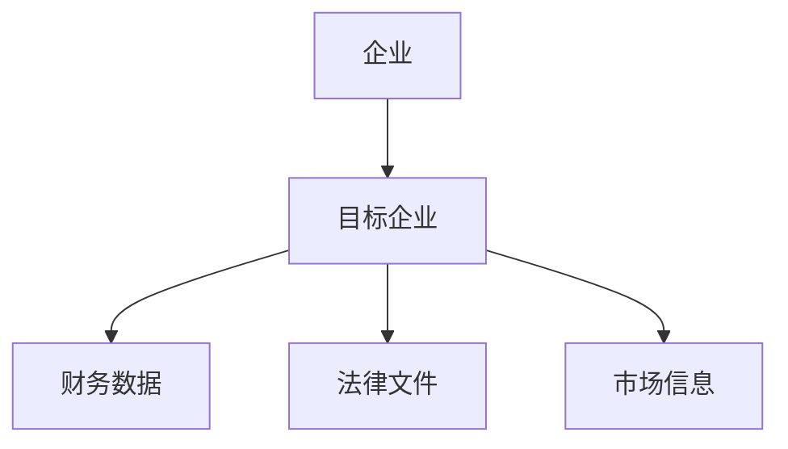
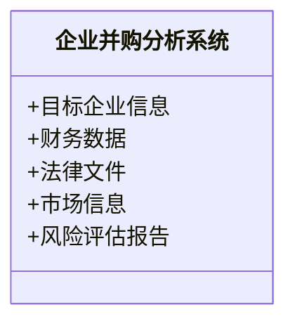

                 


# AI Agent在企业并购分析与尽职调查中的作用

> 关键词：AI Agent, 企业并购, 尽职调查, 自然语言处理, 数据挖掘, 系统架构

> 摘要：  
本文探讨了AI Agent在企业并购分析与尽职调查中的应用，详细分析了AI Agent的核心概念、算法原理、系统架构以及实际项目中的应用场景。文章从背景介绍出发，逐步深入到技术细节，结合实际案例，展示了AI Agent如何通过自然语言处理、信息抽取和数据挖掘等技术，提高企业并购分析的效率和准确性。通过系统架构设计和项目实战，进一步验证了AI Agent在实际应用中的价值和优势。

---

## 第1章: 背景介绍

### 1.1 企业并购分析与尽职调查的背景

#### 1.1.1 企业并购的基本概念  
企业并购（Mergers and Acquisitions，M&A）是指两个或多个企业之间的合并或收购行为。并购不仅是企业扩大规模、优化资源配置的重要手段，也是企业战略调整的重要方式。然而，企业并购过程中涉及的法律、财务、市场等多个方面的复杂性，使得并购决策的风险和成本较高。

#### 1.1.2 尽职调查的重要性  
尽职调查（Due Diligence，DD）是企业并购过程中不可或缺的环节，旨在对目标企业的财务状况、法律风险、市场前景等进行全面评估。传统尽职调查依赖人工分析，效率低、成本高，且容易遗漏关键信息。

#### 1.1.3 传统尽职调查的痛点与挑战  
传统尽职调查过程中，分析师需要手动处理大量非结构化数据（如合同、报告、新闻等），耗时且容易出错。此外，人工分析难以全面捕捉潜在风险，导致并购决策的不确定性增加。

---

### 1.2 AI Agent的核心概念

#### 1.2.1 AI Agent的定义与特点  
AI Agent（人工智能代理）是一种能够感知环境、执行任务并做出决策的智能系统。AI Agent在企业并购中的应用，主要体现在数据处理、信息提取和风险评估等方面。其特点包括：

1. **自动化**：能够自动处理大量数据。
2. **智能化**：能够通过学习和推理优化分析结果。
3. **实时性**：能够实时获取最新信息并做出反馈。

#### 1.2.2 AI Agent在企业并购中的应用场景  
AI Agent在企业并购中的应用场景包括：

1. **数据整理与分析**：自动整理目标企业的财务报表、法律文件等数据。
2. **风险评估**：通过分析新闻、社交媒体等信息，识别潜在的法律风险和市场风险。
3. **决策支持**：基于分析结果，为并购决策提供优化建议。

#### 1.2.3 AI Agent与传统尽职调查工具的对比  

| 对比维度       | AI Agent                           | 传统尽职调查工具                     |
|----------------|------------------------------------|--------------------------------------|
| 数据处理能力   | 高效处理非结构化数据              | 依赖人工处理，效率较低                |
| 决策能力       | 可以提供优化建议                   | 仅提供数据整理，不支持决策优化        |
| 成本            | 一次性投入高，但长期成本低        | 人工成本高，且效率低下                |

---

## 第2章: AI Agent的核心概念与联系

### 2.1 AI Agent的原理与机制

#### 2.1.1 AI Agent的基本原理  
AI Agent的核心原理包括以下步骤：

1. **数据获取**：通过API或爬虫获取目标企业的相关信息。
2. **数据预处理**：清洗和结构化数据，为后续分析做准备。
3. **信息抽取**：利用NLP技术提取关键信息（如财务数据、法律条款等）。
4. **风险评估**：基于提取的信息，评估潜在风险并生成报告。

#### 2.1.2 AI Agent的核心算法  
AI Agent的核心算法包括：

1. **自然语言处理（NLP）**：用于文本信息的抽取与理解。
2. **信息抽取**：用于从非结构化文本中提取关键实体（如公司名称、金额等）。
3. **数据挖掘**：用于发现数据中的模式和趋势。

#### 2.1.3 AI Agent的输入输出模型  
AI Agent的输入输出模型如下：

$$
\text{Input} \rightarrow \text{数据处理} \rightarrow \text{信息抽取} \rightarrow \text{风险评估} \rightarrow \text{Output}
$$

---

### 2.2 核心概念对比分析

#### 2.2.1 企业并购分析的实体关系图  



---

## 第3章: AI Agent的算法原理

### 3.1 算法基础

#### 3.1.1 自然语言处理（NLP）算法  
自然语言处理是AI Agent的核心技术之一，常用的NLP算法包括：

1. **分词（Tokenization）**：将文本分割成单词或短语。
2. **实体识别（NER）**：识别文本中的关键实体（如公司名称、日期等）。
3. **情感分析（Sentiment Analysis）**：分析文本中的情感倾向。

#### 3.1.2 信息抽取与实体识别  
信息抽取的目标是从非结构化文本中提取结构化数据。例如，从新闻中提取公司名称、事件时间和地点等信息。

#### 3.1.3 数据挖掘与模式识别  
数据挖掘技术用于发现数据中的模式和趋势，例如通过聚类分析识别市场趋势。

---

### 3.2 AI Agent的核心算法实现

#### 3.2.1 基于深度学习的文本分析算法  
深度学习算法（如BERT）在文本分析中表现出色，能够自动学习文本的语义信息。

#### 3.2.2 基于规则的文本分析算法  
基于规则的算法通过预定义的规则（如正则表达式）进行文本匹配，适用于结构化程度较高的文本。

#### 3.2.3 算法的数学模型与公式  
以文本分类为例，其数学模型可以表示为：

$$
P(y|x) = \frac{P(x|y)P(y)}{P(x)}
$$

其中，$P(y|x)$ 是在给定文本$x$的情况下，类别$y$的概率。

---

## 第4章: AI Agent的系统分析与架构设计

### 4.1 问题场景介绍

#### 4.1.1 企业并购分析中的问题场景  
企业并购分析中常见的问题包括数据分散、信息不完整、分析效率低等。

#### 4.1.2 尽职调查中的典型问题  
尽职调查中的典型问题包括数据获取困难、分析耗时长、风险识别不全面等。

#### 4.1.3 AI Agent的应用目标  
AI Agent的应用目标是提高数据处理效率、降低分析成本、优化决策支持。

---

### 4.2 系统功能设计

#### 4.2.1 领域模型设计  
领域模型设计如下：



---

## 第5章: AI Agent的项目实战

### 5.1 环境安装与配置

#### 5.1.1 开发环境的选择  
推荐使用Python 3.8及以上版本，安装必要的库（如`requests`、`BeautifulSoup`、`spaCy`等）。

#### 5.1.2 代码实现  
以下是AI Agent的核心代码示例：

```python
import requests
from bs4 import BeautifulSoup
import spacy

nlp = spacy.load("en_core_web_sm")

def extract_entities(text):
    doc = nlp(text)
    entities = [ent.text for ent in doc.ents]
    return entities

url = "https://example.com"
response = requests.get(url)
text = response.text
entities = extract_entities(text)
print("提取的实体：", entities)
```

---

## 第6章: 总结与展望

### 6.1 最佳实践 tips  
1. 在使用AI Agent前，确保数据来源的合法性和准确性。
2. 结合人工审查，确保分析结果的准确性。

### 6.2 小结  
本文详细介绍了AI Agent在企业并购分析与尽职调查中的应用，通过技术细节和实际案例，展示了AI Agent如何提高并购分析的效率和准确性。

### 6.3 注意事项  
1. 数据隐私和安全问题需要特别注意。
2. 算法的可解释性是实际应用中的重要考量。

### 6.4 拓展阅读  
推荐阅读相关书籍和论文，深入了解自然语言处理和数据挖掘的技术细节。

---

# 结语  
随着AI技术的不断发展，AI Agent在企业并购分析与尽职调查中的作用将越来越重要。通过本文的介绍，读者可以更好地理解AI Agent的技术原理和实际应用，为未来的实践提供参考。

